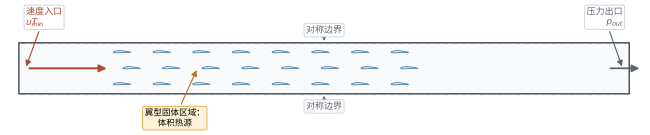
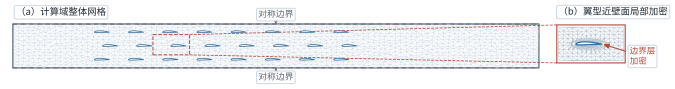
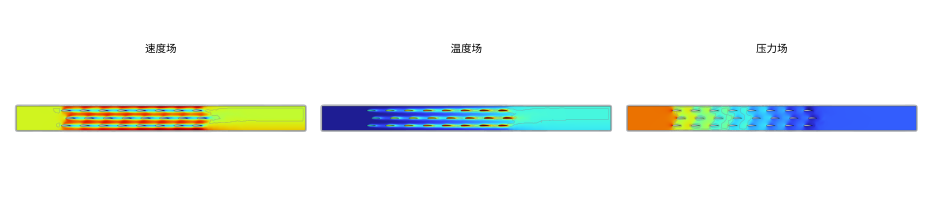
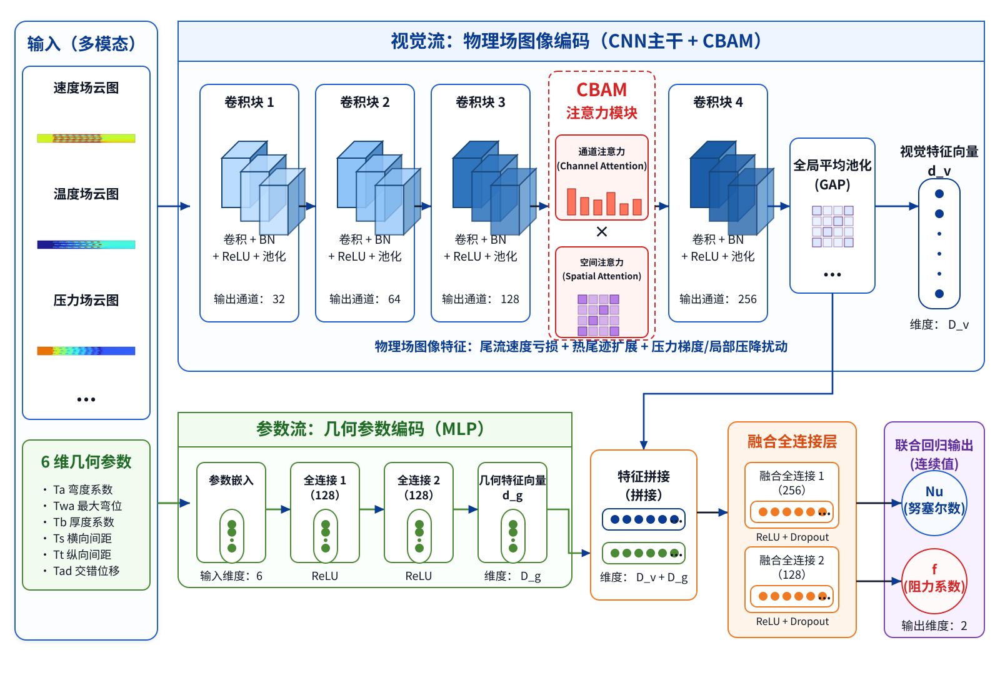
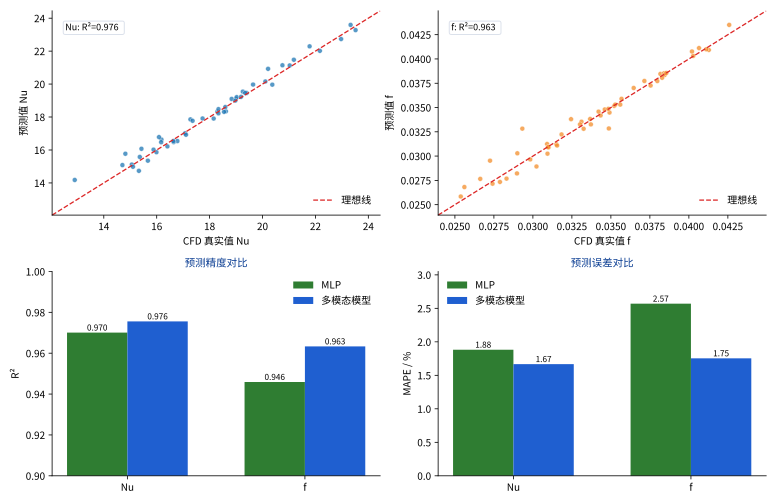
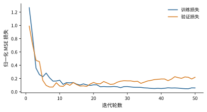
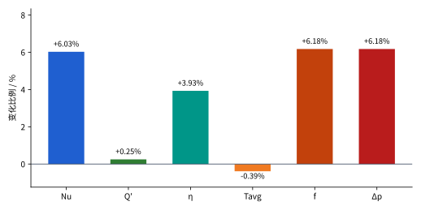
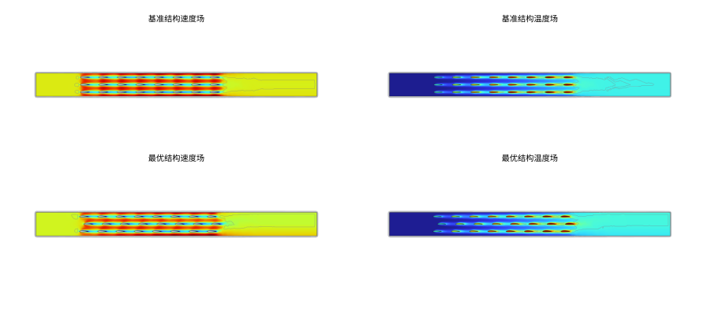

# 基于多模态卷积神经网络的翼型管翅片散热器形状与布局参数优化

**摘要：**针对翼型管翅片散热器多参数设计中 CFD 逐点寻优成本高、纯几何代理模型难以表征局部流场演化的问题，提出一种融合流场图像与几何参数的多模态 CNN 形状与布局参数优化方法。以 NACA0012 对称翼型管阵列为基准构型，构建包含弯度、最大弯度位置、厚度、纵向间距、横向间距和交错位移的 6 维参数化设计空间，并基于 COMSOL 获得不同结构下的速度场、温度场、压力场及 Nu、阻力系数 f 等性能指标。在此基础上，建立引入 CBAM 注意力机制的多模态双流 CNN 代理模型，并将其作为差分进化算法的快速适应度评估器。测试结果表明，模型对 Nu 和 f 的预测决定系数分别达到 0.9756 和 0.9633，较纯几何 MLP 表现出更高预测精度。经 CFD 复核，最优结构的 Nu、单位深度等效换热率 Q′_total 和综合评价因子 η 分别提升 6.03%、0.25% 和 3.93%，翼型管平均温升降低约 5.45%，同时阻力系数 f 增加 6.18%，说明该结构在散热增强与流阻代价之间取得了一定折中。该方法可通过“代理预测—智能筛选—CFD 复核”流程降低候选结构筛选成本，为紧凑式散热器快速优化提供参考。

**关键词：**多模态卷积神经网络；翼型管翅片散热器；流热耦合；形状与布局参数优化；强迫对流；差分进化算法

**Title:** Shape and Layout Parameter Optimization of an Airfoil Tube-Fin Radiator Based on a Multimodal Convolutional Neural Network

**Abstract:** To reduce the high computational cost of point-by-point CFD optimization and overcome the limited ability of geometry-only surrogate models to describe local flow-field evolution, a multimodal CNN-based shape and layout parameter optimization method integrating flow-field images with geometric parameters is proposed for an airfoil tube-fin radiator. Taking the NACA 0012 symmetric airfoil-tube array as the baseline configuration, a six-dimensional parametric design space is constructed, including camber, maximum camber position, thickness, longitudinal spacing, transverse spacing, and staggering offset. The velocity, temperature, and pressure fields, as well as the Nusselt number and resistance coefficient of different configurations, are obtained using COMSOL. On this basis, a multimodal dual-stream CNN surrogate model with a CBAM attention mechanism is developed and used as a fast fitness evaluator in the differential evolution algorithm. The test results show that the coefficients of determination for Nu and f reach 0.9756 and 0.9633, respectively, indicating higher prediction accuracy than the geometry-only MLP model. According to independent CFD verification, the optimal structure increases Nu, the unit-depth equivalent heat transfer rate Q′_total, and the comprehensive evaluation factor η by 6.03%, 0.25%, and 3.93%, respectively, while reducing the average temperature rise of the airfoil tube by approximately 5.45%; meanwhile, the resistance coefficient f increases by 6.18%. The results indicate that the optimized structure achieves a reasonable compromise between heat dissipation enhancement and flow resistance penalty. The proposed “surrogate prediction—intelligent screening—CFD verification” procedure can reduce the screening cost of candidate structures and provide a reference for the rapid optimization of compact radiators.

**Keywords:** multimodal convolutional neural network; airfoil tube-fin radiator; flow-thermal coupling; shape and layout parameter optimization; forced convection; differential evolution algorithm

---

## 1 引言

随着电子设备以及动力系统功率密度的持续提高，紧凑式换热器内部冷却通道中的管翅结构，对系统传热能力以及泵功消耗具有重要影响。在管翅式散热器设计中，通常可以通过改变换热管几何外形、尺寸参数以及阵列排布方式，破坏热边界层并增强流体扰动，从而提高气侧强迫对流换热性能。刘佳鑫等[1]对工程机械散热模块传热性能开展了数值与试验研究，指出常规管翅阵列在强化传热的同时，往往伴随较大的压降惩罚；雷翔宇等[2]运用 CFD 仿真探究了管翅参数对散热性能的影响，并进行了多目标优化设计；潘晟[3]、于明豪[4]采用基于 MMC-密度法的拓扑优化方法对散热器流道进行寻优，指出流热耦合迭代会带来较高的计算成本；ZENG 等[5]采用均质化方法对微通道散热器进行拓扑优化，证实非连续阵列可以协同提升综合性能；王宝中[6]、冯少聪等[7]将航空翼型引入工程车辆管翅式散热器设计，并借助数值模拟与信噪比方法分析冷侧翼型管的敏感度，发现流线型特征能够有效推迟流动分离；Tariq 等[8]对交错与对齐排布的翼型管进行了传热特性对比，得出列间交错排布可减弱尾流热遮挡的结论。上述研究表明，翼型管的几何形状以及阵列排布方式会明显影响散热器的换热能力和流动阻力；但随着设计变量数量增加，依靠 CFD 逐点计算来开展传统优化，仍然面临较高的计算成本。

近年来，数据驱动算法被广泛用于加速多物理场优化过程。WANG 等[9]构建了深度学习预测模型，并将其用于三维冷却通道寻优，有效缩短了计算时间；朱高嘉等[10]、陈焱飙等[11]基于人工神经网络对散热器结构进行迭代优化，实现了从几何标量到宏观性能指标的快速映射。特别地，JIANG 等[12]采用反向传播人工神经网络（BP-ANN）并结合非支配排序遗传算法，对翼型印刷电路板式换热器（PCHE）的四维几何结构参数进行了寻优预测。然而，现有基于机器学习的散热结构优化研究，多数仍以几何标量作为输入，主要建立结构参数与 Nu、阻力系数或平均温度等宏观指标之间的数值关联。对于翼型管阵列这类流热耦合特征较强的结构，其宏观性能不仅取决于几何参数本身，还会受到尾迹偏转、流体滞止、局部热遮挡、边界层重构以及压力集中等空间物理过程的共同影响。若仅依靠低维几何标量，代理模型就难以充分利用 CFD 结果中已经包含的速度场、温度场以及压力场信息，从而削弱其对复杂流热耦合响应的表征能力。

针对上述问题，提出一种融合流场图像与几何参数的多模态 CNN 形状与布局参数优化方法。该方法以 NACA0012 对称翼型为基准截面，构建包含弯度、最大弯度位置、厚度等翼型管形状参数，以及纵向间距、横向间距和列间交错位移等管间布局参数的 6 维设计空间；同时考虑尾流干涉、热遮挡、局部压力集中及流阻增加等因素，以 Nu 和 f 为主要预测目标，并通过综合评价因子衡量换热强化与流阻代价之间的折中关系。在具体实现上，基于 CFD 模拟生成 500 组不同参数组合下的流热耦合样本，提取速度场、温度场、压力场云图以及 Nu、f 等性能标签，训练引入 CBAM 注意力机制的多模态双流 CNN 学习“几何参数 + 流场图像 → Nu/f”的非线性映射关系。随后，将训练后的代理模型嵌入差分进化算法进行候选方案筛选，并对最优结构重新开展 COMSOL 独立复核，进一步结合速度场和温度场云图分析优化结构的散热强化机理。

---

## 2 数值模型与评价方法

### 2.1 物理模型与设计变量

以紧凑式翼型管翅片散热器气侧流动与换热过程为研究对象，选取包含 3×8 翼型换热管阵列的二维代表性计算域进行分析。该模型在降低计算量的同时，可保留空气绕流、尾迹干涉、热遮挡和局部压降损失等主要现象。管内冷却液流动不再单独求解，翼型管固体区域等效为具有恒定体积生热率 qᵥ 的热源区域。

为描述翼型管外形和阵列排布，首先定义 6 个几何参数，如图 1 所示。其中，翼型管外形参数包括最大弯度 m、最大弯度位置 p 和最大厚度 t；阵列布局参数包括横向间距 S_s、纵向间距 S_t 和列间交错位移 S_d。本文所称纵向间距对应计算域 y 方向上下排间距，横向间距对应相邻翼型管在另一方向上的中心距。

单个翼型换热管基于 NACA 四位数翼型方程生成。本文保留 Ta、Twa、Tb、Ts、Tt 和 Tad 作为脚本建模中的 6 个参数化控制量，并以翼型管弦长 c 为基准换算实际几何尺寸：

$$
m=T_a c,\quad p=T_{wa}c,\quad t=T_b c
$$

$$
S_s=(1+T_s)c,\quad S_t=T_t c,\quad S_d=T_{ad}c
$$

式中，Ta 为弯度控制量，Twa 为最大弯度位置控制量，Tb 为厚度控制量，Ts 为横向间距控制量，Tt 为纵向间距控制量，Tad 为列间交错位移控制量。需要说明的是，脚本中横向相邻翼型管中心距按 $(1+T_s)c$ 生成，因此 Ts 表示在一个弦长基础上的横向间距增量控制量。表 1 给出了各参数化控制量的取值范围。在 COMSOL 建模时，根据给定弦长 c 将表 1 中的参数换算为实际几何尺寸后生成计算模型。为便于性能对比，选取无弯度且完全对齐排布的对称翼型管阵列作为基准模型（Baseline），即 Ta = 0、Tad = 0。

**表 1 翼型管阵列 6 维参数化设计变量及其取值范围**

| 参数符号 | 物理意义 | 变量类型 | 取值范围      |
| ---- | ---- | ---- | --------- |
| Ta   | 弯度系数 | 形状特征 | 0.00～0.05 |
| Twa  | 最大弯度位置 | 形状特征 | 0.20～0.60 |
| Tb   | 厚度系数 | 形状特征 | 0.08～0.15 |
| Ts   | 横向间距控制量 | 布局特征 | 0.50～1.50 |
| Tt   | 纵向间距控制量 | 布局特征 | 0.50～1.20 |
| Tad  | 交错位移控制量 | 布局特征 | 0.00～1.00 |

### 2.2 控制方程与边界条件

采用 COMSOL Multiphysics 对翼型管翅片散热器气侧流动与换热过程进行流热耦合模拟。冷却介质为空气，视为定常、不可压缩牛顿流体；翼型管固体区域与空气流体区域通过流固界面耦合换热，忽略热辐射影响。实际求解采用有量纲物性参数、几何尺寸和边界条件，相关计算输入如表 2 所示。

**表 2 数值计算输入参数与边界条件设置**

| 参数         | 符号     | 数值       | 单位       |
| ---------- | ------ | -------- | -------- |
| 空气密度       | ρ      | 1.2      | kg/m³    |
| 空气动力黏度     | μ      | 1.8×10⁻⁵ | Pa·s     |
| 空气定压比热容    | cp     | 1005     | J/(kg·K) |
| 空气导热系数     | ka     | 0.026    | W/(m·K)  |
| 翼型管材料      | —      | 铝        | —        |
| 翼型管弦长      | c      | 0.01     | m        |
| 翼型管固体密度    | ρs     | 2700     | kg/m³    |
| 翼型管固体导热系数  | ks     | 238      | W/(m·K)  |
| 翼型管固体定压比热容 | cps    | 900      | J/(kg·K) |
| 入口平均速度     | u_in  | 5        | m/s      |
| 入口温度       | T_in  | 293.15   | K        |
| 出口静压       | p_out | 0        | Pa       |
| 体积生热率      | qᵥ     | 1×10⁷    | W/m³     |
| 入口雷诺数      | Re_c  | 3.33×10³ | —        |

以翼型管弦长 c 和入口平均速度 u_in 为特征尺度，入口雷诺数定义为：

$$
Re_c=\frac{\rho u_{in}c}{\mu}
$$

代入表 2 中参数可得 Re_c ≈ 3.33×10³。由于本文重点在于比较不同参数化设计方案的稳态平均换热与流阻差异，采用稳态层流模型进行相对性能评价。

流体区域满足不可压缩流动控制方程，主要包括质量守恒方程、动量方程和能量方程：

$$
\nabla\cdot \mathbf{u}=0
$$

$$
\rho(\mathbf{u}\cdot\nabla)\mathbf{u}=-\nabla p+\mu\nabla^2\mathbf{u}
$$

$$
\rho c_p(\mathbf{u}\cdot\nabla T)=\nabla\cdot(k_a\nabla T)
$$

固体翼型管区域只考虑导热和体积生热，其能量方程可写为：

$$
\nabla\cdot(k_s\nabla T)+q_v=0
$$

式中，u 为速度矢量，p 为压力，T 为温度，ρ、μ、c_p 和 k_a 分别为空气密度、动力黏度、定压比热容和导热系数，k_s 为翼型管固体导热系数，q_v 为体积生热率。

实际计算中，入口设置为速度入口，u_in = 5 m/s，T_in = 293.15 K；出口设置为压力出口，p_out = 0 Pa；流固界面满足无滑移、温度连续和热流连续条件；上下边界采用对称滑移边界。计算域及边界条件如图 2 所示。求解过程中，在翼型前缘、尾缘及流固交界面附近进行局部网格加密，并采用稳态分离式算法结合伪时间步进策略提高收敛稳定性；当速度、压力、温度残差及压降、翼型管平均温度等监测量趋于稳定时，判定计算达到稳态收敛。

### 2.3 网格无关性与模型验证

为保证数值结果不受网格数量影响，以基准结构为对象，对不同网格密度下的翼型管平均温度和流道压降进行网格无关性验证。计算域采用非结构化三角形网格，并在近壁面和尾迹区域局部加密。

**表 3 网格无关性验证**

| 网格方案     | 网格总数/个  | 翼型管平均温度 T_avg/K | 压降 ΔP/Pa | T_avg 相对误差/% |
| -------- | ------- | -------------- | -------- | ----------- |
| 方案 A（粗糙） | 21,450  | 329.05         | 0.612    | —           |
| 方案 B（常规） | 48,200  | 329.82         | 0.626    | 0.23        |
| 方案 C（较细） | 85,600  | 330.15         | 0.631    | 0.10        |
| 方案 D（超细） | 152,000 | 330.18         | 0.632    | 0.01        |

由表 3 可知，当网格总数由 85,600 增至 152,000 时，翼型管平均温度相对变化仅为 0.01%，压降也基本稳定。因此，后续模拟采用方案 C 的网格配置。基准工况与已有文献结果对比表明，Nu 和 f 最大相对误差均控制在 6% 以内，说明所建数值模型能够满足后续参数分析和数据集生成需求。

### 2.4 性能评价指标

采用全局努塞尔数 Nu 和阻力系数 f 评价散热器换热与流阻性能。阻力系数定义为：

$$
f=\frac{2\Delta P}{\rho u_{in}^2}
=\frac{2(p_{in}-p_{out})}{\rho u_{in}^2}
$$

式中，p_in 和 p_out 分别为进、出口平均静压，ΔP 为进出口压降，u_in 为入口平均速度。本文中的 f 为基于入口动压定义的无量纲阻力系数，用于表征不同构型之间的相对流阻差异，并非管道内流 Darcy 摩擦因子。定义特征温差 ΔT 为固体域全局平均温度与入口空气温度之差：

$$
\Delta T=T_{avg}-T_{in}
$$

整体努塞尔数 Nu 表示为：

$$
Nu=\frac{q_v V_s c}{k_a A_s(T_{avg}-T_{in})}
$$

式中，Tavg 为固体域全局平均温度，Vs 为所有翼型管总体积，As 为固体翼型管与空气接触的换热面积，c 为翼型管弦长，ka 为空气导热系数。对于二维代表性计算域，Vs 和 As 按单位厚度等效换算。

为衡量换热强化与流阻代价之间的折中关系，引入综合评价因子 η：

$$
\eta=\frac{Nu}{f^{1/3}}
$$

式中，Nu 为全局努塞尔数，f 为阻力系数。η 用于表征换热能力与流阻代价之间的相对折中关系；在相同评价准则下，η 较大表示单位流阻代价下的换热表现更有利。

---

## 3 CFD 样本生成与数据集构建

### 3.1 典型阵列流场特征

为明确引入流场图像模态的必要性，对典型交错排布工况下的速度场、温度场和压力场进行分析，如图 4 所示。速度场表明，列间交错位移会改变主流通道，使气流在相邻翼型管之间形成偏转穿透路径，从而削弱前排尾迹对后排迎风区域的遮挡。温度场显示，对齐或交错不足时前排翼型管后方易形成高温滞留区，而适当交错可增强后排翼型管表面的低温来流冲刷。压力场则反映出前缘高压区和尾迹低压区的变化，并与整体流阻密切相关。

上述结果说明，翼型管阵列的 Nu 和 f 不仅取决于 6 维几何参数，还与尾迹覆盖、热遮挡、近壁面温度梯度和局部压力集中等空间流场结构有关。因此，将速度场、温度场和压力场云图作为图像模态输入，可为代理模型提供纯几何标量难以直接表达的空间信息。

### 3.2 参数采样方法

为兼顾样本代表性与计算成本，采用拉丁超立方抽样（Latin hypercube sampling, LHS）在表 1 所示连续参数空间内生成 500 组参数组合。LHS 能够在每个设计变量范围内进行分层抽样，使样本在 6 维空间中保持较均匀覆盖，同时避免全因子试验带来的过高计算成本。采样变量范围与样本数设置如表 4 所示。

**表 4 LHS 采样变量范围与样本数设置**

| 变量 | 物理意义 | 采样下限 | 采样上限 | 采样方法 |
| --- | --- | ---: | ---: | --- |
| Ta | 弯度控制量 | 0.00 | 0.05 | LHS |
| Twa | 最大弯度位置控制量 | 0.20 | 0.60 | LHS |
| Tb | 厚度控制量 | 0.08 | 0.15 | LHS |
| Ts | 横向间距控制量 | 0.50 | 1.50 | LHS |
| Tt | 纵向间距控制量 | 0.50 | 1.20 | LHS |
| Tad | 交错位移控制量 | 0.00 | 1.00 | LHS |
| 样本总数 | — | — | — | 500 |

### 3.3 CFD 数据集构建与质量检查

基于采样结果，借助自动化脚本驱动 COMSOL 批量建模并完成稳态流热耦合求解。每组样本提取 6 维几何参数、速度场云图、温度场云图、压力场云图以及对应的 Nu 和 f。其中，几何参数描述翼型外形和阵列排布，三类物理场图像分别表征流动、换热和流阻的空间分布信息。

批量计算后，对样本进行收敛性、异常值和图像一致性检查，剔除未收敛或宏观监测量明显波动的工况，并统一云图范围、视角、分辨率和色标映射方式。最终保留 500 组有效样本，可表示为：

$$
Sample_i=\{X_i,I_i,y_i\}
$$

式中，$X_i=[T_a,T_{wa},T_b,T_s,T_t,T_{ad}]$ 为几何参数向量，$I_i$ 为速度场、温度场和压力场图像集合，$y_i=[Nu,f]$ 为性能标签。数据集构成如表 5 所示。

**表 5 多模态 CFD 数据集构成**

| 数据项 | 内容 | 数量或维度 |
| --- | --- | --- |
| 几何参数 | Ta、Twa、Tb、Ts、Tt、Tad | 6 维 |
| 图像模态 | 速度场、温度场、压力场云图 | 3 类 |
| 性能标签 | Nu、阻力系数 f | 2 维 |
| 有效样本数 | 收敛且图像完整的 CFD 样本 | 500 组 |

---

## 4 代理模型构建与参数化优化

传统 CFD 参数优化需要对大量候选结构进行重复建模和求解，计算成本较高。为提高翼型管翅片散热器形状与布局参数优化效率，构建多模态 CNN 代理模型，用于快速预测不同设计参数下的 Nu 和 f，并将其作为差分进化算法的适应度评估器，实现候选结构方案的快速筛选。

### 4.1 多模态 CNN 代理模型构建

多模态 CNN 采用双流特征融合结构，包括物理场视觉编码分支、几何特征嵌入分支和融合回归模块。对每个 CFD 样本，将同一构型下的速度场、温度场和压力场云图统一裁剪、缩放和归一化后，作为物理场图像输入 I_i = [I_U, I_T, I_p]；同时将 6 维几何参数 X_i = [T_a, T_wa, T_b, T_s, T_t, T_ad] 作为参数流输入。

速度场、温度场和压力场云图分别反映尾流速度亏损、热尾迹扩展及局部压力集中等空间信息。视觉分支通过卷积层提取云图中的梯度、纹理和空间分布特征，CBAM 从通道和空间两个维度调整特征权重，使模型更倾向于关注尾流区、热边界层和压力集中区等对 Nu 和 f 影响较大的区域；参数流 MLP 则编码 6 维几何变量，提供翼型形状和阵列布局的全局设计信息。两类特征拼接后经全连接层共同回归 Nu 和 f，其过程可表示为：

$$
F_{img}=CNN_{CBAM}(I_U,I_T,I_p)
$$

$$
F_{geo}=MLP(X_i)
$$

$$
[Nu,f]=FC([F_{img},F_{geo}])
$$

式中，F_img 为物理场图像特征向量，F_geo 为几何参数特征向量，CNN_CBAM 表示引入 CBAM 注意力机制的视觉编码分支，FC 表示融合全连接回归层。由此，模型建立了“几何参数—流热场空间结构—性能指标”之间的映射关系，而不是仅依靠几何标量直接预测 Nu 和 f。网络隐藏层激活函数采用 ReLU，损失函数采用均方误差（MSE），二者表达式分别为：

$$
ReLU(x)=\max(0,x)
$$

$$
L_{MSE}=\frac{1}{N}\sum_{i=1}^{N}(\hat{y}_i-y_i)^2
$$

式中，x 为神经元输入值，N 为单次批处理样本数量，ŷᵢ 为模型预测值，yᵢ 为 CFD 计算标签。模型主要参数配置如表 6 所示，网络结构示意图如图 5 所示。

**表 6 CNN 网络主要参数配置**

| 组件        | 参数设置                  |
| --------- | --------------------- |
| 卷积层数      | 4 层（32→64→128→256 通道） |
| 卷积核尺寸     | 3×3                   |
| 池化方式      | 最大池化 2×2              |
| MLP 隐藏层   | 64→128 神经元            |
| 融合层神经元    | 512→256               |
| Dropout 率 | 0.3                   |
| 激活函数      | ReLU                  |
| 输出维度      | 2（Nu, f）              |

### 4.2 模型训练与预测性能验证

训练前，对 6 维几何参数及 Nu、f 标签进行 Z-score 标准化处理：

$$
x'=\frac{x-\mu}{\sigma}
$$

式中，x′ 为标准化变量，x 为原始变量，μ 和 σ 分别为训练集样本均值和标准差，并统一用于验证集和测试集处理，以避免数据泄露。模型训练过程中，Nu 和 f 以标准化形式参与损失函数计算；在预测性能评价和优化目标计算时，模型输出先进行反标准化处理，再计算 RMSE、MAPE 和综合评价因子 η。速度场、温度场和压力场云图按各自物理量范围归一化，并在训练集、验证集和测试集中采用一致的归一化规则。500 组样本按 75%、15% 和 10% 划分为训练集、验证集和测试集。模型采用 Adam 优化器，并结合 Dropout、权重衰减、自适应学习率衰减和轻量级数据增强抑制过拟合。

测试结果如表 7 所示，多模态模型对 Nu 和 f 的预测决定系数分别为 0.9756 和 0.9633，说明模型对换热和流阻性能均具有较好预测能力。

**表 7 测试集预测性能指标**

| 目标变量 | R²     | RMSE     | MAPE/% |
| ---- | ------ | -------- | ------ |
| Nu   | 0.9756 | 0.3765   | 1.667  |
| f    | 0.9633 | 0.000843 | 1.753  |

为分析流场图像输入的作用，将仅输入 6 维几何参数的 MLP 与多模态融合模型进行对比，结果如表 8 所示。相较 MLP，多模态融合模型在 Nu 和 f 上均取得更高 R² 和更低 RMSE、MAPE，说明速度场、温度场和压力场图像特征能够补充几何参数难以直接表达的空间流热信息。

**表 8 纯几何代理模型与多模态代理模型预测结果对比**

| 模型      | 输入信息           | 目标变量 | R²     | RMSE     | MAPE/% |
| ------- | -------------- | ---- | ------ | -------- | ------ |
| MLP     | 6 维几何参数        | Nu   | 0.9701 | 0.4166   | 1.882  |
| MLP     | 6 维几何参数        | f    | 0.9459 | 0.001024 | 2.570  |
| 多模态融合模型 | 几何参数 + 物理场图像特征 | Nu   | 0.9756 | 0.3765   | 1.667  |
| 多模态融合模型 | 几何参数 + 物理场图像特征 | f    | 0.9633 | 0.000843 | 1.753  |

图 6 给出了独立测试集预测结果及模型对比。Nu 和 f 的预测点整体分布在理想预测线附近，表明预测结果与 CFD 计算结果具有较好一致性；R² 和 MAPE 对比进一步表明，多模态融合模型整体优于纯几何 MLP。

图 7 给出了训练集与验证集损失函数随迭代轮数的变化情况。两类损失整体下降并在后期趋于稳定，说明模型训练过程较稳定，未出现明显发散。

### 4.3 基于代理模型的参数化优化

完成模型训练与验证后，将多模态 CNN 作为快速适应度评估器，并结合差分进化算法对 6 维翼型管阵列参数化设计变量进行优化。优化目标为最大化综合评价因子 η：

$$
\max\ \eta(X)=\frac{Nu(X)}{[f(X)]^{1/3}}
$$

$$
X=[T_a,T_{wa},T_b,T_s,T_t,T_{ad}]
$$

$$
X_{min}\le X\le X_{max}
$$

式中，X 为 6 维参数化设计变量向量，Xmin 和 Xmax 分别为变量上下界，具体范围由表 1 给出。差分进化算法种群规模 NP = 50，变异因子 F = 0.8，交叉概率 CR = 0.9，最大迭代代数为 200。每一代候选个体均由代理模型快速预测 Nu 和 f，并在反标准化后代入综合评价因子 η 进行适应度计算，从而减少重复 CFD 调用。

需要指出的是，优化搜索阶段的新候选结构无法实时获得对应 CFD 流场云图。为保证流程可执行，选取训练集中与基准工况相近且收敛稳定的样本云图作为视觉基准输入，候选结构则通过 6 维几何变量描述相对扰动。该策略仅用于候选方案快速筛选，最终 Nu、f 和 η 均以独立 CFD 复核结果为准。

### 4.4 优化结果与流场分析

经差分进化算法筛选后，获得一组综合评价因子较高的最优候选结构，其参数组合为：X_opt = [0.035, 0.40, 0.12, 1.10, 0.85, 0.50]。随后，将该结构重新导入 COMSOL，在体积生热率 qᵥ = 1×10⁷ W/m³ 工况下进行独立流热耦合复核。表 9 中各指标均为 COMSOL 复核得到的原始物理量或由其计算得到的评价指标。

**表 9 基准结构与最优结构散热性能及流阻代价对比**

| 指标 | 单位 | 基准结构（Baseline） | 最优结构（Optimal） | 变化比例 |
| --- | :---: | ---: | ---: | ---: |
| 努塞尔数 Nu | — | 36.574 | 38.779 | +6.03% |
| 单位深度等效换热率 Q′_total | W/m | 1947.8 | 1952.7 | +0.25% |
| 翼型管平均温度 T_avg | K | 318.63 | 317.39 | −0.39% |
| 平均温升 ΔT_avg | K | 20.48 | 19.37 | −5.45% |
| 综合评价因子 η | — | 81.555 | 84.761 | +3.93% |
| 阻力系数 f | — | 0.09019 | 0.09576 | +6.18% |
| 压降 Δp | Pa | 1.353 | 1.436 | +6.18% |

由表 9 和图 8 可知，与基准结构相比，最优结构的 Nu、单位深度等效换热率 Q′_total 和综合评价因子 η 分别提升 6.03%、0.25% 和 3.93%；翼型管平均温度由 318.63 K 降至 317.39 K，对应平均温升由 20.48 K 降至 19.37 K，温升降低约 5.45%；同时，阻力系数 f 和压降 Δp 均增加约 6.18%。这表明最优结构在增强散热能力、降低固体热源区域温度的同时带来一定流阻代价，但按本文综合评价因子判断，其换热—流阻折中关系较基准结构更有利。

图 9 对比了基准结构与最优结构的速度场和温度场分布。速度场结果显示，相较于基准结构，最优结构中翼型管后方尾迹区发生一定偏移，阵列内部流动通道更加弯曲，列间穿透流特征更明显，说明交错排布有助于改变后排翼型管附近的来流分配。温度场结果显示，最优结构中后排翼型管附近的高温滞留区范围有所减小，热尾迹向下游扩展时的集中程度降低，后排区域温度分布更加均匀。结合表 9 和图 8 中 Nu、单位深度等效换热率 Q′_total 以及综合评价因子 η 的提升结果可知，优化结构能够在相同热源输入条件下增强气侧对流换热能力，减弱局部热量积聚，从而改善整体散热效果。

---

## 5 结论

以 NACA0012 对称翼型管翅片散热器为基准构型，构建了包含翼型外形参数与阵列排布参数的 6 维参数化设计空间，建立融合物理场云图与几何参数的多模态 CNN 代理模型，并结合差分进化算法完成翼型管阵列的形状与布局参数优化。主要结论如下：

（1）多模态 CNN 模型能够较好表征翼型管阵列的流热耦合特征。测试结果表明，模型对 Nu 和 f 的预测决定系数分别达到 0.9756 和 0.9633，且相较仅输入 6 维几何参数的 MLP 模型具有更低的 RMSE 和 MAPE，说明速度场、温度场和压力场图像能够补充几何标量难以表达的空间流热信息。

（2）基于代理模型和差分进化算法获得的最优结构表明，适度弯度与列间交错排布能够改善翼型管阵列内部的来流分配，削弱前排尾迹对后排翼型管的热遮挡，并增强局部对流换热，从而提升散热器换热性能。

（3）经 CFD 复核，最优结构的 Nu、单位深度等效换热率 Q′_total 和综合评价因子 η 分别提升 6.03%、0.25% 和 3.93%，翼型管平均温升降低约 5.45%，阻力系数和压降均增加约 6.18%。结果表明，优化结构在增强散热性能的同时引入了一定流阻代价，但按本文综合评价因子判断，其换热—流阻折中关系较基准结构更有利；后续仍需结合实验测试进一步验证其工程适用性。

## 参考文献

[1] 刘佳鑫. 工程机械散热模块传热性能研究[D]. 长春: 吉林大学, 2013.

[2] 雷翔宇, 费文辉, 张超锋. 基于烟囱效应的域控制器散热器结构优化[J]. 低温工程, 2023(6): 17-24.

[3] 潘晟. 基于MMC-密度法的分步式液冷散热器拓扑优化设计[D]. 大连: 大连理工大学, 2023.

[4] 于明豪. 液冷散热器流道与热源分布拓扑优化研究[D]. 大连: 大连理工大学, 2021.

[5] ZENG S, et al. Topology optimization of microchannel heat sinks using a homogenization approach[J]. International Journal of Heat and Mass Transfer, 2021.

[6] 王宝中, 沈超, 蔡惠坤. 工程车辆翼型管散热器冷侧翅片信噪比分析[J]. 机械设计与制造, 2018(01): 208-211.

[7] 冯少聪, 王宝中, 沈超. 工程车辆五位数翼型热管散热器性能对比分析[J]. 机械设计与制造, 2018(02): 112-114.

[8] TARIQ M H, KHAN F, RIZWAN H M, et al. Thermo-fluid performance enhancement using NACA aerofoil cross-sectional tubes[J]. Engineering Proceedings, 2022, 23(1): 13.

[9] WANG H, WANG Z, QU Z, et al. Deep-learning accelerating topology optimization of three-dimensional coolant channels for flow and heat transfer in a proton exchange membrane fuel cell[J]. Applied Energy, 2023, 352: 121950.

[10] 朱高嘉, 何函宇, 李龙女, 等. 基于神经网络同步学习的功率模块散热器拓扑优化快速迭代方法[J]. 电源学报, 2024, 22(3): 111-120.

[11] 陈焱飙, 尤向华, 曹晔, 等. 基于人工神经网络的平直穿孔翅片散热器优化[J]. 低温工程, 2025(6): 106-111.

[12] JIANG T, LI M J, YANG J Q. Research on optimization of structural parameters for airfoil fin PCHE based on machine learning[J]. Applied Thermal Engineering, 2023, 229: 120498.
