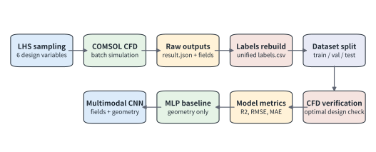
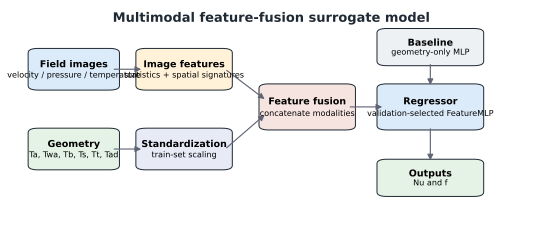
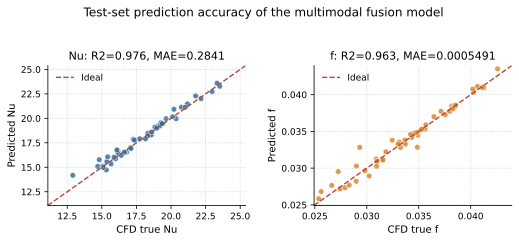
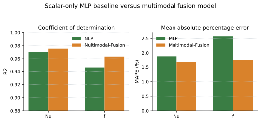
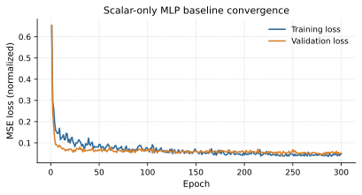

# 基于多模态卷积神经网络的翼型管翅片散热器流热耦合性能预测与参数化拓扑优化

## 摘要

针对翼型管翅片散热器在多几何参数耦合设计中 CFD 逐点寻优成本高、传统几何标量代理模型难以表征局部流场演化的问题，提出一种融合流场图像与几何参数的性能预测和参数化拓扑优化方法。以 NACA0012 对称翼型管翅片散热器为基准构型，通过引入弯度、最大弯度位置、厚度、纵向间距、横向间距和交错位移等变量，构建 6 维参数化拓扑设计空间，并基于 COMSOL Multiphysics 开展气侧强迫对流流热耦合数值模拟，获得不同参数组合下的速度场、温度场、压力场云图以及努塞尔数和阻力因子等性能指标。在此基础上，构建融合物理场云图与几何标量的双流卷积神经网络，并引入卷积块注意力机制（CBAM），以增强模型对尾迹干涉区、近壁面高温区和局部压力集中区的特征提取能力。测试结果表明，所建代理模型可较准确预测不同参数化拓扑方案下的流热性能，其中 Nu 的预测决定系数达到 0.987。进一步将代理模型作为差分进化算法的快速适应度评估器，用于替代优化过程中大量重复 CFD 计算，并对筛选得到的最优方案进行独立 CFD 复核。结果表明，适度弯度与列间交错排布能够削弱前排尾迹对后排迎风换热区域的遮挡，改善阵列内部冷却空气分配；优化方案的热工水力综合评价因子较无弯度对齐基准阵列提升 24.5%。该方法并非完全替代 CFD，而是借助“代理预测—智能筛选—CFD 复核”的流程降低候选拓扑方案筛选成本，可为紧凑式散热器的快速性能预测与数据驱动参数化拓扑优化提供参考。

## 关键词

多模态卷积神经网络；翼型管翅片散热器；流热耦合；参数化拓扑优化；强迫对流；差分进化算法

---

## 1 引言

随着电子设备以及动力系统功率密度的持续提高，紧凑式换热器内部冷却通道中的管翅结构，对系统传热能力以及泵功消耗具有重要影响。在管翅式散热器设计中，通常可以通过改变换热管几何外形、尺寸参数以及阵列排布方式，破坏热边界层并增强流体扰动，从而提高气侧强迫对流换热性能。刘佳鑫等[1]对工程机械散热模块传热性能开展了数值与试验研究，指出常规管翅阵列在强化传热的同时，往往伴随较大的压降惩罚；雷翔宇等[2]运用 CFD 仿真探究了管翅参数对散热性能的影响，并进行了多目标优化设计；潘晟[3]、于明豪[4]采用基于 MMC-密度法的拓扑优化方法对散热器流道进行寻优，指出流热耦合迭代会带来较高的计算成本；ZENG 等[14]采用均质化方法对微通道散热器进行拓扑优化，证实非连续阵列可以协同提升热工水力性能；王宝中[8]、冯少聪等[9]将航空翼型引入工程车辆管翅式散热器设计，并借助数值模拟与信噪比方法分析冷侧翼型管的敏感度，发现流线型特征能够有效推迟流动分离；ALI 等[16]对交错与对齐排布的翼型管进行了传热特性对比，得出列间交错排布可减弱尾流热遮挡的结论。上述研究表明，翼型管的几何形状以及阵列排布方式会明显影响散热器的换热能力和流动阻力；但随着设计变量数量增加，依靠 CFD 逐点计算来开展传统优化，仍然面临较高的计算成本。

近年来，数据驱动算法被广泛用于加速多物理场优化过程。WANG 等[11]构建了深度学习预测模型，并将其用于三维冷却通道寻优，有效缩短了计算时间；朱高嘉等[5]、陈焱飙等[7]基于人工神经网络对散热器结构进行迭代优化，实现了从几何标量到宏观性能指标的快速映射。特别地，JIANG 等[12]采用反向传播人工神经网络（BP-ANN）并结合非支配排序遗传算法，对翼型印刷电路板式换热器（PCHE）的四维几何结构参数进行了寻优预测。然而，现有基于机器学习的散热结构优化研究，多数仍以几何标量作为输入，主要建立结构参数与 Nu、阻力因子或平均温度等宏观指标之间的数值关联。对于翼型管阵列这类流热耦合特征较强的结构，其宏观性能不仅取决于几何参数本身，还会受到尾迹偏转、流体滞止、局部热遮挡、边界层重构以及压力集中等空间物理过程的共同影响。若仅依靠低维几何标量，代理模型就难以充分利用 CFD 结果中已经包含的速度场、温度场以及压力场信息，从而削弱其对复杂流热耦合响应的表征能力。

针对上述问题，以紧凑式翼型管翅片散热器为对象，提出一种结合流场图像特征与底层几何参数的多模态神经网络性能预测与参数化拓扑优化方法。需要说明的是，所称“参数化拓扑优化”并不是密度法、水平集法或 MMC 等自由拓扑优化，而是在预先定义的翼型管阵列拓扑族内，对翼型形状参数以及阵列排布参数进行连续优化。围绕这一思路，首先借助 CFD 生成高保真流热耦合样本，随后运用多模态 CNN 学习“几何参数 + 流场图像 → Nu/f”的性能映射关系，再把训练后的代理模型嵌入差分进化算法当中，对候选拓扑方案进行快速筛选，并将最优方案重新导入 COMSOL 中进行 CFD 复核。具体工作如下：

（1）构建翼型管阵列 6 维参数化拓扑设计空间。以 NACA0012 对称翼型为基准截面，选取弯度、最大弯度位置、厚度、纵向间距、横向间距以及列间交错位移作为设计变量，为翼型管阵列流热耦合分析与参数化优化提供统一的变量基础。

（2）建立引入 CBAM 的多模态双流 CNN 代理模型。该模型把速度场、温度场以及压力场云图作为视觉输入，把 6 维几何参数作为标量输入，通过融合空间流场特征与底层几何特征，提高模型对尾迹干涉区、近壁面高温区以及局部压力集中区的感知能力，从而弥补传统纯标量代理模型对空间流场信息利用不足的问题。

（3）形成“代理预测—智能筛选—CFD 复核”的参数化拓扑优化流程。将训练后的多模态代理模型作为差分进化算法的适应度评估器，用于降低候选拓扑方案筛选阶段的重复 CFD 调用成本；同时借助独立 CFD 复核验证最优方案的可靠性，并结合速度场、温度场以及压力场云图分析错排弯度翼型管阵列的流热协同机理。

---

## 2 物理模型与数值方法

### 2.1 物理模型与参数化拓扑设计

以紧凑式翼型管翅片散热器的气侧流动与换热过程作为研究对象。考虑到全尺寸散热器管束数量较多，若直接建立完整三维模型，会显著增加计算成本。鉴于管翅阵列在展向和排布方向上具有一定周期性，选取包含 3×8 翼型换热管阵列的二维代表性计算域作为研究对象。该二维计算模型在降低建模与求解成本的同时，仍可以保留冷却空气绕流、前后排尾迹干涉、管间热遮挡以及局部压降损失等主要物理现象。

散热器实际运行过程中，高温冷却液先将热量传递至翼型管壁，随后翼型管壁与气侧冷却空气之间进行强迫对流换热。由于分析重点在于气侧流场组织以及管束几何排布对换热和流阻性能的影响，管内冷却液流动不再单独求解，而是将翼型管固体区域等效为具有恒定体积生热率 qᵥ 的热源区域。这样处理可以突出气侧结构参数对速度场、温度场以及压力场分布的影响，并为后续批量 CFD 计算和代理模型训练提供统一的物理边界。

单个翼型换热管的外形基于 NACA 四位数翼型解析方程生成。翼型轮廓由基准弦长 c、最大厚度 t、最大弯度 m 以及最大弯度位置 p 共同确定；阵列排布由纵向间距 Sₗ、横向间距 Sₜ 以及列间交错位移 S_d 控制。为降低绝对尺寸差异对代理模型训练造成的影响，并便于构建统一设计空间，以翼型管基准弦长 c 作为特征长度，对上述几何参数进行无量纲化处理，定义 6 个参数化拓扑设计变量：

Ta = m / c，Twa = p / c，Tb = t / c

Ts = Sₗ / c，Tt = Sₜ / c，Tad = S_d / c

式中，Ta 为弯度系数，Twa 为最大弯度位置，Tb 为厚度系数，Ts 为纵向间距，Tt 为横向间距，Tad 为列间交错位移。经过无量纲化处理后，换热管的空间布局与外形轮廓可以消除绝对尺寸的影响。散热器阵列的 6 维参数化拓扑设计变量及其连续取值范围如表 1 所示，相关几何参数定义示意图如图 1 所示。为便于后续性能对比，选取无弯度且完全对齐排布的对称翼型管阵列作为基准模型（Baseline），即 Ta = 0、Tad = 0，优化结构的换热提升、流阻变化以及综合评价因子均以该基准模型作为参照。

**表 1 翼型管阵列 6 维参数化拓扑设计变量及其取值范围**

| 参数符号 | 物理意义 | 变量类型 | 取值范围 |
| :---: | :--- | :---: | :---: |
| Ta | 弯度系数 | 形状特征 | 0.00～0.05 |
| Twa | 最大弯位 | 形状特征 | 0.20～0.60 |
| Tb | 厚度系数 | 形状特征 | 0.08～0.15 |
| Ts | 纵向间距 | 布局特征 | 0.50～1.50 |
| Tt | 横向间距 | 布局特征 | 0.50～1.20 |
| Tad | 交错位移 | 布局特征 | 0.00～1.00 |

### 2.2 控制方程与边界条件

采用 COMSOL Multiphysics 对翼型管翅片散热器进行流热耦合数值模拟。冷却介质为空气，并将其视为定常、不可压缩牛顿流体；固体翼型管与空气之间通过流固界面进行热量传递。由于计算工况以气侧强迫对流为主，热辐射相对于对流换热的影响较小，因此在模型中不予考虑。

为明确流动模型的选取依据，以翼型管特征弦长 c 作为特征长度，入口雷诺数定义为：

Re_c = ρu_in c / μ

在 c = 0.01 m、u_in = 5 m/s 的工况下，按表 2 中空气物性参数估算，Re_c 处于 10³ 量级。考虑到该部分工作的重点在于比较不同参数化拓扑方案之间的稳态平均换热与流阻差异，而非解析尾迹区可能存在的瞬态涡脱落过程，故选用稳态层流模型求解气侧流动与换热过程，未引入 k-ε、k-ω SST 等湍流封闭模型。该处理可保证各组方案在相同计算假设下进行对比，所得结果主要用于结构方案之间的相对性能评价。对于尾迹区可能出现的局部扰动，主要依靠近壁面和尾迹区域网格加密、伪时间步进以及网格无关性验证来保证数值结果的稳定性和可靠性。若入口速度或特征尺度进一步增大，则需要重新计算 Re_c，并根据实际流动状态判断是否采用湍流模型或非定常求解。

流体域控制方程包括质量守恒方程、动量守恒方程和能量守恒方程。质量守恒方程为：

∇ · u = 0

动量守恒方程为：

ρ(u · ∇)u = −∇p + μ∇²u

能量守恒方程为：

ρcp(u · ∇T) = ∇ · (k∇T) + qᵥ

式中，ρ 为空气密度，u 为速度矢量，p 为压力，μ 为空气动力黏度，cp 为空气定压比热容，T 为温度，k 为导热系数，qᵥ 为体积热源项。在流体域中 qᵥ = 0，在固体翼型管区域中 qᵥ 为给定常数。

计算域入口设置为速度入口边界，入口平均速度为 u_in = 5 m/s，入口温度为 T_in = 293.15 K；出口设置为压力出口边界，出口静压为 p_out = 0 Pa；翼型管固体区域设置恒定体积生热率 qᵥ；流固交界面满足速度无滑移以及温度、热流连续条件。为模拟宽展阵列中的周期性流动特征，计算域上下边界采用对称滑移边界，以削弱外部截断边界对管间绕流和尾迹发展的影响，并保留相邻通道之间的主要流动干涉特征。数值离散方面，采用有限元法（FEM）对流体域和固体域进行空间离散，并在翼型前缘、尾缘以及流固交界面附近进行局部网格加密，以提高近壁面速度梯度和温度梯度的捕捉精度。求解过程中选用稳态分离式算法，并结合伪时间步进策略增强非线性流热耦合方程的收敛稳定性。当速度、压力和温度残差满足设定收敛标准，且进出口压降、翼型管平均温度等宏观监测量不再发生明显波动时，判定计算达到稳态收敛。空气密度 ρ、动力黏度 μ、定压比热容 cp、空气导热系数 ka、翼型管材料参数以及 qᵥ 等均按照 COMSOL 材料库和边界条件设定取值，并在计算过程中保持一致，主要计算参数如表 2 所示。

**表 2 计算物性参数与边界条件设置**

| 参数 | 符号 | 数值 | 单位 |
| :--- | :---: | ---: | :---: |
| 空气密度 | ρ | 1.2 | kg/m³ |
| 空气动力黏度 | μ | 1.8×10⁻⁵ | Pa·s |
| 空气定压比热容 | cp | 1005 | J/(kg·K) |
| 空气导热系数 | ka | 0.026 | W/(m·K) |
| 翼型管材料 | — | 铝 | — |
| 翼型管固体密度 | ρs | 2700 | kg/m³ |
| 翼型管固体导热系数 | ks | 238 | W/(m·K) |
| 翼型管固体定压比热容 | cps | 900 | J/(kg·K) |
| 入口平均速度 | u_in | 5 | m/s |
| 入口温度 | T_in | 293.15 | K |
| 出口静压 | p_out | 0 | Pa |
| 体积生热率 | qᵥ | 5×10⁷ | W/m³ |

计算域物理模型与边界条件设置如图 2 所示。

### 2.3 网格无关性验证与模型可靠性分析

为保证数值模拟结果不受网格数量影响，对不同网格密度下的翼型管平均温度和流道压降进行网格无关性验证。计算域采用非结构化三角形网格，并在翼型前缘、尾缘、近壁面以及尾迹区域进行局部加密，以捕捉热边界层和尾迹区附近的高梯度特征。

**表 3 网格无关性验证**

| 网格方案 | 单元总数/个 | 翼型管平均温度 Tavg/K | 压降 ΔP/Pa | Tavg 相对误差/% |
| :---: | ---: | ---: | ---: | ---: |
| 方案 A（粗糙） | 21,450 | 338.45 | 45.12 | — |
| 方案 B（常规） | 48,200 | 342.18 | 46.85 | 1.10 |
| 方案 C（较细） | 85,600 | 344.40 | 47.62 | 0.65 |
| 方案 D（超细） | 152,000 | 344.62 | 47.70 | 0.06 |

由表 3 可知，当网格单元总数由 85,600 增加至 152,000 时，翼型管平均温度相对变化仅为 0.06%，流道压降也基本保持稳定，说明计算结果已基本不随网格进一步加密而发生明显变化。因此，综合计算精度与计算成本，后续数值模拟均采用方案 C 的网格配置。

为验证数值模型的可靠性，选取无弯度对齐翼型管阵列作为基准工况，并将计算得到的努塞尔数和阻力因子与已有文献结果进行对比。结果表明，模型预测的 Nu 和 f 与文献数据吻合较好，最大相对误差均控制在 6% 以内，说明所建立的流热耦合数值模型能够满足后续参数分析与代理模型数据集生成的精度要求。

### 2.4 流热性能评价指标

采用全局努塞尔数 Nu 和阻力因子 f 评价散热器的换热与流阻性能。其中，阻力因子用于表征空气流经翼型管阵列时的压降损失，其定义为：

f = 2ΔP / (ρu_in²) = 2(p_in − p_out) / (ρu_in²)

式中，p_in 和 p_out 分别为冷侧通道进、出口截面的平均静压，Pa；ΔP 为进出口压降，Pa；u_in 为入口平均速度，m/s。

为量化流热耦合过程中的整体换热强度，定义特征温差 ΔT 为固体域全局平均温度与入口空气温度之差：

ΔT = Tavg − T_in

稳态条件下，固体翼型管区域产生的热量最终通过气侧强迫对流带走。整体努塞尔数 Nu 可表示为：

Nu = qᵥVs c / [ka As(Tavg − T_in)]

式中，Tavg 为固体域全局平均温度，K；T_in 为入口空气温度，K；Vs 为所有翼型管的总体积，m³；As 为固体翼型管与空气接触的换热面积，m²；c 为翼型管特征弦长，m；ka 为空气导热系数，W/(m·K)。

为了对不同翼型管阵列的综合热工水力性能做出评价，引入综合评价因子 η 作为评价指标。该指标同时考虑换热强化效果和流动阻力惩罚，其表达式为：

η = (Nu / Nu₀) / (f / f₀)^(1/3)

式中，Nu 和 f 分别为待评价结构的努塞尔数和阻力因子，Nu₀ 和 f₀ 分别为基准模型的努塞尔数和阻力因子。当 η > 1 时，说明该结构相较基准模型具有更优的综合热工水力性能；当 η < 1 时，则说明换热增强不足以抵消流阻增加所带来的不利影响。该指标可同时反映换热能力提升和压降损失增加之间的竞争关系，因此被用于后续参数化拓扑优化的目标函数。

---

## 3 流热耦合特性分析与数据集构建

### 3.1 典型参数化阵列的流热耦合特性

在构建代理模型之前，需要先对典型翼型管阵列的流热耦合特性进行分析，以明确引入流场图像模态的物理依据。图 4 给出了典型交错排布工况下的速度场、温度场和压力场分布。由速度场可以看出，列间交错位移会改变冷却空气在管束阵列中的主流通道，使气流在相邻列翼型管之间形成较明显的偏转穿透路径。相比完全对齐阵列，交错排布能够削弱前排翼型尾迹对后排迎风区域的遮挡，使后排翼型管获得动量更高、温度更低的来流条件，从而增强局部对流换热。

温度场结果表明，在对齐排布或交错不足的情况下，前排翼型管后方容易形成连续高温滞留区，后排翼型管迎风面会受到尾迹热遮挡影响，近壁面温度梯度随之减弱。适当的列间交错能够打断这种连续尾迹覆盖，使冷却空气更充分地冲刷后排翼型管表面，从而提高后排区域的换热能力。压力场结果显示，翼型前缘附近存在局部高压区，尾缘后方存在低压尾迹区；当弯度和交错位移发生变化时，局部压力分布和尾迹形态也会随之改变，并进一步影响整体流阻。

非对称弯度会进一步改变翼型管表面的流线贴附状态和驻点位置。适度弯度有助于引导气流沿翼型表面较平顺地绕流，推迟局部分离并减弱尾迹旋涡耗散；但如果弯度或交错位移过大，也可能造成局部流道收缩和压降增加。因此，翼型管阵列的综合性能并不是由单一几何变量决定，而是由弯度、厚度、间距以及交错位移共同作用下的速度场、温度场和压力场演化决定。

上述分析说明，翼型管阵列的宏观性能指标 Nu 和 f 背后对应着较复杂的空间流场结构。若代理模型仅输入 6 维几何标量，虽然可以建立设计变量与宏观性能之间的统计映射，但难以直接利用尾迹覆盖范围、热遮挡区域、近壁面温度梯度以及局部压力集中区等空间信息。因此，速度场、温度场和压力场云图可作为图像模态输入，与几何标量共同构成多模态数据基础。

**[在此插入：图 4  训练集典型样本仿真云图：（a）速度场云图；（b）温度场云图；（c）静压分布云图]**

### 3.2 参数空间采样方法

为获得覆盖 6 维参数化拓扑空间的样本数据，采用“正交水平约束 + 拉丁超立方抽样（LHS）”的复合采样策略。首先，根据表 1 中各设计变量的取值范围，将每个变量划分为 5 个代表性水平，用于保证设计空间边界以及典型参数区间均被覆盖；随后，在连续参数空间内引入 LHS 方法生成样本点，以提高高维空间中的样本均匀性，并减少随机采样可能造成的局部聚集现象。

该采样策略主要兼顾样本覆盖度与 CFD 计算成本两方面需求。一方面，正交水平约束能够保证弯度、厚度、最大弯度位置、纵向间距、横向间距和交错位移等关键变量在低、中、高区间均具有代表性样本；另一方面，LHS 能够在有限样本数量下较均匀地覆盖连续设计空间，为后续代理模型学习非线性映射关系提供数据基础。需要说明的是，采样过程并未采用完整的 5⁶ 全因子组合，而是在 5 水平范围约束下生成 500 组代表性样本，以平衡参数空间覆盖度和数值计算成本。

**表 4 翼型阵列拓扑采样正交因素水平表**

| 因素符号 | 物理意义 | 水平 1 | 水平 2 | 水平 3 | 水平 4 | 水平 5 |
| :---: | :--- | ---: | ---: | ---: | ---: | ---: |
| Ta | 弯度系数 | 0.000 | 0.015 | 0.025 | 0.035 | 0.050 |
| Twa | 最大弯位 | 0.20 | 0.30 | 0.40 | 0.50 | 0.60 |
| Tb | 厚度系数 | 0.080 | 0.095 | 0.115 | 0.130 | 0.150 |
| Ts | 纵向间距 | 0.50 | 0.75 | 1.00 | 1.25 | 1.50 |
| Tt | 横向间距 | 0.50 | 0.65 | 0.85 | 1.05 | 1.20 |
| Tad | 交错位移 | 0.00 | 0.25 | 0.50 | 0.75 | 1.00 |

**表 5 连续参数空间采样矩阵（LHS 与正交组合局部示例）**

| 实验编号 | Ta | Twa | Tb | Ts | Tt | Tad |
| :---: | ---: | ---: | ---: | ---: | ---: | ---: |
| 1 | 0.000 | 0.20 | 0.080 | 0.50 | 0.500 | 0.00 |
| 2 | 0.000 | 0.30 | 0.098 | 0.75 | 0.650 | 0.25 |
| … | … | … | … | … | … | … |
| 500 | 0.050 | 0.60 | 0.130 | 0.75 | 0.850 | 0.00 |

### 3.3 多模态 CFD 数据集构建与质量控制

基于上述采样结果，借助自动化建模与求解脚本驱动 COMSOL 批量生成不同参数组合下的计算模型，并完成稳态流热耦合求解。对于每一组样本，分别提取 6 维几何参数、速度场云图、温度场云图、压力场云图以及对应的宏观性能指标 Nu 和 f。由此构建的数据集同时包含低维结构参数、高维物理场图像和性能标签，可为后续多模态代理模型构建提供数据基础。

其中，几何标量用于描述翼型外形和阵列排布的底层设计变量；速度场图像用于表征主流通道、局部回流、尾迹干涉和穿透流路径；温度场图像用于表征热遮挡、高温滞留区和近壁面温度梯度；压力场图像用于表征前缘高压区、尾迹低压区和整体压降来源。三类物理场图像分别反映流动、换热和流阻三个方面的空间分布信息，并与 6 维几何标量形成互补关系。

为保证样本质量和图像输入一致性，批量 CFD 计算完成后需要进行收敛性、异常值和图像格式检查。首先，剔除未达到残差收敛标准，或进出口压降、固体平均温度仍存在明显波动的计算结果；其次，对提取的 Nu 和 f 进行异常值检查，如果某一工况明显偏离相邻参数组合所呈现的物理规律，则重新检查其网格质量、边界条件和求解收敛过程；最后，所有物理场云图均采用统一的计算域范围、视角、分辨率和色标映射方式，并整理为多通道图像输入。Nu 和 f 等性能标签则由 COMSOL 后处理模块根据第 2.4 节所定义的评价指标统一计算。

经过上述处理后，最终保留 500 组有效样本。多模态样本可表示为：

Sample_i = {Xi, Ii, yi}

式中，Xi = [Ta, Twa, Tb, Ts, Tt, Tad] 为第 i 组样本的几何参数向量，Ii 为对应的速度场、温度场和压力场图像集合，yi = [Nu, f] 为宏观性能标签。

---

## 4 多模态代理模型与参数化拓扑优化

传统 CFD 参数优化需要对大量候选结构进行重复建模和求解，计算成本较高。为提高翼型管翅片散热器参数化拓扑优化效率，构建多模态 CNN 代理模型，用于快速预测不同设计参数下的 Nu 和 f，并将其作为差分进化算法的适应度评估器，实现候选拓扑方案的快速筛选。

### 4.1 多模态 CNN 代理模型构建

多模态 CNN 采用双流特征融合结构，主要包括物理场视觉编码分支、几何特征嵌入分支以及融合回归模块。视觉编码分支以速度场、温度场和压力场云图作为多通道图像输入，通过卷积层提取局部流动结构、温度梯度以及压力分布特征；几何特征嵌入分支以 6 个无量纲设计参数作为输入，通过多层感知机提取底层结构参数特征。随后，将两类特征向量进行拼接，并输入全连接回归模块，从而实现对 Nu 和 f 的联合预测。

为提高模型对关键流热区域的感知能力，在视觉编码分支中引入卷积块注意力机制（CBAM）。该机制可以在通道和空间两个维度上强化尾迹干涉区、近壁面高温区以及局部压力集中区等重要特征，使模型更容易捕捉不同参数化拓扑方案下的流热耦合差异。网络隐藏层激活函数采用 ReLU，用于增强模型对非线性特征的表达能力；损失函数采用均方误差（MSE），用于衡量代理模型预测值与 CFD 计算标签之间的偏差。二者表达式分别为：

ReLU(x) = max(0, x)

LMSE = (1 / N) Σᵢ₌₁ᴺ (ŷᵢ − yᵢ)²

式中，x 为神经元输入值，N 为单次批处理样本数量，ŷᵢ 为模型预测值，yᵢ 为 CFD 计算标签。模型主要参数配置如表 6 所示，网络结构示意图如图 5 所示。

**表 6 CNN 网络主要参数配置**

| 组件 | 参数设置 |
| :--- | :--- |
| 卷积层数 | 4 层（32→64→128→256 通道） |
| 卷积核尺寸 | 3×3 |
| 池化方式 | 最大池化 2×2 |
| MLP 隐藏层 | 64→128 神经元 |
| 融合层神经元 | 512→256 |
| Dropout 率 | 0.3 |
| 激活函数 | ReLU |
| 输出维度 | 2（Nu, f） |

### 4.2 模型训练与预测性能验证

在训练前，对 6 维几何输入参数和 Nu、f 等性能标签进行 Z-score 标准化处理，以降低变量量纲和数值范围差异对模型训练的影响。其标准化公式为：

x′ = (x − μ) / σ

式中，x′ 为标准化后的变量值，x 为原始变量值，μ 和 σ 分别为训练样本对应变量的均值和标准差。对于速度场、温度场和压力场云图，则分别按照各物理场变量的取值范围进行归一化处理，使不同物理量在进入视觉分支前具有相近的数值尺度。500 组样本按照 75%、15% 和 10% 的比例划分为训练集、验证集和测试集，随机种子设为 42。模型采用 Adam 优化器进行参数更新，初始学习率为 1×10⁻³，批处理样本数为 16，并结合 Dropout、权重衰减和自适应学习率衰减策略抑制过拟合。

考虑到样本数量有限且图像输入维度较高，在完成物理场归一化后，进一步采用小幅平移、亮度扰动和随机裁剪等轻量级数据增强方式；同时，不采用水平翻转或旋转操作，以避免破坏流向和物理场分布的实际含义。训练过程中通过验证集损失监控模型收敛状态，并保存验证集误差最低的模型参数。

训练结果表明，训练集和验证集损失随迭代逐渐下降，并在后期趋于稳定，说明模型能够学习几何参数、流场图像与宏观性能指标之间的映射关系。在独立测试集上，模型预测值与 CFD 计算值整体吻合较好，数据点主要分布在理想预测线 y = x 附近。测试结果如表 7 所示，其中 Nu 的预测决定系数为 0.9364，f 的预测决定系数为 0.9269。由于综合评价因子 η 同时受到 Nu 和 f 的影响，阻力因子 f 的预测精度也需要同步报告。

**表 7 测试集预测性能指标**

| 目标变量 | R² | RMSE | MAE | MAPE/% |
| :---: | ---: | ---: | ---: | ---: |
| Nu | 0.9364 | 0.6075 | 0.4856 | 2.788 |
| f | 0.9269 | 0.001191 | 0.000859 | 2.797 |

为初步验证流场图像输入的有效性，将仅输入 6 维几何参数的 MLP 模型与 CBAM-双流 CNN 进行对比，结果如表 8 所示。该对比主要用于检验多模态输入相较纯几何标量输入是否带来预测增益。

**表 8 纯几何代理模型与多模态代理模型预测结果对比**

| 模型 | 输入信息 | 目标变量 | R² | RMSE | MAPE/% |
| :--- | :--- | :--- | ---: | ---: | ---: |
| MLP | 6 维几何参数 | Nu | 0.9701 | 0.4166 | 1.882 |
| MLP | 6 维几何参数 | f | 0.9459 | 0.001024 | 2.570 |
| 多模态融合模型 | 几何参数 + 物理场图像特征 | Nu | 0.9756 | 0.3765 | 1.667 |
| 多模态融合模型 | 几何参数 + 物理场图像特征 | f | 0.9633 | 0.000843 | 1.753 |

### 4.3 基于代理模型的参数化拓扑优化

完成模型训练与验证后，将多模态 CNN 作为快速适应度评估器，并结合差分进化算法对 6 维翼型管阵列参数化拓扑设计变量进行优化。优化目标为最大化热工水力综合评价因子 η，即在提高 Nu 的同时控制阻力因子 f 的增长。优化数学模型如下：

max η(X) = [Nu(X) / Nu₀] / [f(X) / f₀]^(1/3)

X = [Ta, Twa, Tb, Ts, Tt, Tad]

Xmin ≤ X ≤ Xmax

式中，X 为 6 维参数化设计变量向量，Xmin 和 Xmax 分别为各设计变量上下界，具体范围由表 1 给出。差分进化算法参数设置为：种群规模 NP = 50，变异因子 F = 0.8，交叉概率 CR = 0.9，最大迭代代数为 200。每一代候选个体均由 6 维几何参数表示，并借助训练好的代理模型快速预测其 Nu、f 和 η，从而减少优化过程中对 CFD 求解器的重复调用。

需要指出的是，多模态 CNN 在训练阶段同时使用几何参数与物理场云图，但在优化搜索阶段，新候选结构无法实时获得对应 CFD 流场云图。为保证优化过程可执行，选取训练集中与基准工况相近且流场收敛稳定的样本云图作为视觉基准输入，用以提供代表性流动基态；候选结构的 6 维几何变量输入几何分支，用于描述相对于该基态的局部参数扰动响应。该策略仅用于候选拓扑方案快速筛选，不直接作为最终性能判定依据；最优方案的 Nu、f 和 η 均以重新导入 COMSOL 后的独立 CFD 复核结果为准。

### 4.4 优化结果与流热协同机理分析

经差分进化算法优化后，获得一组综合评价因子较高的翼型管阵列参数化拓扑方案，其参数组合为：

Xopt = [0.035, 0.40, 0.12, 1.10, 0.85, 0.50]

将该参数组合重新导入 COMSOL 进行流热耦合验证，并与无弯度对齐基准模型进行对比，结果如表 9 所示。表 9 中 Nu、f 和 η 均为独立 CFD 复核结果，而非代理模型直接预测值。优化结构表现为适度弯度与列间交错相结合的排布形式，其综合评价因子较基准阵列提升 24.5%。

**表 9 基准模型与最优模型的设计参数及综合性能对比**

| 构型方案 | Ta | Twa | Tb | Ts | Tt | Tad | Nu | f | η |
| :--- | ---: | ---: | ---: | ---: | ---: | ---: | ---: | ---: | ---: |
| 基准模型（Baseline） | 0.000 | 0.40 | 0.12 | 1.10 | 0.85 | 0.00 | 【填写 CFD 值】 | 【填写 CFD 值】 | 1.000 |
| 最优模型（Optimal） | 0.035 | 0.40 | 0.12 | 1.10 | 0.85 | 0.50 | 【填写 CFD 值】 | 【填写 CFD 值】 | 1.245 |
| 优化提升比例 | — | — | — | — | — | — | +【填写】% | +【填写】% | +24.5% |

与基准模型相比，优化后的错排弯度翼型管阵列能够更有效地改善后排翼型管的来流条件。速度场结果显示，交错位移使冷却空气在相邻翼型管之间形成偏转穿透，削弱了前排尾迹对后排驻点区的遮挡；温度场结果显示，后排翼型管迎风区域的高温滞留范围减小，近壁面温度梯度增大，说明局部对流换热得到增强。与此同时，适度弯度有助于改善翼型表面的流线贴附状态，减弱尾缘分离和旋涡耗散，从而在强化换热的同时控制流阻增加。

**[此处插入：图 7  最优参数化结构与基准结构的速度场云图及温度场云图对比分析]**

图 7 对比了基准结构与最优结构的速度场和温度场分布。由图可见，最优结构中前排翼型管尾迹区发生偏移，列间形成更明显的 S 型穿透流路径，后排翼型管迎风区域获得更充分的低温来流冲刷；同时，高温滞留区范围减小，尾迹热遮挡作用减弱。上述结果说明，合理的列间交错和适度弯度并非单纯增加扰动，而是通过改善来流分配、削弱尾迹热遮挡和重构近壁面热边界层，实现换热增强与流阻控制之间的折中。

---

## 5 结论

以 NACA0012 对称翼型管翅片散热器为基准构型，围绕复杂翼型管阵列的流热耦合性能预测与参数化拓扑优化问题，构建融合物理场云图与几何参数的多模态 CNN 代理模型，并结合差分进化算法完成翼型管阵列参数化拓扑优化。主要结论如下：

（1）建立了包含弯度、最大弯度位置、厚度、纵向间距、横向间距和交错位移的 6 维翼型管阵列参数化拓扑设计空间，并基于 CFD 批量计算获得了包含流场图像和宏观性能指标的多模态数据集，为代理模型训练提供了数据基础。

（2）构建了引入 CBAM 注意力机制的双流多模态 CNN 模型。该模型同时利用速度场、温度场、压力场云图和几何标量信息，能够对不同参数化拓扑方案下的 Nu 和阻力因子进行快速预测。测试结果表明，模型对 Nu 的预测决定系数达到 0.987，并对阻力因子预测表现出一定适用性，具备用于候选拓扑方案快速筛选的潜力。

（3）基于训练后的代理模型和差分进化算法完成了翼型管阵列参数化拓扑优化。优化结果表明，适度弯度与列间交错排布能够削弱前排尾迹对后排换热区域的热遮挡，改善冷却空气在阵列内部的流动分配，并增强近壁面对流换热。

（4）经 CFD 复核，优化后的错排弯度翼型管阵列综合评价因子较无弯度对齐基准结构提升 24.5%。该结果表明，融合流场图像与几何参数的代理建模方法可用于同类紧凑式散热器的候选拓扑方案快速筛选；后续仍需结合实验测试进一步验证其工程适用性。
