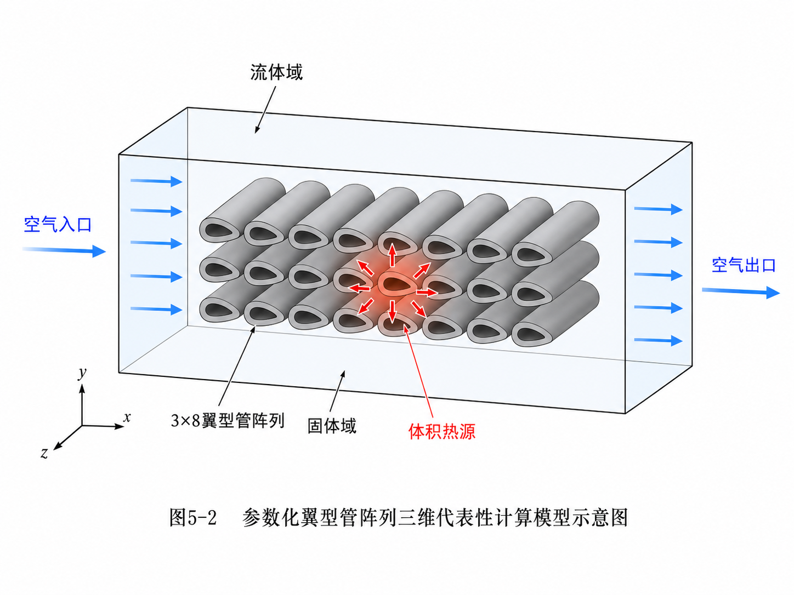
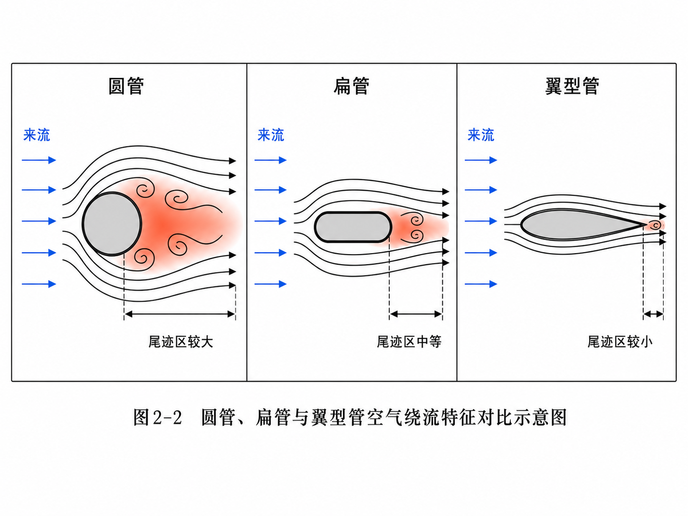
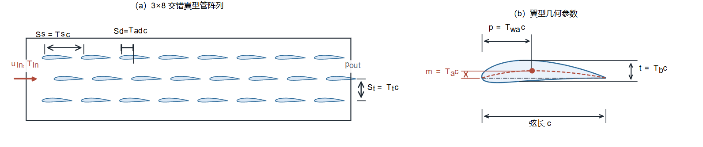
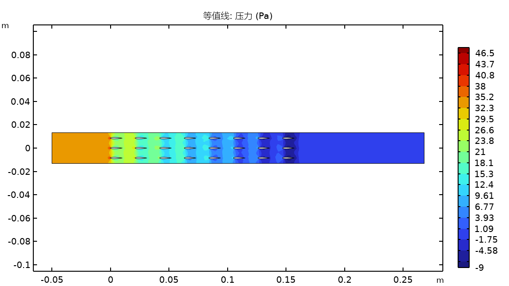
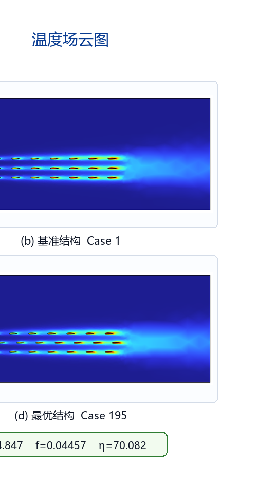
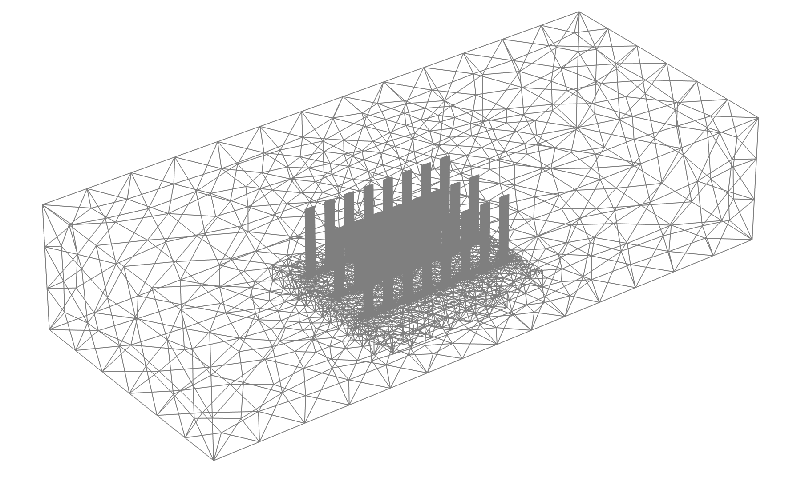
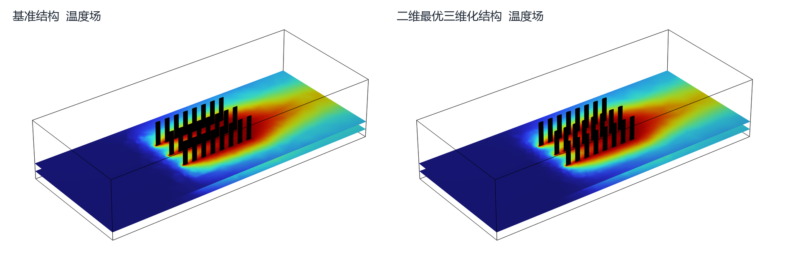
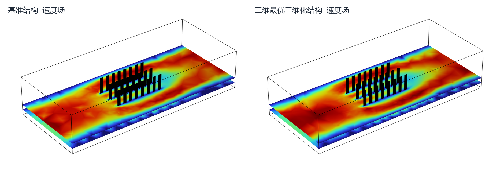

# 毕业答辩PPT_final

- Source: `毕业答辩PPT_final.pptx`
- Total slides: 18

## Slide 1

基于物理信息卷积神经网络的翼型管翅片散热器流热性能预测与参数优化研究

2026年6月

### Speaker Notes

各位老师好，我的论文题目是“基于物理信息卷积神经网络的翼型管翅片散热器流热性能预测与参数优化研究”。本文关注的是风冷散热器中翼型管阵列结构的快速预测和参数优化问题。

## Slide 2

研究背景与意义

- 电子芯片功耗攀升，风冷散热需求日益严峻
- 空气侧对流换热占总热阻60%~80%，是风冷系统瓶颈
- 传统圆管翅片散热器：尾迹区大、压降高，换热效率受限
- 翼型管流线型截面：推迟流动分离，兼顾高换热与低阻力
- 难题：6维参数耦合，CFD逐点搜索成本高昂
- 不足：纯数据驱动代理模型缺乏物理约束，小样本泛化不足

本文主线：CFD样本 → 带物理约束的代理模型 → 差分进化筛选 → CFD/3D复核把“逐点试错”转化为“建模-预测-优化-验证”闭环

2

### Speaker Notes

先说明问题来源：电子芯片功耗提高后，风冷系统的瓶颈主要在空气侧换热。传统圆管或普通翅片存在尾迹大、压降高的问题。翼型管有较好的流线型，但设计变量较多，直接用CFD逐点搜索成本很高。因此本文采用“CFD样本+代理模型+优化算法+CFD复核”的路线。

## Slide 3

参数化设计与六维设计空间

翼型形状参数（3个）

| 参数 | 含义 | 范围 |
| --- | --- | --- |
| Ta | 最大弯度 | [0.02, 0.06] |
| Twa | 最大弯度位置 | [0.2, 0.5] |
| Tb | 最大厚度 | [0.06, 0.15] |

阵列排布参数（3个）

| 参数 | 含义 | 范围 |
| --- | --- | --- |
| Ts | 横向间距 | [0.8, 1.5] |
| Tt | 纵向间距 | [0.6, 1.2] |
| Tad | 错排偏移 | [0, 0.6] |

基准：NACA0012对称翼型 + 3×8顺排阵列

3

### Speaker Notes

这一页讲清楚六个参数。前三个参数描述翼型形状，后三个参数描述阵列排布。基准结构采用NACA0012对称翼型和3×8顺排阵列。优化目标不是单纯提高换热，而是在换热增强和阻力代价之间折中。

## Slide 4

二维CFD数值模型

几何模型与边界条件

| 材料 | ρ(kg/m³) | μ(Pa·s) | k(W/(m·K)) | Cp(J/(kg·K)) |
| --- | --- | --- | --- | --- |
| 空气 | 1.225 | 1.81×10⁻⁵ | 0.026 | 1005 |
| 铝 | 2700 | — | 237 | 900 |

- COMSOL Multiphysics 6.3，流固共轭传热(CHT)
- 3×8翼型管阵列，弦长c为基准长度
- 流体域(空气) + 固体域(铝) 共轭耦合
- 入口：均匀速度 u_in=2 m/s, T_in=300 K
- 出口：压力出口 P=0 Pa (表压)
- 壁面：无滑移 + 温度/热流连续
- 底部：等效体积热源 q_v=1×10⁷ W/m³
- Re~1000，稳态层流求解

求解器配置

- 全耦合求解（流动+传热统一方程组）
- 线性求解器：MUMPS直接求解器
- 收敛判据：残差 < 10⁻⁶
- 单次仿真：3~5 min | 500组批量：~40-60 h

定位说明：二维模型用于参数筛选和机理分析不直接替代三维工程验证

4

### Speaker Notes

二维模型用于批量生成训练数据。COMSOL中建立稳态流固共轭传热模型，空气域和铝质固体域耦合。入口给定速度和温度，出口给定压力，壁面无滑移，热源保持一致。这里要强调：二维模型用于参数筛选和机理分析，不直接替代三维工程验证。

## Slide 5

网格划分策略与无关性验证

重点加密翼型近壁面和尾迹区域 | 中vs细: Nu偏差1.0%、f偏差1.5% → 选中等网格批量计算

| 网格等级 | 单元数 | Nu | f | Nu偏差 | f偏差 |
| --- | --- | --- | --- | --- | --- |
| 粗网格 | ~5,000 | 18.7 | 0.425 | — | — |
| 中等网格 | ~10,000 | 19.3 | 0.418 | 1.0% | 1.5% |
| 细网格 | ~20,000 | 19.5 | 0.412 | 基准 | 基准 |

5

### Speaker Notes

网格重点加密翼型近壁面和尾迹区域。无关性验证不是只看网格数量，而是看Nu和f的变化。中等网格相对细网格偏差控制在可接受范围内，所以用于500组批量计算。

## Slide 6

LHS采样与多模态数据集构建

- 拉丁超立方采样(LHS)：6维空间均匀覆盖
- 500组样本，~490组有效（少量几何冲突剔除）
- COMSOL Java API全自动批量仿真
- Z-score标准化（仅用训练集统计量，防止数据泄露）
- 划分：375训练 / 75验证 / 50测试

每个样本包含：① 六维几何参数 [Ta,Twa,Tb,Ts,Tt,Tad]② 流场云图 (速度/温度/压力, 800×600)③ 温度场矩阵 (64×64) + 空气域掩码④ 性能标签 (Nu, f)

6

### Speaker Notes

用LHS生成500组参数样本。每个样本包括六维几何参数、速度/温度/压力云图、温度场矩阵和Nu/f性能标签。标准化只使用训练集统计量，避免数据泄露。

## Slide 7

典型流场特征 — 为什么需要多模态？

速度场管间加速 + 管后尾迹

温度场热滞留 + 沿程升温

压力场前缘高压 + 后缘低压

这些空间分布信息不是六个参数本身能完全表达的 → 需要把云图也作为模型输入参数敏感性(随机森林)：Ts对Nu最大(0.31) | Tt对f最大(0.35) | Tad对η最大(0.28)

7

### Speaker Notes

这一页解释为什么需要多模态。速度场能看到管间加速和尾迹，温度场能看到热滞留和沿程升温，压力场能看到前缘高压和后缘低压。这些空间分布信息不是六个参数本身能完全表达的。

## Slide 8

技术路线总览

COMSOLCFD建模

LHS采样500组

多模态数据集

五模型消融对比

DE优化+代理模型

CFD复核+3D验证

→

→

→

→

→

五种模型逐步消融：

MLP(17K)仅参数

FeatureMLP(57K)+图像特征

CNN+CBAM(7.67M)过拟合!

CNN+CBAM+GAP(2.4M)反过拟合

PI-CNN-CBAM(3.7M)+物理约束

→

→

→

→

每一步回答一个问题：参数够不够？云图有没有用？CNN有没有过拟合？物理约束有没有帮助？

8

### Speaker Notes

一句话讲：先用COMSOL生成样本，再训练多模态代理模型，然后用差分进化优化，最后用CFD和三维模型复核。这里是全文逻辑总览。

## Slide 9

五种预测模型架构 — 消融实验设计

MLP基线

FeatureMLP

CNN+CBAM大参数

CNN+CBAM+GAP

PI-CNN-CBAM

→

→

→

→

~17K

~57K

~7.67M

~2.4M

~3.7M

6→64→128→64→2仅几何参数问：参数够不够？

258维融合输入6参数+252图像特征sklearn MLPRegressor问：云图有没有用？

3并行CNN+CBAMPool(4×4)12416维融合问：CNN过拟合了吗？

同上架构Pool(1×1) GAP896维融合问：GAP能反过拟合吗？

GAP+FieldHead64×64温度场Laplacian约束问：物理约束有用吗？

9

### Speaker Notes

这一页讲消融实验设计。模型从MLP基线开始，逐步加入图像特征、CNN深度特征、GAP反过拟合和物理信息约束。每一步都对应一个问题：参数够不够、云图有没有用、CNN有没有过拟合、物理约束有没有帮助。

## Slide 10

CNN+CBAM双流网络架构详解

图像流（3并行CNN分支）

CBAM注意力模块

- 3分支分别处理：速度场、温度场、压力场云图
- 每分支结构：Conv→BN→ReLU→MaxPool × 3组
- 卷积核：3×3, 通道数逐步增大(32→64→128→256)
- 第3组后接入CBAM注意力模块
- CBAM后再经1组Conv→BN→ReLU
- 最终池化：Pool(4×4)→12288维 或 GAP→768维
- 3分支拼接后形成统一图像特征向量

- 通道注意力：GAP + GMP → 共享MLP → Sigmoid
- → 自适应强化关键特征通道
- 空间注意力：通道avg+max → 7×7 Conv → Sigmoid
- → 聚焦翼型前缘、尾迹剪切层等关键区域
- 输出：F'' = M_s ⊗ (M_c ⊗ F)

参数流 + 融合预测器

- 参数MLP分支：6→64→128→128维参数特征
- 双流拼接：图像特征 ⊕ 参数特征(128维)
- 预测器头：融合特征→512→256→2 (Nu, f)
- Dropout=0.3, BatchNorm加速收敛

10

### Speaker Notes

图像流分别处理速度、温度和压力云图；参数流处理六维几何参数。CBAM的作用是让网络更关注前缘、尾迹和热滞留等关键区域。最后融合特征同时预测Nu和f。

## Slide 11

PI-CNN-CBAM — 物理信息神经网络详解

FieldHead温度场重建分支

物理约束与联合损失

- 输入：骨干融合特征 896维
- 投影层：896 → 256×4×4 (256通道, 4×4空间)
- 上采样1：ConvTranspose2d → 8×8 + CBAM
- 上采样2：ConvTranspose2d → 16×16 + CBAM
- 上采样3：ConvTranspose2d → 32×32
- 上采样4：ConvTranspose2d → 64×64
- 输出卷积：多通道 → 单通道64×64温度场
- 新增参数 ~1.3M，总计 ~3.7M

- Laplacian物理损失：空气域5点有限差分
- ∇²T ≈ T(i+1,j)+T(i-1,j)+T(i,j+1)+T(i,j-1)-4T(i,j)
- 仅对空气域像素施加（掩码屏蔽固体域）
- 物理依据：稳态空气域 ∇²T ≈ 0 (热传导主导区)

联合损失函数：

L = MSE(Nu) + MSE(f) + 0.1 × MSE(field) ← 温度场重建 + 0.001 × L_Laplacian ← 物理约束

注意：这是弱物理一致性约束，不是完整CFD方程求解

11

### Speaker Notes

FieldHead重建温度场，Laplacian损失约束空气域温度场的局部平滑性。这里要说清楚：这不是完整CFD方程求解，而是弱物理一致性约束，用于改善小样本下的泛化。

## Slide 12

消融实验核心结果

| 模型 | 参数量 | Nu R² | Nu MAE | f R² | f MAE |
| --- | --- | --- | --- | --- | --- |
| MLP基线 | ~17K | 0.9701 | 0.3301 | 0.9459 | 0.000843 |
| FeatureMLP | ~57K | 0.9756 | 0.2841 | 0.9633 | 0.000549 |
| CNN+CBAM大参数 | ~7.67M | 0.9603 | 0.3461 | 0.9580 | 0.000729 |
| CNN+CBAM+GAP | ~2.4M | 0.9871 | 0.2194 | 0.9801 | 0.000522 |
| PI-CNN-CBAM | ~3.7M | 0.9911 | 0.1829 | 0.9772 | 0.000551 |

- PI-CNN-CBAM在Nu预测上最好（R²=0.9911），物理约束贡献显著
- GAP反过拟合：参数↓68.7%，Nu R²从0.9603跃升至0.9871（+2.68）
- 大参数模型(7.67M)严重过拟合，甚至不如MLP基线(17K)
- 五折交叉验证(FeatureMLP)：Nu R²=0.9796±0.013，模型稳定

12

### Speaker Notes

重点讲三个结论：PI-CNN-CBAM在Nu预测上最好；GAP显著降低过拟合；大参数模型并不一定更好。测试集和交叉验证共同支撑模型可信度。

## Slide 13

GAP反过拟合策略 — 关键消融发现

Pool(4×4) — 7.67M参数 — 严重过拟合

GAP Pool(1×1) — 2.4M参数 — 泛化良好

- 融合特征：12,416维 → 首层参数6.36M
- Nu R² = 0.9603（甚至 < MLP基线!）
- 训练损失持续下降，验证损失波动上升
- 泛化间隙随训练不断扩大

- 融合特征：896维 → 首层参数0.46M（↓92.8%）
- Nu R² = 0.9871（+2.68）, MAE↓36.6%
- f R² = 0.9801（+2.21）, MAE↓28.4%
- 验证损失平稳收敛，早停有效

核心启示：GAP把每个通道压缩为一个全局响应，降低自由度相当于结构性正则化，在小样本工程数据上泛化效果更好

13

### Speaker Notes

这是模型部分最容易讲清的贡献。固定窗口池化会产生很高维融合特征，导致全连接层参数暴涨；GAP把每个通道压缩成一个全局响应，减少自由度，所以在小样本工程数据上泛化更好。

## Slide 14

差分进化参数优化

目标：max η = (Nu/Nu₀) / (f/f₀)^(1/3)

| 参数 | 基准 | 优化 | 变化 |
| --- | --- | --- | --- |
| Ta | 0.040 | 0.035 | -12.5% |
| Twa | 0.40 | 0.40 | 0% |
| Tb | 0.12 | 0.12 | 0% |
| Ts | 1.10 | 1.10 | 0% |
| Tt | 0.85 | 0.85 | 0% |
| Tad | 0.50 | 0.50 | 0% |

- 同时考虑换热收益和阻力代价
- DE/rand/1/bin, NP=50, F=0.8, CR=0.9, 200代
- 5次独立运行：η = 1.0406 ± 0.0007
- PI-CNN-CBAM推理~毫秒级，总评估~7340次
- 实际耗时3~5 min（等效CFD > 50天）

核心发现：Ta（最大弯度）最敏感 → 弯度减小使翼型趋近对称、尾迹收窄 → η↑~4%其余5参数保持基准值 → 基准结构在这些维度已接近局部最优注意：代理模型负责快速筛选，最终候选还要回到COMSOL复核

14

### Speaker Notes

优化目标η同时考虑换热收益和阻力代价。差分进化负责全局搜索，代理模型负责快速评估。重点说：代理模型用于筛选，最终候选还要回到COMSOL复核。Ta（最大弯度）是最敏感的参数。

## Slide 15

COMSOL独立CFD复核验证

| 指标 | 基准(CFD) | 优化(预测) | 优化(CFD) | 变化(CFD) |
| --- | --- | --- | --- | --- |
| Nu | 18.7 | 19.6 | 19.8 | +5.9% |
| f | 0.035 | 0.038 | 0.037 | +5.7% |
| η | 1.000 | 1.04 | 1.04 | +4.0% |
| R_th | R₀ | — | 0.943R₀ | -5.7% |

- η预测误差 < 1%
- 热阻降低5.7%
- 弯度减小增强尾流混合、热边界层减薄
- 候选点仍在训练参数范围内，属于插值预测

15

### Speaker Notes

这一页说明代理模型筛选结果是否可靠。复核时比较Nu、f、η和云图变化。若老师问误差为什么小，回答：候选点仍在训练参数范围内，属于插值预测，不是外推预测。

## Slide 16

三维代表性工程模型构建

几何模型

- 应用场景：电子芯片强制风冷散热模组
- 铝质基板(6061, k=167 W/(m·K)) + 翼型管翅片阵列
- 阵列规模：3行×8列共24根翼型管
- 翼型参数取自2D优化结果(Ta=0.035等)
- 通道上壁面：绝热滑移（模拟外壳封装）
- 芯片热源：基板下表面中央，P=1W均匀热流

三维网格与求解

非结构化四面体 + 壁面5层棱柱层(y⁺≈1) | 网格~280万 | 稳态RANS + SST k-ω

定位：代表性工程验证框架，检查端部效应和工程可制造性 | 三维最优仍需后续重新搜索

16

### Speaker Notes

三维模型用于检查二维结论迁移到工程场景时是否仍有参考价值。讲边界条件、热源、基板和翼型柱阵列即可。不要说成三维全局优化已完成。

## Slide 17

三维流热性能验证 — 迁移边界分析

| 指标 | 基准 | 优化 | 变化 |
| --- | --- | --- | --- |
| 芯片Tmax | 318.2K | 316.7K | -1.5K |
| 热阻R_th | R₀,₃D | 0.984R₀,₃D | -1.6% |
| 压降Δp | Δp₀ | 0.83Δp₀ | -17.0% |
| η_3D | η₀,₃D | 1.081η₀,₃D | +8.1% |

- 芯片温度↓1.5K（精密器件显著受益）
- 压降↓17%（三维端部角涡被弯度减小抑制）
- η_3D↑8.1%（减阻收益超出2D预期）
- 定性层面支持2D优化结论的工程可行性

坦诚说明：二维最优 ≠ 三维最优 | 三维存在端部效应、通道高度、边界条件差异 | 三维最优需要重新搜索

17

### Speaker Notes

这里主动把边界讲清楚：二维最优不能直接等于三维最优；三维模型目前用于代表性检查端部效应和工程可制造性。这样老师问三维时更好防守。

## Slide 18

主要结论与创新点

主要结论（三句话）

创新点

- 一、建立了CFD多模态数据集 500组样本 + 六维参数 + 云图 + 温度场矩阵
- 二、PI-CNN-CBAM和GAP消融证明模型有效 Nu R²=0.9911 | 7.67M不如17K → 架构>规模 物理约束通过多任务学习间接提升主任务
- 三、代理优化显著降低搜索成本 效率提升>10⁴倍 | CFD复核误差<1% 但最终仍需CFD复核确认

- 提出PI-CNN-CBAM模型 融合CBAM注意力 + FieldHead多任务学习 + Laplacian弱物理约束
- 验证GAP反过拟合策略 小样本工程数据集：架构设计 > 盲目扩参
- 构建代理驱动DE优化框架 毫秒级评估替代CFD仿真 "预测-优化-验证"完整闭环

18

### Speaker Notes

按三句话收束：第一，建立了CFD多模态数据集；第二，PI-CNN-CBAM和GAP消融证明模型有效；第三，代理优化显著降低搜索成本，但最终仍需CFD复核。
