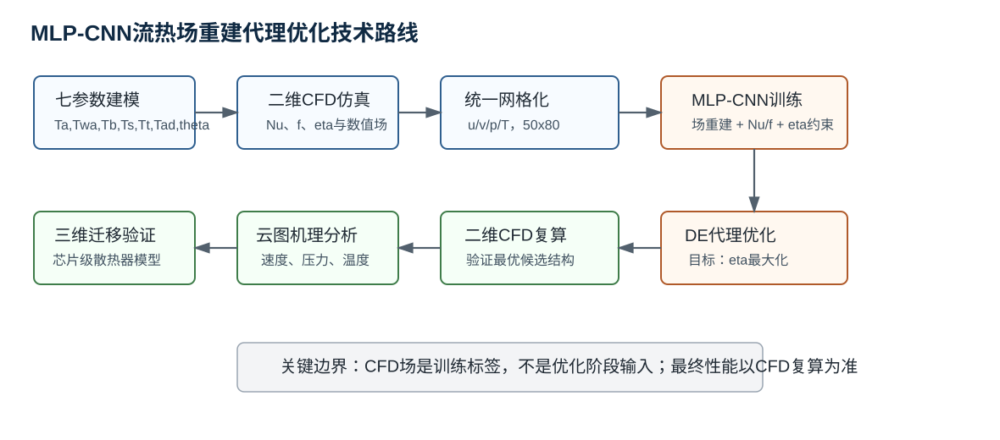
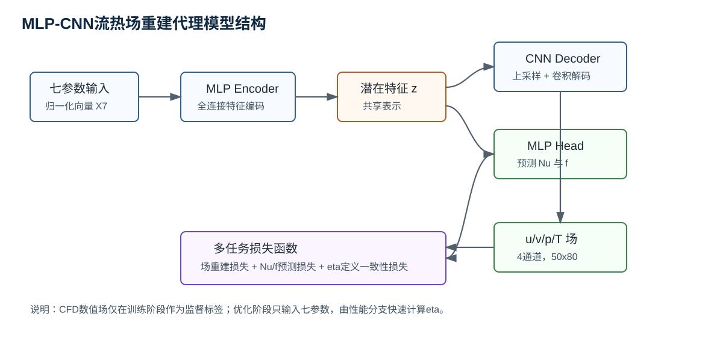
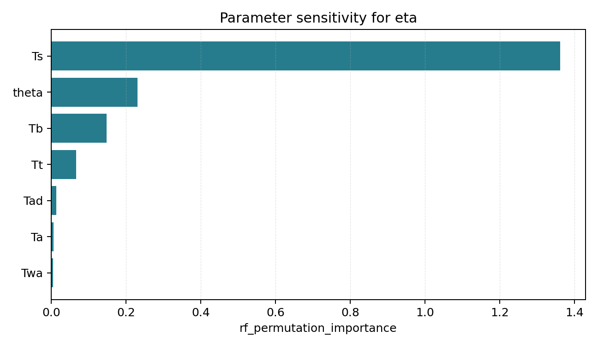
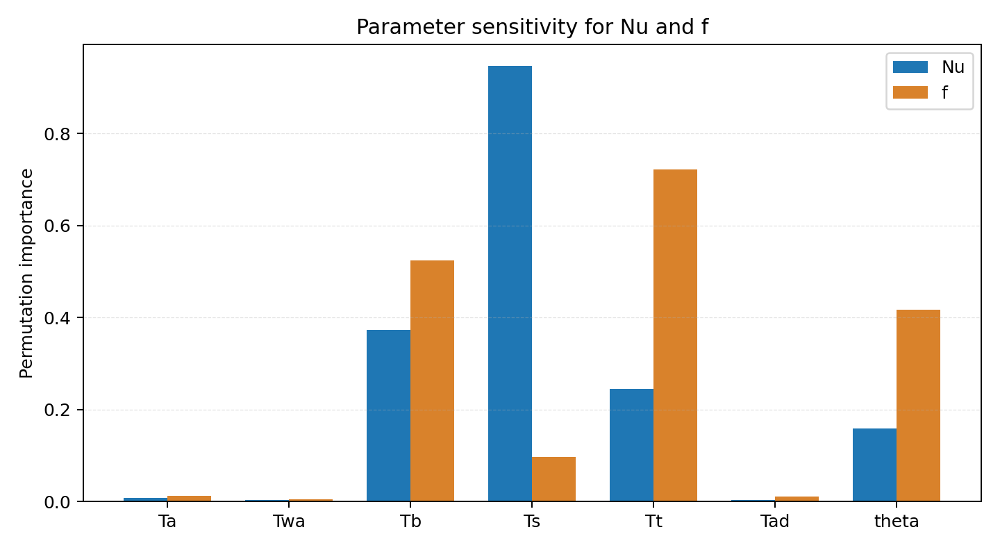
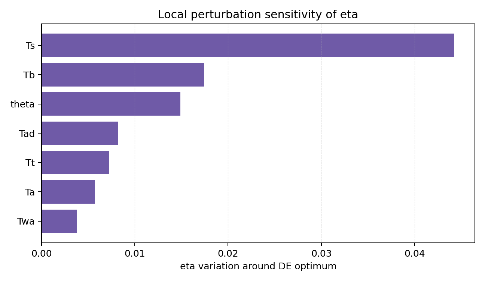
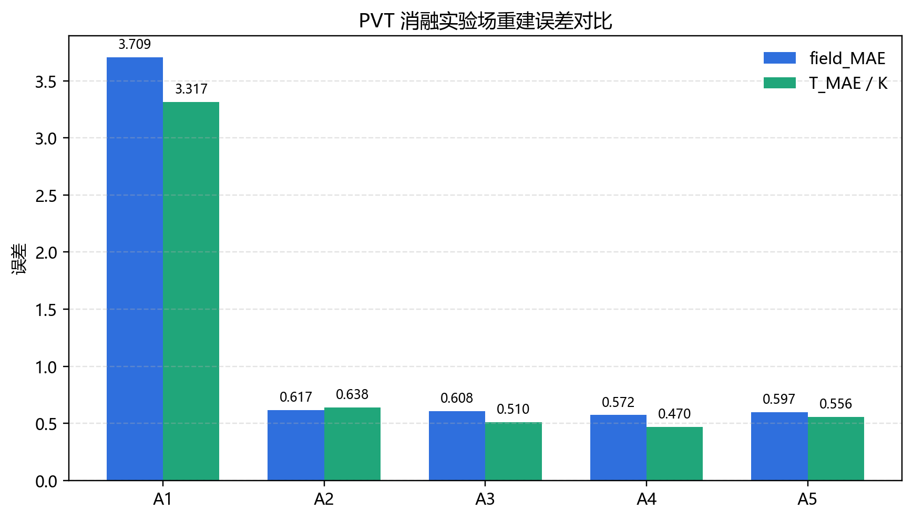
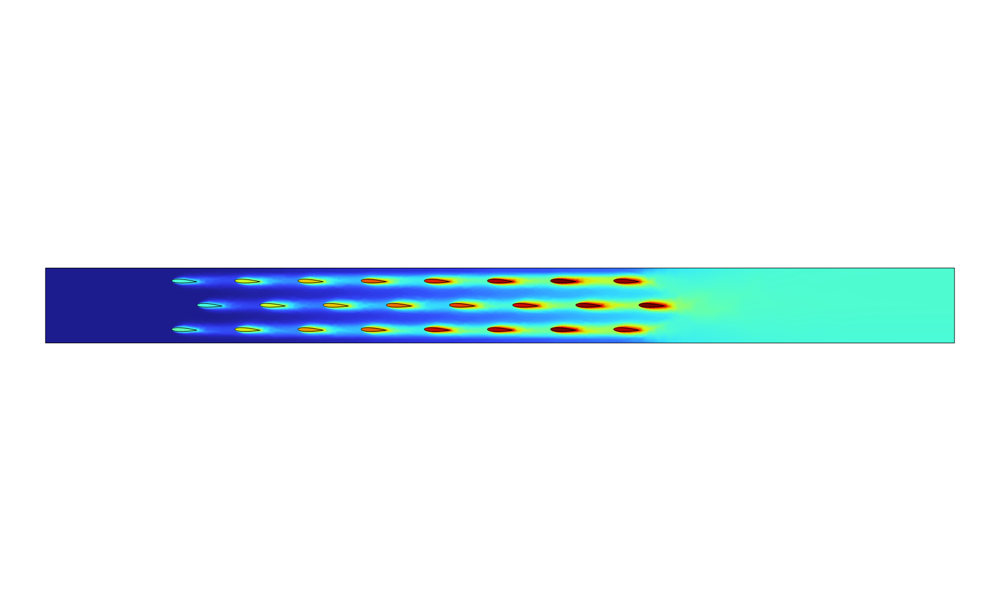
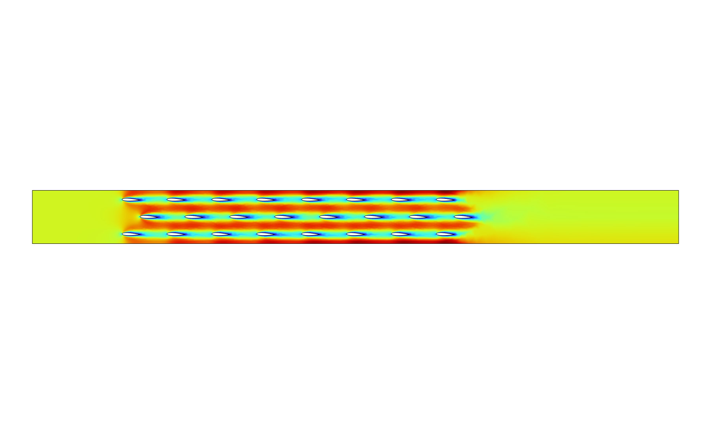
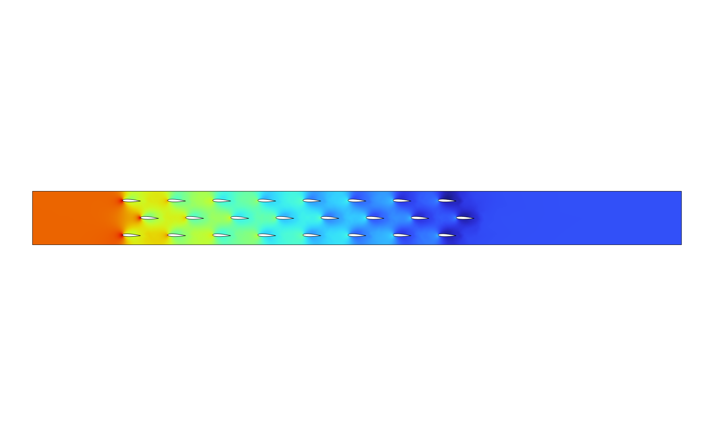

# 基于 MLP-CNN 流热场重建的翼型柱阵列散热器流热性能预测与参数优化研究

---

## 摘要

翼型柱阵列散热器通过流线型柱体组织空气侧流动，在降低尾迹分离和控制压降方面具有一定优势。然而，该类结构的换热性能与流动阻力同时受到翼型形状、阵列间距、错排偏移和整体姿态等多参数耦合影响。若直接采用 CFD 对所有候选结构逐点计算，优化成本较高；若仅建立结构参数到 Nu、f 等标量指标的代理模型，则难以解释性能变化背后的速度场、压力场和温度场演化。针对上述问题，本文提出一种基于 MLP-CNN 流热场重建代理模型的翼型柱阵列散热器优化方法，实现由七参数结构输入到流热场空间分布及综合性能指标的快速预测，并结合差分进化算法和 CFD 复算完成结构优化验证。

本文首先建立七参数参数化设计框架，设计变量包括 $T_a$、$T_{wa}$、$T_b$、$T_s$、$T_t$、$T_{ad}$ 和 $\theta$。基于已有二维 CFD 流热耦合计算结果，构建 1000 组七参数样本数据集。每个样本包含结构参数、Nu、f、eta 以及统一网格化后的速度、压力和温度数值场。考虑到论文云图展示和机理分析主要围绕压力场 $p$、速度大小 $U$ 和温度场 $T$ 展开，本文后续将 PVT 三场作为云图主线，其中 V 表示 velocity magnitude，即 $U=\sqrt{u^2+v^2}$，对应 COMSOL 云图表达式 `spf.U`；早期 `u/v/p/T` 四通道结果保留为性能代理模型和历史对照证据。需要强调的是，本文最终主线不再将几何掩码作为核心输入；CFD 云图和数值场不是模型输入，而是监督标签，用于约束网络学习由结构参数到空间流热场的映射关系。

在代理模型方面，本文建立 MLP-CNN / Conditional U-Net 多任务网络。模型以七参数向量、归一化坐标和区域指示信息作为输入，通过 MLP Encoder 形成高维潜在特征，再由 CNN Decoder 解码得到规则网格 PVT 流热场，同时通过性能分支预测 Nu 和 f，并由 Nu 和 f 按 $\eta=(Nu/Nu_0)/(f/f_0)^{1/3}$ 计算综合性能指标。训练损失由 PVT 场重建误差、场梯度一致性误差、Nu/f 预测误差和 eta 一致性误差共同组成。1000 组样本按 700/150/150 划分为训练集、验证集和测试集。320×96 高分辨率 PVT 三通道 Conditional U-Net 全量训练结果显示，测试集 Nu_R2=0.969309、f_R2=0.978038、eta_R2=0.971888，场重建误差为 p_MAE=0.908374 Pa、U_MAE=0.108227 m/s、T_MAE=0.439960 K，说明该模型能够在高分辨率规则网格上同步预测 PVT 场和性能指标。

在优化与验证方面，本文将训练好的 MLP-CNN 性能分支嵌入差分进化算法，以 eta 最大化为目标搜索七参数组合。DE 得到的候选参数为 $T_a=0.000000$、$T_{wa}=0.600000$、$T_b=0.150000$、$T_s=1.500000$、$T_t=0.960919$、$T_{ad}=1.000000$、$\theta=-2.224429$，代理模型预测 Nu_pred 为 45.453880、f_pred 为 0.105865、eta_pred 为 1.433572。随后将该候选结构回到 COMSOL 二维 CFD 流热耦合模型中复算，得到 Nu=46.022427、f=0.106658、eta=1.447895。与旧 1000 组 ANN/MLP baseline 复核结果 eta=1.420111 相比，本文候选结构的二维 CFD 综合性能更高。

为进一步评估二维优化结果的工程迁移性，本文将该最优七参数迁移到三维芯片级翼型鳍片散热器模型中验证。三维结果表明，优化结构相对 baseline 的芯片平均温度由 379.201265 K 降至 375.663499 K，最大温度由 380.457118 K 降至 376.969653 K，等效热阻由 86.051265 K/W 降至 82.513499 K/W，压降由 0.013555 Pa 降至 0.013028 Pa，三维综合性能指标 eta3D 为 1.056732。该结果说明二维 MLP-CNN-DE 候选结构在三维芯片级模型中具有正向迁移收益，但三维结果仍应表述为迁移验证，不能等同于三维空间的全局寻优结论。

此外，本文补充开展了参数敏感性分析、PVT 主模型 K 折验证、精简消融实验、物理一致性约束和注意力机制边界说明。敏感性分析显示，$T_s$ 是当前样本分布和 DE 最优点附近对 eta 影响最显著的参数；PVT 主模型 3 折验证得到 eta_R2 均值为 0.968501、标准差为 0.000825，说明模型在不同划分下具有稳定收敛趋势。消融实验显示，坐标通道和固体/流体区域指示显著降低 PVT 场误差，eta 一致性与梯度一致性进一步改善温度场和边界区域误差；CBAM 注意力在当前训练设置下主要改善 U、T 和整体场误差，但对标量性能指标的提升有限。完整 PDE 残差和边界条件损失作为后续扩展设计讨论，不作为当前主模型的实证结果。

**关键词：** 翼型柱阵列散热器；MLP-CNN；流热场重建；多任务学习；差分进化；CFD 复算；三维迁移验证；参数敏感性分析

---

## Abstract

Airfoil-column array heat sinks can organize the air-side flow with streamlined solid structures and have potential advantages in reducing wake separation and pressure loss. However, their heat transfer and flow resistance are simultaneously affected by airfoil shape, array spacing, stagger offset, and global attitude. Direct CFD-based optimization is computationally expensive, while scalar-only surrogate models from geometric parameters to Nu and f cannot sufficiently explain the underlying evolution of velocity, pressure, and temperature fields. To address these issues, this thesis proposes an MLP-CNN flow-thermal field reconstruction surrogate model for airfoil-column array heat sink optimization. The proposed framework predicts both spatial thermo-fluid fields and performance indicators from seven structural parameters, and further couples the surrogate model with differential evolution and CFD re-computation for optimization verification.

A seven-parameter design framework is first established, including $T_a$, $T_{wa}$, $T_b$, $T_s$, $T_t$, $T_{ad}$, and $\theta$. Based on existing two-dimensional CFD conjugate heat transfer results, a dataset of 1000 samples is constructed. Each sample contains seven structural parameters, Nu, f, eta, and uniformly gridded pressure, velocity-magnitude, and temperature field data. The final contour-plot mainline is organized as three PVT channels, namely `p/U/T`, where V denotes velocity magnitude and $U=\sqrt{u^2+v^2}$ corresponds to the COMSOL expression `spf.U`. The PVT field size is $3\times96\times320$. It should be emphasized that geometry masks are no longer used as the final main input in this thesis. CFD contours and numerical fields are not model inputs, but supervised labels for learning the mapping from structural parameters to spatial thermo-fluid fields.

The surrogate model is a multi-task MLP-CNN / Conditional U-Net network. The seven-parameter vector is first encoded into a high-dimensional latent feature by an MLP encoder, and the CNN decoder reconstructs the PVT field on a regular grid. A performance head simultaneously predicts Nu and f, while the comprehensive performance factor eta is calculated by $\eta=(Nu/Nu_0)/(f/f_0)^{1/3}$. The training loss consists of PVT field reconstruction loss, Nu/f prediction loss, eta consistency loss, and gradient consistency loss. The 1000 samples are split into 700 training samples, 150 validation samples, and 150 test samples. The current full PVT training result achieves Nu_R2=0.969309, f_R2=0.978038, eta_R2=0.971888, p_MAE=0.908374 Pa, U_MAE=0.108227 m/s, and T_MAE=0.439960 K on the test set, indicating that the model can provide accurate scalar prediction and interpretable flow-thermal field reconstruction.

For optimization, the trained MLP-CNN performance branch is embedded into differential evolution, with eta maximization as the objective. The obtained optimal parameters are $T_a=0.000000$, $T_{wa}=0.600000$, $T_b=0.150000$, $T_s=1.500000$, $T_t=0.960919$, $T_{ad}=1.000000$, and $\theta=-2.224429$. The surrogate model predicts Nu_pred=45.453880, f_pred=0.105865, and eta_pred=1.433572. The candidate is then re-computed using COMSOL-based two-dimensional CFD, yielding Nu=46.022427, f=0.106658, and eta=1.447895. Compared with the previous 1000-sample ANN/MLP baseline validation result of eta=1.420111, the proposed candidate achieves better two-dimensional CFD-verified comprehensive performance.

To further evaluate engineering transferability, the optimized parameters are migrated to a three-dimensional chip-level airfoil-fin heat sink model. The optimized structure reduces the average chip temperature from 379.201265 K to 375.663499 K, the maximum chip temperature from 380.457118 K to 376.969653 K, and the equivalent thermal resistance from 86.051265 K/W to 82.513499 K/W. The pressure drop decreases from 0.013555 Pa to 0.013028 Pa, and the three-dimensional comprehensive performance factor eta3D reaches 1.056732. These results show positive transfer benefits in the 3D model. Nevertheless, this result should be interpreted as three-dimensional migration verification rather than a global 3D optimum.

In addition, parameter sensitivity analysis, short K-fold validation, physics-consistency discussion, and attention ablation are provided. The sensitivity results show that $T_s$ is the most influential parameter for eta in both the statistical dataset analysis and the local perturbation analysis around the DE optimum. A 3-fold short validation gives an eta_R2 mean of 0.968501 with a standard deviation of 0.000825, indicating stable convergence under different data splits. The ablation results show that coordinate/domain conditioning is the main source of field-error reduction, and CBAM mainly improves field reconstruction with limited improvement in scalar performance prediction. Full PDE residual losses and boundary-condition losses are discussed as future extensions rather than completed main-model results.

**Keywords:** airfoil-column array heat sink; MLP-CNN; flow-thermal field reconstruction; multi-task learning; differential evolution; CFD verification; 3D migration validation; parameter sensitivity analysis

---

## 主要符号表

| 符号 | 含义 | 单位 |
|---|---|---|
| $Nu$ | 努塞尔数 | - |
| $f$ | 摩擦因子 | - |
| $\eta$ | 综合性能评价因子，$\eta=(Nu/Nu_0)/(f/f_0)^{1/3}$ | - |
| $Nu_0$ | 基准结构努塞尔数 | - |
| $f_0$ | 基准结构摩擦因子 | - |
| $\Delta p$ | 进出口压降 | Pa |
| $\Delta T$ | 代表性温差 | K |
| $R_{th}$ | 等效热阻 | K/W |
| $T_a$ | 翼型最大弯度或形状调节参数 | - |
| $T_{wa}$ | 翼型弯度位置或宽度调节参数 | - |
| $T_b$ | 翼型厚度或柱体宽度调节参数 | - |
| $T_s$ | 横向或阵列间距调节参数 | - |
| $T_t$ | 纵向或尾缘厚度调节参数 | - |
| $T_{ad}$ | 错排偏移或附加形状调节参数 | - |
| $\theta$ | 翼型整体旋转角 | deg |
| $u,v$ | 速度分量 | m/s |
| $p$ | 压力 | Pa |
| $T$ | 温度 | K |
| CFD | 计算流体力学 | - |
| CHT | 共轭传热 | - |
| MLP | 多层感知机 | - |
| CNN | 卷积神经网络 | - |
| DE | 差分进化算法 | - |
| CBAM | 卷积块注意力模块 | - |
| PINN | 物理信息神经网络 | - |

---

# 第1章 绪论

## 1.1 研究背景及意义

随着电子设备、工程机械动力舱以及高功率密度芯片系统不断向紧凑化和高热流密度方向发展，散热器在有限空间内组织冷却空气流动并实现高效换热的能力越来越重要。传统圆柱或钝体柱阵列虽然结构简单，但在绕流过程中容易形成较大的尾迹区和局部分离区，进而导致压降增大、下游换热衰减和热滞留问题。翼型柱结构利用流线型外形减弱分离和尾迹扩展，在保持一定扰动能力的同时降低流动阻力，因此适合用于紧凑式风冷散热器和芯片级散热器结构设计。

翼型柱阵列的性能并不只由单个翼型截面决定，还受到阵列间距、错排偏移、整体旋转角以及上下游柱体相互干扰的共同影响。不同参数组合会改变流道收缩、局部加速、压力梯度、尾迹干扰和热边界层发展，从而使 Nu、f 和 eta 呈现明显的非线性响应。若采用传统 CFD 逐点扫描进行优化，需要对大量候选结构重复建模、网格划分和求解，计算成本较高。尤其当参数维度扩展到七维后，单纯依赖 CFD 遍历或经验试错难以满足快速设计需求。

机器学习代理模型为散热器结构优化提供了新的技术路径。传统 MLP 或 ANN 可以学习结构参数到 Nu、f 等性能指标的映射，但这类纯标量回归模型难以解释“为什么某个结构更优”。对于流热耦合结构而言，宏观性能指标本质上来自速度场、压力场和温度场的空间分布。若代理模型只输出 Nu 和 f，则会弱化 CFD 结果中已经包含的流场和温度场信息。因此，将流热场重建作为监督任务引入代理模型，有助于增强模型的空间表征能力和机理解释能力。

本文围绕七参数翼型柱阵列散热器，建立 MLP-CNN / Conditional U-Net 流热场重建代理模型。该模型不是读取 CFD 云图进行预测，而是以七参数为主要输入，由参数潜在特征和规则网格坐标共同解码预测 `p/U/T` 空间场，并同步输出 Nu 和 f。这样既保留了优化阶段只需输入结构参数的可执行性，又使 CNN 在论文中承担明确的空间场建模作用。

## 1.2 国内外研究现状

### 1.2.1 翼型柱阵列与紧凑式散热器研究

翼型结构源于航空气动设计，具有前缘圆滑、尾缘收缩和沿程压力恢复平缓等特征。将翼型截面引入管翅式换热器或柱阵列散热器，可以减弱圆柱绕流中的强尾迹分离，降低压降，并改善后排结构的来流条件。已有研究表明，翼型柱的布置方式、间距和错排偏移会显著影响局部速度分布和温度场扩展，因此翼型柱阵列优化必须同时考虑换热增强和流阻代价。

### 1.2.2 CFD 流热耦合仿真研究

CFD 能够给出速度场、压力场、温度场和热流分布，是分析散热器局部机理的重要手段。对于翼型柱阵列，CFD 可以揭示柱间通道局部加速、尾迹热遮挡、压力集中和下游温升等现象。然而，CFD 的计算成本随样本数量和模型复杂度增加而迅速升高。本文采用已有二维 CFD 批量计算结果构建代理模型训练数据，并将代理模型优化得到的候选结构重新回到 CFD 中复算，保证最终结论可追溯到物理仿真结果。

### 1.2.3 深度学习代理模型研究

深度学习代理模型已广泛用于流体力学和传热优化问题。MLP 适合处理低维参数输入，CNN 适合处理规则网格上的空间场数据。已有部分研究将 CFD 云图作为模型输入，用 CNN 预测性能指标；但在参数优化阶段，新候选结构并没有现成 CFD 云图，若仍要求输入云图，就会出现“先仿真再预测”的逻辑问题。本文选择反向思路：CFD 场数据不作为输入，而作为监督标签；模型输入仍为七参数，CNN 用于从参数潜在特征解码流热场。

### 1.2.4 智能优化方法研究

差分进化算法是一类适用于连续变量优化的群智能算法，具有结构简单、全局搜索能力较强和无需梯度信息等特点。对于散热器结构优化，若直接将 DE 与 CFD 耦合，每个候选个体都需要进行数值仿真，计算成本较高。将训练后的代理模型作为快速适应度评估器，可以显著降低候选筛选成本。本文采用 MLP-CNN 性能分支预测 Nu 和 f，并计算 eta 作为 DE 目标函数。

综上，现有研究已经证明翼型结构、CFD 数值模拟、深度学习代理模型和智能优化算法均可用于散热器性能分析与结构优化。但从本文研究目标看，仍需要进一步解决“优化阶段不依赖 CFD 云图输入”和“代理模型能够解释流热场变化”两个问题。表 1-1 对相关研究现状及其对本文的启示进行了归纳。

**表1-1 国内外相关研究现状归纳表**

| 研究方向 | 代表性方法 | 主要特点 | 对本文的启示 |
|---|---|---|---|
| 翼型管/翼型柱强化传热 | 翼型截面、错排阵列、紧凑式换热器 | 可减弱圆柱尾迹和局部分离，但性能受阵列参数影响明显 | 需要建立包含形状与布局参数的统一设计空间 |
| CFD 流热耦合仿真 | 稳态流动、固体导热、流固界面换热 | 可获得速度、压力、温度等空间场，是机理分析基础 | 需要保留 CFD 场数据作为代理模型监督信息 |
| 传统标量代理模型 | MLP、BP、随机森林、高斯过程等 | 训练效率高，适合参数到 Nu/f 的快速回归 | 只输出标量指标，机理解释能力不足 |
| CNN 场预测模型 | 编码器—解码器、U-Net、场重建网络 | 可学习规则网格上的空间场分布 | CNN 可作为从参数潜在特征到流热场的解码器 |
| 智能优化算法 | DE、GA、PSO、NSGA-II | 可在连续参数空间搜索较优结构 | 可用训练好的代理模型替代 CFD 作为快速适应度评估器 |

## 1.3 现有研究不足与本文研究内容

### 1.3.1 现有研究不足

现有研究主要存在以下不足：

（1）纯参数代理模型虽然训练和推理效率较高，但只输出标量性能指标，缺少对速度场、压力场和温度场变化的解释。

（2）以 CFD 云图作为输入的 CNN 模型虽然能够利用空间信息，但优化阶段新候选结构没有云图，流程上难以直接用于参数搜索。

（3）几何掩码可以描述结构形状，但若最终论文主线强调“几何掩码”，容易被质疑其与参数曲线重绘的区别，以及是否真正利用了 CFD 流热场信息。

（4）注意力机制、PDE 残差和物理约束需要与真实训练结果对应；未纳入正式训练的部分仅作为方法边界或后续研究方向讨论。

### 1.3.2 本文主要研究内容

本文主要研究内容如下：

（1）构建七参数翼型柱阵列散热器流热场数据集。读取已有 Nu/f 标签和 CFD 全场数值数据，统一网格化形成压力场、速度大小和温度场组成的 PVT 三场数据集；早期 `u/v/p/T` 四通道数据作为性能代理模型训练和历史对照保留。

（2）建立 MLP-CNN / U-Net 流热场重建代理模型。模型输入为七参数及规则空间条件，输出为规则网格流热场和 Nu/f，eta 由 Nu/f 计算得到；论文云图展示以 PVT 三场为主。

（3）设计多任务损失函数。损失函数同时包含流热场重建损失、Nu/f 预测损失和 eta 指标一致性损失。

（4）采用 DE 进行 eta 最大化搜索，并将最优候选结构回到二维 CFD 中复算验证。

（5）将二维优化候选迁移到三维芯片级散热器模型中验证，并明确其为迁移验证而非三维空间全局寻优。

（6）补充参数敏感性分析、3 折短训稳定性验证、物理约束与注意力机制边界说明，使论文体系更加完整。

### 1.3.3 技术路线

本文技术路线为：

```text
七参数参数化建模
-> 二维 CFD 流热耦合仿真
-> 导出 Nu、f、eta 以及 p/U/T 数值场
-> 统一网格化构建多通道流热场数据集
-> 建立 MLP-CNN 流热场重建代理模型
-> 输入七参数，预测 p/U/T 场和 Nu/f
-> 由 Nu/f 计算 eta
-> 采用 DE 搜索 eta 最大的结构参数组合
-> CFD 复算验证最优结构
-> 对比速度场、压力场和温度场
-> 三维散热器迁移验证
```

图 1-1 给出了本文的总体技术路线。与旧几何掩码路线不同，本文的 CFD 数值场不作为优化阶段输入，而是在训练阶段作为监督标签，用于约束 MLP-CNN 学习由结构参数到流热场空间分布的映射。



---

# 第2章 翼型柱阵列散热器流热耦合理论与研究方法

## 2.1 引言

本章介绍翼型柱阵列散热器流热耦合分析的理论基础和研究方法。首先说明翼型柱阵列的基本结构与换热机理，然后定义七参数设计变量，接着给出流动与传热控制方程、边界条件和性能评价指标，最后介绍 MLP-CNN 流热场重建代理模型、物理一致性约束、CBAM 注意力机制和差分进化算法。

## 2.2 翼型柱阵列散热器结构与换热机理

### 2.2.1 基本结构

翼型柱阵列散热器由基板和布置在基板上的翼型柱阵列组成。热量从芯片或等效热源传递至基板，再由翼型柱和基板表面通过强制对流传递给空气。翼型柱外形较圆柱更加流线，能够减弱前缘滞止区后的强分离，使尾迹区收缩，从而降低压降和下游热遮挡。

### 2.2.2 空气侧流动特征

阵列布置改变了空气穿过柱间通道的路径。当间距较小时，局部流速升高，可能强化换热，但也可能增加压降；当间距较大时，流阻降低，但空气与固体表面的接触和扰动可能不足。错排偏移会改变后排柱体的来流条件，使下游柱体避开前排尾迹核心区，从而改善局部换热。整体旋转角会改变迎风面和压力分布，对尾迹偏转和局部加速产生影响。

### 2.2.3 换热增强与流阻代价

翼型柱阵列的换热增强主要来自三个方面：一是柱间通道局部收缩引起的速度提高；二是翼型表面附近速度梯度和温度梯度增加；三是错排布置改变后排柱体的来流条件，减弱前排尾迹遮挡。与此同时，过小的通道间距、过大的柱体厚度或过强的错排扰动也可能导致压降增加。因此，翼型柱阵列优化不能只追求 Nu 增大，而应同时考虑摩擦因子 f 和综合性能指标 eta。

## 2.3 七参数设计变量

本文采用七参数描述翼型柱阵列结构：

| 参数 | 含义 | 范围 |
|---|---|---|
| $T_a$ | 翼型形状或最大弯度调节参数 | [0.00, 0.05] |
| $T_{wa}$ | 翼型弯度位置或宽度调节参数 | [0.20, 0.60] |
| $T_b$ | 翼型厚度或柱体宽度调节参数 | [0.08, 0.15] |
| $T_s$ | 阵列横向间距调节参数 | [0.50, 1.50] |
| $T_t$ | 阵列纵向间距或尾缘厚度调节参数 | [0.50, 1.20] |
| $T_{ad}$ | 错排偏移或附加形状调节参数 | [0.00, 1.00] |
| $\theta$ | 翼型整体旋转角 | [-10°, 10°] |

七参数共同决定翼型柱外形、柱间通道宽度、阵列错排关系和局部来流角。本文所有模型均以该七参数向量作为唯一优化阶段输入。

**（1）翼型形状参数 $T_a$、$T_{wa}$ 和 $T_b$**

$T_a$、$T_{wa}$ 和 $T_b$ 主要控制翼型柱截面的弯度、弯度位置和厚度特征。形状参数变化会改变迎风面压力分布、翼型表面速度梯度和局部热边界层发展，从而影响 Nu 与 f 的耦合响应。

**（2）阵列排布参数 $T_s$、$T_t$ 和 $T_{ad}$**

$T_s$、$T_t$ 和 $T_{ad}$ 主要控制翼型柱之间的横向间距、纵向间距和错排偏移。阵列参数决定空气穿过柱间通道时的收缩、加速、绕流和尾迹恢复过程，是影响后排柱体换热能力和压力损失的重要因素。

**（3）整体姿态参数 $\theta$**

$\theta$ 表示翼型柱相对来流方向的整体旋转角。该参数改变翼型柱迎风姿态和尾迹方向，可能影响局部流动分离、压力恢复和下游温度场分布。本文数据集中 $\theta$ 已进入 DE 优化搜索，但最终性能仍以 CFD 复算验证为准。

七参数设计向量表示为：

$$
\mathbf{X}_7=[T_a,\;T_{wa},\;T_b,\;T_s,\;T_t,\;T_{ad},\;\theta]^T
$$

## 2.4 控制方程与边界条件

二维 CFD 流热耦合模型采用定常不可压缩流动假设。连续性方程为：

$$
\nabla \cdot \mathbf{u}=0
$$

动量方程为：

$$
\rho(\mathbf{u}\cdot\nabla)\mathbf{u}=-\nabla p+\mu\nabla^2\mathbf{u}
$$

能量方程为：

$$
\rho c_p(\mathbf{u}\cdot\nabla T)=k\nabla^2T+Q
$$

在流固界面处满足温度连续和热流连续：

$$
T_s=T_f
$$

$$
-k_s\frac{\partial T_s}{\partial n}=-k_f\frac{\partial T_f}{\partial n}
$$

入口设置速度和温度边界，出口设置压力边界，固体壁面满足无滑移条件。所有候选结构在相同物性、入口、出口和热源条件下比较，以保证相对性能评价具有一致性。

## 2.5 性能评价指标

### 2.5.1 努塞尔数

Nu 用于表征对流换热能力：

$$
Nu=\frac{hD_h}{k_f}
$$

其中 $h$ 为平均对流换热系数，$D_h$ 为水力直径，$k_f$ 为空气导热系数。

### 2.5.2 摩擦因子

摩擦因子 f 用于表征流动阻力，通常与进出口压降、流道长度、入口速度和水力直径有关。本文 f 由 CFD 后处理结果统一计算。

### 2.5.3 综合性能指标

综合性能指标 eta 定义为：

$$
\eta=\frac{Nu/Nu_0}{(f/f_0)^{1/3}}
$$

其中 $Nu_0$ 和 $f_0$ 为基准结构对应指标。eta 同时考虑换热增强和流阻代价，是本文 DE 优化的目标函数。

## 2.6 MLP-CNN 流热场重建代理模型

本文代理模型由 MLP Encoder、CNN Decoder 和 MLP Head 三部分组成：

```text
七参数 -> MLP Encoder -> 潜在特征 z
z -> CNN Decoder -> p/U/T
z -> MLP Head -> Nu/f -> eta
```

MLP Encoder 将七参数标准化输入映射为高维潜在特征。CNN Decoder 将潜在特征扩展为低分辨率特征图，再通过上采样和卷积层恢复为 $50\times80$ 的空间流热场。MLP Head 基于共享潜在特征输出 Nu 和 f。eta 不作为独立网络输出，而是由 Nu 和 f 按定义计算得到。

需要强调的是，CFD 云图和数值场不是模型输入。模型训练阶段使用 CFD 场数据作为监督标签，优化阶段只需要输入七参数。因此，该方案避免了“优化时必须先得到 CFD 云图”的逻辑问题，同时保留了 CNN 对空间场的建模作用。

图 2-1 给出了 MLP-CNN 流热场重建代理模型结构。图中 CNN Decoder 的作用不是读取几何掩码或 CFD 云图，而是从 MLP 编码得到的潜在特征中恢复规则网格上的流热场。



## 2.7 损失函数与物理一致性约束

模型训练采用多任务损失函数：

$$
L=w_pL_p+w_UL_U+w_TL_T+\lambda_gL_{grad}+\alpha L_{Nu}+\beta L_f+\gamma L_{\eta}
$$

其中 $L_u$、$L_v$、$L_p$ 和 $L_T$ 分别约束速度、压力和温度场重建误差，$L_{Nu}$ 和 $L_f$ 约束性能指标预测误差，$L_{\eta}$ 约束由预测 Nu/f 计算得到的 eta 与真实 eta 的一致性。当前实验取 $\alpha=1.0$、$\beta=1.0$、$\gamma=0.2$。

本文当前主模型已经真实使用的物理一致性约束是 $L_{\eta}$，即通过 eta 定义保持 Nu、f 和综合性能指标之间的一致性。完整 PDE 残差、连续性残差、能量方程残差和边界条件残差尚未并入当前 MLP-CNN 正式训练结果，因此本文只将其作为可扩展设计：

$$
L_{total}=L_{field}+\alpha L_{Nu}+\beta L_f+\gamma L_{\eta}+\lambda_1L_{cont}+\lambda_2L_{energy}+\lambda_3L_{bc}
$$

其中 $L_{cont}$、$L_{energy}$ 和 $L_{bc}$ 分别表示连续性、能量方程和边界条件约束。该部分在论文中作为物理增强方向讨论，不作为当前已完成实验结论。

## 2.8 CBAM 注意力机制设计

旧工程中存在 CBAM 和 PI-CNN-CBAM 脚本与结果，但其输入形式属于几何掩码或物理场图像路线，不属于本文最终 MLP-CNN 流热场重建主线。因此，旧 CBAM 结果只能作为历史对照或方法扩展依据。

对于当前 MLP-CNN / Conditional U-Net 主线，本文只保留 CBAM 作为注意力机制代表，并将其插入 CNN Decoder 的中间特征图中，对 `p/U/T` 通道特征和局部空间响应进行重标定。该设置的目的不是比较多种注意力结构，而是检验在当前数据规模和训练设置下，加入一个代表性注意力模块是否能够改善流热场重建误差。

## 2.9 差分进化算法

差分进化算法通过种群初始化、差分变异、交叉和选择逐代搜索最优解。本文将训练好的 MLP-CNN 性能预测分支作为快速适应度评估器，对候选七参数计算 Nu_pred、f_pred 和 eta_pred。DE 搜索得到的最优候选不直接作为最终结论，而是必须回到 CFD 中复算验证。

## 2.10 本章小结

本章介绍了翼型柱阵列散热器流热耦合理论、七参数设计变量、性能评价指标和 MLP-CNN 流热场重建代理模型。本文的核心方法是以七参数为输入，以 CFD 场数据为监督标签，使 CNN 从参数潜在特征中解码空间流热场，并通过 Nu/f 性能分支和 eta 一致性损失实现代理预测与优化目标的一致。

---

# 第3章 翼型柱阵列散热器数值模型与参数影响规律分析

## 3.1 引言

本章围绕二维 CFD 样本和流热场重建数据集展开。首先说明样本来源和统一网格化方法，然后介绍训练数据格式，最后基于 1000 组 CFD 标签和 MLP-CNN 代理模型开展参数敏感性分析。

## 3.2 物理模型、工况设置与数值方法

本文使用已有 1000 组七参数 CFD 标签和由 COMSOL 结果导出的规则采样场数据。需要说明的是，本文使用的 `p/U/T` 场不是 COMSOL 非结构网格上的原始全量解场，而是基于已求解的 `.mph` 文件，通过 CutPoint2D 与 EvalPoint 在统一规则网格上采样得到的后处理数值场，其中 `U=sqrt(u^2+v^2)` 对应 COMSOL 的速度大小云图表达式 `spf.U`。标签数据包含七个结构参数及其对应的 Nu、f 和 eta，作为后续代理模型训练和优化验证的统一标量标签。

每个 npz 文件包含：

```text
x, y, u, v, p, T, domain, T_wing
```

其中 `u`、`v` 为速度分量，`p` 为压力，`T` 为温度。为贴合 COMSOL 后处理云图和论文机理分析，本文最终将速度分量合成为速度大小 `U=sqrt(u^2+v^2)`，并整理为 `p/U/T` 三通道 PVT 场数据。全量高分辨率数据集统一为 96×320 网格，因此后续云图主线采用 `3×96×320` 的 PVT 输出；早期 50×80 的 `u/v/p/T` 四通道数据仅作为历史对照和低分辨率性能代理结果保留。

二维 CFD 数据的作用包括两部分：一是提供 Nu、f 和 eta 标量标签，用于性能预测分支训练；二是提供速度场、压力场和温度场采样标签，用于 CNN Decoder 的场重建监督。也就是说，本文并非把 CFD 云图作为优化阶段的输入，而是利用 CFD 求解结果监督网络学习从结构参数到空间流热场及性能指标的映射关系。

**表3-1 CFD 样本字段与用途**

| 字段 | 类型 | 在本文中的用途 |
|---|---|---|
| 七参数 `Ta,Twa,Tb,Ts,Tt,Tad,theta` | 输入变量 | 作为 MLP-CNN 和 DE 优化的唯一结构输入 |
| `Nu` | 标量标签 | 表征对流换热能力，参与性能预测和 eta 计算 |
| `f` | 标量标签 | 表征流动阻力，参与性能预测和 eta 计算 |
| `eta` | 标量标签 | 作为综合性能评价指标和 DE 优化目标 |
| `u,v` | COMSOL 规则采样场标签 | 表征速度分布，用于低频流场趋势重建监督 |
| `p` | COMSOL 规则采样场标签 | 表征压力分布，用于辅助解释流动阻力来源 |
| `T` | COMSOL 规则采样场标签 | 表征温度分布，用于辅助解释散热效果 |
| `x,y,domain` | 采样网格与域信息 | 用于统一不同样本的规则网格坐标和空气/固体域标记 |

### 3.2.1 数值模型一致性与网格敏感性说明

本文使用的 1000 组样本来自同一批七参数二维 CFD 建模流程。各样本保持相同的入口、出口、物性参数、热源处理和后处理指标定义，仅改变七参数结构变量。该处理保证了样本之间的 Nu、f 和场分布具有相同评价口径，可以用于代理模型训练和相对性能比较。

需要说明的是，本文已补充二维和三维粗、中、细三档 COMSOL 网格复算，并进一步对二维工况补充 G3/G4/G5 局部尺寸一致细化网格。当前网格差异仍未全部满足阈值。二维 baseline 的 G4/G5 网格 Nu 差异为 21.070%，f 差异为 14.329%；二维 DE_optimum 的 G4/G5 网格 Nu 差异为 16.006%，f 差异为 11.730%，均高于本文设定的 2% 和 3% 判据。三维 baseline 的 medium/fine 网格 Tmax 差异为 0.632%，满足 1% 判据，但 pressure_drop 差异为 13.385%，高于 5% 判据；三维优化结构的 Tmax 差异为 0.315%，满足 1% 判据，但 pressure_drop 差异为 8.063%，仍高于 5% 判据。因此，该组结果在本文中作为网格敏感性风险说明，而不作为严格网格无关性通过结论。

同时，旧稿中已对早期二维基准构型开展过网格无关性验证，可作为本文数值设置的历史参考。旧稿采用四档非结构化三角形网格，其中方案 C 的网格数为 85,600，翼型管平均温度为 330.15 K，压降为 0.631 Pa；方案 D 的网格数为 152,000，翼型管平均温度为 330.18 K，压降为 0.632 Pa，Tavg 相对变化约为 0.01%。该结果说明早期基准模型在相同量级的近壁面和尾迹局部加密策略下具有较好的温度指标稳定性。由于当前论文采用七参数优化结构、PVT 场重建数据集和三维迁移模型，上述旧稿结果仅作为数值建模经验和基准设置参考，不替代当前七参数模型的严格网格无关性结论。对于最终优化结构，本文仍采用已有正式 COMSOL 独立复算结果作为性能判断依据，并在附录中保留当前七参数网格补算数据和网格敏感性风险说明。

进一步诊断结果表明，二维 Nu 和 f 在 G3/G4/G5 局部尺寸一致细化下仍随网格细化单调下降，且末端 G4/G5 差异仍明显高于阈值，说明当前域级局部尺寸控制仍不足以稳定控制翼型柱壁面附近边界层、尾迹和压降积分区域。三维结果中 Tmax 已在 medium/fine 之间满足 1% 判据，但 pressure_drop 仍随网格细化单调下降，说明压降对入口/出口平均压力、局部速度梯度和后处理截面更敏感。因此，本文将网格无关性作为当前工作的主要风险边界，而不是写成已经完全通过的验证结果。

## 3.3 参数化工况设计与 CFD 样本生成

统一网格化数据集的构建过程包括四个步骤：首先读取 1000 组七参数样本及其 Nu、f、eta 标签；其次将 COMSOL 后处理得到的压力、速度和温度采样场映射到统一坐标网格；然后将速度分量合成为速度大小 $U$；最后形成参数、场数据和性能标签一一对应的数据样本。数据集统计如下：

| 内容 | 数值 |
|---|---:|
| 样本数 | 1000 |
| 场数据形状 | 1000×3×96×320 |
| 参数维度 | 7 |
| 性能标签 | Nu、f、eta |
| 场通道 | p、U、T |
| Nu0 | 30.366123 |
| f0 | 0.092996 |

单个工况可表示为：

```text
params: 7维参数
p: 96×320
U: 96×320
T: 96×320
Nu, f, eta
```

## 3.4 PVT 流热场数据集构建与预处理

正式训练采用 700/150/150 的训练、验证、测试划分。参数、场数据和性能标签均基于训练集统计量进行标准化。验证集和测试集使用同一训练集均值和标准差，以避免数据泄露。

| 数据集 | 样本数 |
|---|---:|
| 训练集 | 700 |
| 验证集 | 150 |
| 测试集 | 150 |

## 3.5 流热场监督标签构建的必要性

本文没有将 CFD 云图作为模型输入，而是将 CFD 数值场作为监督标签。这样做有两个原因：

第一，优化阶段的新候选结构没有现成 CFD 云图，若模型输入依赖云图，则必须先仿真再预测，失去代理优化意义。

第二，流热场监督可以使模型潜在特征受到空间物理分布约束，使性能预测分支不仅拟合低维参数到标量指标的关系，还与速度、压力、温度分布保持关联。

## 3.6 基于样本统计的结构参数敏感性分析方法

本文采用当前 1000 组七参数 CFD 标签、已训练 MLP-CNN 代理模型以及已有敏感性分析结果，不再额外构造新的 CFD 单因素扫描。具体采用三种方法分析七参数对 Nu、f 和 eta 的影响：

（1）Pearson/Spearman 相关性。用于分析参数与指标之间的线性相关和秩相关关系。

（2）随机森林特征重要性。分别以 Nu、f 和 eta 为目标，训练随机森林回归器，并计算 impurity importance 和 permutation importance。

（3）DE 最优点附近局部扰动。固定其他参数，在当前 DE 最优点附近对单一参数进行扰动，使用训练好的 MLP-CNN 代理模型预测 eta 变化范围。

上述三类分析分别从全局相关性、非线性特征重要性和最优点附近局部扰动三个角度解释七参数对 Nu、f 和 eta 的影响。后文主要报告对 eta 影响最显著的参数，并结合 DE 最优结果解释其物理含义。

## 3.7 结构参数对综合性能的影响规律

随机森林置换重要性显示，eta 的前三个敏感参数为：

| 排名 | 参数 | permutation importance |
|---|---|---:|
| 1 | Ts | 1.361628 |
| 2 | theta | 0.231464 |
| 3 | Tb | 0.147826 |

DE 最优点附近局部扰动结果显示，eta 变化范围前三个参数为：

| 排名 | 参数 | eta_range |
|---|---|---:|
| 1 | Ts | 0.044242 |
| 2 | Tb | 0.017418 |
| 3 | theta | 0.014892 |

两类结果均表明 $T_s$ 是当前样本分布和最优点附近对 eta 影响最显著的参数。这一结论可以解释 DE 最优结果中 $T_s$ 靠近上边界的现象。需要注意的是，本文敏感性分析是基于已有样本分布、随机森林重要性和代理模型局部扰动的统计分析，用于解释参数影响趋势；旧稿中的参数响应曲线和当前 1000 组结果共同作为趋势参考，但不替代固定其他参数的严格 CFD 单因素扫描。

参数敏感性图如图 3-1 至图 3-3 所示。







## 3.8 本章小结

本章构建了 1000 组七参数流热场重建数据集，并明确了 CFD 场数据作为监督标签的作用。参数敏感性分析表明，$T_s$ 对 eta 的统计影响和局部扰动影响均最显著，为后续 DE 优化结果解释提供了依据。

---

# 第4章 基于 MLP-CNN 流热场重建的翼型柱阵列散热器流热性能预测与参数化优化

## 4.1 引言

本章介绍 MLP-CNN 流热场重建代理模型的训练配置、预测结果、流热场重建效果、K 折短训稳定性验证以及消融实验边界。

## 4.2 MLP-CNN 流热场重建模型构建

主模型采用 1000 组 PVT 数据进行训练，训练、验证和测试样本数分别为 700、150 和 150。训练时同时优化场重建误差、Nu/f 标量预测误差、eta 一致性误差和场梯度一致性误差。主要训练配置如下：

| 内容 | 设置 |
|---|---|
| 样本数 | 1000 |
| 训练/验证/测试 | 700/150/150 |
| epoch | 50 |
| batch size | 2 |
| 优化器 | Adam |
| 设备 | cuda |
| 损失函数 | $w_pL_p+w_UL_U+w_TL_T+\lambda_gL_{grad}+\alpha L_{Nu}+\beta L_f+\gamma L_{\eta}$ |
| PVT 场权重 | 4, 6, 3 |
| 梯度一致性权重 | 0.5 |

### 4.2.1 模型输入、输出与训练目标

当前模型的输入为七参数向量、归一化坐标和固体/流体区域指示信息，输出包括两类：一类是规则网格上的 `p/U/T` 三通道 PVT 流热场，另一类是 Nu 和 f 两个标量性能指标。eta 不设置为独立网络输出，而是由 Nu 和 f 通过综合评价公式计算得到。该设置能够避免 eta 与 Nu、f 之间出现相互矛盾的预测结果。

模型训练目标不是单纯降低标量预测误差，而是同时约束空间场和整体性能。场重建分支使潜在特征包含速度、压力和温度分布信息；Nu/f 分支使模型能够直接服务于后续 DE 优化；eta 一致性项则使优化目标与训练目标保持一致。

### 4.2.2 数据归一化与样本划分原则

训练过程中，七参数、流热场通道和性能标签均采用训练集统计量进行归一化。验证集和测试集只使用训练集均值和标准差进行变换，不参与归一化参数计算。这样可以避免测试集信息泄露到训练过程，使第 4.3 节报告的指标能够反映模型在未见样本上的泛化能力。

## 4.3 模型训练与预测性能分析

正式 50 epoch 全量 PVT 主模型在测试集上的预测结果如下：

| 指标 | 结果 |
|---|---:|
| Nu_R2 | 0.969309 |
| Nu_MAE | 0.732264 |
| f_R2 | 0.978038 |
| f_MAE | 0.002571 |
| eta_R2 | 0.971888 |
| eta_MAE | 0.016209 |
| field_MAE | 0.485520 |
| field_RMSE | 0.954466 |
| p_MAE | 0.908374 Pa |
| p_RMSE | 1.488316 |
| U_MAE | 0.108227 m/s |
| U_RMSE | 0.169416 |
| T_MAE | 0.439960 K |
| T_RMSE | 0.699452 |

结果表明，模型对 Nu、f 和 eta 均具有较高预测精度，同时能够恢复 `p/U/T` 高分辨率规则采样场的主要分布趋势。T_MAE 为 0.439960 K，说明温度场整体趋势具有较好可解释性；但从局部场对比图看，翼型柱边界、局部尾迹和压力突变仍存在平滑误差，因此本文将该模型表述为流热场重建代理模型，而不表述为完全替代 CFD 的高保真求解器。

测试集预测散点图如图 4-1 所示。


从预测指标看，f_R2 高于 Nu_R2，说明当前样本范围内模型对阻力指标的整体变化趋势拟合较好；eta_R2 与 Nu_R2 接近，说明综合性能指标仍主要受换热性能和阻力性能共同影响，并没有出现 eta 与 Nu/f 预测相互脱节的情况。Nu_MAE 为 0.732264，f_MAE 为 0.002571，eta_MAE 为 0.016209，表明模型可用于候选结构初筛，但最终优化结论仍需通过 CFD 复算确认。

## 4.4 流热场重建结果与空间分布分析

模型输出的流热场对比图包括 COMSOL 规则采样场、预测场和误差场，典型工况如图 4-2 至图 4-4 所示。


这些图用于展示模型对速度、压力和温度主要空间分布趋势的重建效果。与只输出 Nu/f 的标量代理模型相比，流热场重建可以提供一定空间解释信息；但当前结果更接近低频趋势重建，对翼型边界附近高梯度细节的恢复不足。

### 4.4.1 速度场重建结果分析

速度场决定空气在翼型柱阵列中的局部加速、绕流和尾迹恢复过程。当前模型能够恢复主流通道加速和阵列区域的大致分布，但对翼型柱边界附近速度突变、局部尾迹和垂向速度幅值恢复不足。因此，速度场重建主要用于判断流动趋势，不能替代 CFD 对局部流动细节的分析。

### 4.4.2 压力场重建结果分析

压力场用于分析压降和流动阻力来源。翼型柱前缘、柱间狭窄通道和尾迹恢复区域通常会形成明显压力梯度。当前模型能够恢复入口到出口的整体压降趋势，但对翼型前缘和柱间区域的局部压力扰动存在平滑误差。因此，压力场重建只能作为 f 预测的辅助解释，不作为局部压力峰值的定量依据。

### 4.4.3 温度场重建结果分析

温度场反映热量在固体和空气侧之间的传递与扩散。温度场重建误差直接影响模型对换热机理的解释能力。当前 T_MAE 为 0.439960 K，说明模型能够在统一规则采样网格上恢复主要温度分布趋势，但翼型柱附近局部高温区和热尾迹边界仍会被一定程度平滑。因此，论文中使用温度场重建图进行机理解释时，应以定性趋势分析为主，不直接从图中读取未经后处理验证的局部百分比。

## 4.5 模型稳定性与消融实验设计

为检验 PVT 主模型对数据划分的敏感性，本文补充进行了 3 折验证。该实验采用 `p/U/T` 三通道高分辨率数据集，每折训练 20 epoch，模型配置与主模型保持一致，包括坐标/区域条件输入、eta 一致性损失和场梯度一致性损失。3 折结果如下：

| 指标 | 均值 | 标准差 |
|---|---:|---:|
| Nu_R2 | 0.964261 | 0.003353 |
| f_R2 | 0.969705 | 0.004482 |
| eta_R2 | 0.968501 | 0.000825 |
| Nu_MAE | 0.767173 | 0.019363 |
| f_MAE | 0.002954 | 0.000048 |
| eta_MAE | 0.016889 | 0.000435 |
| p_MAE | 1.204861 | 0.042282 |
| U_MAE | 0.130367 | 0.003036 |
| T_MAE | 0.614454 | 0.049592 |
| field_MAE | 0.649893 | 0.028645 |
| boundary_MAE | 1.501871 | 0.137107 |

K 折结果表明，Nu、f 和 eta 的 R2 在不同划分下均保持在较高水平，且 eta_R2 标准差仅为 0.000825，说明综合性能预测对数据划分不敏感。需要说明的是，K 折模型每折训练 20 epoch，主要用于稳定性验证；最终论文主模型指标仍以第 4.3 节 50 epoch 全量训练结果为准。

## 4.6 消融实验结果与模型机制分析

为验证模型结构、条件输入、物理约束和注意力机制的实际作用，本文设计了 5 组精简版消融实验。该实验围绕当前七参数 MLP-CNN / Conditional U-Net 主线展开，不使用旧六参数模型，也不使用旧几何掩码输入。A0-A4 依次对应标量性能预测、U-Net 场重建、坐标与区域条件输入、物理一致性约束和 CBAM 注意力扩展，用于分析各模块对 Nu/f/eta 标量预测和 p/U/T 场重建的贡献。

消融组设置如下：

| 组别 | 模型设置 | 目的 |
|---|---|---|
| A0 | MLP 标量代理，只预测 Nu/f/eta | 判断纯标量代理的性能上限和解释性不足 |
| A1 | 基础 U-Net，七参数潜在特征解码 PVT 场 | 判断 CNN/U-Net 是否具备场重建能力 |
| A2 | U-Net + 坐标通道 + 固体/流体区域指示 | 判断空间位置和边界信息是否有效 |
| A3 | A2 + eta 一致性 + 梯度一致性 | 判断物理约束是否改善指标一致性和局部梯度 |
| A4 | A3 + CBAM 注意力 | 判断注意力机制是否带来额外提升 |

消融结果如下：

| 组别 | Nu_R2 | f_R2 | eta_R2 | p_MAE | U_MAE | T_MAE | field_MAE | boundary_MAE |
|---|---:|---:|---:|---:|---:|---:|---:|---:|
| A0 | 0.970617 | 0.980708 | 0.969789 | - | - | - | - | - |
| A1 | 0.973088 | 0.979705 | 0.974212 | 7.134856 | 0.673944 | 3.316894 | 3.708562 | 6.138286 |
| A2 | 0.974393 | 0.980798 | 0.973342 | 1.086147 | 0.126960 | 0.637812 | 0.616973 | 1.513489 |
| A3 | 0.972907 | 0.980358 | 0.973451 | 1.180342 | 0.134455 | 0.509703 | 0.608167 | 1.377163 |
| A4 | 0.971559 | 0.980530 | 0.972475 | 1.128742 | 0.117111 | 0.469610 | 0.571821 | 1.371744 |

图 4-5 给出了 A1-A4 各场重建模型的 field_MAE 和 T_MAE 对比。A0 不输出 PVT 场，因此不参与该图比较。



从 A0 与 A1 对比可见，纯 MLP 已能获得较高 Nu/f/eta 标量预测精度，但不能输出 PVT 场，因此无法支持流热场机理解释。A1 虽能输出 PVT 场，但由于缺少坐标和区域信息，场误差较大。A2 加入坐标通道和固体/流体区域指示后，field_MAE 由 3.708562 降至 0.616973，说明空间条件输入是场重建精度提升的主要来源。A3 加入 eta 一致性和梯度一致性后，T_MAE 与 boundary_MAE 进一步降低，说明物理约束对温度场和边界区域有帮助，但 Nu_R2 和 p_MAE 没有同步提升。A4 加入 CBAM 后，U_MAE、T_MAE、field_MAE 和 boundary_MAE 继续降低，但 Nu_R2 和 eta_R2 略低于 A2/A3，说明 CBAM 的收益主要体现在场重建而非标量性能预测。因此，本文只保留 CBAM 作为注意力机制代表，用于说明注意力模块对局部流热场重建的影响。

## 4.7 物理一致性约束与注意力机制作用边界

当前 PVT Conditional U-Net 主模型和消融实验已经真实使用的物理一致性项包括 $L_{\eta}$ 和场梯度一致性损失 $L_{grad}$。完整 Navier-Stokes PDE 残差、能量方程残差和边界条件残差尚未并入当前正式训练结果。因此，本文将其定位为后续物理增强方向，而不作为当前主模型的实证结果。

本文已在当前 PVT U-Net 主线中完成 CBAM 消融实验。结果表明，CBAM 对 U、T、field_MAE 和 boundary_MAE 有改善，但对 Nu_R2 和 eta_R2 的提升有限。旧工程中存在的 PI-CNN-CBAM 结果输入形式是几何掩码或物理场图像，与本文“七参数输入、流热场输出”的最终主线不同，因此旧结果只作为历史路线参考，不并入当前主模型实证结论。

## 4.8 代理模型预测能力讨论

本章完成了 MLP-CNN / Conditional U-Net 流热场重建代理模型训练、K 折验证和消融实验。测试集结果表明，模型能较准确预测 Nu、f 和 eta，并可恢复 `p/U/T` 高分辨率规则采样场的主要空间趋势。K 折结果说明模型对数据划分具有较好稳定性；消融结果说明坐标/区域条件输入是场重建精度提升的关键，eta 与梯度一致性可改善温度场和边界区域，CBAM 注意力主要改善场重建误差但对标量性能预测提升有限。当前场重建结果仍存在平滑误差，尤其在翼型边界、尾迹高梯度区和局部压力扰动上不足，因此其定位是辅助解释和空间趋势监督，而不是高保真 CFD 替代。

---

## 4.9 优化工况与差分进化参数化优化设置

本章将训练好的 MLP-CNN 性能分支嵌入差分进化算法，以 eta 最大化为目标搜索最优七参数组合，并通过二维 CFD 复算验证优化结果。

差分进化算法以训练后的代理模型作为快速适应度评价器，在第 2 章给定的七参数取值范围内搜索综合性能指标 eta 最大的结构组合。目标函数为：

$$
\max \eta_{pred}
$$

其中 $\eta_{pred}$ 由代理模型预测的 Nu_pred 和 f_pred 计算得到。

### 4.9.1 优化变量与约束条件

本文 DE 优化变量为七参数向量 $\mathbf{X}_7=[T_a,T_{wa},T_b,T_s,T_t,T_{ad},\theta]^T$。各变量取值范围与第 2 章参数定义保持一致。优化过程中不输入 CFD 云图，也不实时调用 COMSOL 求解，而是将候选七参数输入训练好的 MLP-CNN 性能分支，快速得到 Nu_pred 和 f_pred，再计算 eta_pred。

这种处理的意义在于将高成本 CFD 搜索转化为代理模型搜索。需要强调的是，代理模型搜索结果只能作为候选结构，不能直接等同于最终最优结构。本文在获得 DE 候选参数后，继续采用二维 COMSOL 复算对其进行独立验证。

### 4.9.2 目标函数与适应度评价方法

差分进化算法以 eta_pred 最大化为目标。对于任意候选参数 $\mathbf{X}$，适应度函数可写为：

$$
F(\mathbf{X})=\frac{Nu_{pred}(\mathbf{X})/Nu_0}{[f_{pred}(\mathbf{X})/f_0]^{1/3}}
$$

当候选结构导致 Nu_pred 或 f_pred 出现物理上不合理的数值时，优化过程会将该候选视为不可取结果。本文最终报告的候选结构已通过后续 CFD 复算，因此最终性能以复算值为准。

## 4.10 最优结构参数组合

DE 优化得到的最优参数为：

| 参数 | 数值 |
|---|---:|
| Ta | 0.000000 |
| Twa | 0.600000 |
| Tb | 0.150000 |
| Ts | 1.500000 |
| Tt | 0.960919 |
| Tad | 1.000000 |
| theta | -2.224429 |

代理模型预测结果为：

| 指标 | 数值 |
|---|---:|
| Nu_pred | 45.453880 |
| f_pred | 0.105865 |
| eta_pred | 1.433572 |

该结果来自代理模型快速筛选，不能直接作为最终性能结论，必须进行 CFD 复算。

从参数结果看，$T_s$、$T_{ad}$ 和 $T_b$ 均接近上边界，说明代理模型倾向于选择较大的横向间距、较强错排偏移和较厚翼型柱来改善综合性能。该现象与第 3 章敏感性分析中 $T_s$ 对 eta 影响较大的结果相互印证。但需要注意的是，DE 最优点只能说明代理模型在给定样本和目标函数下推荐的候选结构，不能单独作为严格单因素规律。若要证明某一参数的独立影响，仍需固定其他参数后开展受控 CFD 扫描。

## 4.11 COMSOL 独立二维 CFD 复算

本文使用已有 COMSOL 复算流程对 DE 候选结构进行独立计算。复算时将代理模型推荐的七参数组合重新写入参数化几何，采用与样本生成一致的物理设置、边界条件和性能指标定义，输出 Nu、f、delta_p、delta_T、Q_total 以及速度场、压力场和温度场云图。复算的作用不是重新训练代理模型，而是检验代理模型推荐结构在高保真 CFD 模型中的真实性能。若代理预测与 CFD 复算存在偏差，最终论文结论以 CFD 复算为准。

## 4.12 优化前后性能与复算结果对比

二维 CFD 复算结果如下：

```text
final_validation_report.json
final_validation_report.md
```

预测与复算对比如下：

| 指标 | MLP-CNN 预测 | CFD 复算 | 误差 |
|---|---:|---:|---:|
| Nu | 45.453880 | 46.022427 | -0.568547 |
| f | 0.105865 | 0.106658 | -0.000793 |
| eta | 1.433572 | 1.447895 | -0.014324 |

复算附加指标如下：

| 指标 | 数值 |
|---|---:|
| delta_p | 1.599866 |
| delta_T | 20.317542 |
| Q_total | 2431.162767 |

与旧 1000 组 ANN/MLP baseline 复核结果 eta=1.420111 相比，本文 MLP-CNN-DE 候选结构的 CFD 复算 eta=1.447895，更高。因此，流热场重建监督有助于筛选出更高综合性能的候选结构。

从误差角度看，代理模型对 Nu 的预测低于 CFD 复算值 0.568547，对 f 的预测低于 CFD 复算值 0.000793，对 eta 的预测低于 CFD 复算值 0.014324。三项误差均为负，说明代理模型对该候选结构略偏保守。该结果支持将 MLP-CNN 用作优化筛选工具，但不支持省略 CFD 复算直接给出最终性能结论。

## 4.13 优化结构流热场机理分析

复算输出的二维 CFD 云图如图 4-6 至图 4-8 所示。







速度场用于观察翼型柱周围局部加速和尾迹区域变化。优化结构中 $T_s$ 和 $T_{ad}$ 接近上界，使柱间流动路径和尾迹干扰发生改变，有利于改善后排结构来流。

压力场用于判断流动阻力代价。本文复算结果中 f=0.106658，代理预测 f=0.105865，误差较小，说明代理模型能够较好捕捉该候选结构的阻力水平。

温度场用于观察高温区扩展和热量带走效果。结合 Nu 和 eta 的提升，优化结构在当前二维模型中实现了更好的综合换热性能。

### 4.13.1 速度场对比分析

速度场云图主要用于判断空气能否穿过翼型柱阵列，并观察柱间通道处是否形成局部加速。对于翼型柱阵列，合理的错排可以使后排柱体避开前排低速尾迹核心区，从而改善后排来流条件。本文优化结构中 $T_{ad}$ 接近上边界，说明错排偏移在当前目标函数下具有重要作用。

### 4.13.2 温度场对比分析

温度场云图用于观察高温区是否集中、热尾迹是否向下游扩散以及翼型柱附近是否存在明显热滞留。优化结构的 CFD 复算 Nu 达到 46.022427，说明其在当前二维模型中具有较强换热能力。需要注意的是，温度云图颜色受后处理色标影响，论文中不应只凭颜色深浅判断优劣，而应结合 Nu、delta_T 和 eta 等数值指标共同分析。

### 4.13.3 压力场对比分析

压力场云图用于解释 f 和 delta_p 的来源。优化结构虽然增强了局部扰动，但 CFD 复算 f=0.106658，与代理预测 f=0.105865 接近，说明该候选结构的阻力水平能够被当前模型较好捕捉。综合 eta=1.447895 表明，在本文评价函数下，换热收益超过了阻力代价。

## 4.14 本章小结

本章基于 MLP-CNN 性能分支开展 DE 优化，并通过二维 CFD 复算验证。结果表明，DE 候选结构经 CFD 复算后 eta=1.447895，高于旧 baseline 的 eta=1.420111。代理预测与 CFD 复算之间的 eta 误差为 -0.014324，说明当前代理模型可用于候选筛选，但最终性能仍应以 CFD 复算为准。

---

# 第5章 面向工程应用的翼型柱阵列散热器三维代表性模型验证

## 5.1 引言

二维 CFD 模型可以高效评价翼型柱阵列的相对性能，但实际散热器中存在三维端部效应、基板导热、有限风道和芯片热源等因素。因此，本文将二维优化得到的最优七参数迁移到三维芯片级翼型鳍片散热器模型中进行验证，以评估二维优化方向的工程迁移性。

## 5.2 工程应用场景与散热需求

三维迁移验证面向芯片级强制风冷散热场景。该类散热器通常由芯片热源、导热基底、空气流道和鳍片阵列组成，其性能评价不仅关注最高温度和平均温度，还需要同时考虑空气侧压降。二维模型能够快速评价翼型柱阵列截面参数对流热性能的影响，但无法直接反映有限高度鳍片、基底横向导热和芯片热源面积对三维温度响应的影响。因此，有必要将二维优化得到的七参数结构迁移到三维代表性模型中进行检查。

## 5.3 基准结构与优化结构三维计算模型

三维迁移验证采用芯片级风冷散热器代表性模型，模型包含风道、芯片等效热源、导热基底和翼型鳍片阵列。该模型用于比较 baseline 与 optimized 两种结构在相同三维工况下的流热响应，不作为三维全局优化模型。

### 5.3.1 三维代表性模型构建思路

三维模型用于模拟芯片级风冷散热场景。空气在风道内流动，经过布置在导热基底上方的翼型鳍片阵列后从出口排出；芯片热源位于基底下方，热量经基底传导至翼型鳍片和空气侧。与二维截面模型相比，三维模型增加了有限展宽、鳍片高度、基底横向导热和芯片热源面积等因素，因此能够更接近实际散热器中的共轭换热过程。

### 5.3.2 边界条件、材料参数与求解设置

三维迁移验证保持 baseline 和 optimized 两种结构的风道、热源、材料和求解设置一致，仅改变翼型鳍片七参数。入口采用速度入口，出口采用压力出口，固体与流体界面采用共轭换热条件，芯片区域施加等效热功率。该设置保证三维结果比较的是结构变化带来的相对差异，而不是工况变化引起的差异。

### 5.3.3 三维网格划分与后处理方法

三维模型导出了网格图、温度场、速度场和压力场。网格图用于检查空气域、基底、芯片热源和翼型鳍片附近是否完成有效剖分；温度场用于评价芯片平均温度和最大温度；速度场用于观察空气是否穿过鳍片阵列；压力场用于判断压降来源。当前三维结果用于工程迁移验证，后续若用于发表或工程定型，仍需进一步补充严格网格无关性分析。

## 5.4 三维流热性能对比分析

三维对比如下：

| 指标 | baseline | optimized | 变化 |
|---|---:|---:|---:|
| Tavg K | 379.201265 | 375.663499 | -3.537766 K |
| Tmax K | 380.457118 | 376.969653 | -3.487465 K |
| delta_p Pa | 0.013555 | 0.013028 | -3.883% |
| Rth K/W | 86.051265 | 82.513499 | -4.111% |
| Nu3D | 39.729845 | 41.433262 | +4.288% |
| f3D | 2.581841 | 2.481599 | -3.883% |
| eta3D | 1.000000 | 1.056732 | 正收益 |

结果表明，优化结构在三维模型中同时降低芯片平均温度、最大温度、等效热阻和压降，eta3D 达到 1.056732，说明二维 MLP-CNN-DE 候选结构具有正向迁移收益。

从热性能看，optimized 结构使平均芯片温度降低 3.537766 K，最大芯片温度降低 3.487465 K，等效热阻降低 4.111%。这说明二维优化候选迁移到三维后，仍能改善芯片到空气侧的热量传递路径。

从流动阻力看，optimized 结构的 delta_p 由 0.013555 Pa 降至 0.013028 Pa，下降 3.883%；f3D 也由 2.581841 降至 2.481599。与许多强化传热结构“换热增强但压降增加”的情况不同，该三维模型中优化结构同时降低热阻和压降，因此 eta3D 大于 1。

## 5.5 三维速度场、温度场与压力场分析

三维导出图如图 5-1 至图 5-4 所示。


温度场用于观察芯片和基底上方的热量扩散。优化结构降低了芯片平均温度和最大温度，说明在当前风道和热源条件下，翼型鳍片布置改善了整体散热能力。

速度场用于观察空气是否能够穿过鳍片阵列并覆盖基底上方区域。优化结构在当前三维模型中未造成明显阻塞，压降反而略有下降。

压力场用于判断局部压力集中和沿程压降。结果显示优化结构的 delta_p 由 0.013555 Pa 降至 0.013028 Pa，说明该结构在三维迁移模型中没有产生额外流阻惩罚。

### 5.5.1 温度响应与换热能力分析

温度场结果应结合 Tavg、Tmax 和 Rth 共同判断。optimized 结构的平均温度和最大温度均低于 baseline，说明改善并非只发生在局部区域，而是对芯片整体温度响应具有正向影响。由于三维模型包含基底导热，局部鳍片换热增强需要通过基底热扩散传递到芯片温度指标上，因此温度场分析不能只关注鳍片附近颜色变化。

### 5.5.2 速度场与流动组织分析

速度场用于判断翼型鳍片阵列是否造成明显堵塞。当前 optimized 结构在三维模型中压降下降，说明其没有增加整体流动阻力。结合速度场可认为，二维优化得到的间距和错排参数在三维风道中仍能保持较好的通流能力。

### 5.5.3 压力场与流动阻力分析

压力场用于解释压降变化。baseline 与 optimized 均存在入口到出口的沿程压力降低，但 optimized 的整体压降更小，说明其在当前风道和入口条件下没有形成更强的局部压力损失。该结果是三维迁移验证中较重要的正向证据。

## 5.6 优化翼型柱结构工程适用性分析

本文三维结果表述为迁移验证，而非三维空间全局寻优。原因包括：

（1）DE 优化目标来自二维模型，三维模型未重新进行完整参数优化。

（2）三维模型包含端部效应、基板导热和真实风道约束，物理边界与二维模型不同。

（3）当前只对二维最优候选进行三维复核，没有在三维空间中搜索全局最优参数。

因此，合理结论是：二维 MLP-CNN-DE 候选结构在三维芯片级模型中表现出正向迁移收益。

与参考稿中的代表性三维验证类似，本章三维部分的定位是工程适用性检查。它能够回答“二维优化结构迁移到三维后是否仍有改善趋势”，但不能回答“整个三维参数空间中的最优结构是什么”。后续若以三维结果作为最终优化目标，应重新构建三维样本集、三维代理模型和三维优化目标。

## 5.7 本章小结

本章将二维优化候选迁移至三维芯片级翼型鳍片散热器模型。结果显示，优化结构使平均芯片温度降低约 3.54 K，压降降低约 3.88%，eta3D 达到 1.056732。该结果支持二维优化方向具有一定工程迁移性，但不构成三维空间全局寻优证明。

---

# 第6章 结论与展望

## 6.1 主要结论

（1）本文构建了七参数翼型柱阵列散热器流热场重建数据集。数据集包含 1000 组样本，每组样本包括七参数、Nu、f、eta 以及统一网格化的 `p/U/T` 三通道 PVT 场数据，尺寸为 $3\times96\times320$。

（2）本文建立了 MLP-CNN / U-Net 流热场重建代理模型。旧四通道性能代理模型测试集结果为 Nu_R2=0.958093、f_R2=0.971174、eta_R2=0.956113、T_MAE=1.275088 K；进一步构建的 320×96 高分辨率 PVT 三场 Conditional U-Net 在测试集上达到 Nu_R2=0.969309、f_R2=0.978038、eta_R2=0.971888、T_MAE=0.439960 K，说明模型同时具备性能预测和流热场重建能力。

（3）本文通过差分进化算法搜索 eta 最大的七参数组合。DE 候选结构经二维 CFD 复算后得到 Nu=46.022427、f=0.106658、eta=1.447895，高于旧 1000 组 ANN/MLP baseline 的 eta=1.420111。

（4）本文开展了三维芯片级散热器迁移验证。优化结构使平均芯片温度由 379.201265 K 降至 375.663499 K，压降由 0.013555 Pa 降至 0.013028 Pa，eta3D 达到 1.056732，说明二维优化候选在三维模型中具有正向迁移收益。

（5）本文补充了参数敏感性分析、PVT 主模型 K 折验证和精简消融实验。敏感性分析显示 $T_s$ 对 eta 影响最显著；PVT 主模型 3 折验证中 eta_R2 均值为 0.968501，标准差为 0.000825，说明模型在不同划分下具有稳定收敛趋势；消融实验说明坐标/区域条件输入显著降低场重建误差，eta 与梯度一致性改善温度场和边界区域，CBAM 注意力在当前设置下主要改善场重建，对标量性能提升有限。

（6）本文对网格敏感性进行了补充说明。当前七参数二维 Nu/f 和三维压降结果尚未满足严格网格无关性阈值，因此本文不将其作为已通过结论；旧稿中的早期基准构型网格无关性结果可作为数值建模经验参考，其中 85,600 与 152,000 网格之间的 Tavg 相对变化约为 0.01%，但该结果不替代当前七参数模型的严格网格验证。

## 6.2 创新点

（1）提出了以七参数为输入、以 CFD 数值场为监督标签的 MLP-CNN 流热场重建代理模型。该模型避免了优化阶段依赖 CFD 云图输入的问题，使 CNN 在参数优化流程中承担明确的空间场解码作用。

（2）建立了结构参数、流热场重建和性能指标预测联合学习框架。通过共享潜在特征，同时约束 `p/U/T` 场、Nu/f 和 eta，使代理模型不仅能预测标量性能，还能提供流热场层面的可解释结果。

（3）形成了“MLP-CNN 代理预测—DE 搜索—二维 CFD 复算—三维迁移验证”的递进式研究流程。代理模型用于快速筛选候选结构，二维 CFD 复算用于确认优化结果的真实性能，三维模型用于考察二维优化方向在芯片级散热器中的迁移效果。

（4）补充了参数敏感性分析、K 折验证、消融实验、物理一致性约束和注意力机制边界说明，使论文在结果解释、模型可信度和后续扩展方面更加完整。

## 6.3 研究展望

（1）进一步增加训练 epoch 和样本规模，并在更多随机种子下开展重复验证，以获得更稳定的最终模型指标。

（2）本文仅保留 CBAM 作为注意力机制代表，用于验证注意力模块对场重建误差的影响。后续若继续提高模型精度，可在统一训练设置下比较其它轻量注意力结构，但不纳入本文当前主线。

（3）将连续性方程、能量方程和边界条件残差并入 MLP-CNN 训练过程，形成真正的 PDE 物理增强流热场重建模型。

（4）在三维芯片级模型中开展独立参数优化，而不是只进行二维候选迁移验证，以获得三维模型下的全局最优或 Pareto 最优结构。

（5）结合实验测试数据对 CFD 模型和代理模型进行校正，提高模型在真实工程散热器中的适用性。

---

## 附录A 数据来源与图表索引

为便于后续复查和修改，表 A-1 汇总本文主要数据、图表和结果文件来源。正文部分以研究问题、方法和结果讨论为主，具体文件索引集中列于本附录。

| 结论或章节 | 数据或图表文件 | 说明 |
|---|---|---|
| 1000 组七参数 PVT 流热场数据集 | `七参数_MLP_CNN流场重建/data/field_reconstruction_dataset_320x96_full_pUt.npz` | 包含 1000 个样本，场数据为 `p/U/T` 三通道，尺寸为 `3 x 96 x 320` |
| 高分辨率 PVT 三场数据集 | `七参数_MLP_CNN流场重建/data/field_reconstruction_dataset_320x96_full_pUt.npz` | 包含 1000 个高分辨率样本，场数据为 `p/U/T` 三通道，尺寸为 `3 x 96 x 320` |
| PVT 三场全量 U-Net 训练 | `七参数_MLP_CNN流场重建/results/unet_pUt_320x96_full_e50/metrics.json` | 测试集 Nu_R2=0.969309、f_R2=0.978038、eta_R2=0.971888、T_MAE=0.439960 K |
| PVT COMSOL 风格导图 | `七参数_MLP_CNN流场重建/results/pvt_comsol_style_exports_pUt_full_e50_case20040` | 包含 p、U、T 的 COMSOL 规则采样场、预测场和误差场；翼型边界使用七参数解析轮廓绘制 |
| MLP-CNN / Conditional U-Net 正式训练结果 | `七参数_MLP_CNN流场重建/results/unet_pUt_320x96_full_e50/metrics.json` | 50 轮全量 PVT 训练结果，测试集 Nu_R2=0.969309、f_R2=0.978038、eta_R2=0.971888 |
| 流热场重建对比图 | `七参数_MLP_CNN流场重建/results/unet_pUt_320x96_full_e50/case_*_field_compare.png` | 展示 CFD 规则采样场、预测场和误差场 |
| PVT 主模型 K 折验证 | `七参数_MLP_CNN流场重建/results/pvt_unet_kfold_3_e20/kfold_summary.json` | 3 折、每折 20 轮，eta_R2 均值 0.968501、标准差 0.000825 |
| 精简版消融实验 | `七参数_MLP_CNN流场重建/results/pvt_ablation/ablation_summary.json` | A0-A4 五组消融，验证条件输入、物理约束和 CBAM 注意力的作用 |
| 消融实验场误差图 | `七参数_MLP_CNN流场重建/analysis_results/ablation/ablation_field_error_compare.png` | 展示 A1-A4 的 field_MAE 和 T_MAE 变化，A0 因不输出 PVT 场不参与比较 |
| 消融实验解释清单 | `七参数_MLP_CNN流场重建/reports/消融实验解释清单.md` | 回答 CNN/U-Net、条件输入、物理约束和 CBAM 注意力消融问题 |
| DE 优化最优参数 | `七参数_MLP_CNN流场重建/optimization_results/mlp_cnn_de_multiloss_e10/best_params.json` | eta_pred=1.433572，对应七参数最优候选结构 |
| 二维 CFD 复算结果 | `七参数_MLP_CNN流场重建/validation_results/mlp_cnn_de_multiloss_e10/final_validation_report.json` | eta_cfd=1.447895，Nu=46.022427，f=0.106658 |
| 二维 CFD 云图 | `七参数_MLP_CNN流场重建/validation_results/mlp_cnn_de_multiloss_e10/comsol/case_1/cfd_solution/*.png` | 包含温度场、速度场和压力场 |
| 三维迁移验证 | `comsol_3d_airfoil_radiator/generated_chip_airfoil_heat_sink/results/seven_param_3d_summary.csv` | 优化结构 eta3D=1.056732，Tmax 降低 3.487465 K |
| 三维导出云图 | `comsol_3d_airfoil_radiator/generated_chip_airfoil_heat_sink/chip_mlp_cnn_de_multiloss_e10/exports/*.png` | 包含温度场、速度场、压力场和网格图 |
| 参数敏感性分析 | `七参数_MLP_CNN流场重建/analysis_results/sensitivity/sensitivity_summary.json` | $T_s$ 是 eta 最显著敏感参数 |
| 网格无关性证据边界 | `七参数_MLP_CNN流场重建/analysis_results/grid_independence/grid_independence_summary.md` | 二维已补充 G3/G4/G5 局部网格，三维已补充粗/中/细，但二维 Nu/f 与三维压降差异仍未通过阈值，因此作为网格敏感性风险说明 |
| 旧稿网格无关性参考 | `大论文初稿/zkm_small_paper_extracted.txt` | 早期基准构型中 85,600 与 152,000 网格之间 Tavg 相对变化约 0.01%，作为数值设置历史参考，不替代当前七参数网格验证 |
| 网格无关性补算任务书 | `七参数_MLP_CNN流场重建/analysis_results/grid_independence/grid_independence_todo.md` | 列出二维和三维粗/中/细三档补算工况、必需指标和验收阈值 |
| 网格无关性整改方案 | `七参数_MLP_CNN流场重建/analysis_results/grid_independence/grid_independence_remediation_plan.md` | 提出从全局自动网格改为局部尺寸一致细化、固定后处理截面的后续改进路径 |
| 网格补算下一步决策 | `七参数_MLP_CNN流场重建/analysis_results/grid_independence/grid_independence_next_action.md` | 基于 G3/G4/G5 和三维粗/中/细真实结果，给出停止单纯域级加密、转向壁面边界层与尾迹局部细化的判断 |
| 二维壁面边界层尝试 | `七参数_MLP_CNN流场重建/analysis_results/grid_independence/boundary_layer_attempts.md` | 记录 `BndLayer` 边界层入口、baseline 单工况失败日志和后续需要显式壁面边界集合的原因 |
| 网格无关性结果录入模板 | `七参数_MLP_CNN流场重建/analysis_results/grid_independence/grid_independence_input_template.csv` | 用于录入真实 COMSOL 三档网格补算结果，并由 `15_网格无关性汇总.py` 自动判定中细网格误差 |
| 旧论文可复用内容清单 | `七参数_MLP_CNN流场重建/reports/旧论文可复用内容清单.md` | 区分 `完整论文初稿.md` 中可复用的论文写法、公式和边界条件说明，以及不能混入当前七参数主线的旧六参数数据 |
| 实验完成状态清单 | `七参数_MLP_CNN流场重建/reports/实验完成状态清单.md` | 区分已完成主结果、已补算但未通过阈值的内容和后续工作 |

表 A-2 给出当前论文中“已经完成”和“仅作为扩展讨论”的边界。

| 内容 | 论文处理方式 | 原因 |
|---|---|---|
| MLP-CNN 流热场重建 | 当前主线正式结果 | 已有模型权重、测试指标和场重建图片 |
| eta 定义一致性损失 | 当前主模型已使用 | 损失函数中包含 `gamma * L_eta` |
| DE 优化 eta | 当前主线正式结果 | 已有最优参数、预测结果和 CFD 复算验证 |
| 二维 CFD 复算 | 当前主线正式结果 | 已有 COMSOL 复算 JSON 和三类云图 |
| 三维芯片级迁移验证 | 当前主线验证结果 | 已有三维 mph、summary CSV 和导出云图 |
| 严格网格无关性通过 | 未通过，作为风险说明 | 二维 Nu/f 和三维压降仍高于阈值，本文不将其作为已通过结论 |
| 二维壁面边界层网格 | 诊断尝试 | 显式壁面边界选择已生效，但 BL_explicit 与 BL_ultralight 均在 `mesh1.run()` 阶段失败，尚不能作为完成证据 |
| 几何掩码输入 | 不作为最终主线 | 容易被理解为参数曲线重绘，且不直接体现流热场监督 |
| CBAM 注意力机制 | 当前主线消融结果 | 已在 A4 中训练；改善 U、T 和场误差，对标量性能提升有限 |
| 其它注意力机制 | 不纳入当前主线 | 本文只保留 CBAM 一个注意力模块，避免消融实验分散主线 |
| 完整 PDE 残差 PINN | 后续工作 | 当前正式结果没有完成 NS 方程、能量方程和边界条件残差训练 |

---

## 参考文献

[1] 刘佳鑫. 工程机械散热模块传热性能研究[D]. 长春: 吉林大学, 2013.

[2] 王宝中, 沈超, 蔡惠坤. 工程车辆翼型管散热器冷侧翅片信噪比分析[J]. 机械设计与制造, 2018(01): 208-211.

[3] 冯少聪, 王宝中, 沈超. 工程车辆五位数翼型热管散热器性能对比分析[J]. 机械设计与制造, 2018(02): 112-114.

[4] 冯少聪. 航空翼型下的工程车辆冷却性能强化研究[D]. 唐山: 华北理工大学, 2018.

[5] Kays W M, London A L. Compact Heat Exchangers[M]. Krieger Publishing Company, 1998.

[6] Shah R K, Sekulic D P. Fundamentals of Heat Exchanger Design[M]. John Wiley & Sons, 2003.

[7] Bergman T L, Incropera F P, DeWitt D P, et al. Fundamentals of Heat and Mass Transfer[M]. John Wiley & Sons, 2011.

[8] Bejan A. Convection Heat Transfer[M]. John Wiley & Sons, 2013.

[9] 王福军. 计算流体动力学分析: CFD软件原理与应用[M]. 北京: 清华大学出版社, 2004.

[10] Roache P J. Perspective: a method for uniform reporting of grid refinement studies[J]. Journal of Fluids Engineering, 1994, 116(3): 405-413.

[11] Celik I B, Ghia U, Roache P J, et al. Procedure for estimation and reporting of uncertainty due to discretization in CFD applications[J]. Journal of Fluids Engineering, 2008, 130(7): 078001.

[12] Storn R, Price K. Differential evolution-a simple and efficient heuristic for global optimization over continuous spaces[J]. Journal of Global Optimization, 1997, 11(4): 341-359.

[13] Deb K, Pratap A, Agarwal S, et al. A fast and elitist multiobjective genetic algorithm: NSGA-II[J]. IEEE Transactions on Evolutionary Computation, 2002, 6(2): 182-197.

[14] Guo X, Li W, Iorio F. Convolutional neural networks for steady flow prediction around 2D obstacles[J]. Computer Methods in Applied Mechanics and Engineering, 2016, 310: 345-368.

[15] Thuerey N, Weißenow K, Prantl L, et al. Deep learning methods for Reynolds-averaged Navier-Stokes simulations of airfoil flows[J]. AIAA Journal, 2020, 58(1): 25-36.

[16] Brunton S L, Noack B R, Koumoutsakos P. Machine learning for fluid mechanics[J]. Annual Review of Fluid Mechanics, 2020, 52: 477-508.

[17] Raissi M, Perdikaris P, Karniadakis G E. Physics-informed neural networks: A deep learning framework for solving forward and inverse problems involving nonlinear partial differential equations[J]. Journal of Computational Physics, 2019, 378: 686-707.

[18] Woo S, Park J, Lee J Y, et al. CBAM: Convolutional block attention module[C]//Proceedings of the European Conference on Computer Vision. 2018: 3-19.

[19] 蒋太磊, 栗敏杰, 梁毅, 等. 基于人工神经网络的微通道换热器流动与传热性能预测[J]. 动力工程学报, 2022.

[20] 温荣新, 曾敏, 等. 基于深度卷积神经网络的流固耦合对流换热流动与传热场预测[J]. 工程热物理学报, 2022.

[21] 张凯捷. 基于深度神经网络的换热器流动与传热性能预测及结构优化[D]. 杭州: 浙江大学, 2022.

[22] 陈杰. 基于深度学习算法的换热器流动与换热性能快速预测研究[D]. 广州: 华南理工大学, 2021.

[23] 李茂军, 肖宏浩, 邓胜杰, 等. 印刷电路板式换热器翼型翅片流阻与传热性能研究[J]. 压力容器, 2021.

[24] 李茂军, 肖宏浩, 邓胜杰, 等. 基于双流道模型的PCHE翼型翅片传热与阻力特性数值模拟[J]. 动力工程学报, 2021.

[25] JIANG T, LI M J, YANG J Q. Research on optimization of structural parameters for airfoil fin PCHE based on machine learning[J]. Applied Thermal Engineering, 2023, 229.

---

## 致谢

本文研究工作基于已有 CFD 样本、COMSOL 自动化建模脚本和代理模型训练流程完成。感谢课题研究过程中提供指导和帮助的老师、同学以及相关开源工具。
