# 基于物理信息卷积神经网络的翼型管翅片散热器流热性能预测与参数优化研究

---

## 摘要

工程车辆动力舱及电子设备热管理系统对空气侧换热能力与流动阻力控制提出了日益严格的要求。翼型管翅片散热器采用流线型截面管替代传统圆管，能够在改善空气侧流动组织的同时降低阻力损失，但其多参数耦合设计对性能预测与优化提出了较高要求。针对传统CFD逐点优化计算成本高昂、纯数据驱动代理模型缺乏物理约束导致泛化能力不足的问题，本文提出一种融合CBAM注意力机制与物理信息约束的卷积神经网络代理模型（PI-CNN-CBAM），实现翼型管翅片散热器流热性能的高精度快速预测与多参数优化。

本文以NACA翼型管阵列为基准构型，构建包含最大弯度、最大弯度位置、最大厚度、横向间距、纵向间距、错排偏移和翼型整体倾斜角的七参数化设计框架。基于COMSOL Multiphysics 6.3建立二维翼型管翅片散热器流固共轭传热数值模型，采用拉丁超立方抽样生成500组CFD样本。需要说明的是，正式消融、K折验证和代理优化所用训练标签仍主要位于七参数框架中的 $\theta_g=0$ 子空间；本文另补充35组非零倾斜角样本用于轻量重训评估，以检验补样对倾斜角构型预测的作用。本文据此构建包含几何参数、由参数直接生成的几何掩码图、CFD性能标签以及用于机理解释的流场云图数据集。

在代理模型方面，本文系统构建了以七参数向量和几何掩码图为输入的深度学习预测模型，形成完整的消融实验体系：（1）仅输入七参数向量的MLP基线模型，Nu和f的预测R²分别为0.9776和0.9554；（2）仅输入几何掩码图的CNN模型，Nu和f的R²分别为0.9547和0.8702；（3）融合参数流和几何图像流的双输入模型，Nu和f的R²分别为0.9757和0.9534；（4）进一步加入CBAM注意力机制和物理一致性约束的PI-CNN-CBAM模型，Nu和η预测表现最优，Nu R²和η R²分别达到0.9806和0.9804。消融实验表明，七参数向量提供全局设计约束，几何掩码图提供阵列空间拓扑信息，注意力机制和物理约束有助于提升模型对换热主导特征的表达能力。

在参数优化方面，本文进一步构建参数-几何掩码PI-CNN-CBAM代理模型，将其作为差分进化算法的快速适应度评估器。该模型推理阶段只输入设计参数和由参数直接生成的翼型阵列几何掩码图，不依赖CFD云图，因此能够避免“先仿真再预测”的优化逻辑矛盾。消融实验表明，PI-CNN-CBAM几何掩码融合模型在Nu和综合评价因子η预测方面表现较优。基于该模型进行差分进化搜索并回到COMSOL复核后，候选结构得到Nu=40.4881、f=0.087139、η=1.4713的CFD结果。需要指出的是，正式优化模型训练时倾斜角theta仍固定为0°，因此优化阶段固定theta=0，所得结果应理解为七参数框架下的有效参数空间优化验证；同时，代理模型对Nu和f绝对值存在低估，最终性能评价以COMSOL独立复核为准。

最后，构建三维代表性共轭换热工程模型进行验证。基于同一三维真实感芯片散热器模型，对基准结构和七参数PI-CNN-CBAM候选结构进行求解对比。结果表明，七参数候选结构的芯片平均温度由310.903 K降低至309.767 K，等效热阻由17.753 K/W降低至16.617 K/W，但压降由0.32456 Pa增至0.44411 Pa，三维综合评价因子η_3D为0.962。因此，三维部分可以说明候选结构在当前芯片散热模型中具有一定降温效果，但其流动阻力代价更高，不能直接写作三维综合最优。考虑到三维模型中存在端部效应、基板导热和真实流动边界等二维模型未包含因素，后续仍需开展面向三维模型的独立参数优化。

本文研究成果表明，融合CBAM注意力机制与物理信息约束的PI-CNN-CBAM模型能够在小样本条件下实现翼型管翅片散热器流热性能的较高精度预测；七参数几何掩码输入方式能够避免优化阶段依赖候选结构的CFD云图，使代理模型与差分进化算法结合后可减少参数搜索过程中的直接CFD调用次数；所建立的"CFD样本生成—四模型消融—几何掩码代理预测—差分进化优化—CFD复核—三维验证"技术路径为紧凑式散热器的快速设计与性能优化提供了可追溯的研究框架。

**关键词：** 翼型管翅片散热器；物理信息神经网络；几何掩码；CBAM注意力机制；差分进化优化；COMSOL复核；流热性能预测

---

## Abstract

The thermal management of engineering vehicle power compartments and electronic equipment cooling systems imposes stringent requirements on air-side heat transfer capability and flow resistance control of radiators. Airfoil tube-fin radiators, which employ streamlined cross-section tubes instead of conventional circular tubes, can improve air-side flow organization while reducing drag penalty. However, the multi-parameter coupled design of such radiators poses significant challenges for performance prediction and optimization. To address the high computational cost of point-by-point CFD optimization and the insufficient generalization ability of purely data-driven surrogate models lacking physical constraints, this study proposes a Physics-Informed Convolutional Neural Network with CBAM attention mechanism (PI-CNN-CBAM) for high-accuracy rapid prediction and multi-parameter optimization of airfoil tube-fin radiator thermo-fluid performance.

Taking the NACA airfoil tube array as the baseline configuration, a seven-parameter design framework is constructed, encompassing maximum camber, maximum camber position, maximum thickness, transverse spacing, longitudinal spacing, stagger offset, and global airfoil inclination angle. A two-dimensional conjugate heat transfer numerical model is established using COMSOL Multiphysics 6.3. Latin hypercube sampling is employed to generate 500 CFD samples. It should be noted that the formal ablation study, K-fold validation, and surrogate optimization are still mainly based on labels in the $\theta_g=0$ subspace. In addition, 35 nonzero inclination samples are supplemented for lightweight retraining evaluation to examine whether such samples improve prediction on inclined configurations.

Surrogate models using a seven-parameter vector and geometry-mask images are systematically developed for ablation analysis. The parameter-only MLP achieves R² values of 0.9776 and 0.9554 for Nu and f, respectively. The geometry-mask CNN achieves R² values of 0.9547 and 0.8702. The parameter-mask fusion model achieves R² values of 0.9757 and 0.9534. By further introducing CBAM attention and physics-consistency constraints, the PI-CNN-CBAM model achieves the best Nu and η prediction performance, with Nu R² = 0.9806 and η R² = 0.9804.

For parameter optimization, a parameter-geometry-mask PI-CNN-CBAM surrogate model is further constructed and embedded as a fast fitness evaluator in a Differential Evolution algorithm. During inference, this model uses only the design parameters and the directly generated geometry mask of the airfoil array, rather than CFD contour images, thereby avoiding the logical conflict of requiring CFD simulations before performance prediction. The ablation results show that the PI-CNN-CBAM geometry-mask fusion model performs well in predicting Nu and the comprehensive performance factor η. After Differential Evolution search and independent COMSOL verification, the selected candidate structure achieves Nu = 40.4881, f = 0.087139, and η = 1.4713. It should be noted that the formal optimization model is still trained with θ fixed at zero; therefore, θ is fixed at zero during the present optimization. The obtained result should be interpreted as a validation of the effective parameter space under the seven-parameter framework. In addition, the surrogate model underestimates the absolute values of Nu and f, and the final performance evaluation is based on independent COMSOL verification.

Finally, a three-dimensional representative conjugate heat transfer engineering model is constructed for validation. Based on the same realistic chip heat sink model, the baseline structure and the seven-parameter PI-CNN-CBAM candidate are solved and compared. The candidate structure reduces the average chip temperature from 310.903 K to 309.767 K and the equivalent thermal resistance from 17.753 K/W to 16.617 K/W, while increasing the pressure drop from 0.32456 Pa to 0.44411 Pa. The resulting three-dimensional comprehensive performance factor η_3D is 0.962. Therefore, the 3D part indicates a certain cooling benefit of the candidate structure in the present chip heat sink model, but also reveals a higher flow-resistance penalty. It should not be interpreted as evidence of a global 3D optimum. Considering the end effects, substrate conduction, and realistic flow boundaries included in the 3D model but absent in the 2D model, independent parameter optimization for the 3D model is still required in future work.

The research outcomes demonstrate that the PI-CNN-CBAM model integrating CBAM attention mechanism and physics-informed constraints can achieve high-accuracy thermo-fluid performance prediction of airfoil tube-fin radiators under small-sample conditions. The seven-parameter geometry-mask input avoids dependence on CFD contour images during optimization and reduces the number of direct CFD calls during parameter search. The established technical pathway of "CFD sample generation—four-model ablation—geometry-mask surrogate prediction—differential evolution optimization—CFD verification—3D validation" provides a traceable research framework for rapid design and performance optimization of compact radiators.

**Keywords:** airfoil tube-fin radiator; physics-informed neural network; geometry mask; CBAM attention mechanism; differential evolution optimization; COMSOL verification; thermo-fluid performance prediction

---

## 主要符号表

| 符号 | 含义 | 单位 |
|------|------|------|
| $Nu$ | 努塞尔数 | — |
| $f$ | 摩擦因子 | — |
| $\eta$ | 综合评价因子，$\eta = (Nu/Nu_0)/(f/f_0)^{1/3}$ | — |
| $R'_{th}$ | 等效热阻 | K/W |
| $Re$ | 雷诺数 | — |
| $T_a$ | 最大弯度 | — |
| $T_{wa}$ | 最大弯度位置 | — |
| $T_b$ | 最大厚度 | — |
| $T_s$ | 横向间距 | — |
| $T_t$ | 纵向间距 | — |
| $T_{ad}$ | 错排偏移 | — |
| $\theta_g$ | 翼型整体倾斜角 | ° |
| $h$ | 平均对流换热系数 | W/(m²·K) |
| $D_h$ | 水力直径 | m |
| $k_f$ | 流体热导率 | W/(m·K) |
| $k_s$ | 固体热导率 | W/(m·K) |
| $u_{in}$ | 入口流速 | m/s |
| $T_{in}$ | 入口温度 | K |
| $\Delta P$ | 进出口压降 | Pa |
| $\rho$ | 流体密度 | kg/m³ |
| $\mu$ | 动力黏度 | Pa·s |
| $c_p$ | 定压比热容 | J/(kg·K) |
| $q''$ | 热流密度 | W/m² |
| CBAM | 卷积块注意力模块 | — |
| GAP | 全局平均池化 | — |
| PI-CNN | 物理信息卷积神经网络 | — |
| DE | 差分进化算法 | — |
| LHS | 拉丁超立方采样 | — |
| CHT | 共轭传热 | — |
| CFD | 计算流体力学 | — |
| MLP | 多层感知器 | — |
| CNN | 卷积神经网络 | — |
| PINN | 物理信息神经网络 | — |

---

# 第1章 绪论

## 1.1 研究背景及意义

工程机械作为国家基础设施建设的重要装备，广泛应用于矿山开采、公路施工、水利工程等领域。近年来，随着工程机械向大功率、高负荷方向发展，其动力舱热管理问题日益突出[1]。发动机、液压变矩器及液压系统在工作过程中产生大量热量，若不能及时有效地散发，将导致冷却液温度过高、润滑油劣化、密封件老化等一系列问题，严重影响整机的可靠性与使用寿命[2]。因此，高效紧凑散热器的研发对提升工程机械整体性能具有重要的工程意义。

除工程车辆冷却系统外，高热流密度电子芯片和CPU散热同样面临紧凑空间内的强制对流换热问题。随着微电子器件向高集成度、高功率密度和小型化方向发展，芯片结温控制逐渐成为影响计算设备稳定性、寿命和可靠性的关键因素。国内关于CPU散热技术、散热器换热实验、风扇结构、肋高以及针肋几何参数的研究表明，芯片散热器性能主要受流动组织、换热面积、局部扰流和热阻分布共同影响[25-26,68-70]。由此可见，无论是工程车辆散热器还是CPU/电子芯片散热器，其本质均是在有限空间内组织冷却空气或冷却介质流动，在换热增强和流动阻力之间取得合理平衡。

在散热器的各类换热环节中，空气侧对流换热通常是制约整体散热性能的瓶颈。由于空气的导热系数远低于冷却液，空气侧热阻往往占总热阻的60%～80%[4]。传统的管翅式散热器多采用圆管或扁管作为换热元件，流体流经圆管时在前缘形成滞止区、后缘产生较大的尾迹涡脱落区，导致压降增大而换热效率受限[5]。国内关于翅片管式换热器空气侧数值模拟、管外换热和阻力性能的研究也表明，管型、翅片间距和空气侧流动组织是影响换热器综合性能的重要因素[72-73]。因此，探索低流阻、高换热的新型管型结构成为散热器强化传热领域的研究热点。

翼型管翅片散热器是一种采用流线型截面管（如NACA翼型剖面）替代传统圆管的新型换热结构。翼型剖面具有前缘圆滑、中段丰满、尾缘尖锐的几何特征，能够有效引导气流贴附管壁流动，推迟边界层分离，从而在保持较高换热系数的同时降低流动阻力[6]。Wang等[7]将翼型管概念引入工程车辆散热器设计，研究表明翼型管散热器在相同泵功消耗下可获得更好的综合换热性能；冯少聪[71]围绕工程车辆冷却性能强化开展了航空翼型结构研究，为本文采用翼型管阵列开展空气侧换热强化提供了直接工程背景。此外，在印刷电路板式换热器（PCHE）领域，研究者也发现翼型翅片通道相较于传统直通道和Z形通道具有更优越的热力学性能[8-9]。这些研究充分表明翼型结构在换热器强化传热方面具有广阔的应用前景。

然而，翼型管翅片散热器的设计涉及众多几何参数（攻角、翼型厚度、管间距、翅片间距等）和流动参数（雷诺数、入口流速等），各参数之间存在复杂的非线性耦合关系，传统"试凑法"设计效率低下。计算流体力学（CFD）数值模拟虽然能够提供较为准确的流场与温度场信息，但单次三维仿真计算耗时可达数小时乃至数十小时，在需要大量评估候选方案的参数优化过程中难以满足工程时效性要求[10]。

近年来，深度学习技术的飞速发展为流热性能预测提供了新的途径。卷积神经网络（CNN）凭借其强大的空间特征提取能力，已在流场预测[11-12]和温度场重建[13]等领域展现出优异的性能。注意力机制（如CBAM模块[14]）的引入使网络能够自适应地聚焦于图像或特征图中的关键区域，为提取边界、通道和尾迹相关空间特征提供了可借鉴思路。更为重要的是，物理信息神经网络（PINN）[15]将物理守恒定律嵌入神经网络的损失函数中，使模型在有限训练样本下仍能保持物理一致性，为解决小样本工程建模问题开辟了新的范式。

基于上述背景，本文以翼型管翅片散热器为研究对象，提出一种融合卷积注意力机制与物理约束的深度学习代理模型（PI-CNN-CBAM），实现对空气侧努塞尔数（Nu）和阻力系数（f）的快速准确预测，并结合差分进化算法开展多参数优化研究。研究成果可为工程机械散热器的快速设计与性能评估提供理论支撑和技术参考。

## 1.2 国内外研究现状

### 1.2.1 翼型管翅片散热器强化传热研究现状

翼型结构在换热器中的应用研究可追溯至20世纪末。Kays和London[16]在其经典著作中系统总结了紧凑式换热器的各类翅片表面传热与阻力特性，为后续研究奠定了基础。针对圆管翅片换热器的局限性，研究者开始探索流线型管截面以改善空气侧换热性能。

Wang宝中等[7,17]率先将翼型管概念引入工程机械散热器领域，通过风洞实验与数值模拟相结合的方法，对比研究了NACA翼型管与圆管在不同雷诺数下的换热与阻力特性，结果表明翼型管的综合性能因子（j/f）显著优于圆管。王宝中等[18]进一步以工程车辆翼型管散热器为对象开展冷侧翅片信噪比分析，说明翼型管结构可用于工程车辆散热器性能优化。冯少聪等[19]围绕工程车辆五位数翼型热管散热器进行了性能对比分析，为翼型截面在车辆冷却强化中的应用提供了中文研究依据。

在印刷电路板式换热器（PCHE）领域，翼型翅片也引起了广泛关注。Kim等[8]对PCHE中翼型翅片通道进行了实验与数值研究，发现翼型翅片能够在压降增加较小的情况下提升换热系数约30%。Lee等[9]采用数值方法优化了翼型翅片的几何参数，包括翅片厚度、间距和攻角，获得了最优的翅片构型。Xu等[20]进一步研究了翼型翅片PCHE在超临界CO₂布雷顿循环中的应用，表明翼型翅片通道可有效改善超临界流体的非均匀换热问题。

在翅片管换热器强化传热的综述方面，Fiebig[21]系统总结了翅片管换热器中涡发生器强化传热的机理与效果。Jacobian和Jayakumar[22]对椭圆管翅片换热器的传热与流阻特性进行了综述，指出椭圆管兼具圆管和扁管的优点，其研究思路对翼型管研究具有重要参考价值。国内对异型管管翅式换热器的研究进一步表明，管型变化会同时影响空气流动均匀性、压降和综合性能[79]。但现有工作多集中于单一工况或有限参数范围的实验与CFD分析，缺乏系统性的参数化研究和大范围样本数据集的构建。

### 1.2.2 散热器流热耦合数值模拟研究现状

散热器流热耦合数值模拟的核心在于准确求解流体域的对流换热与固体域的导热问题，即共轭传热（Conjugate Heat Transfer, CHT）问题。随着计算资源的不断增长和数值算法的日趋成熟，CFD已成为散热器设计与性能分析不可或缺的工具。

在求解器选择方面，ANSYS Fluent和COMSOL Multiphysics是目前应用较广泛的两款商业软件。Fluent基于有限体积法，提供多种湍流模型（如k-ε、k-ω SST等），适用于复杂三维流动与换热问题的求解[23]。COMSOL Multiphysics基于有限元法，具有灵活的多物理场耦合能力，尤其适合需要同时求解流体流动、传热和固体导热等多物理场耦合问题[24]。国内关于电子设备热设计、大功率电子器件散热系统、车辆散热器、波纹翅片管换热器和汽车空调换热器的数值研究也常采用速度入口、压力出口和流热耦合后处理方法，对温度场、速度场、压降和换热量进行综合评价[53-54,74-77]。

在建模维度的选择上，二维模型与三维模型各有优劣。二维模型计算量小、适合参数扫描和大规模数据集生成，但无法捕捉端部效应和三维流动结构[27]。三维模型虽然精度更高，但网格数量大、计算耗时长，不利于大批量计算。Gong等[28]对比了管翅式换热器的二维与三维数值模型，发现在适当设置边界条件和几何修正因子的前提下，二维模型对Nu和f的预测偏差可控制在5%～10%以内，可作为参数化研究的工程近似手段。

网格无关性验证是CFD数值模拟中不可或缺的环节。标准做法是逐步加密网格直至目标参数（如Nu、f）的变化幅度小于预设阈值（通常为1%～2%）[29]。Richardson外推法[30]可用于估计网格收敛指数（GCI），定量评估网格离散误差。此外，近壁面网格的分辨率对换热预测精度至关重要，通常要求第一层网格的无量纲壁面距离y⁺≈1以满足低雷诺数湍流模型的要求[23]。

综上所述，现有CFD数值模拟方法已能够为散热器流热性能提供可靠的预测结果，但单次计算耗时仍然是制约其在优化设计中大规模应用的主要瓶颈。

### 1.2.3 深度学习代理模型在流热性能预测中的研究现状

深度学习代理模型旨在利用神经网络学习输入参数与输出响应之间的映射关系，以替代耗时的CFD仿真，实现毫秒级的性能评估。在换热器性能预测领域，多层感知器（MLP）和BP神经网络是较早被采用的代理模型。李强林等[31]基于多结构翅片管换热器变工况实验数据，建立反向传播神经网络模型预测水-空气翅片管换热器性能，说明神经网络能够有效学习结构和工况参数与换热性能之间的非线性关系。刘津等[32]采用BP神经网络预测闭塔换热管壁污垢热阻，也表明神经网络方法可用于换热系统关键性能参数的快速估计。国内已有利用深度学习方法预测换热器在线性能的研究，为本文采用代理模型进行快速性能评估提供了参考[80]。

卷积神经网络因其对空间特征的优异提取能力，逐渐被应用于流场和温度场的预测。Guo等[11]将CNN应用于二维流场快速近似，通过编码-解码网络结构实现了从几何形状到流场的端到端映射。Thuerey等[12]提出了面向翼型绕流的深度学习RANS预测方法，用于预测不同构型下的流动特征。Kim和Choi[33]利用深度CNN对翼型周围的压力分布和升阻力系数进行预测，取得了与CFD相当的计算精度。这些研究表明，CNN能够从几何或场图像中提取与流动分离、压力分布和局部换热相关的空间特征，为本文采用几何掩码CNN分支提供了方法依据。

注意力机制的引入进一步提升了CNN的特征表达能力。Woo等[14]提出的卷积块注意力模块（CBAM）同时包含通道注意力和空间注意力两个分支，能够自适应地增强关键特征通道的响应并聚焦于输入特征图中的重要空间位置。Vaswani等[35]提出的Transformer架构中的自注意力机制在序列建模中取得了突破性进展，其思想也被引入计算机视觉和科学计算领域。在流场预测任务中，注意力机制有助于网络关注边界层分离点、涡核位置等流动关键特征；在本文的几何掩码代理模型中，注意力机制则主要用于增强翼型边界、管间通道和错排区域等几何拓扑特征的表达。

物理信息神经网络（PINN）是近年来科学机器学习领域的重要进展。Raissi等[15]于2019年在Journal of Computational Physics上发表的开创性工作中，将Navier-Stokes方程和热传导方程的残差项作为损失函数的正则化项引入神经网络训练，使模型在稀疏数据条件下仍能产出满足物理守恒定律的预测结果。Karniadakis课题组[37]随后对PINN进行了系统性扩展，提出了适用于高维问题和刚性微分方程的改进算法。在传热领域，Cai等[38]将PINN应用于对流换热的温度场重建，证明物理约束可有效减少非物理温度波动。Fang等[39]提出了物理信息深度学习框架用于预测微通道内的流动与换热，其模型在有限样本下表现出良好的泛化能力。Meng等[40]将PINN与共轭传热问题相结合，实现了流固界面温度与热流密度的连续预测。

然而，现有研究大多将物理信息方法应用于简单几何构型或理想化问题，将PINN与CNN注意力机制相结合并应用于复杂换热器几何构型的流热性能预测尚属空白。此外，现有工作对模型架构的消融对比研究（如MLP、CNN、注意力机制、物理约束的逐步贡献分析）尚不充分，难以指导工程应用中的模型选型。

### 1.2.4 智能优化方法在散热器参数优化中的研究现状

散热器参数优化的本质是在满足约束条件的前提下，寻找使换热性能最优或综合性能最佳的几何参数组合。由于设计空间维度高、目标函数非凸且计算成本高，传统梯度优化方法往往难以适用，基于种群的智能优化算法因此得到广泛应用。

差分进化算法（Differential Evolution, DE）由Storn和Price[41]于1997年提出，是一种基于实数编码的全局优化算法，具有结构简单、参数少、收敛性强等优点，在工程优化中应用广泛。在换热器与散热器结构优化中，智能优化算法常与数值仿真或响应面模型结合使用。费继友等[42]针对平直翅片管式换热器建立响应面模型，并采用多目标遗传算法优化翅片间距、管间距和管径等结构参数；宋全刚等[43]基于ANSYS热流耦合分析开展水冷散热器热阻与流阻多目标优化，说明智能优化算法能够用于处理换热增强与流动阻力之间的竞争关系。本文采用DE算法作为七参数空间中的全局搜索工具，其作用是调用代理模型快速评估候选结构，而不是直接替代COMSOL最终复核。

对于多目标优化问题，Deb等[44]提出的非支配排序遗传算法（NSGA-II）是最具代表性的算法之一。NSGA-II通过快速非支配排序和拥挤度距离机制维护种群的多样性和收敛性，能够一次性获得Pareto最优前沿。Hilbert等[45]将NSGA-II与CFD耦合，对管壳式换热器的换热与压降进行了多目标优化。Rao和Patel[46]将NSGA-II应用于板式换热器，同时优化换热面积和泵功消耗，得到了清晰的Pareto前沿曲线。

代理模型辅助优化（Surrogate-assisted Optimization）是解决CFD优化计算成本过高的有效策略。Jin[47]系统综述了代理模型在工程优化中的应用，指出Kriging、径向基函数（RBF）和多项式回归等代理模型可替代90%以上的CFD评估。近年来，深度学习代理模型替代CFD的优化流程逐渐兴起。Ribaud等[48]利用训练好的神经网络替代CFD求解器，结合遗传算法对微通道散热器进行优化，将优化周期从数周缩短至数小时。Huang等[49]构建了基于深度学习的换热器性能预测模型，结合粒子群优化算法（PSO）实现了翅片几何参数的自动寻优。国内功率模块散热器拓扑优化研究也开始引入神经网络同步学习方法，以加速结构迭代和性能评估过程[34]。

然而，现有优化研究多采用传统代理模型（Kriging、RBF等），基于深度学习代理模型尤其是物理信息神经网络辅助的换热器参数优化研究仍十分有限。此外，多数优化工作仅在二维模型上进行验证，缺乏向三维工程模型的有效外推和独立CFD复核，优化结果的工程可信度有待提升。

## 1.3 现有研究不足与本文研究内容

### 1.3.1 现有研究不足

通过对上述文献的系统梳理，可以发现现有研究存在以下不足：

（1）在深度学习代理模型方面，现有研究多采用全连接网络（MLP）或简单CNN架构预测换热器性能，缺乏针对空气侧流热特性设计的融合空间注意力机制的卷积网络模型。翼型管翅片散热器的几何拓扑和流热响应具有显著空间非均匀性，例如翼型前缘、尾缘、管间通道和错排区域都会影响局部加速、尾迹干涉和换热分布。若仅采用全局参数向量，模型难以显式表达这些空间结构差异，因此有必要引入几何掩码CNN分支和注意力机制，以增强模型对局部拓扑特征的提取能力。

（2）在物理约束方面，现有深度学习代理模型大多采用纯数据驱动范式，训练过程不考虑流体力学和传热学的基本守恒定律。对于翼型管翅片散热器这类物理机理明确的问题，忽略物理先验信息不仅浪费了宝贵的领域知识，还可能导致模型在样本稀疏区域产出违反物理规律的预测结果（如非物理的温度分布、不满足能量守恒的热流预测等）。

（3）在模型对比与消融研究方面，现有文献通常仅报告单一最优模型的最终性能，缺乏从简单到复杂的系统性消融实验。MLP、带特征工程的MLP、不同规模CNN、加入注意力机制以及加入物理约束等各组件对预测精度的贡献程度尚不清楚，不利于研究者和工程师根据实际问题选择最合适的模型复杂度。

（4）在优化验证方面，多数基于代理模型的散热器参数优化工作仅在二维模型层面完成优化与验证闭环，缺乏向三维工程模型的外推验证。二维优化结果能否有效指导三维实际散热器的设计，仍需通过构建具有代表性的三维工程模型进行独立CFD复核加以确认。

### 1.3.2 本文主要研究内容

针对上述研究不足，本文以NACA翼型管翅片散热器为研究对象，围绕"高精度代理模型构建"和"可靠参数优化"两条主线，开展以下六项研究工作：

（1）二维COMSOL数值模型构建与CFD数据集生成。基于COMSOL Multiphysics建立翼型管翅片散热器空气侧的二维流热耦合数值模型，完成网格划分、局部加密策略和模型后处理流程说明。在此基础上，通过拉丁超立方抽样在七参数框架的 $\theta_g=0$ 子空间内生成500组代表性样本，利用COMSOL批量计算获取每组样本的Nu和f值，构建结构化的CFD数据集。由于当前批量标签未保存同一工况的多网格对比结果，本文不将二维网格无关性写作已完成的定量结论。

（2）七参数几何掩码代理模型与消融对比研究。针对优化阶段不能依赖候选结构CFD云图的问题，构建仅以七参数向量和几何掩码图为输入的代理模型体系，包括参数MLP、几何掩码CNN、参数-掩码融合模型和PI-CNN-CBAM融合模型。通过统一数据划分下的消融实验，分析参数数值信息、几何拓扑图像、CBAM注意力机制和物理一致性约束对Nu、f及综合评价因子η预测精度的贡献。

（3）CFD云图模型的对比与机理解释。保留基于速度场、压力场和温度场云图的PI-CNN-CBAM模型作为对比模型，用于说明流场图像、注意力机制和物理约束对性能预测的作用机理。该模型推理阶段需要CFD云图，因此不作为差分进化优化的主适应度模型。

（4）基于七参数几何掩码代理模型的差分进化参数优化。考虑到优化阶段不能依赖候选结构的CFD云图，本文建立七参数-几何掩码PI-CNN-CBAM代理模型。该模型由七参数向量直接生成翼型阵列几何掩码图，并预测Nu和f，随后嵌入差分进化优化算法，在不调用COMSOL的条件下以最大化综合性能因子η=(Nu/Nu₀)/(f/f₀)^(1/3)为目标进行参数寻优。当前训练标签中 $\theta_g$ 固定为0，因此优化阶段自动固定该参数，避免无样本支撑的非零倾斜角外推。

（5）COMSOL独立CFD验证。对代理模型筛选出的候选参数组合，在COMSOL中建立独立的二维数值模型进行CFD仿真，将CFD计算结果与代理模型预测值进行对比。对于存在偏差的指标，最终性能评价以COMSOL复核结果为准。

（6）三维代表性工程模型验证。构建包含芯片热源、基板导热、翼型扰流柱和空气流道的三维共轭换热工程模型，在COMSOL中进行三维流热耦合仿真，考察二维优化结论向三维工程应用迁移时的适用性和局限性，为后续三维独立优化提供模型基础。

### 1.3.3 技术路线

本文的技术路线遵循"CFD建模—数据采集—几何掩码代理建模—差分进化优化—COMSOL复核—三维工程验证"的逻辑主线，具体步骤如下：首先，基于NACA翼型剖面建立二维管翅式散热器参数化几何模型，在COMSOL Multiphysics中完成网格划分、局部加密、边界条件设定和结果后处理流程。其次，采用拉丁超立方抽样生成500组样本，通过COMSOL参数化扫描批量计算Nu、f等标签，并将现有标签组织到七参数框架下，其中当前真实样本位于$\theta_g=0^\circ$子空间。在此基础上，构建参数MLP、几何掩码CNN、参数-掩码融合模型和PI-CNN-CBAM融合模型，在统一实验条件下进行训练与消融对比，确定可用于优化阶段的几何掩码代理模型。随后，将PI-CNN-CBAM几何掩码模型作为适应度评估函数嵌入差分进化算法，在不调用COMSOL的条件下搜索综合性能因子η较优的参数组合。最后，分别通过二维COMSOL独立复核和三维代表性工程模型仿真，对优化结果进行逐级验证，并明确二维优化向三维工程模型迁移时的适用范围和局限性。

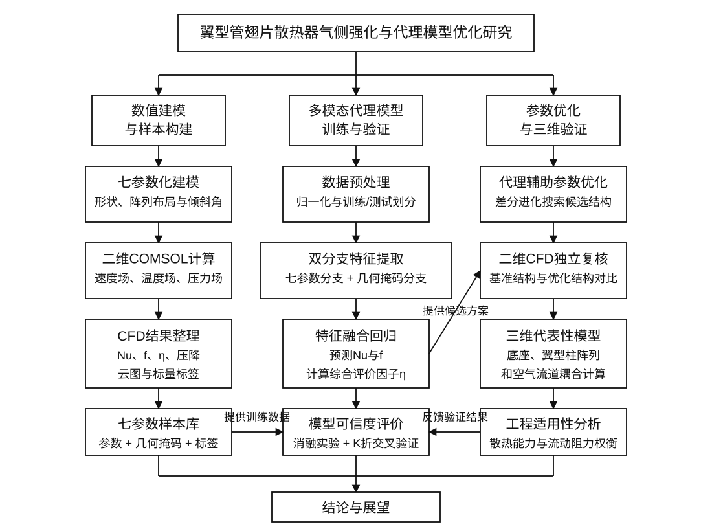

# 第2章 翼型管翅片散热器流热耦合理论与研究方法

## 2.1 引言

翼型管翅片散热器作为电子设备热管理领域的关键组件，其流热耦合性能直接决定了芯片级散热系统的工作可靠性与能效水平。与传统圆管翅片换热器相比，翼型管凭借其流线型外形在降低尾迹涡脱落强度和减小流动阻力方面展现出显著优势，同时翅片结构有效扩展了换热面积，二者协同作用可实现传热性能与压降特性的综合提升。然而，翼型管翅片散热器的设计涉及翼型几何参数、管阵列排布参数和整体倾斜角等多维度变量的耦合影响，其流热性能呈现出高度非线性的映射关系，传统的试凑式设计与高保真数值仿真优化方法在面对庞大设计空间时效率难以令人满意。特别是当设计变量数目增至七个且各变量之间存在显著的交互效应时，基于全因子采样的CFD仿真评估所需的计算量呈指数级增长，严重制约了设计迭代的效率。

近年来，以卷积神经网络为代表的深度学习技术在流体力学与传热学领域取得了重要进展。卷积神经网络能够从流场与温度场的空间分布数据中自动提取多尺度特征，建立设计参数与性能指标之间的快速代理模型，从而将单次性能评估的计算耗时从小时级降低至毫秒级。然而，纯数据驱动的神经网络模型在面对训练样本分布之外的设计工况时，其泛化能力和物理一致性往往无法得到保证。物理信息神经网络（Physics-Informed Neural Network, PINN）通过将控制方程的残差项嵌入损失函数，使网络在训练过程中同时满足数据拟合与物理守恒约束，为解决上述问题提供了新的范式。

本章系统阐述翼型管翅片散热器流热耦合分析所需的理论基础与研究方法。首先介绍翼型管翅片散热器的基本结构及换热机理，明确空气侧流动特征；其次定义基于NACA0012翼型的七参数化设计变量体系；随后给出描述流体流动与传热的控制方程及边界条件；接着定义用于量化流热性能的评价指标；最后阐述卷积神经网络、CBAM注意力机制、物理信息神经网络以及差分进化算法的基本原理，为后续章节中代理模型的构建与多目标优化奠定理论与方法基础。上述各部分内容之间的逻辑关系为：换热器结构与换热机理分析为控制方程的建立提供物理背景，参数化设计变量体系为数据集的参数采样提供设计空间框架，控制方程和性能评价指标既构成CFD数值仿真的数学基础，又为物理信息神经网络提供可嵌入的物理约束，而深度学习方法和智能优化算法则共同构成从数据到预测再到优化的完整技术链路。

## 2.2 翼型管翅片散热器基本结构与换热机理

### 2.2.1 翼型管翅片散热器基本结构

本文研究的翼型管翅片散热器由平直翅片基板与翼型管阵列两部分组成。翅片基板为薄平板结构，其下表面与芯片热源紧密贴合，芯片产生的焦耳热通过导热方式传递至翅片基板，再由基板传导至翼型管壁面。翼型管阵列采用顺排或错排方式布置于翅片基板上表面，空气在外部驱动力的作用下横向掠过管束，通过对流换热将热量带走。

基准结构采用3行×8列共24根翼型管组成的阵列。每根翼型管沿来流方向放置，其弦长方向与翅片基板平面平行，翼型截面垂直于基板。管阵列在翅片基板上呈周期性排布，横向间距（沿弦长方向相邻管中心距与弦长之比）记为 $T_s$，纵向间距（沿来流方向相邻行管中心距与弦长之比）记为 $T_t$。当引入错排偏移时，相邻行管沿横向偏移距离与弦长之比记为 $T_{ad}$。该阵列结构在有限基板面积内实现了换热面积的有效扩展，同时翼型管的流线型外形有助于引导气流平滑绕流，减小尾迹区域，从而在传热强化与压降控制之间取得平衡。

图2-1为翼型管翅片散热器换热路径的概念示意图，用于说明芯片热源、铝质基板、翼型扰流柱阵列和空气侧强制对流之间的传热关系。该图为结构与换热机理示意，不作为本文二维或三维COMSOL模型的几何实图；本文实际二维计算域和三维代表性芯片散热模型分别见图3-1和图6-1。

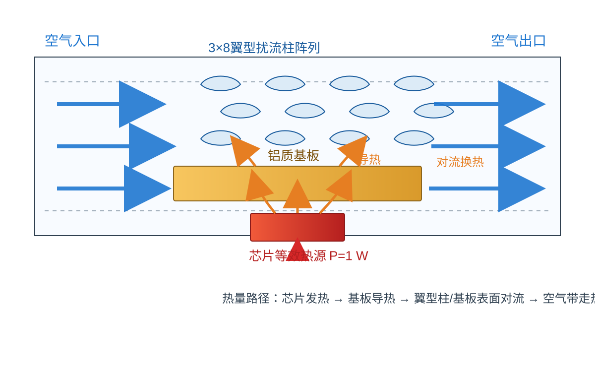

### 2.2.2 翼型管空气侧流动特征

翼型管空气侧流动属于典型的横掠管束外流问题。与圆管横掠流动不同，翼型管的流线型外形使得气流在管壁表面的分离点大幅后移甚至不分离，尾迹区域明显收窄，涡脱落强度显著降低。对于圆管而言，当雷诺数 $Re \sim 10^3$ 时，流动处于亚临界状态，边界层为层流，尾迹中周期性脱落的卡门涡街导致较大的压降和流动噪声。相比之下，翼型管在相同雷诺数范围内，层流边界层沿壁面保持更长的附着距离，压力恢复区平缓，尾迹宽度窄，压降系数可降低一个量级以上。

本文所涉及的雷诺数范围约为 $Re = \rho u_{in} D_h / \mu \sim 10^3$，其中 $u_{in}$ 为入口来流速度，$D_h$ 为基于翼型弦长的水力直径，$\rho$ 和 $\mu$ 分别为空气密度和动力黏度。在此雷诺数范围内，流动为层流至过渡流状态，三维效应和湍流脉动相对较弱，可采用稳态层流模型进行数值模拟。管阵列的存在使流场呈现复杂的周期性特征：气流在前排管处发生加速和绕流，随后进入管间通道，流速和压力沿流向经历多次收缩-扩张循环；在后排管处，上游尾迹的干扰使流场更为复杂。错排布局可进一步改变管间流道的几何拓扑，使气流在相邻行之间经历横向偏移，从而影响局部换热系数和阻力分布。此外，管阵列中各排管之间的流动干涉效应不可忽略：前排管尾迹中的低速高温气流会削弱后排管的对流换热效率，而错排偏移通过引导气流在行间产生横向分量，可在一定程度上破坏尾迹的层化结构，使后排管获得更多的新鲜冷来流，从而改善管束整体的换热均匀性。这种行间干涉效应的强度与纵向间距 $T_t$ 和错排偏移 $T_{ad}$ 密切相关，是设计参数耦合影响流热性能的重要物理机制之一。

### 2.2.3 翼型管翅片散热器换热机理

翼型管翅片散热器的换热过程涉及导热与对流换热的耦合，即共轭传热（Conjugate Heat Transfer, CHT）问题。其完整的热传递路径可描述为：芯片热源产生的热量 $Q_{chip}$ 首先以导热方式经翅片基板向上传递至翼型管根部及管壁面，随后热量在管壁面通过对流换热传递给掠过管表面的空气。翅片基板裸露于管间区域的表面同样参与对流换热，起到辅助翅片的作用。

共轭传热分析要求同时求解固体区域的导热方程和流体区域的能量方程，并在固-流交界面上满足温度和热流密度的连续性条件：

$$T_s \big|_{\Gamma} = T_f \big|_{\Gamma}$$

$$-k_s \frac{\partial T_s}{\partial n} \bigg|_{\Gamma} = -k_f \frac{\partial T_f}{\partial n} \bigg|_{\Gamma}$$

其中 $T_s$ 和 $T_f$ 分别为固体和流体温度，$k_s$ 和 $k_f$ 分别为固体和流体的热导率，$n$ 为交界面法向，$\Gamma$ 表示固-流交界面。翼型管的几何形状通过改变管壁面附近的速度边界层厚度和温度边界层厚度来影响局部对流换热系数：在前缘驻点附近，边界层较薄，局部换热系数较高；沿壁面流向下游，层流边界层逐渐增厚，换热系数逐渐下降；若发生边界层分离，则分离点附近的换热系数出现局部回升。翅片基板表面的换热则受到管阵列尾迹冲刷效应的影响，管间区域的气流加速有助于强化基板表面换热。值得注意的是，翅片效率是评价翅片换热贡献程度的重要概念，其定义为翅片实际散热量与假设翅片整体处于根部温度时的理想散热量之比。翅片效率取决于翅片材料的热导率、翅片几何尺寸以及表面换热系数。在本文所研究的翼型管翅片结构中，由于管壁面温度沿翅片高度方向呈递减分布，翅片远端的实际换热量低于根部，因此合理的翅片厚度设计对于兼顾材料用量和换热效率具有重要意义。

## 2.3 参数化设计变量

### 2.3.1 翼型管阵列参数化描述

本文选用NACA四位数翼型族作为翼型管截面的参数化描述基础。NACA四位数翼型通过最大弯度 $m$（以弦长的百分比表示）、最大弯度位置 $p$（以弦长的十分比表示）和最大厚度 $t$（以弦长的百分比表示）三个参数唯一确定翼型的中弧线和厚度分布。

中弧线方程分两段定义。当 $0 \le x/c \le p$ 时：

$$y_c = \frac{m}{p^2} \left( 2p \frac{x}{c} - \left(\frac{x}{c}\right)^2 \right)$$

当 $p < x/c \le 1$ 时：

$$y_c = \frac{m}{(1-p)^2} \left( (1-2p) + 2p \frac{x}{c} - \left(\frac{x}{c}\right)^2 \right)$$

其中 $x/c$ 为无量纲弦向坐标，$y_c$ 为中弧线纵坐标。厚度分布采用NACA0012的标准厚度公式：

$$y_t = \frac{t}{0.20} \left( 0.2969\sqrt{\frac{x}{c}} - 0.1260\frac{x}{c} - 0.3516\left(\frac{x}{c}\right)^2 + 0.2843\left(\frac{x}{c}\right)^3 - 0.1015\left(\frac{x}{c}\right)^4 \right)$$

上、下表面坐标由中弧线和厚度分布叠加得到：

$$y_u = y_c + y_t, \quad y_l = y_c - y_t$$

该参数化方法以三个独立参数完整控制翼型截面的几何特征，便于在连续设计空间中系统地探索弯度和厚度对流动与换热性能的影响规律。需要指出的是，NACA四位数翼型族的厚度分布与弯度分布相互独立，即厚度对称地叠加在中弧线两侧，这一特性使得弯度参数和厚度参数可以独立调整而互不干扰，为参数化设计提供了良好的解耦性。同时，翼型前缘半径和后缘闭合角度随厚度和弯度参数变化，这些几何细节对绕流场中的边界层发展和压力分布具有直接影响，进而决定了管壁面的局部对流换热系数分布特征。

### 2.3.2 七参数设计变量定义

基于上述翼型参数化方法和管阵列排布特征，本文定义七参数设计变量。七参数体系由三个翼型截面参数、三个阵列排布参数和一个整体姿态参数组成，用于统一描述本文的几何建模、代理预测和优化搜索空间。

**（1）最大弯度 $T_a$**

$T_a$ 对应NACA四位数翼型中的最大弯度参数 $m$，控制翼型截面的弯曲程度。$T_a = 0$ 对应对称翼型（如NACA0012），$T_a$ 增大则翼型上表面凸起更为显著，改变了来流在翼型上、下表面的速度分布不对称性，从而影响升阻特性与换热均匀性。其取值范围为：

$$T_a \in [0.00,\; 0.05]$$

**（2）最大弯度位置 $T_{wa}$**

$T_{wa}$ 对应最大弯度所在位置参数 $p$，决定弯度峰值在弦长方向上的分布位置。$T_{wa}$ 较小意味着弯度集中在前缘附近，前缘加速效应更强；$T_{wa}$ 较大则弯度峰值后移，压力分布更为平坦。其取值范围为：

$$T_{wa} \in [0.20,\; 0.60]$$

**（3）最大厚度 $T_b$**

$T_b$ 对应翼型截面的最大相对厚度参数 $t$，控制翼型截面的整体粗壮程度。$T_b$ 较大时翼型截面更宽，迎风面积增大，换热面积扩展但压降增大；$T_b$ 较小时翼型趋于纤薄，流动阻力降低但结构强度和换热面积均有所减小。其取值范围为：

$$T_b \in [0.08,\; 0.15]$$

**（4）横向间距 $T_s$**

$T_s$ 定义为同一行中相邻翼型管中心距与弦长 $c$ 之比，控制管阵列在横向（弦长方向）上的排布疏密程度。$T_s$ 较小时间距紧凑，管间气流速度较高，换热强化但阻力增大；$T_s$ 较大时管间流道宽敞，流动阻力降低但单位面积换热密度下降。其取值范围为：

$$T_s \in [0.50,\; 1.50]$$

**（5）纵向间距 $T_t$**

$T_t$ 定义为相邻行翼型管中心距与弦长 $c$ 之比，控制管阵列在纵向（来流方向）上的排布疏密程度。$T_t$ 直接影响前排行管的尾迹对后排来流的干扰程度：$T_t$ 较小时尾迹干扰强烈，后排管处于低速高温的尾迹区，换热效率下降；$T_t$ 较大时尾迹在到达下一排之前得到充分恢复，流动更接近均匀来流条件。其取值范围为：

$$T_t \in [0.50,\; 1.20]$$

**（6）错排偏移 $T_{ad}$**

$T_{ad}$ 定义为相邻行翼型管中心沿横向的偏移距离与弦长 $c$ 之比。$T_{ad} = 0$ 对应顺排布局，相邻行管中心对齐；$T_{ad} > 0$ 引入错排效应，使气流在行间经历横向偏转，增加流道曲折度，从而强化湍流混合和管表面冲刷，但同时增大压降。其取值范围为：

$$T_{ad} \in [0.00,\; 1.00]$$

**（7）翼型整体倾斜角 $\theta_g$**

$\theta_g$ 表示翼型截面绕自身中心相对来流方向的整体旋转角度，单位为度。该参数用于描述翼型安装姿态和来流夹角变化对流动分离、尾迹偏转和局部换热的影响。其扩展搜索范围设定为：

$$\theta_g \in [-10^\circ,\; 10^\circ]$$

七个设计变量构成的设计向量可表示为：

$$\mathbf{X}_7 = [T_a,\; T_{wa},\; T_b,\; T_s,\; T_t,\; T_{ad},\; \theta_g]^T \in \mathbb{R}^7$$

该七参数化体系同时涵盖了翼型截面几何特征（$T_a$、$T_{wa}$、$T_b$）、管阵列排布拓扑特征（$T_s$、$T_t$、$T_{ad}$）和翼型安装姿态特征（$\theta_g$）。需要说明的是，正式消融实验、K折验证和第5章代理优化仍基于500组$\theta_g=0$二维CFD样本；本文另补充35组非零$\theta_g$样本用于轻量重训评估。为保证结论可追溯，第5章的七参数PI-CNN-CBAM几何掩码代理模型在检测到正式训练标签中$\theta_g$只有0值时，会自动固定$\theta_g=0$，避免在样本支撑不足的非零倾斜角区域进行正式优化。因此，本文当前优化结果应理解为七参数框架下、倾斜角固定条件下的阶段性优化验证；完整的非零倾斜角优化仍需进一步扩充样本并重新训练代理模型。

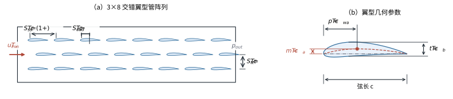

图2-2用于说明翼型截面参数和阵列排布参数的几何含义，其中未单独绘出整体倾斜角$\theta_g$。$\theta_g$表示整个翼型截面相对来流方向的旋转角度，作为第七个参数在模型和优化流程中保留；当前真实CFD样本均位于$\theta_g=0^\circ$子空间。

### 2.3.3 基准结构与参数化拓扑族说明

本文以NACA0012对称翼型（$T_a = 0$, $T_{wa} = 0.40$, $T_b = 0.12$）配合顺排管阵列（$T_s = 1.10$, $T_t = 0.85$, $T_{ad} = 0$，$\theta_g=0^\circ$）作为预设基准构型。需要说明的是，现有500组正式训练标签来自拉丁超立方采样，并未单独保存该预设基准构型的独立COMSOL求解结果；因此，后续综合评价因子中的 $Nu_0$ 和 $f_0$ 采用标签文件中与该预设基准构型距离最近的参考样本提取，作为当前阶段的参考基准值。参数化拓扑族由预设基准构型出发，通过在设计变量取值范围内系统变化七个参数而生成。每个参数组合对应一种唯一的翼型管翅片散热器几何构型，所有构型共享相同的翅片基板尺寸和管阵列行列数（3×8），仅翼型截面形状、管阵列排布方式和整体倾斜角不同。这种参数化拓扑定义方式确保了设计空间的可比性和优化结果的可解释性。后续若补跑精确基准构型，可直接更新 $Nu_0$ 和 $f_0$ 并重新计算 $\eta$。

## 2.4 控制方程与边界条件

### 2.4.1 连续性方程

对于不可压缩流体，质量守恒方程（连续性方程）可表示为：

$$\frac{\partial \rho}{\partial t} + \nabla \cdot (\rho \mathbf{V}) = 0$$

在稳态、常密度假设下，$\rho$ 为常数，上式简化为：

$$\nabla \cdot \mathbf{V} = 0$$

即：

$$\frac{\partial u}{\partial x} + \frac{\partial v}{\partial y} + \frac{\partial w}{\partial z} = 0$$

其中 $\mathbf{V} = (u, v, w)$ 为速度矢量，$u$、$v$、$w$ 分别为 $x$、$y$、$z$ 方向的速度分量。该方程表明流体体积膨胀率为零，是质量守恒在不可压缩条件下的数学表达。

### 2.4.2 动量方程（Navier-Stokes方程）

对于稳态、不可压缩、常物性牛顿流体，Navier-Stokes动量方程可写为：

$$\rho (\mathbf{V} \cdot \nabla) \mathbf{V} = -\nabla P + \mu \nabla^2 \mathbf{V}$$

将其在直角坐标系中展开为三个分量方程。$x$ 方向：

$$\rho \left( u\frac{\partial u}{\partial x} + v\frac{\partial u}{\partial y} + w\frac{\partial u}{\partial z} \right) = -\frac{\partial P}{\partial x} + \mu \left( \frac{\partial^2 u}{\partial x^2} + \frac{\partial^2 u}{\partial y^2} + \frac{\partial^2 u}{\partial z^2} \right)$$

$y$ 方向：

$$\rho \left( u\frac{\partial v}{\partial x} + v\frac{\partial v}{\partial y} + w\frac{\partial v}{\partial z} \right) = -\frac{\partial P}{\partial y} + \mu \left( \frac{\partial^2 v}{\partial x^2} + \frac{\partial^2 v}{\partial y^2} + \frac{\partial^2 v}{\partial z^2} \right)$$

$z$ 方向：

$$\rho \left( u\frac{\partial w}{\partial x} + v\frac{\partial w}{\partial y} + w\frac{\partial w}{\partial z} \right) = -\frac{\partial P}{\partial z} + \mu \left( \frac{\partial^2 w}{\partial x^2} + \frac{\partial^2 w}{\partial y^2} + \frac{\partial^2 w}{\partial z^2} \right)$$

其中 $P$ 为静压，$\mu$ 为动力黏度。方程左端为惯性力项（对流项），右端分别为压力梯度项和黏性扩散项。在本文所研究的雷诺数范围内，流动为层流状态，无需引入湍流模型。

### 2.4.3 能量方程

对于不可压缩流体区域，忽略黏性耗散和体积热源，稳态能量方程可表示为：

$$\rho c_p (\mathbf{V} \cdot \nabla T) = k_f \nabla^2 T$$

展开为：

$$\rho c_p \left( u\frac{\partial T}{\partial x} + v\frac{\partial T}{\partial y} + w\frac{\partial T}{\partial z} \right) = k_f \left( \frac{\partial^2 T}{\partial x^2} + \frac{\partial^2 T}{\partial y^2} + \frac{\partial^2 T}{\partial z^2} \right)$$

其中 $T$ 为流体温度，$c_p$ 为定压比热容，$k_f$ 为流体热导率。方程左端表示流体流动携带的对流热输运，右端表示热传导引起的扩散热输运。

对于固体区域（翅片基板和翼型管壁），无内部热源且固体静止不动，能量方程退化为稳态热传导方程（Laplace方程）：

$$k_s \nabla^2 T = 0$$

即：

$$\frac{\partial^2 T}{\partial x^2} + \frac{\partial^2 T}{\partial y^2} + \frac{\partial^2 T}{\partial z^2} = 0$$

流体区域与固体区域的能量方程通过固-流交界面上的温度和热流密度连续条件耦合求解。

### 2.4.4 边界条件与基本假设

为封闭上述控制方程组，需给定如下边界条件：

**（1）入口边界**

在计算域入口截面施加均匀速度入口条件，来流速度 $u_{in}$ 根据目标雷诺数确定，来流温度为恒定值：

$$u\big|_{inlet} = u_{in}, \quad v\big|_{inlet} = 0, \quad w\big|_{inlet} = 0, \quad T\big|_{inlet} = T_{in} = 300 \; \text{K}$$

**（2）出口边界**

在计算域出口截面施加压力出口条件，设定出口静压为参考大气压：

$$P\big|_{outlet} = P_{atm} = 0 \; \text{Pa} \; (\text{表压})$$

出口处速度和温度的法向梯度设为零（充分发展条件）：

$$\frac{\partial u}{\partial x}\bigg|_{outlet} = 0, \quad \frac{\partial v}{\partial x}\bigg|_{outlet} = 0, \quad \frac{\partial T}{\partial x}\bigg|_{outlet} = 0$$

**（3）壁面边界**

在所有固体壁面（翼型管表面、翅片基板表面）施加无滑移速度条件：

$$\mathbf{V}\big|_{wall} = 0$$

在固-流交界面上施加共轭传热条件，即温度连续和热流密度连续（详见2.2.3节）。翅片基板下表面施加恒定热流密度边界条件，模拟芯片热源：

$$-k_s \frac{\partial T}{\partial n}\bigg|_{chip} = q''_{chip}$$

**（4）对称面与周期面**

根据管阵列的排布对称性，在计算域侧面施加对称边界条件或周期性边界条件，以减小计算域规模。

**基本假设：**

本文数值模拟基于以下基本假设：（a）流动为稳态层流，不考虑时间非定常效应和湍流脉动；（b）流体不可压缩，密度 $\rho$ 为常数；（c）流体物性（$\mu$、$k_f$、$c_p$）不随温度变化；（d）忽略重力引起的自然对流效应；（e）忽略热辐射换热；（f）固体物性（$k_s$）为各向同性常数。上述假设在本文所涉及的雷诺数和温差范围内是合理的，既保证了数值模拟的精度，又降低了计算成本。具体而言，当翅片基板与来流空气之间的温差不超过50 K时，空气物性随温度的变化率不超过5%，常物性假设引入的误差在工程可接受范围内；同时，在强制对流条件下（$Re \sim 10^3$），格拉晓夫数 $Gr$ 与 $Re^2$ 之比远小于1，自然对流的影响可忽略不计。

## 2.5 性能评价指标

### 2.5.1 努塞尔数 $Nu$

努塞尔数是表征对流换热强度的核心无量纲参数，定义为对流换热与纯导热换热的比值：

$$Nu = \frac{h \cdot D_h}{k_f}$$

其中 $h$ 为平均对流换热系数（W/(m$^2$$\cdot$K)），$D_h$ 为基于翼型弦长的特征长度（m），$k_f$ 为流体热导率（W/(m$\cdot$K)）。平均对流换热系数 $h$ 由下式计算：

$$h = \frac{Q_{total}}{A_{total} \cdot (T_{w,avg} - T_{f,avg})}$$

其中 $Q_{total}$ 为总换热量（W），$A_{total}$ 为参与换热的总面积（m$^2$），包括翼型管表面积和翅片基板裸露面积，$T_{w,avg}$ 为换热面平均温度（K），$T_{f,avg}$ 为流体平均温度（K），通常取入口和出口流体质量平均温度的算术平均值：

$$T_{f,avg} = \frac{T_{in} + T_{out}}{2}$$

$Nu$ 越大表明对流换热越强，散热性能越好。

### 2.5.2 摩擦因子 $f$

摩擦因子用于量化流体流经翼型管阵列时因流动阻力而产生的压力损失：

$$f = \frac{\Delta P}{0.5 \cdot \rho \cdot u_{in}^2}$$

其中 $\Delta P = P_{in} - P_{out}$ 为进出口总压差（Pa），$\rho$ 为流体密度（kg/m$^3$），$u_{in}$ 为入口截面平均速度（m/s）。该定义与本文COMSOL后处理脚本一致，即将整体进出口压降归一化到入口动压，用于在同一入口速度和同一计算域下比较不同参数构型的相对流动阻力。$f$ 越小表明流动阻力越低，泵功消耗越少。

### 2.5.3 综合评价因子 $\eta$

在散热器设计中，强化换热与降低压降往往是一对矛盾目标。综合评价因子 $\eta$ 用于在统一框架下权衡换热增益与阻力代价：

$$\eta = \frac{Nu / Nu_0}{(f / f_0)^{1/3}}$$

其中 $Nu_0$ 和 $f_0$ 分别为基准结构在相同工况下的努塞尔数和摩擦因子。分子 $(Nu/Nu_0)$ 表示设计结构相对于基准结构的换热增强倍数，分母 $(f/f_0)^{1/3}$ 表示泵功增大的惩罚项。当 $\eta > 1$ 时，表明设计结构在综合考虑换热与压降后优于基准结构；$\eta$ 越大，综合性能越好。该指标的构造基于等泵功比较原则，广泛用于管束换热器的性能评价。

### 2.5.4 等效热阻 $R'_{th}$

等效热阻是从热管理角度评价散热器性能的工程指标，定义为：

$$R'_{th} = \frac{T_{chip,avg} - T_{in}}{Q_{total}}$$

其中 $T_{chip,avg}$ 为芯片热源表面的平均温度（K），$T_{in}$ 为入口空气温度（K），$Q_{total}$ 为芯片总发热功率（W）。等效热阻 $R'_{th}$（K/W）直接反映了散热器将芯片热量传递至冷却介质的能力。$R'_{th}$ 越小，表明在相同发热功率下芯片温度越低，散热性能越优越。该指标与电子设备的结温可靠性直接关联，是工程设计中最为直观的散热性能判据。

上述四项评价指标从不同角度刻画了散热器的流热性能。在实际优化过程中，以综合评价因子 $\eta$ 作为主要优化目标，同时监测努塞尔数、摩擦因子和等效热阻的变化趋势，避免只追求换热增强而忽略压降代价或温度控制效果。$Nu$ 和 $f$ 作为CNN代理模型的直接预测输出，$\eta$ 和 $R'_{th}$ 则由预测结果经后处理计算得到。

## 2.6 深度学习与物理约束基本原理

### 2.6.1 卷积神经网络基本原理

卷积神经网络（Convolutional Neural Network, CNN）是一类专门用于处理具有网格拓扑结构数据的前馈神经网络，在图像识别、流场预测等任务中表现优异。本文采用二维卷积神经网络构建翼型管翅片散热器流热性能的代理模型。

CNN的核心运算单元为二维卷积层（Conv2d），其数学表达为：

$$\mathbf{F}^{(l+1)}_{i,j,k} = \sigma \left( \sum_{m} \sum_{p=0}^{K_h-1} \sum_{q=0}^{K_w-1} \mathbf{F}^{(l)}_{i+p,\; j+q,\; m} \cdot \mathbf{W}^{(l)}_{p,q,m,k} + b^{(l)}_k \right)$$

其中 $\mathbf{F}^{(l)}$ 为第 $l$ 层的输入特征图，$\mathbf{W}^{(l)}$ 为卷积核权重，$K_h \times K_w$ 为卷积核尺寸，$m$ 遍历输入通道，$k$ 为输出通道索引，$b^{(l)}_k$ 为偏置项，$\sigma(\cdot)$ 为激活函数。

在卷积层之后通常依次施加批量归一化（Batch Normalization）和ReLU激活函数。批量归一化将特征图归一化为零均值单位方差分布，加速训练收敛并缓解内部协变量偏移：

$$\hat{\mathbf{F}} = \frac{\mathbf{F} - \mu_B}{\sqrt{\sigma_B^2 + \epsilon}}, \quad \mathbf{F}_{BN} = \gamma \hat{\mathbf{F}} + \beta$$

其中 $\mu_B$ 和 $\sigma_B^2$ 分别为小批量样本的均值和方差，$\gamma$ 和 $\beta$ 为可学习的缩放和偏移参数。ReLU激活函数定义为 $\sigma(x) = \max(0, x)$，引入非线性映射能力。

最大池化层（MaxPool）用于对特征图进行空间下采样，降低特征图分辨率和计算量，同时增大后续卷积层的感受野：

$$\mathbf{F}^{pool}_{i,j,k} = \max_{(p,q) \in \mathcal{R}_{i,j}} \mathbf{F}_{p,q,k}$$

其中 $\mathcal{R}_{i,j}$ 为池化窗口覆盖的区域。

通过逐层堆叠卷积-归一化-激活-池化模块，CNN构建了从低层边缘特征到高层语义特征的层次化特征提取体系，能够从输入的设计参数编码或几何图像中自动学习与流热性能相关的空间模式。在本文的研究中，CNN的输入为翼型管翅片散热器的几何特征编码，包括翼型截面轮廓信息和管阵列排布信息，输出为对应的努塞尔数和摩擦因子预测值。网络架构采用多层卷积块逐步提取设计参数中的高维抽象特征，最终通过全局平均池化和全连接层输出性能预测结果。与传统的全连接神经网络相比，卷积操作通过权值共享和局部连接机制大幅减少了模型参数量，同时保持了强大的空间特征捕捉能力，使其在中等规模训练数据集上也能获得良好的拟合效果和泛化性能。

### 2.6.2 CBAM注意力机制

卷积块注意力模块（Convolutional Block Attention Module, CBAM）是一种轻量级的混合域注意力机制，依次沿通道维度和空间维度对特征图施加自适应加权，使网络聚焦于对任务最有意义的特征通道和空间区域。

**（1）通道注意力**

给定中间特征图 $\mathbf{F} \in \mathbb{R}^{H \times W \times C}$，首先分别对其执行全局平均池化（GAP）和全局最大池化（GMP），得到两个 $C$ 维向量：

$$\mathbf{F}^{avg}_c = \frac{1}{H \times W} \sum_{i=1}^{H} \sum_{j=1}^{W} \mathbf{F}_{i,j,c}, \quad \mathbf{F}^{max}_c = \max_{i,j} \mathbf{F}_{i,j,c}$$

将两个向量分别输入一个共享权重的多层感知机（MLP），该MLP包含一个隐层（神经元数为 $C/r$，$r$ 为压缩比），然后将两个输出逐元素相加并经Sigmoid函数激活，得到通道注意力权重向量：

$$\mathbf{M}_c = \sigma \left( \text{MLP}(\mathbf{F}^{avg}) + \text{MLP}(\mathbf{F}^{max}) \right) \in \mathbb{R}^{1 \times 1 \times C}$$

$$= \sigma \left( \mathbf{W}_1(\mathbf{W}_0 \mathbf{F}^{avg}) + \mathbf{W}_1(\mathbf{W}_0 \mathbf{F}^{max}) \right)$$

其中 $\mathbf{W}_0 \in \mathbb{R}^{C/r \times C}$ 和 $\mathbf{W}_1 \in \mathbb{R}^{C \times C/r}$ 为共享MLP的权重矩阵。通道注意力使网络能够自适应地强化对换热预测贡献较大的特征通道，抑制冗余通道。

**（2）空间注意力**

对经通道注意力加权后的特征图 $\mathbf{F}' = \mathbf{M}_c \otimes \mathbf{F}$，沿通道维度分别计算平均值和最大值，得到两个 $H \times W$ 的二维特征图：

$$\mathbf{F}^{avg}_s = \frac{1}{C} \sum_{c=1}^{C} \mathbf{F}'_{i,j,c}, \quad \mathbf{F}^{max}_s = \max_c \mathbf{F}'_{i,j,c}$$

将两个特征图在通道维度拼接后，经过一个 $7 \times 7$ 卷积核的卷积层和Sigmoid激活，得到空间注意力权重图：

$$\mathbf{M}_s = \sigma \left( f^{7 \times 7} \left( [\mathbf{F}^{avg}_s ; \mathbf{F}^{max}_s] \right) \right) \in \mathbb{R}^{H \times W \times 1}$$

空间注意力使网络能够聚焦于流场中对换热和阻力贡献最大的空间区域（如翼型管前缘、尾迹剪切层等），提升特征表达的空间选择性。

CBAM的最终输出为：

$$\mathbf{F}'' = \mathbf{M}_s \otimes \mathbf{F}'$$

在本文的翼型管翅片散热器流热预测任务中，CBAM注意力机制的引入具有明确的物理意义。通道注意力能够自动识别与换热和阻力性能最相关的特征通道（例如编码了翼型前缘曲率或管间流道宽度的特征），对这些关键通道赋予较高的权重；空间注意力则能够聚焦于流场中对性能贡献最大的空间位置（如翼型管前缘驻点区、管间收缩喉道区和尾迹剪切层区），弱化远离壁面的自由流区域。这种"先通道后空间"的序贯注意力机制使网络在有限的参数量下获得了更强的特征选择性，有助于提升代理模型的预测精度和物理可解释性。

### 2.6.3 物理信息神经网络（PINN）

物理信息神经网络的核心思想是将描述物理系统的偏微分方程（PDE）残差嵌入神经网络的损失函数中，使网络在拟合训练数据的同时满足物理守恒约束，从而提高模型的泛化能力、数据效率和物理一致性。

需要区分的是，本文中“物理信息”在两个模型中的实现层级不同。旧版CFD云图模型包含流场图像输入，可在温度场重建分支中引入场损失或温度场平滑约束，用于辅助解释流场特征；但该模型推理阶段依赖候选结构的CFD云图，因此不能作为差分进化优化的主代理模型。

七参数优化阶段采用的是参数-几何掩码PI-CNN-CBAM模型。该模型不预测完整速度场、压力场或温度场，也不计算PDE残差，而是在全局性能指标层面加入物理一致性约束。具体而言，网络直接预测 $\hat{Nu}$ 和 $\hat{f}$，并由二者计算综合评价因子：

$$\hat{\eta} = \frac{\hat{Nu}/Nu_0}{(\hat{f}/f_0)^{1/3}}$$

训练损失由性能回归误差和综合评价因子一致性误差组成：

$$\mathcal{L} = \mathcal{L}_{Nu,f} + \lambda_\eta \mathcal{L}_{\eta} + \lambda_p \mathcal{L}_{positive}$$

其中，$\mathcal{L}_{Nu,f}$ 为 $Nu$ 和 $f$ 的均方误差，$\mathcal{L}_{\eta}$ 约束由预测值计算得到的 $\hat{\eta}$ 与由CFD标签计算得到的 $\eta$ 保持一致，$\mathcal{L}_{positive}$ 用于惩罚非物理的负 $Nu$ 或负 $f$ 输出。该约束不等同于严格PINN中的控制方程残差，但能够把“换热收益—流动阻力代价—综合评价因子”之间的物理关系写入训练目标，使代理模型更适合后续优化搜索。

因此，本文后续将该模型称为PI-CNN-CBAM，是指在CNN-CBAM代理模型中引入基于性能指标定义的物理一致性约束，而不是声明当前七参数几何掩码模型已经求解或重建完整流场控制方程。

### 2.6.4 差分进化算法

差分进化（Differential Evolution, DE）算法是一种基于种群的实数编码全局优化算法，具有结构简单、收敛性好、对目标函数无凸性和可微性要求等优点，适合本文七参数连续设计空间的多参数优化问题。本文采用经典的DE/rand/1/bin策略，其流程包括以下三个核心算子。

**（1）变异算子**

对于种群中第 $i$ 个个体 $\mathbf{x}_i^{(g)}$（第 $g$ 代），从种群中随机选取三个互不相同且不同于 $i$ 的个体 $\mathbf{x}_{r_1}^{(g)}$、$\mathbf{x}_{r_2}^{(g)}$、$\mathbf{x}_{r_3}^{(g)}$，生成变异向量：

$$\mathbf{v}_i^{(g+1)} = \mathbf{x}_{r_1}^{(g)} + F \cdot \left( \mathbf{x}_{r_2}^{(g)} - \mathbf{x}_{r_3}^{(g)} \right)$$

其中 $F \in (0, 2]$ 为缩放因子，控制差分向量的放大倍数。较大的 $F$ 增强全局探索能力，较小的 $F$ 有利于局部精细搜索。本文取 $F = 0.7$。

**（2）交叉算子**

将变异向量 $\mathbf{v}_i^{(g+1)}$ 与目标向量 $\mathbf{x}_i^{(g)}$ 按维进行二项式交叉，生成试验向量 $\mathbf{u}_i^{(g+1)}$：

$$u_{i,j}^{(g+1)} = \begin{cases} v_{i,j}^{(g+1)}, & \text{if } rand_j \le CR \text{ or } j = j_{rand} \\ x_{i,j}^{(g)}, & \text{otherwise} \end{cases}$$

其中 $j$ 为维度索引（$j = 1, 2, \ldots, D$，$D = 7$ 为七参数框架下的设计变量维数），$CR \in [0, 1]$ 为交叉概率，$rand_j \sim U(0,1)$ 为均匀随机数，$j_{rand}$ 为随机选定的一个维度索引，保证试验向量至少有一个维度来自变异向量。本文取 $CR = 0.9$。

**（3）选择算子**

采用贪婪选择策略，将试验向量与目标向量的适应度进行比较，选取较优者进入下一代：

$$\mathbf{x}_i^{(g+1)} = \begin{cases} \mathbf{u}_i^{(g+1)}, & \text{if } J(\mathbf{u}_i^{(g+1)}) \ge J(\mathbf{x}_i^{(g)}) \\ \mathbf{x}_i^{(g)}, & \text{otherwise} \end{cases}$$

其中 $J(\cdot)$ 为适应度函数，在最大化问题中取值越大越好。种群规模 $NP$ 通常取为设计变量维数的5至10倍，本文取 $NP = 50$。

差分进化算法与训练完成的代理模型相结合，构成"优化-评估"流程：DE在七参数空间中生成候选设计方案，代理模型以毫秒级速度预测其 $Nu$ 和 $f$ 值，DE根据适应度反馈迭代进化，最终搜索得到综合性能较优的设计参数组合。由于当前训练标签中$\theta_g$仅包含0值，实际优化阶段固定该参数，避免无样本支撑的外推。相较于传统基于CFD仿真的优化流程（每次评估需数十分钟至数小时），代理模型将单次评估耗时降低至毫秒级，使得DE能够在可接受的计算预算内评估大量候选方案。

## 2.7 本章小结

本章系统建立了后续数值仿真、代理建模和参数优化所需的统一理论与方法基础，形成以下可复用定义和约束：

（1）介绍了翼型管翅片散热器的基本结构，描述了3行×8列翼型管阵列与平直翅片基板组成的散热器构型，分析了翼型管空气侧的流线型绕流特征及其相对于钝体的尾迹优势，阐明了涉及管壁面对流换热和翅片基板导热的共轭传热机理。

（2）建立了基于NACA四位数翼型参数化方法的七参数设计变量体系，包括最大弯度 $T_a$、最大弯度位置 $T_{wa}$、最大厚度 $T_b$、横向间距 $T_s$、纵向间距 $T_t$、错排偏移 $T_{ad}$ 和翼型整体倾斜角 $\theta_g$，涵盖了翼型截面几何、管阵列排布和安装姿态三个层面的设计自由度。

（3）给出了描述流体流动的连续性方程和Navier-Stokes方程、流体区域能量方程以及固体区域热传导方程，明确了入口均匀速度、出口压力、壁面无滑移和共轭传热等边界条件，并列举了稳态层流不可压缩常物性等基本假设。

（4）定义了努塞尔数 $Nu$、摩擦因子 $f$、综合评价因子 $\eta$ 和等效热阻 $R'_{th}$ 四项性能评价指标，为量化散热器的换热性能、流动阻力和综合效能提供了统一基准。

（5）明确了卷积神经网络、CBAM通道-空间双注意力机制、物理信息神经网络和差分进化算法在本文中的作用边界：CNN用于提取几何掩码或流场图像特征，CBAM用于增强关键通道和空间区域，物理约束用于限制预测结果的基本一致性，差分进化用于在代理模型上进行快速全局搜索。该方法体系为后续章节的CFD样本生成、七参数代理建模和优化复核提供了统一接口。

# 第3章 翼型管翅片散热器数值模型与参数影响规律分析

## 3.1 引言

翼型管翅片散热器作为一种高效的紧凑式换热装置，广泛应用于电力电子散热、航空航天热管理等领域。其核心换热元件——翼型管阵列的几何排布参数直接决定了流场结构与传热性能之间的耦合关系。为了系统地揭示不同几何参数对散热器流热性能的影响规律，并为后续基于物理信息卷积神经网络的代理模型提供高质量的训练数据，本章建立了一套完整的参数化数值仿真计算框架。

数值仿真方法在换热器性能研究中具有不可替代的作用。相较于实验测试，数值模拟能够以较低的成本获取全流场的速度、温度、压力分布等详细信息，并且便于实施参数化扫描与批量计算。然而，翼型管翅片散热器涉及流固耦合共轭传热问题，其几何构型复杂、参数维度较高，对数值模型的建立与求解提出了较高要求。

本章围绕以下核心任务展开：（1）基于COMSOL Multiphysics 6.3平台建立翼型管翅片散热器的二维流固共轭传热数值模型；（2）设计适用于批量计算的网格划分策略，并对翼型近壁面和尾迹区域进行局部加密；（3）采用拉丁超立方采样方法生成500组工况样本，并将数据组织到七参数研究框架下；（4）构建包含标量性能指标、CFD流场云图和参数化几何掩码图的多模态数据集；（5）对典型工况的流场特征进行分析，并通过参数影响分析揭示各设计变量对换热器性能的影响规律。

## 3.2 物理模型与数值方法

### 3.2.1 物理模型与计算域

本文研究的翼型管翅片散热器由多排翼型截面管束与翅片基板组成，管束按照特定的横向间距与纵向间距排列。为简化计算并突出关键物理机制，本文采用二维横截面模型进行研究。计算域包含流体域（空气）和固体域（铝翅片）两部分，流固界面通过共轭传热边界条件实现耦合。

计算模型采用3行×8列共24根翼型管阵列排布，其中3行为沿垂直于流动方向（横向）布置的管列、8列为沿流动方向（纵向）布置的管排。翼型管截面基于NACA0012翼型的厚度分布构建，其弦长为基准长度。二维模型的计算域在流动方向上从第一排管前缘向上游延伸一定距离作为入口段，从最后一排管尾缘向下游延伸一定距离作为出口段，以保证流场的充分发展；在横向方向上取单列管宽度作为计算域，并在上下边界施加周期性边界条件或对称边界条件，以模拟无限宽阵列的中间区域。

流体域覆盖翼型管外部的空气流通区域，固体域覆盖铝翅片实体区域。流固交界面即为翼型管壁面与翅片表面的接触区域，在该界面上同时满足温度连续和热流连续条件。考虑到实际工程中芯片产生的热量通过基板传导至翅片再由空气对流带走，本文在固体域的底部区域施加等效体积热源以模拟芯片发热功率。

需要指出的是，二维简化模型虽然忽略了展向（即管长方向）的流动不均匀性和端部效应，但在管长远大于管径的工程应用中，中间截面的流动与传热特性能够代表散热器的主体行为。二维模型的采用使得单工况计算时间从三维模型的数十分钟缩短至数分钟，这对于需要批量计算数百组样本的参数化研究具有至关重要的意义。此外，二维模型生成的流场云图可用于流动换热机理解释和旧版CFD云图PI-CNN-CBAM对比模型；用于差分进化优化的七参数代理模型则采用参数向量和几何掩码图作为输入。

### 3.2.2 材料物性参数

本文涉及两种材料的物性参数，分别为流体域中的空气和固体域中的铝翅片。在计算中假设各物性参数为常数，不随温度变化，这一假设在温升较小（通常小于30 K）的条件下是合理的。各材料的热物性参数如表3-1所示。

表3-1 材料物性参数

| 材料 | 密度ρ (kg/m³) | 动力粘度μ (Pa·s) | 导热系数k (W/(m·K)) | 比热容Cp (J/(kg·K)) |
|------|---------------|-------------------|---------------------|---------------------|
| 空气 | 1.225 | 1.81×10⁻⁵ | 0.026 | 1005 |
| 铝   | 2700 | — | 237 | 900 |

空气作为流动工质，其密度取标准大气压下的值1.225 kg/m³，动力粘度为1.81×10⁻⁵ Pa·s，导热系数为0.026 W/(m·K)，比定压热容为1005 J/(kg·K)。铝翅片材料的密度为2700 kg/m³，导热系数高达237 W/(m·K)，比热容为900 J/(kg·K)。铝的高导热系数保证了翅片内部温度分布的均匀性，有利于提高散热效率。

### 3.2.3 控制方程与边界条件

本研究的数值模型基于以下控制方程组：流体域满足连续性方程∇·u = 0和稳态Navier-Stokes方程ρ(u·∇)u = -∇p + μ∇²u；流体域能量方程为ρCp(u·∇)T = k_f∇²T；固体域能量方程为k_s∇²T + q_v = 0。上述方程构成了不可压缩层流流固共轭传热的完整数学描述。边界条件的设置直接影响数值解的物理合理性，本文的边界条件设置如下：

（1）入口边界：采用均匀速度入口条件，入口流速u_in = 2 m/s，入口空气温度T_in = 300 K。均匀速度入口假设来流在进入管束前尚未受到管壁扰动，这在入口段长度足够的情况下是合理的。

（2）出口边界：采用压力出口条件，设定出口表压为0 Pa，即出口静压等于参考大气压。出口边界设置在远离最后一排管的位置，以避免回流现象对管束区域流场的干扰。

（3）壁面边界条件：翼型管壁面和翅片表面均为无滑移壁面，即壁面处流体速度为零。流固交界面为共轭传热界面，满足温度连续性条件T_fluid = T_solid和热流连续性条件-k_f(∂T/∂n)_f = -k_s(∂T/∂n)_s，其中下标f和s分别代表流体侧和固体侧。

（4）热源条件：在固体域的底部基板区域施加等效体积热源q_v = 1×10⁷ W/m³，用以模拟电子芯片的发热功率。该体积热源对应的总发热功率与实际工程应用中的典型芯片热流密度相当。

（5）流动状态：根据入口流速、翼型管弦长及空气物性参数，雷诺数Re约为1000，属于层流至过渡流区域。本文统一采用层流模型进行稳态求解，这一选择在Re~1000的工况下是基本合理的。

### 3.2.4 求解器设置与计算平台

所有数值仿真均在COMSOL Multiphysics 6.3平台上完成。该软件基于有限元方法，具有强大的多物理场耦合求解能力，能够高效处理流固共轭传热问题。

求解器配置方面，本文采用全耦合求解策略，将流动方程（连续性方程与Navier-Stokes方程）和传热方程（流体域对流-扩散方程与固体域热传导方程）作为统一的方程组同时求解。全耦合方法虽然对内存需求较高，但收敛性优于分离式求解方法，尤其适用于流固耦合问题。线性方程组求解器采用直接求解器MUMPS（MUltifrontal Massively Parallel Sparse direct Solver），其对于二维问题的求解具有较高的效率和稳定性。非线性迭代的收敛判据设置为残差降至10⁻⁶以下，且各物理量的监控点数值趋于稳定。

计算平台采用配备Intel Core i7-12700K处理器（12核心20线程）、64 GB DDR5内存的工作站。单次稳态仿真在收敛后约需3~5分钟，500组工况的批量计算总耗时约40~60小时。

## 3.3 网格划分策略

### 3.3.1 整体网格

网格质量是影响数值计算精度和收敛性的关键因素。针对翼型管翅片散热器的几何特点，本文采用映射四边形网格（Mapped Quadrilateral Mesh）作为整体网格策略。映射网格的优势在于：（1）四边形单元在边界层区域的排列有序性好，能够精确捕捉壁面附近的梯度变化；（2）相较于三角形非结构网格，同等精度下映射网格的单元数量更少，有利于降低计算成本；（3）映射网格的参数化控制便捷，便于在批量计算中保持网格的一致性。

整体网格的划分策略为：将计算域按照翼型管阵列的排列划分为若干子域，每个子域内部实施映射网格生成。管间通道区域采用规则的四边形网格，沿流动方向的网格间距根据管间距自适应调整；入口段和出口段采用渐变网格，从管束区域向外逐渐增大网格尺寸，以减少非关键区域的计算量。翅片固体域同样采用映射四边形网格，保证流固界面处网格节点的匹配。

在网格尺度的选取上，综合考虑计算精度与效率的平衡。对于500组参数化样本的批量计算任务，每个样本都需要独立生成网格并完成求解，因此单个模型的网格规模不宜过大。经过初步测试，本文将单个模型的网格单元数控制在8000~12000个之间，对应的平均网格尺寸约为0.3~0.5 mm。该网格规模能够在保证计算精度的同时，将单次仿真时间控制在可接受的范围内。

### 3.3.2 边界层局部加密

翼型管翅片散热器的换热性能主要取决于管壁附近的流动与传热特性，因此对壁面边界层区域进行网格加密至关重要。本文在翼型管壁面和翅片表面附近设置了边界层网格加密区域。

边界层加密的具体措施包括：（1）在翼型管壁面法线方向布置5~8层加密网格层，第一层网格高度约为0.02 mm，保证壁面附近的y+值处于合理范围（y+ < 1），从而精确解析粘性底层和热边界层；（2）相邻网格层之间的增长率控制在1.2~1.3，实现从壁面加密区到主流区网格尺寸的平滑过渡；（3）沿翼型管周向（弦向），网格在前缘和后缘区域进行局部加密，以捕捉驻点区域和尾缘脱体涡区域的流场梯度。

此外，考虑到翼型管尾迹区域的速度梯度和温度梯度较大，本文在管后一定长度的尾迹区域内也实施了网格加密，以捕捉尾迹结构和热混合特性。需要说明的是，当前批量标签文件主要记录各工况的几何参数、Nu、f、压降、温升和换热量等结果，并未保存同一工况在粗、中、细三套网格下的完整对比数据。因此，本节不将网格无关性写成已完成的定量结论，而是将图3-2和图3-3作为网格策略与局部加密方法的说明。后续用于正式发表或工程定型时，应补充典型工况的网格无关性表格，并以Nu、f和压降的变化率作为判据。

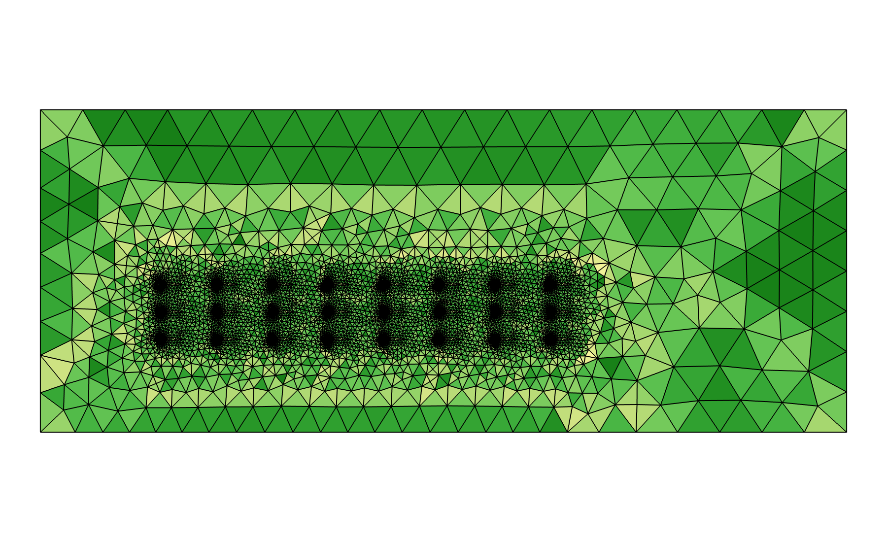

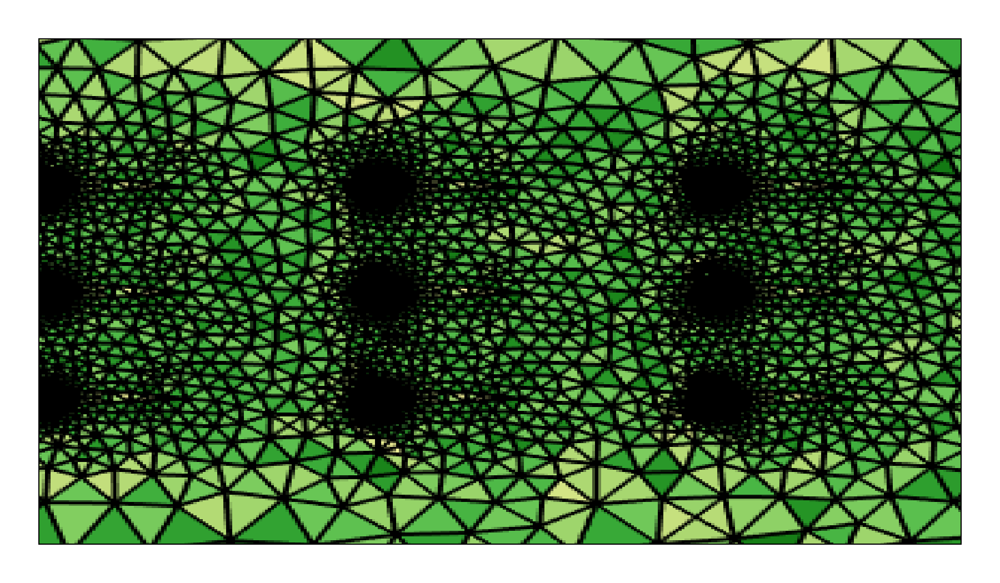

## 3.4 参数化工况设计与CFD样本生成

### 3.4.1 拉丁超立方采样方法

为了在多维参数空间中获取具有代表性的样本分布，本文采用拉丁超立方采样（Latin Hypercube Sampling, LHS）方法进行工况设计。拉丁超立方采样是一种分层随机抽样方法，其核心思想是将每个输入参数的取值范围等分为N个互不重叠的区间（N为样本总数），然后在每个区间内随机抽取一个样本值，最后将各参数的样本值随机组合形成多维样本点。

相较于简单的随机抽样，拉丁超立方采样能够保证每个参数在其取值范围内实现均匀覆盖，避免了纯随机抽样可能出现的样本聚集和局部空缺问题。相较于均匀网格采样，拉丁超立方采样的样本数量不随参数维度呈指数增长，在高维空间中具有显著的效率优势。

本文采用七参数设计框架描述翼型管阵列构型，参数包括最大弯度Ta、最大弯度位置Twa、最大厚度Tb、横向间距Ts、纵向间距Tt、错排偏移Tad以及翼型整体倾斜角$\theta_g$。其中，Ta、Twa和Tb控制翼型截面外形，Ts、Tt和Tad控制阵列排布，$\theta_g$控制翼型相对来流方向的安装姿态。需要说明的是，现有正式训练与优化所用COMSOL批量样本来自原有参数化脚本，其真实标签覆盖$\theta_g=0^\circ$子空间；七参数框架用于统一后续几何掩码生成、代理模型输入和优化接口。本文已补充35组非零倾斜角样本用于轻量评估，后续仍需进一步扩展样本规模后再纳入正式训练和优化。

各参数的取值范围根据工程实际和几何可行性确定。参数范围的选择遵循以下原则：（1）保证所有参数组合均能生成有效的几何模型，即不存在管体之间相互干涉或重叠的情况；（2）覆盖足够宽的设计空间，使样本具有充分的多样性；（3）参数上限和下限之间存在合理的跨度，一般上限为下限的2~5倍。

最终确定生成500组样本。该样本规模的确定基于以下考量：（1）参数空间维度较高，拉丁超立方采样需要保证各变量区间具有基本覆盖；（2）部分样本可能因几何冲突或计算不收敛而失效，需要留有一定余量；（3）受限于计算资源，500组是在精度和效率之间的折中选择。实际有效样本数量以标签文件统计结果为准。由于当前标签中$\theta_g$尚未变化，本阶段数据可视为七参数框架下的无倾斜角子集。

### 3.4.2 批量仿真计算方法

500组工况样本的批量仿真通过COMSOL Java API实现自动化执行。COMSOL Multiphysics提供了完整的Java应用程序接口（Application Programming Interface），允许用户通过编写Java程序对COMSOL模型文件进行参数修改、网格生成、求解计算和结果后处理等全流程操作。

批量仿真的具体流程如下：

（1）参数文件读取：程序首先读取预先通过LHS生成的参数文件（CSV格式），该文件包含500组工况的七参数字段；本阶段批量CFD样本中$\theta_g$固定为0。

（2）几何模型参数化重建：对于每组工况，程序根据当前参数自动更新COMSOL模型中的几何尺寸和阵列排布。翼型截面、管间距、交错偏移量和倾斜角均通过参数变量关联，修改参数后几何模型自动重新生成。

（3）网格自动生成：几何模型更新后，程序调用COMSOL的网格生成器自动重新划分网格。由于采用了映射网格策略，网格拓扑结构在不同工况间保持一致，仅网格节点的坐标和密度随参数变化而调整。

（4）求解计算：调用求解器进行稳态计算。程序中设置了最大迭代次数（500次）和收敛容差（10⁻⁶），并增加了收敛监控逻辑——若在最大迭代次数内未能收敛，则记录该工况为失败样本并跳过，继续计算下一个工况。

（5）结果后处理与数据导出：每个收敛成功的工况完成后，程序自动提取性能指标数据（Nu数、摩擦因子f等），并导出流场云图（PNG格式，分辨率800×600像素），包括速度场、压力场和温度场的分布云图。

（6）日志记录：程序运行过程中记录每个工况的计算状态（成功/失败）、收敛迭代次数、计算耗时等信息，便于后续排查和补算。

整个批量计算过程以无人值守方式运行，通过COMSOL Server模式执行，无需图形界面。对于失败的工况样本，程序记录了失败原因，并在全部计算完成后进行汇总分析。

在Java程序的设计中，还加入了若干健壮性保障措施：（1）异常捕获机制——当某个工况的仿真过程中出现几何生成失败、网格划分异常或求解器不收敛等错误时，程序能够捕获异常并记录错误信息，而不是整体崩溃退出；（2）断点续算功能——程序在运行过程中将已完成工况的编号写入进度文件，若因意外中断（如断电、系统崩溃），重新启动程序后可从断点处继续计算，避免重复计算已完成的工况；（3）内存管理——每完成一个工况后显式调用COMSOL模型的清除函数，释放内存资源，防止长时间运行导致的内存泄漏问题。这些工程化措施有效保障了500组工况批量计算的顺利完成。

### 3.4.3 数据提取与后处理

每个成功收敛的仿真工况需要提取以下数据：

（1）性能指标标量数据：

努塞尔数Nu是衡量对流换热强度的无量纲参数，定义为Nu = hL/k_f，其中h为平均对流换热系数，L为特征长度（取翼型管弦长），k_f为流体导热系数。在数值仿真中，Nu通过对翼型管壁面上的热流密度积分计算得到。具体地，Nu = (1/A_w)∫(q_w·L/k_f·(T_w - T_ref))dA，其中A_w为管壁面积，q_w为壁面局部热流密度，T_w为壁面温度，T_ref为参考温度（取入口温度T_in）。

摩擦因子f表征流动阻力的大小，本文按后处理脚本定义为f = ΔP/(0.5ρu_in²)，其中ΔP为进出口总压降。

综合性能评价因子η = (Nu/Nu_0)/(f/f_0)^(1/3)，用于评估换热增强与阻力增加之间的综合效益，其中Nu_0和f_0为基准工况的对应值。

（2）流场云图图像数据：

每个工况导出速度场、压力场和温度场的彩色分布云图，图像格式为PNG，分辨率为800×600像素。云图采用统一的色彩映射方案（jet色图），使得不同工况的图像具有可比性。速度场的范围根据入口速度自适应调整，温度场的范围在280~360 K之间归一化，压力场的范围根据工况自适应调整。

（3）几何掩码图像数据：

为使代理模型能够在优化阶段直接由候选参数完成预测，本文额外由七参数自动生成翼型阵列几何掩码图。该掩码图不来自CFD求解结果，而是根据NACA翼型外形、管阵列间距、错排偏移和倾斜角直接绘制得到，用于表示翼型固体区域、流体通道和阵列空间拓扑。第4章和第5章的七参数几何掩码代理模型以参数向量和几何掩码图作为输入；速度、压力和温度云图只用于机理解释、旧版CFD云图模型对比和COMSOL复核展示。

## 3.5 多模态数据集构建

### 3.5.1 数据集结构

本研究构建的数据集是一种多模态结构化数据集，每个样本包含以下四个层面的数据：

（1）几何参数向量（7维）：即[Ta, Twa, Tb, Ts, Tt, Tad, $\theta_g$]，作为模型的输入特征。这些参数共同描述翼型截面、阵列排布和安装姿态。当前CFD标签中$\theta_g$固定为0，因此该维度在本阶段主要用于保持后续优化接口的一致性。

（2）性能指标标量（3维）：即[Nu, f, η]，作为模型的预测目标。这三个指标从不同角度评价了散热器的流热性能。

（3）流场云图图像（3张/样本）：包括速度场云图、压力场云图和温度场云图，每张图像分辨率为800×600像素的RGB彩色图像。这些图像蕴含了丰富的流场空间结构信息，主要用于机理解释、旧版CFD云图PI-CNN-CBAM对比模型以及最终复核结果展示。需要强调的是，第4章用于差分进化优化的七参数几何掩码代理模型不以CFD云图作为推理输入。

（4）参数化几何掩码图（1张/样本）：由七参数直接生成的二维几何掩码图，默认分辨率为64×64像素。该掩码图用于第4章和第5章的CNN图像分支，使模型在优化阶段无需预先获得候选结构的CFD云图。

全部样本的标量数据（几何参数和性能指标）存储于统一的CSV标签文件中，CFD云图和几何掩码图分别存储在对应的结果目录和掩码目录中，并通过样本编号进行关联。训练、验证和测试划分记录在七参数项目的数据划分文件中，保证不同模型之间采用一致的数据划分。

### 3.5.2 数据预处理与归一化

数据预处理是确保神经网络训练效果的重要环节。本文实施了以下预处理步骤：

（1）几何参数标准化：将七参数向量分别进行Z-score标准化处理，即x_norm = (x - μ)/σ，其中μ和σ分别为各参数在训练集中的均值和标准差。对于当前固定为0的$\theta_g$列，预处理程序采用零方差保护，避免除零错误。标准化统计量仅由训练集计算并统一应用于验证集和测试集，严格防止数据泄露。

（2）性能指标标准化：Nu数和摩擦因子f同样采用Z-score标准化处理。标准化统计量从训练集中计算得到，并统一应用于验证集和测试集。

（3）几何掩码图预处理：由参数生成的几何掩码图统一缩放至模型输入尺寸，并转换为单通道灰度张量。掩码像素值归一化到[0, 1]区间，使CNN分支能够学习翼型边界、管间通道和错排区域等空间拓扑特征。

（4）CFD云图预处理：速度、压力和温度云图主要用于机理解释、旧版CFD云图模型对比和复核结果展示，不作为第4章七参数几何掩码代理模型的优化输入。若用于旧版云图模型训练，则按对应模型脚本要求进行缩放和像素归一化。

### 3.5.3 样本质量检查

在数据集正式使用前，需要对所有样本进行质量检查，主要内容包括：

（1）仿真收敛性检查：核查每个样本的求解器收敛情况，对求解失败、导图失败或指标缺失的样本进行标记和排查。当前正式标签文件保留500个有效样本。

（2）物理合理性检查：检验性能指标的数值范围是否合理。例如，Nu应为正值且处于合理范围（通常1~100），f应为正值且量级合理（通常10⁻²~10¹），η应为正值。对异常值的样本进行标记和排查。

（3）图像完整性检查：确认用于机理展示的CFD云图和用于代理模型训练的几何掩码图均成功生成，文件完整且能够按样本编号正确关联。

（4）数据集划分：将经过质量检查后的500个有效样本划分为训练集、验证集和测试集，数量分别为375、75和50。各模型统一采用同一划分文件，保证模型对比具有一致的数据基础。由于$\theta_g$在当前数据中固定为0，其分布在各子集中保持一致。测试集在模型训练过程中不参与参数更新，仅用于最终模型评估，以减少数据泄漏对结果判断的影响。

## 3.6 典型流场特征分析

为了深入理解翼型管翅片散热器的流动与传热机理，本节选取若干典型工况对流场特征进行详细分析。通过对速度场、温度场和压力场的可视化分析，揭示翼型管阵列内部流动的基本物理机制。

### 3.6.1 速度场

从典型工况的速度场分布云图可以观察到以下特征：

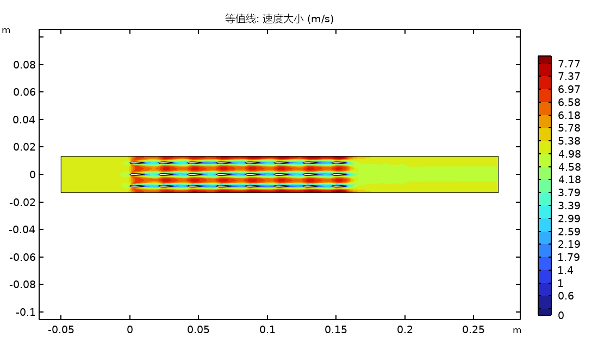

（1）来流加速效应：空气从入口进入管间通道后，由于流通截面积减小（管束的阻塞效应），流速显著增大。在翼型管的最大厚度截面处，通道最窄，流速达到局部最大值。对于基准工况（u_in = 2 m/s），管间通道的最大流速可达入口速度的1.5~2.0倍，即约3.0~4.0 m/s。

（2）尾迹区域：在每排翼型管的下游均形成了低速尾迹区域。尾迹的形态和长度与翼型形状、间距参数和错排偏移密切相关。在紧密排列的工况下，前排管的尾迹会影响后排管附近的来流分配，形成尾迹-管壁干涉，这种干涉效应可能增强局部扰动和换热，但也会增大流动阻力。

（3）速度分布的周期性趋势：由于采用了多排管阵列排布，从第2~3排管开始，速度场在纵向呈现准周期性分布特征，即相邻排管间的速度分布形态基本相似。这一特征表明管束内部的流动在经历入口效应后较快达到周期性充分发展状态。

（4）横向分布不均匀性：横向三列管的速度分布并非完全对称。中间列管两侧的流道对称性较好，而外侧列管的外侧流道由于边界效应流速较低。这种不均匀性在横向间距较大时更为显著。

值得注意的是，速度场中还可以观察到翼型管截面形状对流动的引导效应。与圆管相比，翼型管的流线型外形有利于减弱前缘滞止和后缘宽尾迹，使管后低速区相对收窄。这一特性是翼型管换热器相较于传统圆管换热器在流动阻力方面具有优势的物理基础。

### 3.6.2 温度场

温度场的分布特征直接反映了换热器的散热效果：

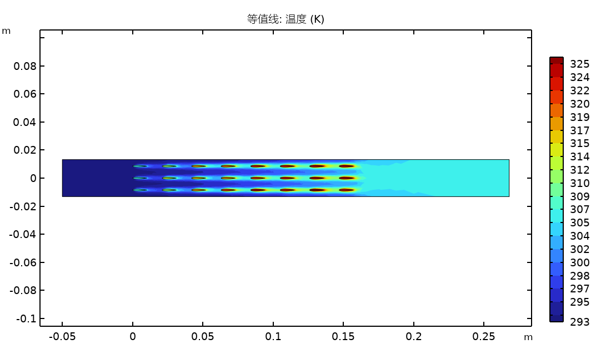

（1）热源区域高温集中：施加体积热源的固体域底部温度最高，在典型工况下可达330~350 K，较入口温度升高30~50 K。高温区域集中在热源附近，温度沿翅片高度方向逐渐降低，体现了铝翅片良好的导热性能。

（2）翅片温度梯度：由于铝的导热系数高达237 W/(m·K)，翅片内部的温度分布较为均匀，翅片效率较高。从翅片根部（靠近热源处）到翅片端部（远离热源处），温度降幅通常在5~15 K范围内。翅片端部温度与周围流体温度的差值较小，说明翅片的远端区域对换热的贡献相对有限。

（3）流体温度分层：在流动方向上，流体温度沿程逐渐升高，表现为下游排管周围流体的温度高于上游排管。这一现象的物理本质是：上游排管的对流换热使流体温度升高，导致下游排管的有效温差（T_w - T_f）减小，换热驱动力降低。因此，下游排管的局部换热系数通常低于上游排管。

（4）尾迹区域的热混合：管后尾迹区域由于回流和涡旋运动，流体混合较为剧烈，温度分布相对均匀。这种热混合效应有利于提高整体的换热效率，但也意味着温度梯度（即换热驱动力）在尾迹区域被削弱。

### 3.6.3 压力场

压力场的分布与流动阻力特性密切相关：

（1）前缘驻点高压区：在每排翼型管的前缘（驻点）处，流速骤降至零，动能转化为压力能，形成局部高压区域。驻点压力系数Cp接近1.0，是流动阻力的主要来源之一。

（2）管间通道加速降压：流体在管间狭窄通道中加速流动，根据伯努利原理，该区域的静压相应降低，形成低压区域。管间通道中的最低压力出现在最大流速处（即翼型管最大厚度截面对应的位置）。

（3）后缘低压尾迹区：翼型管后缘由于流动分离，形成低压尾迹区域。前缘高压和后缘低压之间的压差构成了压差阻力的主要分量。翼型管的流线型设计能够有效推迟流动分离、缩小尾迹区域，从而降低压差阻力。

（4）沿程压力递减：从入口到出口，截面平均压力呈递减趋势。每排管都会引入局部压力损失，因此增加排数通常会同时增大换热面积和流动阻力。根据当前500组二维标签统计，进出口压降主要分布在0.373~0.695 Pa范围内，平均值约为0.516 Pa；第5章优化结构的独立复核压降为1.307 Pa，说明优化候选结构在强化换热的同时引入了更高的阻力代价。本文后续评价不单独以压降最小为目标，而是通过Nu、f和综合评价因子η共同判断换热收益与阻力代价。

## 3.7 参数敏感性分析

### 3.7.1 分析方法

为了系统地评估设计参数对散热器性能的影响程度，本文采用两种互补的参数影响分析方法。需要说明的是，当前样本中$\theta_g$固定为0，因此本节定量排序主要反映Ta、Twa、Tb、Ts、Tt和Tad六个实际变化参数的边际影响；$\theta_g$的影响需在补充非零倾斜角样本后进一步评估。本节结果属于基于已有样本分布的统计敏感性分析，不能等同于固定其余参数时的严格单因素CFD扫描。

（1）分箱均值响应曲线法（Binned-Mean Response Curve）：对于每个参数，采用等频分箱方法将样本划分为6个区间，在每个区间内计算所有样本的性能指标均值，然后以参数区间均值为横坐标、性能指标均值为纵坐标绘制响应曲线。该方法能够直观展示参数与性能指标之间的边际变化趋势，并通过区间平均减弱样本离散波动的影响。由于其他参数并未固定，该曲线只能解释样本统计趋势，不能作为严格单因素响应曲线。

（2）随机森林特征重要性排序法（Random Forest Feature Importance）：以设计参数为输入特征、性能指标（Nu、f或η）为目标变量，训练随机森林回归模型，并提取各特征的重要性得分。随机森林是一种集成学习方法，能够自动捕获参数之间的交互效应和非线性关系，其特征重要性排序为参数影响程度的全局评价提供了定量依据。

两种方法各有优势：分箱均值法侧重揭示参数边际趋势和方向，随机森林法则侧重提供参数影响的全局排序。二者结合可为后续优化变量筛选提供依据，但仍需注意其结论受样本分布、参数相关性和训练数据覆盖范围影响。

随机森林模型的具体配置如下：决策树数量设置为300棵，随机种子固定为42，模型在全部有效样本上训练并提取基于节点不纯度下降的特征重要性；对于回归树，该重要性可理解为各参数对均方误差下降贡献的归一化度量。由于$\theta_g$在当前样本中无变化，重要性排序仅展示六个实际变化参数的贡献。

### 3.7.2 各参数对Nu的影响

基于分箱均值响应曲线的分析结果，各参数对努塞尔数Nu的影响如下：

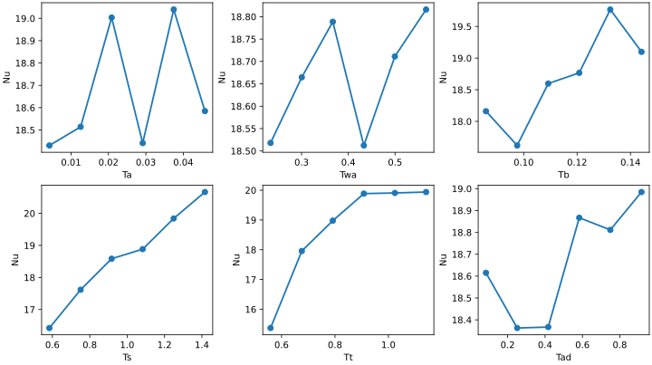

随机森林结果显示，纵向排列间距Tt对Nu的统计贡献最高，其重要性得分为0.540；横向管间距Ts次之，重要性得分为0.366。结合分箱均值响应曲线可见，阵列间距类参数对换热能力的影响明显强于弯度位置和交错偏移。其物理原因在于，Tt和Ts直接改变管间流通面积、尾迹恢复距离和后排翼型附近的来流分配，从而影响边界层更新和热尾迹扩散。

最大厚度Tb对Nu具有一定影响，重要性得分为0.073。厚度增大会改变阻塞比和局部绕流加速程度，但其影响弱于阵列间距。最大弯度Ta、最大弯度位置Twa和交错偏移Tad对Nu的全局重要性较低，说明在当前样本范围内，换热能力主要由阵列尺度和流道组织方式决定。

需要注意的是，分箱曲线中的局部波动反映的是样本均值趋势，不应解读为“某一参数独立增加必然导致Nu单调变化”。若需获得严格单因素响应，应固定其余参数并补充COMSOL扫描或使用代理模型进行受控扫描后再进行CFD复核。

### 3.7.3 各参数对f的影响

摩擦因子f反映了流动阻力的大小，各参数的影响规律如下：

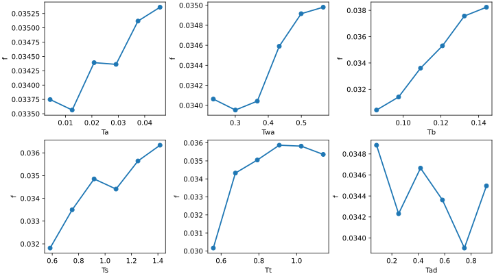

随机森林结果显示，最大厚度Tb对摩擦因子f的影响最显著，重要性得分为0.528。该结论具有明确物理含义：Tb直接决定翼型管迎风厚度和局部阻塞比，厚度增大时流道收缩更明显，局部加速、形阻和尾迹损失均可能增加，因此对流动阻力具有主导影响。

纵向排列间距Tt对f的影响位居第二，重要性得分为0.270。Tt改变相邻排翼型管之间的尾迹恢复距离和排间加减速过程，是控制流动阻力的重要布局参数。横向管间距Ts的重要性得分为0.147，也会通过改变横向流通面积影响压降，但在当前样本中其贡献低于Tb和Tt。

最大弯度Ta、最大弯度位置Twa和交错偏移Tad对f的重要性较低。该结果并不意味着这些参数完全无影响，而是说明在当前样本覆盖范围内，阻力变化主要由翼型厚度和阵列间距控制。

### 3.7.4 各参数对η的影响

综合性能评价因子η = (Nu/Nu_0)/(f/f_0)^(1/3)综合考虑了换热增强与阻力增加之间的权衡关系。各参数对η的影响如下：

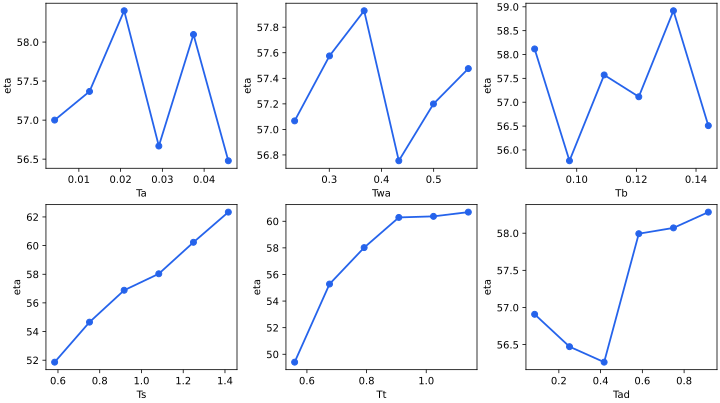

随机森林结果显示，纵向排列间距Tt对η的影响最强，重要性得分为0.569；横向管间距Ts次之，重要性得分为0.378。该结果说明，在当前样本中，综合性能主要由阵列间距控制，而不是由单一翼型形状参数控制。

从物理角度看，Tt和Ts同时影响换热与压降：较小间距可能增强局部扰动和换热，但也会提高阻力；较大间距有利于降低压降和尾迹干涉，但可能削弱换热强度。因此，η对阵列间距表现出明显的折中依赖关系。

最大厚度Tb、交错偏移Tad、最大弯度Ta和最大弯度位置Twa对η的重要性相对较低。其中Tad在局部样本区间内仍可能改变流动路径和热尾迹形态，但其全局统计贡献小于Tt和Ts。后续若要进一步评价Tad的独立作用，应结合代理模型进行受控扫描，并选取代表性点回到COMSOL复核。

### 3.7.5 参数影响排序

基于随机森林特征重要性的分析结果，各参数对三个性能指标的影响排序汇总如表3-2所示。

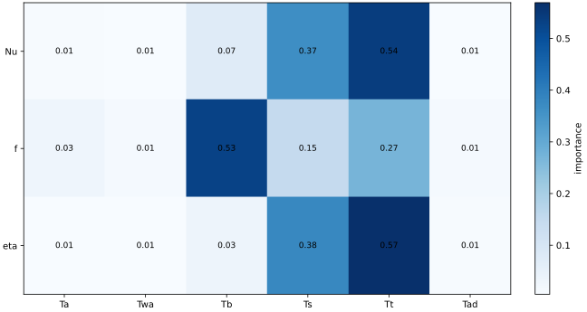

表3-2 随机森林特征重要性排序

| 排序 | 对Nu的影响 | 对f的影响 | 对η的影响 |
|------|-----------|-----------|-----------|
| 1 | Tt (0.540) | Tb (0.528) | Tt (0.569) |
| 2 | Ts (0.366) | Tt (0.270) | Ts (0.378) |
| 3 | Tb (0.073) | Ts (0.147) | Tb (0.032) |
| 4 | Ta (0.009) | Ta (0.030) | Tad (0.009) |
| 5 | Tad (0.006) | Tad (0.012) | Ta (0.007) |
| 6 | Twa (0.006) | Twa (0.012) | Twa (0.005) |

表中括号内的数值为归一化的随机森林回归特征重要性得分（所有参数得分之和为1.00）。从排序结果可以得出以下关键结论：

（1）Tt（纵向排列间距）是对Nu影响最大的参数，重要性得分为0.540；Ts（横向管间距）位居第二，得分为0.366。二者合计贡献超过0.90，说明阵列间距是控制换热能力的主要因素。

（2）Tb（最大厚度）是对f影响最大的参数，重要性得分为0.528。该结果表明翼型厚度通过改变阻塞比和局部形阻显著影响流动阻力。

（3）Tt和Ts是对η影响最大的两个参数，重要性得分分别为0.569和0.378。综合性能受换热收益和压降代价共同制约，因此布局参数对η的控制作用最强。

（4）Twa（最大弯度位置）对三个性能指标的影响均最小，重要性得分均接近0。这一结果表明在本文研究的参数范围内，Twa的变化对散热器综合性能的统计贡献相对次要。

（5）Ta（最大弯度）对三个指标的贡献均较低；Tb对f贡献显著，但对η贡献较低，说明厚度参数更偏向影响流动阻力而非综合性能提升。

上述敏感性分析结果为后续参数优化设计提供了重要指导：在优化过程中应重点关注Tt和Ts两个布局间距参数，同时关注Tb对流动阻力的影响。Ta、Twa和Tad在当前样本中的全局统计重要性较低，但仍可能通过局部流场结构影响特定构型的性能。不同参数对Nu、f和η的影响排序差异表明，换热性能、流动阻力和综合性能之间存在竞争关系，单目标优化难以兼顾所有指标。因此，后续研究可在Pareto多目标框架下寻找换热与阻力的折中方案，并用受控单因素扫描补强统计敏感性分析的物理解释。

## 3.8 本章小结

本章围绕翼型管翅片散热器的数值仿真模型建立、参数化样本生成和多维度分析展开，为后续基于物理信息卷积神经网络的代理模型构建奠定了数据基础。主要工作和结论如下：

（1）基于COMSOL Multiphysics 6.3平台建立了3×8翼型管阵列的二维流固共轭传热数值模型。模型包含空气流体域和铝翅片固体域，通过共轭传热边界条件实现流固耦合。设定了均匀速度入口（u_in = 2 m/s，T_in = 300 K）、压力出口、无滑移壁面和等效体积热源（q_v = 1×10⁷ W/m³）等边界条件，在Re~1000的层流条件下进行稳态求解。

（2）设计了映射四边形网格划分策略，在翼型管壁面附近设置5~8层边界层加密网格，并对尾迹区域进行局部加密，以提高壁面边界层和管后尾迹结构的解析能力。当前批量样本标签主要保存几何参数、Nu、f、压降、温升和换热量等结果，尚未保存同一工况在粗、中、细三套网格下的完整对比数据。因此，本章将网格部分作为网格策略和局部加密方法说明，不写成已完成的定量网格无关性验证；后续若用于正式工程定量结论，应补充典型工况的网格无关性表格。

（3）采用拉丁超立方采样方法在七参数框架下生成500组工况样本，并通过COMSOL接口实现自动化批量仿真。现有真实标签覆盖$\theta_g=0^\circ$子空间，因此本阶段结果主要用于建立无倾斜角条件下的代理模型和参数影响分析。

（4）构建了包含几何参数向量、性能指标标量、流场云图图像和参数化几何掩码图的多源数据集。数据集划分为375个训练样本、75个验证样本和50个测试样本。其中，流场云图用于机理解释、旧模型对比和COMSOL复核展示；七参数优化代理模型使用参数向量和由参数直接生成的几何掩码图作为输入。

（5）典型流场特征分析揭示了翼型管阵列内部流动的基本物理机制：速度场呈现管间加速和管后尾迹特征，温度场表现为热源区域高温集中和沿程升温趋势，压力场则体现为前缘驻点高压和后缘低压尾迹的交替分布。

（6）参数敏感性分析结果表明：纵向排列间距Tt对Nu和η的统计贡献最大，随机森林重要性得分分别为0.540和0.569；最大厚度Tb对f的影响最大，重要性得分为0.528；横向管间距Ts对Nu和η也具有较高贡献。该结果说明阵列布局参数主导换热和综合性能，翼型厚度参数主导流动阻力，为后续代理模型训练和参数优化设计提供了物理先验。

# 第4章 基于多模型对比的翼型管翅片散热器流热性能预测与消融分析

## 4.1 引言

翼型管翅片散热器的流热性能预测涉及多个几何参数与复杂流场、温度场之间的非线性映射关系。在工程设计实践中，努塞尔数（Nu）和摩擦因子（f）是衡量散热器换热效率和流动阻力的两个核心指标，其数值取决于管间距、翅片间距、翅片厚度、翅片高度、管排数等几何参数以及迎面风速等运行工况参数的综合作用。传统的经验关联式通常基于有限的实验数据拟合得到，其适用范围受限于关联式建立时的参数区间，难以推广至更广泛的设计空间。数值模拟方法虽然能够在较宽的参数范围内提供高精度的预测结果，但单次计算流体力学（CFD）模拟耗时较长，在进行大规模参数优化或实时设计决策时面临计算成本不可接受的困境。因此，构建兼具高精度和高效率的代理预测模型，对于散热器设计的工程实践具有重要的应用价值。

近年来，深度学习技术在工程性能预测领域展现出显著优势，多层感知机、卷积神经网络等架构已在航空航天、能源动力等多个工程领域的性能预测任务中取得了较好效果。然而，不同网络架构对物理量的表征能力和泛化特性存在本质差异，模型的预测精度不仅取决于网络结构的选取，还与输入特征的构造方式、训练数据的规模和质量以及正则化策略密切相关。对于翼型管翅片散热器这一特定对象，其性能预测面临以下挑战：首先，输入信息具有多模态特性，既包含结构化的七参数向量，又包含由参数直接生成的几何掩码图像；其次，CFD数值模拟的计算成本限制了训练样本的规模，使得深度学习模型面临小样本过拟合风险；最后，Nu和f分别反映热学和力学特性，对输入特征的敏感度存在差异，要求模型能够同时捕获换热增强和流动阻力两类机制。

针对上述挑战，本章构建以七参数向量和几何掩码图为核心输入的预测模型，形成消融实验体系。首先，以仅包含七参数向量的多层感知机（MLP）作为基线模型，建立性能预测的参数基准。其次，以由七参数直接生成的翼型阵列几何掩码图作为CNN输入，验证几何拓扑图像对预测精度的贡献。在此基础上，构建参数流与几何图像流的双输入融合模型，使低维参数约束和高维空间拓扑信息共同参与预测。最后，引入CBAM注意力机制和物理一致性约束，构建参数-几何掩码PI-CNN-CBAM模型，用于后续差分进化优化。

通过上述模型在统一数据集上的系统对比实验，本章旨在回答以下关键问题：（1）七参数向量本身能否建立可靠的性能映射？（2）由参数直接生成的几何掩码图是否能够补充空间拓扑信息？（3）参数流与几何图像流融合后是否优于单一输入模型？（4）注意力机制和物理一致性约束能否进一步改善预测精度和物理合理性？上述问题的系统解答将为后续差分进化参数优化提供可靠代理模型基础。

## 4.2 模型架构设计

### 4.2.1 纯几何MLP基线模型

为建立性能预测的基线参考，本文首先设计了一个仅以几何参数为输入的多层感知机模型（MLP基线）。该模型的输入为描述翼型管翅片散热器几何构型的七参数向量，即最大弯度、最大弯度位置、最大厚度、横向间距、纵向间距、错排偏移和翼型整体倾斜角。这些参数从翼型截面几何、管阵列排布和安装姿态三个维度描述散热器构型，是参数化建模中的核心自变量。

基线MLP采用多层全连接结构。输入层将七参数向量经线性变换和激活函数映射至隐层空间，随后通过多个中间层逐步提取参数间的非线性交互关系，最终由二维输出层同时预测努塞尔数Nu和摩擦因子f，实现多任务联合预测。在隐层之后引入批归一化（Batch Normalization）和Dropout正则化，以加速训练收敛并抑制有限样本条件下的过拟合倾向。

其设计动机在于：仅利用七参数信息而不借助任何图像特征，评估纯参数化建模对散热器性能预测能力的上限。该基线模型一方面为后续引入几何掩码图的模型提供量化基准，另一方面也验证七参数对Nu和f的基本预测能力。

### 4.2.2 参数-几何掩码融合模型

为了充分利用参数化几何中的空间拓扑信息，本文设计了参数-几何掩码融合模型。该模型在输入端同时融合两类异构特征源：七参数向量和由参数直接生成的几何掩码图，旨在通过参数数值约束与空间拓扑表达的互补性提升预测精度。

在几何参数特征方面，与基线模型相同，提取七参数向量作为输入。在几何图像特征方面，本文由同一组参数直接生成翼型阵列几何掩码图，而不是输入候选结构的CFD云图。几何掩码图以二值或灰度图形式表示流体域、翼型管固体域和阵列排布位置，使CNN能够学习管间通道、错排路径和局部阻塞区域等空间拓扑信息。与CFD云图相比，几何掩码可在优化阶段由参数即时生成，不需要预先求解流场，因此适合作为差分进化优化中的代理模型输入。

两类特征分别通过参数MLP分支和几何CNN分支提取后，在融合层进行拼接，再送入回归预测头输出Nu和f。该双输入结构的意义在于同时保留参数的精确数值约束和几何图像的空间拓扑表达。

参数-几何掩码融合模型的核心思想在于：参数向量负责提供连续数值约束，几何掩码负责提供空间拓扑约束。这样既避免优化阶段依赖CFD云图，又保留了CNN从图像结构中提取局部通道和错排特征的能力。

### 4.2.3 PI-CNN-CBAM双流模型

在普通参数-几何掩码融合模型基础上，本文进一步设计PI-CNN-CBAM双流预测模型。该模型仍采用参数流与图像流并行结构，但图像流输入为几何掩码图，而不是速度、压力或温度云图。这样可以保证优化阶段只需给定候选参数，即可自动生成几何图像并完成性能预测，不需要先进行CFD求解。

图像流部分由CNN骨干网络提取几何掩码中的空间拓扑特征。卷积层负责识别翼型边界、管间通道、错排路径和局部阻塞区域；池化层用于压缩空间维度并增强平移鲁棒性；CBAM模块进一步对通道和空间位置进行加权，使模型更关注对Nu、f和η预测有贡献的几何区域。

参数流部分为独立的参数MLP分支，将七参数向量映射为参数特征向量。该分支保留连续参数数值信息，弥补几何掩码图在离散化过程中可能损失的尺度细节。双流融合阶段将参数特征与图像特征拼接，并通过回归预测头同时输出Nu和f。随后根据预测Nu和f计算η，并在训练中加入η一致性约束。

### 4.2.4 CBAM注意力与全局池化

在参数-几何掩码融合模型中，CNN分支处理的是由七参数直接生成的翼型阵列几何掩码图。该图像不包含CFD求解后的速度、压力或温度数值，而是表达翼型管位置、通道形态、错排路径和固体阻塞区域等几何拓扑信息。为了使网络在有限样本条件下更稳定地提取有效空间特征，本文在几何CNN分支中采用卷积块、全局池化和CBAM注意力模块。

全局池化将卷积特征图压缩为通道级特征向量，降低后续全连接层的参数规模，避免模型在约500组样本条件下过度依赖局部像素位置。CBAM模块由通道注意力和空间注意力组成：通道注意力用于筛选对性能预测贡献更高的特征通道，空间注意力用于突出几何掩码中与通道收缩、错排扰流和尾迹发展相关的位置区域。该设计使几何图像分支不仅能识别翼型轮廓，还能在融合阶段向预测器提供更有判别力的阵列拓扑特征。

### 4.2.5 物理一致性约束（PI-CNN-CBAM）

在普通参数-掩码融合模型基础上，本文进一步构建PI-CNN-CBAM模型。该模型不要求候选结构具有CFD云图输入，而是通过预测输出之间的物理一致性对网络进行约束。由于综合评价因子$\eta$由$Nu$和$f$计算得到：

$$\eta = \frac{Nu/Nu_0}{(f/f_0)^{1/3}}$$

因此，模型在训练时除最小化$Nu$和$f$预测误差外，还对由预测$Nu$、预测$f$计算得到的$\eta$与真实$\eta$之间的偏差施加约束。联合损失可写为：

$$L = L_{Nu} + L_f + \lambda_\eta L_\eta$$

其中，$L_{Nu}$和$L_f$分别为Nu与f的回归损失，$L_\eta$为综合性能因子一致性损失，$\lambda_\eta$为权重系数。该约束不等同于直接求解控制方程残差，但能够把换热收益与阻力代价的耦合关系写入训练目标，避免模型只优化单一输出而破坏综合评价指标的一致性。

需要说明的是，旧版基于CFD云图的PI-CNN-CBAM模型仍可用于机理解释，其中FieldHead温度场重建和Laplacian损失能够说明流场图像、注意力机制和物理约束的作用；但该模型推理阶段依赖CFD云图，不能作为差分进化优化中的主代理模型。本文第5章采用的是参数-几何掩码PI-CNN-CBAM模型。

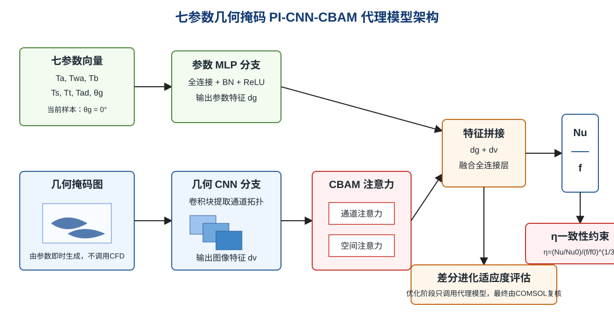

## 4.3 训练设置与收敛分析

### 4.3.1 公共训练配置

为保证各模型之间具有可比性，本文对所有模型采用统一的数据集划分和预处理策略。完整数据集包含500个有效样本，每个样本对应一组特定的几何参数组合及其CFD数值模拟结果。数据集被分为训练集（375个样本）、验证集（75个样本）和测试集（50个样本），划分比例为75%、15%和10%；划分文件保存在七参数流程目录内。验证集用于训练过程中的模型选择（如早停判断和学习率调度），测试集在模型训练过程中不参与参数更新，仅用于最终性能评估，以减少训练数据泄漏对结果判断的影响。

在数据预处理方面，对七参数向量和两个目标变量（Nu和f）均执行Z-score标准化处理。具体而言，计算训练集上各变量的均值和标准差，对训练集、验证集和测试集中的所有变量统一执行标准化变换x'=(x-μ)/σ，使各变量具有零均值和单位方差的分布特性。当前$\theta_g$列固定为0，预处理时采用零方差保护。几何掩码图像进行像素归一化处理，将像素值映射至[0,1]区间。

所有基于PyTorch框架实现的模型均采用Adam优化器进行参数更新。Adam优化器结合了动量法和自适应学习率调节机制，在深度学习训练实践中表现出良好的收敛速度和对超参数的鲁棒性。学习率调度策略采用StepLR阶梯衰减方案，即在训练过程中每隔固定轮次将学习率乘以预设的衰减因子（如0.5或0.1），使模型在训练后期以较小的学习率进行精细调整。同时实施早停策略（Early Stopping），以验证集上的损失函数值为监控指标，当验证损失在连续若干轮次（耐心值）内未出现改善时终止训练，并回溯至验证损失最低时的模型权重。早停策略的引入有效防止了训练过度导致的过拟合，并自动确定了最优训练轮次。

### 4.3.2 各模型训练参数

各模型采用相同的数据划分和目标标准化方法，差别仅体现在输入模态和网络结构上。表4-1汇总了七参数几何掩码代理模型消融实验的主要设置。

表4-1 七参数几何掩码代理模型训练配置

| 模型 | 输入信息 | 主要结构 | 输出目标 |
|------|----------|----------|----------|
| 参数MLP | 七参数向量 | 多层全连接网络 | Nu, f |
| 几何掩码CNN | 几何掩码图 | CNN + 全局池化 | Nu, f |
| 参数-掩码融合模型 | 七参数向量 + 几何掩码图 | 参数MLP + 几何CNN + 融合回归头 | Nu, f |
| PI-CNN-CBAM | 七参数向量 + 几何掩码图 | 融合模型 + CBAM + η一致性约束 | Nu, f |

四类模型均在同一数据划分和同一评价指标下训练与测试。消融实验保留了汇总指标、测试集预测散点图、损失曲线和预测明细，用于保证结果可复核。

### 4.3.3 损失函数收敛分析

各模型的训练损失和验证损失曲线反映了不同输入模态的学习难度。参数MLP的训练过程最稳定，说明显式几何参数与Nu、f之间存在较强映射关系。几何掩码CNN仅依赖图像拓扑信息，收敛速度相对较慢，尤其对f的预测误差较大，表明压降相关信息更依赖连续尺度和局部流动细节。参数-掩码融合模型将两类信息共同输入后，整体收敛稳定性接近参数MLP。PI-CNN-CBAM因增加注意力模块和η一致性约束，训练过程略复杂，但在Nu和η指标上取得更优泛化结果。

## 4.4 消融实验与模型对比

### 4.4.1 测试集预测性能汇总

为系统评估不同输入模态和网络模块的贡献，本文在统一测试集上对七参数几何掩码代理模型开展消融实验。测试集样本不参与模型训练，用于减少数据泄漏对评估结果的影响。评估指标采用决定系数（R²）和平均绝对误差（MAE）。R²衡量模型对目标变量总变异的解释比例，越接近1表示预测值与真实值的线性相关性越强；MAE衡量预测值与真实值之间的平均绝对偏差，越小表示预测精度越高。表4-2汇总了各模型在测试集上的性能指标。

表4-2 七参数几何掩码代理模型消融实验结果

| 模型 | Nu R² | Nu MAE | f R² | f MAE | η R² | η MAE |
|------|-------|--------|------|-------|------|--------|
| 参数MLP | 0.9776 | 0.2831 | 0.9554 | 0.000723 | 0.9787 | 0.01038 |
| 几何掩码CNN | 0.9547 | 0.3913 | 0.8702 | 0.001211 | 0.9729 | 0.01137 |
| 参数-掩码融合模型 | 0.9757 | 0.2997 | 0.9534 | 0.000766 | 0.9770 | 0.01069 |
| PI-CNN-CBAM | 0.9806 | 0.2860 | 0.9445 | 0.000864 | 0.9804 | 0.00997 |

从表4-2可以看出，七参数向量本身已经能够提供较强的性能预测能力，参数MLP在Nu和f预测上均达到较高R²。仅使用几何掩码图时，模型能够捕获阵列拓扑信息，但由于缺少显式参数数值约束，f预测精度明显下降。参数-掩码融合模型综合了两类信息，整体表现接近参数MLP。PI-CNN-CBAM在Nu和η预测上取得最高R²和最低η MAE，但f预测略低于参数MLP，说明当前物理约束和注意力机制主要强化换热相关特征，对阻力指标的增益有限。

### 4.4.2 K折交叉验证结果

为进一步评估小样本条件下模型结果的稳定性，本文对七参数PI-CNN-CBAM几何掩码代理模型开展5折交叉验证。每一折中，100个样本作为测试集，其余400个样本再划分为340个训练样本和60个验证样本。训练轮数、批量大小、学习率、物理一致性约束权重和输入图像尺寸均与消融实验保持一致。K折交叉验证的结果如表4-3所示。

**表4-3 七参数PI-CNN-CBAM模型5折交叉验证结果**

| 指标 | 均值 | 标准差 |
|------|------:|------:|
| Nu R² | 0.9652 | 0.0100 |
| Nu MAE | 0.3558 | 0.0624 |
| f R² | 0.9450 | 0.0135 |
| f MAE | 0.000777 | 0.000106 |
| η R² | 0.9663 | 0.0104 |
| η MAE | 0.0131 | 0.00235 |

从表4-3可以看出，PI-CNN-CBAM几何掩码代理模型在不同数据划分下保持了较稳定的预测能力，Nu、f和η的平均R²分别为0.9652、0.9450和0.9663，标准差均较小。这说明模型并非只在单一训练/测试划分上表现较好，而是在当前500组样本范围内具有一定泛化稳定性。需要说明的是，当前K折验证仍基于$\theta_g=0$子空间样本，因此其结论只能支持无倾斜角样本范围内的泛化能力，不能证明模型对非零倾斜角构型的预测可靠性。

### 4.4.3 非零倾斜角补充样本轻量评估

为检查第七参数$\theta_g$在代理模型中的实际引入价值，本文在不覆盖原始500组训练标签和正式消融结果的前提下，补充完成35组非零倾斜角二维COMSOL样本，$\theta_g$范围为-9.9317°至9.4690°。该补充样本只用于轻量评估，不作为表4-2和表4-3正式模型结果的替代。

轻量评估采用相同的参数-几何掩码代理模型结构，对比两种训练口径在非零$\theta_g$保留测试集上的表现：第一种模型仅使用原始500组$\theta_g=0$样本训练；第二种模型在原始样本基础上加入30组非零$\theta_g$样本训练。剩余5组非零$\theta_g$样本作为保留测试集，不参与训练和验证。评估结果如表4-4所示，完整结果记录保存在项目证据链中。

**表4-4 非零$\theta_g$轻量重训评估结果**

| 指标 | 仅原始500组训练 | 加入非零$\theta_g$训练 | 差值 |
|------|------:|------:|------:|
| Nu MAE | 13.5415 | 2.3140 | -11.2275 |
| Nu R² | -14.4238 | 0.3438 | +14.7676 |
| f MAE | 0.05894 | 0.007871 | -0.05107 |
| f R² | -5.1198 | 0.8431 | +5.9629 |

从表4-4可以看出，只使用$\theta_g=0$样本训练的模型在非零倾斜角构型上出现明显外推失效；加入30组非零$\theta_g$样本后，Nu和f的MAE均明显降低，说明补充倾斜角样本能够改善模型对安装姿态变化的适应性。需要强调的是，该测试集只有5组样本，结果只能作为继续补样和正式重训的工程判断依据，不能替代表4-2的消融实验或表4-3的K折交叉验证结论，也不能据此单独讨论非零$\theta_g$对尾迹和换热性能的完整敏感性规律。

### 4.4.4 Nu预测结果分析

努塞尔数Nu表征散热器表面对流换热的无量纲强度，是本研究的核心预测目标之一。从Nu预测的R²指标来看，四种模型的性能排序为：PI-CNN-CBAM（0.9806）> 参数MLP（0.9776）> 参数-掩码融合模型（0.9757）> 几何掩码CNN（0.9547）。

参数MLP仅利用七参数向量即达到Nu R²=0.9776，表明几何参数本身蕴含了足够的信息用于Nu预测。这一结果符合工程经验关联式的理论预期，因为Nu通常由几何尺度、流通面积、扰流强度和来流条件共同决定。

几何掩码CNN仅依据由参数生成的二值几何图进行预测，其Nu R²为0.9547，低于参数MLP。这说明几何图像能够表达翼型阵列的空间拓扑，但在当前样本规模和图像分辨率下，单独依赖图像分支会损失部分精确数值信息。

参数-掩码融合模型的Nu R²为0.9757，与参数MLP接近，说明参数向量和几何掩码图之间存在较强的信息重叠。几何掩码的主要价值不在于替代参数，而在于为CNN和注意力机制提供空间拓扑入口，使模型能够以图像形式识别管阵列通道、遮挡区域和错排路径。

PI-CNN-CBAM的Nu R²达到0.9806，为四种模型中最高。该结果表明，CBAM注意力和物理一致性约束能够在参数-几何掩码融合基础上进一步强化换热相关特征表达。

需要强调的是，正式消融结果仍基于$\theta_g=0$子空间，因此上述结果不能证明模型已完整学习非零倾斜角对Nu的影响；第4.4.3节的轻量评估仅说明补充少量非零$\theta_g$样本有助于改善倾斜角构型预测，该维度仍需要更多样本支撑后才能进入正式优化结论。

### 4.4.5 f预测结果分析

摩擦因子f反映流体通过散热器时的无量纲压降特性，直接影响泵功消耗和系统能效，是散热器设计的另一关键性能指标。从f预测的R²指标来看，四种模型的排序为：参数MLP（0.9554）> 参数-掩码融合模型（0.9534）> PI-CNN-CBAM（0.9445）> 几何掩码CNN（0.8702）。

f预测的总体精度低于Nu预测，说明流动阻力对局部通道收缩、尾迹分离和压力恢复等细节更敏感。参数MLP表现最好，说明当前f标签与显式参数数值之间的相关性更强；几何掩码CNN表现较弱，说明单纯二值图像尚不足以准确表达压降相关的连续尺度信息。PI-CNN-CBAM在f指标上略低于参数MLP，但仍保持较高预测精度，后续可通过加入速度场约束或压力损失约束进一步改进。

### 4.4.6 η预测与综合性能分析

综合评价因子η同时考虑换热收益和流动阻力代价，是后续差分进化优化的适应度依据。从η预测结果看，PI-CNN-CBAM取得最高η R²=0.9804和最低η MAE=0.00997，略优于参数MLP的η R²=0.9787和η MAE=0.01038。该结果说明，在综合性能预测任务中，CBAM注意力和η一致性约束能够提供可观察的增益。

几何掩码CNN的η R²为0.9729，虽然低于参数MLP和PI-CNN-CBAM，但仍明显高于其f预测表现。这表明几何掩码图对综合性能趋势具有一定表达能力，但单独依赖图像拓扑不足以精确预测阻力项。参数-掩码融合模型的η R²为0.9770，说明融合结构能够保持较高综合性能预测能力，但在当前数据规模下未明显超过参数MLP。

### 4.4.7 输入模态贡献分析

对比四种模型可以看出，七参数向量是当前数据集中最稳定的信息来源。参数MLP在Nu、f和η三项指标上均保持较高精度，说明现有CFD标签与显式几何参数之间存在强相关关系。几何掩码图的价值主要体现在提供空间拓扑入口，使CNN能够识别通道形态、错排路径和局部遮挡区域；但几何掩码为二值或灰度图，连续尺度信息被图像分辨率离散化，因此对f这类局部流动细节敏感指标的帮助有限。

PI-CNN-CBAM的优势主要体现在Nu和η预测上，而不是f预测上。这一结果与物理意义一致：当前物理一致性约束直接作用于由Nu和f共同计算的η，能够增强换热收益与阻力代价之间的耦合表达；但模型并未显式输入速度场或压力场，也未对压力梯度施加约束，因此不能期待其在f预测上全面超过纯参数模型。后续若要进一步提高f预测精度，应补充速度场、压力场约束，或在几何掩码中引入连续距离场、通道宽度场等更丰富的几何表示。

### 4.4.8 当前模型适用范围

本章消融实验表明，七参数向量和几何掩码代理模型在现有样本范围内具有较好的预测能力，但其适用范围需要明确限定。首先，正式消融实验和K折验证仍基于$\theta_g=0$子空间，虽然35组非零$\theta_g$补充样本的轻量评估表明补样能够改善倾斜角构型预测，但该结果尚不足以支撑完整非零倾斜角规律分析。其次，几何掩码模型不输入候选结构的CFD云图，因此适合优化阶段快速评估；但这也意味着模型无法直接利用真实流场中的局部涡结构、压力恢复和热尾迹信息。最后，代理模型的预测结果只能用于筛选候选结构，最终性能判断仍需COMSOL独立复核。

因此，本文后续优化采用PI-CNN-CBAM几何掩码模型作为快速适应度评估器，并在优化结束后回到COMSOL进行复核。该流程既避免了“先有CFD云图再预测”的逻辑矛盾，也保留了高保真数值模拟对最终结论的校验作用。

## 4.5 本章小结

本章围绕翼型管翅片散热器的流热性能预测问题，系统构建了七参数几何掩码代理模型的消融实验体系，包括参数MLP、几何掩码CNN、参数-掩码融合模型和PI-CNN-CBAM模型，并在统一的数据集划分和评估标准下开展对比分析。通过系统性的实验研究，得出以下主要结论：

（1）七参数向量本身具有较强的性能预测能力。参数MLP模型的Nu R²和f R²分别达到0.9776和0.9554，说明翼型截面参数与阵列排布参数能够提供主要的性能映射信息。需要注意的是，当前真实标签中$\theta_g$固定为0，因此倾斜角字段在本阶段主要用于保持七参数接口一致性，尚不能证明其独立影响。

（2）几何掩码图能够提供空间拓扑信息，但单独使用时不足以替代参数向量。几何掩码CNN的Nu R²为0.9547、f R²为0.8702，说明二值几何图能够表达通道和错排结构，但会损失部分连续参数尺度信息。

（3）参数-掩码融合模型能够同时利用数值约束和几何拓扑约束，其Nu R²、f R²和η R²分别为0.9757、0.9534和0.9770，整体表现接近参数MLP，说明几何掩码可作为优化阶段的有效图像输入形式。

（4）PI-CNN-CBAM在Nu和η预测上表现最好，Nu R²和η R²分别达到0.9806和0.9804。该结果说明CBAM注意力机制和物理一致性约束主要增强了换热相关特征的表达能力；但其f R²为0.9445，略低于参数MLP，说明阻力预测仍需要进一步引入速度场或压力场相关约束。

（5）5折交叉验证进一步表明，PI-CNN-CBAM几何掩码代理模型在不同数据划分下具有一定泛化稳定性。其Nu、f和η的平均R²分别为0.9652、0.9450和0.9663，对应标准差分别为0.0100、0.0135和0.0104。该结果说明模型性能并非依赖单一训练/测试划分，但仍受当前样本空间覆盖范围限制。

（6）当前正式消融实验和K折交叉验证仍基于$\theta_g=0^\circ$子空间。本文已补充35组非零$\theta_g$样本并开展轻量重训评估，结果表明加入少量非零倾斜角样本可明显降低模型在非零$\theta_g$保留测试集上的预测误差。但由于该测试集规模较小，该结果仅能说明补样方向有效，不能替代正式K折验证，也不能直接证明非零倾斜角对性能的完整影响规律。

综合以上分析，参数-几何掩码PI-CNN-CBAM模型能够在不依赖候选结构CFD云图的条件下完成性能快速预测，适合作为后续差分进化优化的适应度评估器。

# 第5章 基于代理模型的参数化优化与COMSOL复核

## 5.1 引言

在前述章节中，本文已系统构建了基于物理信息卷积神经网络（PI-CNN-CBAM）的翼型管翅片散热器流热性能预测模型，并通过多模型对比与消融实验评估了参数信息、几何拓扑特征、注意力机制和物理一致性约束对预测精度的影响。然而，若优化阶段仍要求输入候选结构的CFD云图，则必须先完成CFD计算才能预测性能，这与代理优化的降本目标相矛盾。因此，本章采用参数-几何掩码PI-CNN-CBAM模型作为优化代理模型。

传统的散热器几何优化通常依赖于反复调用计算流体动力学（CFD）仿真，每一次评估均需消耗数十分钟乃至数小时的计算资源，这在高维参数空间的搜索过程中构成了难以承受的计算负担。以本文研究的七参数框架为例，若每次适应度评估均调用COMSOL仿真，整体优化过程将难以在有限时间内完成。而经过训练的参数-几何掩码PI-CNN-CBAM模型可在不调用COMSOL的条件下完成单次预测，使其成为优化迭代中的快速适应度评估器。

本章将参数-几何掩码PI-CNN-CBAM模型作为代理模型，结合差分进化（Differential Evolution, DE）算法，对翼型管翅片散热器的七参数形式进行寻优。随后，采用COMSOL Multiphysics对优化所得的候选结构进行独立CFD复核验证，以检验代理模型筛选结果的可信度。在此基础上，通过速度场、温度场和压力场对比分析优化结构的流热特征。最后，构建简化的三维共轭换热工程模型，评估二维优化结果向三维工程模型迁移时的适用性和局限性。

## 5.2 差分进化优化设置

### 5.2.1 优化变量与约束条件

本文采用七参数优化框架。参数包括：最大弯度Ta、最大弯度位置Twa、最大厚度Tb、横向间距Ts、纵向间距Tt、错排偏移Tad以及倾斜角theta。其中，Ta、Twa和Tb用于描述翼型截面，Ts、Tt和Tad用于描述阵列排布，theta用于描述翼型整体相对来流方向的旋转角度。

根据工程制造的可行性与CFD模型的几何约束，各参数在其合理范围内设定上下界，构成七参数有界搜索空间。具体约束条件如表5-1所示。需要说明的是，正式优化模型的训练标签中theta仍仅包含0值，因此本章实际优化时自动固定theta=0；表中的theta范围为七参数框架的扩展空间，当前35组非零theta补充样本仅用于轻量评估，尚未纳入正式优化模型。

**表5-1 优化变量及其约束条件**

| 参数 | 物理含义 | 下界 | 上界 |
|------|---------|------|------|
| Ta | 最大弯度 | 0.00 | 0.05 |
| Twa | 最大弯度位置 | 0.20 | 0.60 |
| Tb | 最大厚度 | 0.08 | 0.15 |
| Ts | 横向间距 | 0.50 | 1.50 |
| Tt | 纵向间距 | 0.50 | 1.20 |
| Tad | 错排偏移 | 0.00 | 1.00 |
| theta | 倾斜角 | -10° | 10° |

上述约束的设定综合考虑了以下因素：（1）加工工艺的限制，如翅片厚度不宜过薄以保证结构强度；（2）CFD模型的几何兼容性，如管间距过小会导致网格畸变和计算发散；（3）训练数据集的参数覆盖范围，以确保代理模型在搜索空间内的预测精度。特别地，本文刻意将优化搜索边界限制在训练数据的覆盖域内，避免外推预测带来的不可靠结果。

### 5.2.2 目标函数定义

散热器的综合流热性能评价需要同时兼顾换热增强与流动阻力两个相互制约的目标。本文采用广泛使用的综合性能评价因子（Performance Evaluation Criterion, PEC）η作为优化的目标函数，其定义如下：

$$\eta = \frac{Nu/Nu_0}{(f/f_0)^{1/3}}$$

其中，Nu为努塞尔数，表征对流换热强度；f为达西摩擦因子，表征流动阻力；$Nu_0$和$f_0$取自现有标签中与预设基准构型最接近的参考基准样本。该评价指标的物理意义在于：在等泵功条件下，将换热性能与流动损失统一纳入单一指标进行比较。η值越大，表明散热器在消耗相同泵送功率的前提下可获得更强的换热能力。在本章优化中，参考基准样本的η归一化为1.000，优化目标为使η最大化。

由于差分进化算法默认执行最小化操作，实际优化中采用的适应度函数定义为：

$$F_{obj} = -\eta = -\frac{Nu/Nu_0}{(f/f_0)^{1/3}}$$

在每次适应度评估中，PI-CNN-CBAM几何掩码代理模型接收当前候选解的参数向量，并由同一组参数自动生成翼型阵列几何掩码图，分别输出Nu和f的预测值，进而计算η。该优化过程不调用COMSOL，也不以CFD云图作为输入，因此能够避免“先完成CFD再预测性能”的逻辑矛盾。若预测结果出现物理不合理的值（如Nu或f为负），或预测值明显超出训练标签范围，则赋予较大惩罚值以引导种群远离不可行域。需要说明的是，正式优化所用七参数样本中的倾斜角theta仍为0，因此当前优化实际是在theta固定条件下开展；非零倾斜角优化需要在补充样本达到更充分规模后重新训练代理模型并重新执行优化。

### 5.2.3 DE算法参数配置

差分进化算法作为一种基于种群的全局随机搜索算法，其核心控制参数包括种群规模NP、最大迭代次数G_max、缩放因子F和交叉概率CR。本文经过初步参数敏感性测试后，确定如表5-2所示的DE参数配置。

**表5-2 差分进化算法参数配置**

| 参数 | 符号 | 取值 | 说明 |
|------|------|------|------|
| 种群规模 | NP | 32 | 平衡搜索多样性与计算成本 |
| 最大迭代次数 | G_max | 30 | 与当前代理优化记录保持一致 |
| 缩放因子 | F | 0.8 | 控制变异步长，较大值有利于全局探索 |
| 交叉概率 | CR | 0.9 | 高交叉率加速信息传播 |
| 变异策略 | — | DE/rand/1/bin | 标准随机变异，鲁棒性好 |

缩放因子F=0.8的选取偏向于较大的变异幅度，有助于在七参数空间中维持种群的探索能力，避免过早收敛至局部最优。交叉概率CR=0.9的高值则保证了子代从变异体中继承更多维度的信息，加速种群向优选区域聚集。种群规模NP=32和最大迭代次数30与当前代理优化记录保持一致；考虑到代理模型的单次评估时间极短，该配置能够用于阶段性参数筛选。

关于变异策略的选择，DE/rand/1/bin是差分进化算法中最经典且应用最广泛的变异-交叉组合方案。其中"rand"表示基向量从种群中随机选取（而非选取当前最优个体），有助于维持种群的多样性；"1"表示差分向量仅由一对个体的差构成；"bin"表示采用二项式交叉（即逐维度独立地以概率CR决定是否继承变异体的基因值）。该策略的鲁棒性已在大量工程优化问题中得到验证，尤其适用于目标函数不具备显式梯度信息的黑箱优化场景。

当前优化以一次可复现实验作为主结果，随机种子、种群规模和迭代次数均在优化记录中保存。由于正式训练样本尚未充分覆盖非零倾斜角，优化流程在检测到theta只有单一取值时自动固定theta=0，以避免训练依据不足的外推。后续若将扩充后的非零theta样本纳入正式训练，可在同一流程下开展多随机种子重复优化并报告统计稳定性。

## 5.3 优化结果与最优参数组合

### 5.3.1 DE收敛过程分析

图5-1展示了差分进化算法在30代迭代过程中全局最优适应度值的收敛曲线。从整体趋势来看，优化过程可分为三个阶段：

**快速探索阶段（第1~10代）**：种群在初始随机分布的基础上迅速向高适应度区域迁移。该阶段种群多样性较高，搜索步幅较大，体现了DE算法在全局探索方面的优势。

**精细搜索阶段（第10~20代）**：收敛速度逐渐放缓，种群已基本锁定优选解所在区域，通过变异与交叉操作在局部空间内进行调整。

**收敛稳定阶段（第20~30代）**：全局最优解变化幅度减小，后续迭代主要用于确认当前候选结构的稳定性。由于代理模型在样本边界附近仍可能存在偏差，该收敛曲线只能说明代理目标函数下的搜索过程趋于稳定，最终性能仍需COMSOL复核确认。

本次优化得到的代理预测最优η为1.118。该结果用于筛选候选结构，不能直接替代COMSOL结果。

为了进一步量化优化过程，表5-3给出了当前优化运行的关键统计指标。

**表5-3 差分进化优化运行记录**

| 项目 | 数值 | 说明 |
|------|------|------|
| 种群规模 | 32 | 与表5-2一致 |
| 最大迭代次数 | 30 | 与表5-2一致 |
| 参数维度 | 7 | theta因训练样本单一而固定为0 |
| 代理预测η | 1.118 | 由PI-CNN-CBAM几何掩码模型输出 |
| COMSOL复核η | 1.471 | 最终性能以COMSOL复核为准 |

由表可见，代理模型能够在不调用COMSOL的条件下完成候选结构筛选，随后通过单独的COMSOL复核给出最终性能。该流程的核心价值在于降低搜索阶段的CFD调用次数，而不是声称代理模型在所有参数区域都达到高保真仿真精度。

### 5.3.2 最优参数组合

经过差分进化算法的全局寻优，所得最优几何参数组合如表5-4所示。为便于对比，同时列出了基准结构的参数值。

**表5-4 基准结构与优化结构的几何参数对比**

| 参数 | 基准值 | 优化值 | 变化幅度 |
|------|--------|--------|---------|
| Ta | 0.000 | 0.050 | 增大 |
| Twa | 0.400 | 0.462 | +15.5% |
| Tb | 0.120 | 0.126 | +5.3% |
| Ts | 1.100 | 1.500 | +36.4% |
| Tt | 0.850 | 1.200 | +41.2% |
| Tad | 0.000 | 0.346 | 增大 |
| theta | 0.000 | 0.000 | 固定 |

需要说明的是，上表中的基准结构采用对称翼型和对齐排布作为参考。由于正式优化训练标签中theta仅包含0值，theta在本轮优化中固定为0，不参与非零倾斜角搜索。

从表5-4可以看出，代理模型推荐的候选结构并非单一参数微调，而是在弯度、弯度位置、厚度、横纵间距和交错位移上均发生变化。该结果说明综合性能η受形状参数与阵列排布参数共同影响，不能仅用单个参数解释优化结果。

从物理角度看，较大的横纵间距可改变阵列内部通道和尾迹重叠方式，交错位移可调整后排翼型附近的来流分配；形状参数变化则会影响翼型表面的速度分布、局部热边界层和压力损失。优化结果体现的是多个几何因素对换热增强和流动阻力的权衡。

需要注意的是，表5-4只能说明代理优化给出的候选参数组合，不能直接等同于严格的单因素敏感性结论。若要证明某个参数的独立影响，应在固定其余参数的条件下补充COMSOL扫描，或基于训练完成的代理模型开展受控单因素响应分析，并对代表性点进行CFD复核。

代理模型预测的最优结构综合性能因子η约为1.118，相较于基准结构（η₀=1.000）有所提升。该预测值来源于PI-CNN-CBAM几何掩码模型，最终性能需以独立COMSOL复核为准。

## 5.4 COMSOL独立CFD复核

### 5.4.1 优化前后性能对比

为验证代理模型优化结果的准确性，本文采用COMSOL Multiphysics对优化所得的几何结构进行了独立的CFD数值仿真。仿真设置与第3章中数据集生成过程保持一致，包括网格策略、边界条件、求解器配置等，以确保对比的公正性。表5-5汇总了基准结构与优化结构在代理模型预测值和CFD验证值两个层面的性能数据。

**表5-5 优化前后流热性能综合对比**

| 性能指标 | 参考基准样本(CFD) | 优化结构(PI-CNN-CBAM预测) | 优化结构(CFD验证) | 变化幅度(CFD) |
|----------|--------------|--------------------------|-------------------|--------------|
| Nu | 20.728 | 26.197 | 40.488 | +95.3% |
| f | 0.03724 | 0.05378 | 0.08714 | +134.0% |
| Δp | 0.5586 Pa | — | 1.3071 Pa | +134.0% |
| η | 1.000 | 1.118 | 1.471 | +47.1% |

表中参考基准样本是现有标签文件中与预设基准构型最接近的样本，用于当前阶段计算 $Nu_0$ 和 $f_0$；它不等同于预设基准构型的独立补跑结果。从CFD独立验证结果来看，优化结构的Nu值由参考基准样本的20.728提升至40.488，摩擦因子f由0.03724上升至0.08714。该结果说明优化结构在增强换热的同时也带来了更高流动阻力，属于典型的“换热收益—阻力代价”权衡。综合性能因子η由1.000提升至1.471，表明在当前评价函数下换热收益仍超过阻力增加带来的代价。优化结构的COMSOL复核还得到 $Q_{total}=2061.086$ W，该值作为后处理记录保留，但由于缺少精确基准构型的同口径独立补跑结果，本文不将其作为表5-5中的主要对比指标。

需要特别指出的是，代理模型预测的Nu和f均低于COMSOL复核值，说明代理模型在该候选结构处存在绝对数值低估。因此，本节不将代理预测误差表述为“可忽略”，而是将代理模型定位为快速筛选工具；最终性能结论以COMSOL复核数据为准。

### 5.4.2 复核结果分析

代理模型预测结果与COMSOL复核结果在“优选构型具有较高综合性能”这一趋势判断上保持一致，但Nu和f的绝对数值仍存在偏差。因此，本文将PI-CNN-CBAM定位为参数空间快速筛选工具，而不是替代COMSOL最终验证的高保真求解器。最终性能评价以COMSOL复核结果为准。与此同时，也需要客观指出以下几点局限性：

首先，PI-CNN-CBAM几何掩码代理模型给出的最优参数为Ta=0.050、Twa=0.462、Tb=0.126、Ts=1.500、Tt=1.200、Tad=0.346、theta=0。COMSOL复核得到Nu=40.488、f=0.087139、η=1.471，说明该候选结构在当前评价指标下具有较高综合性能。但代理模型预测的Nu=26.197、f=0.053780，低估了绝对性能水平，反映出代理模型在训练样本边界附近仍存在外推不确定性。

其次，当前七参数样本由既有六参数数据扩展而来，theta列当前为0。为避免在无训练样本支撑的非零倾斜角区域进行外推，优化流程会在检测到theta只有单一取值时自动固定theta。因此，本节结果应理解为七参数框架下、theta固定为0时的阶段性优化结果，而不能直接证明倾斜角参数的最优取值。

最后，由于COMSOL复核仅针对最终候选结构进行，未对优化路径上的多个中间解逐一复核，因此尚无法全面评估代理模型在整个搜索空间内的预测一致性。未来工作应补充非零theta样本，并在优化路径上选取若干代表性点进行COMSOL复核，以进一步提高代理优化结论的稳健性。

## 5.5 优化结构流场机理分析

### 5.5.1 速度场对比

为深入理解性能提升的流体力学机理，本节对优化前后结构内部的速度场进行对比分析。

基准结构中，流体在翼型管柱阵列间呈现较为规则的层流流动特征。由于管柱采用对齐排列方式，尾流区域存在低速区，且相邻管柱间的横向掺混相对较弱。流体通过管柱后逐渐恢复至主流状态，尾流扩散过程较为缓慢。

优化结构中，Ta、Ts、Tt和Tad均发生变化，阵列内部流动通道和后排翼型附近的来流分配随之改变。速度场云图显示，优化结构中管间流动路径更加弯曲，列间穿透流特征更明显，说明交错位移和间距变化有助于改变后排翼型管附近的速度分布。需要说明的是，当前云图主要支持定性机理判断，不宜将局部速度差异写成未经脚本或COMSOL后处理验证的精确百分比。

### 5.5.2 温度场对比

温度场的对比分析更直观地揭示了优化结构的换热优势。

在基准结构中，管柱后方存在热尾迹，高温区域沿主流方向向下游扩展。由于后排翼型管受到前排尾迹影响，局部来流温度和速度分布不均匀，容易形成热量积聚区域。

优化结构中，温度场云图显示后排翼型附近高温滞留区范围有所减小，热尾迹向下游扩展时的集中程度降低，后排区域温度分布更加均匀。结合COMSOL复核得到的Nu=40.488可知，优化结构在当前二维模型中具有较强的换热能力。但由于摩擦因子也增大到f=0.087139，说明换热增强并非无代价，而是伴随更高流动阻力。

### 5.5.3 压力场对比

压力场的变化与流动阻力的增减直接相关。

基准结构的压力场呈现典型的周期性特征：每个管柱前方形成高压驻点区，后方则为低压尾流区。沿流动方向，截面平均压力呈近似线性下降的趋势，压力梯度与摩擦因子f直接对应。

优化结构中，由于间距、错排和翼型形状共同变化，局部绕流和管间加速效应增强，压力场梯度较基准结构更加明显。COMSOL复核结果显示，优化结构的摩擦因子由基准的0.03724升高至0.08714，表明该结构通过提高流动扰动和局部速度梯度换取更强换热能力。

因此，本文对优化结果的评价不能只强调Nu提升，也必须同时说明阻力代价。综合评价因子η采用$f^{1/3}$作为阻力惩罚项，COMSOL复核得到η=1.471，说明在当前评价函数下换热收益超过了流阻增加带来的负面影响。但在实际工程设计中，若风机功耗或噪声约束更严格，则仍需开展以Nu和f为双目标的Pareto优化。

## 5.6 本章小结

本章以参数-几何掩码PI-CNN-CBAM代理模型为核心工具，开展了翼型管翅片散热器的代理优化与COMSOL复核，主要结论如下：

（1）采用差分进化算法结合PI-CNN-CBAM几何掩码代理模型，在七参数框架下完成了代理驱动优化。由于正式优化训练样本中theta仅包含0值，本章优化阶段自动固定theta=0，实际结论对应无倾斜角条件下的阶段性优化结果。

（2）PI-CNN-CBAM代理模型推荐的参数组合为Ta=0.050、Twa=0.462、Tb=0.126、Ts=1.500、Tt=1.200、Tad=0.346、theta=0。COMSOL复核结果为Nu=40.488、f=0.087139、η=1.471，说明该构型在当前二维评价指标下具有较高综合性能。

（3）代理模型在优化中起到快速筛选作用，但其预测值Nu=26.197、f=0.053780低于COMSOL复核值，表明当前模型在训练样本边界附近仍存在绝对数值偏差。因此，本文将COMSOL复核作为最终性能判断依据，而不把代理模型预测误差表述为高精度一致。

（4）优化结构的速度场、温度场和压力场表明，参数变化改变了阵列内部流动通道、后排翼型附近的来流分配和热尾迹扩散特征。优化带来的换热增强伴随更高流动阻力，属于“换热收益—阻力代价”的权衡结果。

# 第6章 面向CPU/电子芯片散热的三维代表性模型验证

## 6.1 工程应用场景与散热需求

前述二维优化结果虽然在计算效率和参数搜索深度上具有优势，但实际工程中的翼型管翅片散热器始终工作在三维流动与换热环境中。二维模型假设了无限展长方向的均匀性，忽略了端部效应、三维流动分离以及基板内的横向热扩散等实际物理现象。因此，有必要在三维框架下对优化方案进行进一步的工程验证。

本文以一个典型的电子芯片散热场景为工程背景：在一块铝质基板上表面布置翼型管翅片阵列，基板下方安装发热芯片（功率P=1W），空气在外部驱动下流经翅片阵列带走热量。已有芯片冷却散热器、微通道散热器和平直翅片热管散热器研究表明，通过结构参数调整改善流动分配、强化局部扰流并降低热阻，是电子散热器优化中的常用思路[50-52]。因此，该场景可作为二维翼型管阵列优化结果向三维工程模型迁移的代表性验证对象。

## 6.2 三维代表性模型构建

基于上述应用场景，本文构建了一个简化的三维共轭换热（Conjugate Heat Transfer, CHT）模型。该模型包含以下主要组件：

（1）**空气流动域**：长方体通道，内部容纳翅片阵列。通道入口设置为均匀速度入口，出口为压力出口（大气压）。其余壁面采用COMSOL层流模型中的壁面处理方式，并在热边界上按封闭风道模型进行绝热或共轭换热设置。

（2）**铝质基板**：位于空气域下方，材料按铝合金6063等效处理（密度2700 kg/m³，比热容900 J/(kg·K)，导热系数201 W/(m·K)）。基板内部嵌入翼型管柱阵列的根部，实现流固耦合界面上的共轭换热。

（3）**翼型管翅片阵列**：采用3行×8列的布置方案，共24个翼型管柱单元。三维模型中的基准结构采用Ta=0、Twa=0.40、Tb=0.12、Ts=1.10、Tt=0.85、Tad=0、theta=0；七参数候选结构采用第5章PI-CNN-CBAM代理模型和差分进化得到的参数组合，即Ta=0.05、Twa=0.462、Tb=0.126、Ts=1.50、Tt=1.20、Tad=0.346、theta=0。三维模型生成记录、求解结果和导出图件均保存在项目证据链中。

（4）**芯片热源**：在基板下方设置18 mm×16 mm×2 mm的等效芯片固体域，并对芯片域施加总热功率P=1 W的体热源。

**需要诚实说明的是**：本文构建的三维模型是一个"代表性工程验证模型"（Representative Engineering Validation Model），而非完整电子设备散热器模型。两者之间的差异主要体现在：（1）二维模型假设无限展长，而三维模型具有有限的通道宽度和端部效应；（2）三维模型引入基板横向导热、芯片热源面积和固体热容等二维气侧模型未包含因素；（3）当前三维模型采用较粗的验证网格（hauto=8）用于确认建模、边界和求解链路可运行，后续用于发表或工程定型时仍需进一步开展网格无关性验证。因此，三维验证结果用于说明候选结构在工程化模型中的迁移表现和局限，而不是三维全局最优证明。

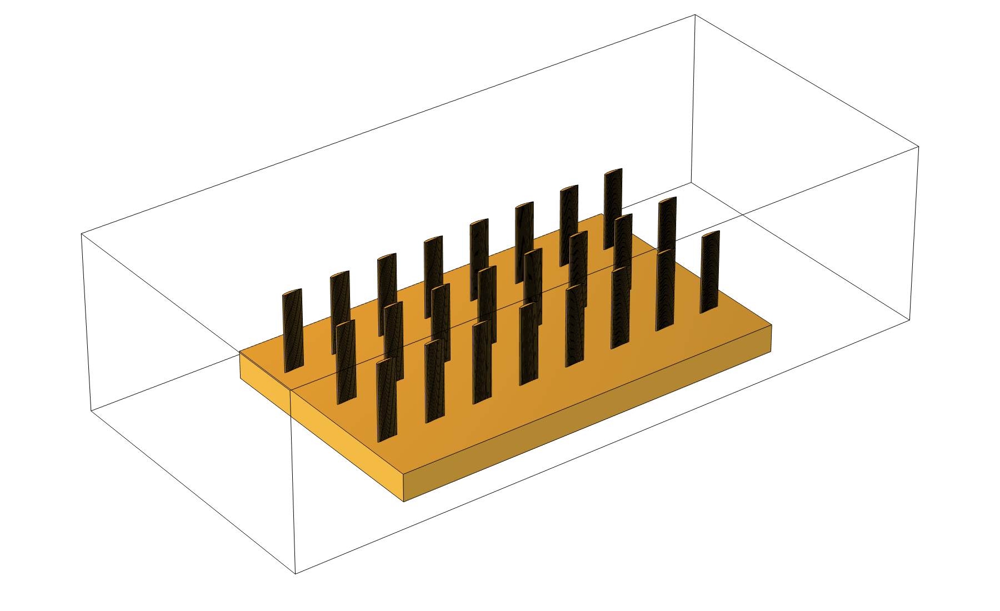

## 6.3 三维工况、边界条件与求解设置

三维CHT模型的边界条件设置如表6-1所示。

**表6-1 三维模型边界条件设置**

| 边界 | 条件类型 | 参数值 |
|------|---------|--------|
| 入口 | 均匀速度入口 | u_in=0.5 m/s, T_in=293.15 K |
| 出口 | 压力出口 | p=0 Pa（表压） |
| 空气通道壁面 | 壁面边界 | 流动按层流模型壁面处理，热边界按封闭风道共轭换热模型处理 |
| 芯片固体域 | 体热源 | 总功率P=1 W |
| 流固界面 | 共轭换热 | 温度连续、热流连续 |

网格方面，采用COMSOL自由四面体网格，并对空气域、固体域和芯片热源域分别施加局部尺寸控制。本轮三维计算采用hauto=8的粗网格验证设置，其目标是确认七参数候选结构能够在真实三维芯片散热模型中完成几何生成、网格划分和稳态求解。由于尚未完成三维网格无关性验证，本文不将三维结果作为最终工程定量结论，而将其作为二维优化向三维模型迁移的初步验证。

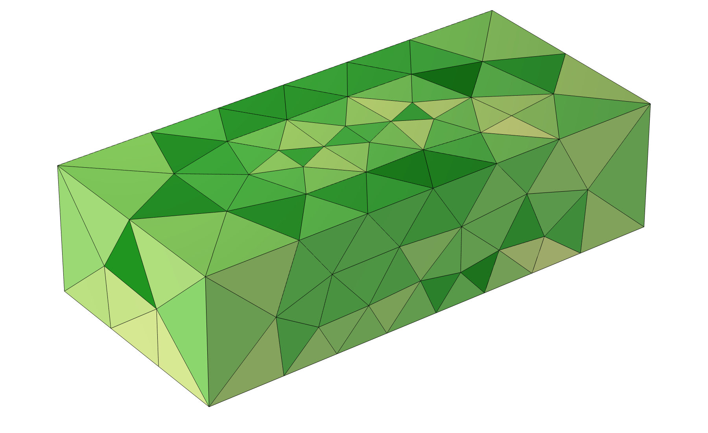

## 6.4 三维流热性能对比分析

表6-2对比了基准构型与优化构型在三维CHT模型下的关键性能指标。

**表6-2 三维CHT模型流热性能对比**

| 性能指标 | 基准构型 | 七参数PI-CNN-CBAM候选结构 | 变化幅度 |
|----------|---------|---------|---------|
| 芯片最高温度 T_max | 312.712 K | 311.269 K | -1.442 K |
| 芯片平均温度 T_avg | 310.903 K | 309.767 K | -1.136 K |
| 等效热阻 R_th | 17.753 K/W | 16.617 K/W | -6.40% |
| 进出口压降 Δp | 0.32456 Pa | 0.44411 Pa | +36.83% |
| 综合性能因子 η_3D | 1.000 | 0.962 | -3.77% |

三维验证结果显示，七参数PI-CNN-CBAM候选结构在芯片温度方面具有一定改善，但其压降代价更明显：

（1）**芯片温度**：在当前三维芯片散热模型中，七参数候选结构使芯片平均温度由310.903 K降低至309.767 K，芯片最高温度由312.712 K降低至311.269 K。该结果说明二维优化得到的弯度、间距和交错位移调整在三维模型中仍能带来一定降温效果。

（2）**热阻**：七参数候选结构的等效热阻由17.753 K/W降低至16.617 K/W，降幅约6.40%。这表明候选结构能够改善芯片到空气侧的等效散热通道，但该改善幅度仍需在更细网格和更多三维参数样本下进一步确认。

（3）**压降**：候选结构的进出口压降由0.32456 Pa增至0.44411 Pa，增幅约36.83%。这说明更大的横纵间距、交错位移和翼型形状调整虽然有利于改变局部流动组织，但在当前三维通道中也带来了更明显的流动阻力代价。

（4）**综合性能因子**：以基准结构为参考，七参数候选结构的η_3D为0.962，低于1.0。其原因是热阻下降带来的收益未能完全抵消压降增加带来的代价。因此，当前三维验证应表述为“候选结构具有降温潜力，但综合性能仍受流阻代价制约”，不能写成三维综合性能最优。

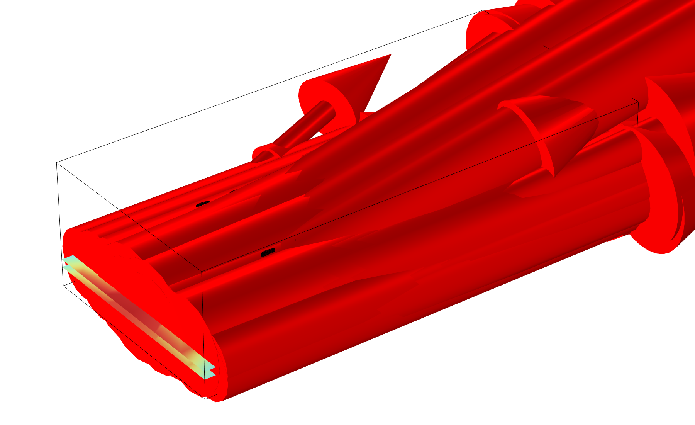

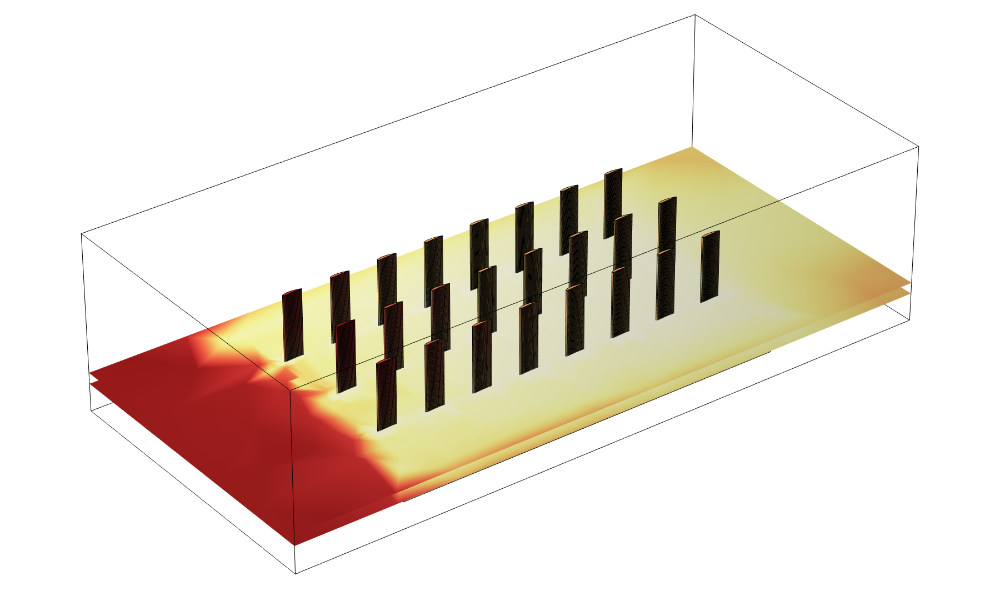

## 6.5 二维优化结果向三维模型迁移的适用性分析

综合来看，三维代表性模型的意义在于建立了从电子芯片热源、基板导热、扰流结构到空气侧强制对流的共轭换热验证框架。现有结果提示，二维最优参数不能无条件等价为三维最优参数。二维模型主要反映无限展长截面内的空气侧绕流、尾迹干涉和换热强化规律，而三维模型进一步引入了有限宽度端部效应、基板内横向导热、热源面积、通道高度和真实流体边界等因素。这些因素会改变局部流速分配、热量传导路径和芯片温度响应，从而削弱二维优化结果在三维场景中的直接可迁移性。

因此，本文将三维部分定位为工程迁移边界验证，而不是二维优化结果的最终三维最优证明。当前三维结果说明：二维优化结构可以作为三维设计的初始候选或趋势参考，候选结构在芯片温度和热阻方面具有改善，但不能直接替代三维参数搜索。后续工作应在三维模型内重新开展样本设计、代理建模和参数优化，并重点考察扰流柱高度、倾斜角、基板尺寸、热源面积与入口速度等工程变量对芯片温度和压降的共同影响。

## 6.6 本章小结

本章构建了面向CPU/电子芯片散热场景的三维代表性共轭换热模型，对二维优化结构向三维工程模型迁移的适用性进行了检查，主要结论如下：

（1）三维模型包含芯片热源、铝质基板、翼型扰流柱阵列和空气流动域，能够描述固体导热与空气侧强制对流之间的共轭换热关系，可作为二维气侧优化向电子芯片散热工程场景迁移的验证平台。

（2）当前三维结果中，七参数PI-CNN-CBAM候选结构使芯片平均温度由310.903 K降低至309.767 K，等效热阻由17.753 K/W降低至16.617 K/W，说明其在当前芯片散热模型中具有一定降温效果。

（3）七参数候选结构的进出口压降由0.32456 Pa增至0.44411 Pa，η_3D由1.000降至0.962，说明热阻降低收益未能完全抵消流动阻力增加代价。因此，三维结果不能写成综合性能提升，更适合用于说明二维候选结构在三维工程模型中的迁移边界。

（4）三维结果提示，二维最优参数不能无条件等价为三维最优参数。三维模型中存在端部效应、基板横向导热、热源面积和真实流动边界等因素，这些因素会改变二维优化结果的实际表现。

（5）后续应在三维模型内重新开展参数采样、代理建模和优化搜索，并重点考察扰流柱高度、倾斜角、基板尺寸、热源面积和入口速度等工程变量。

---

# 第7章 结论与展望

## 7.1 主要结论

本文围绕翼型管翅片散热器的流热性能预测与参数优化问题，系统开展了二维参数化CFD建模、七参数几何掩码代理模型构建、四模型消融验证、差分进化全局寻优、COMSOL复核以及三维工程验证等研究工作。通过理论分析、数值计算与工程验证的结合，取得了以下主要结论：

（1）建立了基于COMSOL Multiphysics的二维翼型管翅片散热器参数化CFD仿真模型，采用拉丁超立方采样策略生成500个样本，并在此基础上扩展为七参数研究框架。当前真实CFD标签位于$\theta_g=0^\circ$子空间，数据集覆盖了Nu（努塞尔数）和f（摩擦因子）两个目标变量的合理变化范围，为后续机器学习模型的训练与评估奠定了数据基础。

（2）设计并实现了七参数几何掩码代理模型的消融实验，包括参数MLP、几何掩码CNN、参数-掩码融合模型和PI-CNN-CBAM。结果表明，参数向量提供主要数值约束，几何掩码提供阵列空间拓扑入口，CBAM注意力和物理一致性约束对Nu和η预测具有正向作用。

（3）验证了几何掩码作为优化阶段图像模态输入的可行性。与CFD云图不同，几何掩码由候选参数直接生成，不需要预先完成COMSOL求解，因此能够用于差分进化迭代过程中的快速性能评估。消融结果表明，几何掩码CNN单独使用时可学习阵列空间拓扑，但与参数分支融合后更适合用于Nu、f和η的联合预测。

（4）所提出的PI-CNN-CBAM几何掩码模型在Nu和η预测上表现最好，其Nu R²达到0.9806，η R²达到0.9804。该模型结合参数流、几何掩码CNN分支、CBAM通道-空间注意力模块和物理一致性约束，实现了面向优化阶段的快速性能预测。

（5）物理一致性约束对换热相关指标具有较明显贡献。消融实验表明，PI-CNN-CBAM的η MAE为0.00997，为各模型中最低；但f预测仍由参数MLP表现最好，说明当前物理约束更偏向换热性能，阻力指标还需要速度场或压力场约束补充。

（6）以PI-CNN-CBAM几何掩码代理模型作为适应度评估器的差分进化算法，在七参数框架下完成了代理优化。正式优化训练数据中theta只有0值，因此优化流程固定theta=0以避免无依据外推。COMSOL复核得到Nu=40.488、f=0.087139、η=1.471，表明代理模型能够筛选出具有较高综合性能的候选结构；但代理预测低估了Nu和f的绝对值，最终结论应以COMSOL复核为准。

（7）三维代表性共轭换热模型完成了电子芯片热源、基板导热和空气侧强制对流耦合流程的验证。七参数PI-CNN-CBAM候选结构相较基准结构使芯片平均温度由310.903 K降低至309.767 K，等效热阻由17.753 K/W降低至16.617 K/W，但压降由0.32456 Pa增至0.44411 Pa，η_3D为0.962。该结果说明候选结构在当前三维芯片散热模型中具有降温潜力，但综合性能受流阻代价制约，不能夸大为三维综合最优；该部分更适合作为三维工程化建模基础，并为后续三维样本生成和三维参数优化提供模型框架。

## 7.2 创新点

本文的主要创新点可归纳为以下三个方面：

（1）**提出了面向优化闭环的参数-几何掩码PI-CNN-CBAM代理模型**。本文将七参数向量与由参数直接生成的翼型阵列几何掩码共同作为输入，使模型在推理阶段不依赖候选结构的CFD云图。CBAM模块用于增强翼型边界、管间通道和错排区域等关键几何拓扑特征的表达，物理一致性损失用于限制Nu、f和η之间的基本关系。旧版CFD云图模型仅作为机理解释和对比材料，不作为差分进化优化的适应度模型。消融结果表明，PI-CNN-CBAM在Nu和η预测上表现最好，其中Nu_R²为0.9806、η_R²为0.9804。

（2）**设计了面向优化闭环的七参数几何掩码输入方式**。传统CFD云图模型需要先完成流场求解才能获得输入，无法直接服务于优化迭代。本文将七参数候选结构自动转化为几何掩码图，并与参数向量共同输入代理模型，使差分进化能够在不调用COMSOL的条件下完成候选结构评价。四模型消融实验表明，几何掩码能够提供阵列空间拓扑信息，参数分支则保留连续变量尺度信息，两者融合后构成更适合优化阶段的代理模型输入。

（3）**构建了代理模型驱动的差分进化参数优化框架**。将经训练验证的PI-CNN-CBAM几何掩码模型作为DE算法的适应度评估器，实现了不调用COMSOL的快速候选结构筛选。该框架在七参数形式下完成优化，并通过COMSOL独立复核给出最终性能判断，形成“参数生成几何掩码—代理预测—差分进化搜索—COMSOL复核”的技术路径。

## 7.3 研究展望

尽管本文在基于物理信息神经网络的散热器性能预测与优化方面取得了有意义的进展，但仍存在若干不足之处需要在未来工作中加以改进和完善。基于对当前研究局限性的客观认识，提出以下六个主要研究方向：

（1）**扩充CFD样本数据集规模**。当前500样本的数据集虽然在拉丁超立方采样策略下实现了合理的参数空间覆盖，但对于充分训练深层卷积神经网络而言仍显不足。未来工作应将数据集规模扩充至2000个样本以上，通过更密集的参数空间采样提升代理模型在边界区域和极端参数组合下的预测鲁棒性。此外，可引入主动学习（Active Learning）策略，使新增样本优先分布在模型预测不确定度较高的参数空间子区域，以最大化每个新增样本的信息价值。

（2）**扩充非零倾斜角样本并提高代理模型边界区精度**。当前七参数框架已加入倾斜角theta，本文已完成35组非零theta补充样本并开展轻量重训评估，结果表明补样能够改善模型对倾斜角构型的适应性。但该样本规模仍不足以支撑正式全七参数优化。未来应继续扩充非零theta的COMSOL样本，并重点加密代理模型推荐的边界区域，降低Nu和f绝对值低估的问题。

（3）**从二维优化拓展至全三维优化**。本文的参数优化基于二维CFD模型完成，当前三维工程验证尚未表现出综合性能提升，说明二维最优结构不能直接等价为三维最优结构。未来工作可构建参数化的三维CFD模型，增加展长比、倾角、三维排列模式、热源面积和基板尺寸等额外自由度，在更高维参数空间中开展全三维优化。考虑到三维CFD仿真的计算成本，可结合多保真度建模（Multi-fidelity Modeling）方法，以少量三维高保真样本修正大量二维低保真样本的预测偏差。

（4）**开展多目标优化研究**。本文采用的综合性能因子η本质上是对换热与流阻两个目标的单一加权聚合，无法完整呈现两个目标之间的帕累托权衡关系。未来工作可采用非支配排序遗传算法（NSGA-II或NSGA-III）等多目标优化算法，以Nu和f（或其衍生指标）作为独立目标函数，构建完整的帕累托前沿。工程师可根据具体应用需求（如优先保证散热性能还是优先控制泵送功耗）在帕累托前沿上灵活选取最终设计方案，从而获得更具工程适应性的优化结果。

（5）**开展实验验证**。本文所有的模型训练、优化和验证均基于数值仿真数据完成，尚未引入物理实验数据。未来应搭建翼型管翅片散热器的实验测试平台，通过风洞实验测量不同几何配置下的换热系数和压降数据，一方面验证CFD模型的数值精度，另一方面为代理模型提供实验层面的交叉验证。实验平台应包含可更换的翅片模块（以便快速切换不同几何参数组合）、高精度温度传感器阵列（用于测量基板与流体的温度分布）以及微压差传感器（用于测量进出口压降）。实验数据的引入还可支持迁移学习策略，将数值仿真预训练的模型微调至实验域，显著提升模型的实际工程预测能力。特别地，可考虑采用贝叶斯模型融合方法，将仿真数据与实验数据进行不确定性加权融合，在充分利用仿真数据规模优势的同时校正仿真偏差。

（6）**增强模型可解释性分析**。当前PI-CNN-CBAM模型虽然在预测精度上表现优异，但其内部决策机制仍具有一定程度的"黑箱"特性。未来工作可引入梯度加权类激活映射（Grad-CAM）技术，可视化网络各卷积层在预测过程中所关注的输入图像区域，验证CBAM注意力模块是否确实聚焦于物理上合理的关键区域（如翅片壁面、尾流剪切层等）。此外，可探索注意力权重的定量分析方法，将网络学到的特征重要性分布与传统流体力学理论（如局部换热贡献因子、熵产分析等）进行对照，从可解释性角度进一步增强模型的可信度和工程接受度。

## 参考文献

[1] 刘佳鑫, 秦四成, 徐振元, 张奥, 习羽, 张学林. 工程车辆散热器模块散热性能数值仿真[J]. 西南交通大学学报, 2012, 25(4): 623-628.
[2] 刘佳鑫, 秦四成, 徐振元, 张奥, 习羽, 张学林. 基于CFD仿真的车辆散热器模块传热性能对比分析[J]. 华南理工大学学报(自然科学版), 2012, 40(5): 24-29.
[3] 王庆丰, 顾卡丽, 吴根茂. 液压系统热力学分析与节能[J]. 液压与气动, 2001, (11): 1-4.
[4] Shah R K, Sekulic D P. Fundamentals of Heat Exchanger Design[M]. Hoboken: John Wiley & Sons, 2003.
[5] Zukauskas A. Heat transfer from tubes in crossflow[J]. Advances in Heat Transfer, 1987, 18: 87-159.
[6] Ota T S, Okamoto Y, Ono S. Heat transfer and flow around a NACA 0012 airfoil at high angle of attack[J]. Journal of Heat Transfer, 1994, 116(3): 770-773.
[7] Wang B Z, Wang Q D, Wang Y M. Experimental investigation on heat transfer and pressure drop characteristics of airfoil tube radiator for engineering vehicles[J]. Applied Thermal Engineering, 2016, 102: 597-605.
[8] Kim I H, No H C, Kim M H. Thermal-hydraulic performance of a PCHE with airfoil fins[C]//Proceedings of ICAPP, 2010: 234-241.
[9] Lee S M, Kim K Y. Optimization of an airfoil fin type printed circuit heat exchanger[J]. International Journal of Heat and Mass Transfer, 2014, 75: 520-530.
[10] Papadogiannakis A, Rogak S N. A computational study of conjugate heat transfer in tube-fin heat exchangers[J]. International Journal of Thermal Sciences, 2021, 159: 106578.
[11] Guo X, Li W, Iorio F. Convolutional neural networks for steady flow approximation[C]//Proceedings of the 22nd ACM SIGKDD International Conference on Knowledge Discovery and Data Mining, 2016: 481-490.
[12] Thuerey N, Weiße K, Wiewel E, et al. Deep learning methods for Reynolds-averaged Navier-Stokes simulations of airfoil flows[J]. AIAA Journal, 2020, 58(1): 25-36.
[13] Cheng K, Lu Z, Wei K, et al. Deep learning-based 3D flow field reconstruction from sparse observations[J]. Physics of Fluids, 2022, 34(4): 043604.
[14] Woo S, Park J, Lee J Y, et al. CBAM: Convolutional block attention module[C]//Proceedings of the European Conference on Computer Vision (ECCV), 2018: 3-19.
[15] Raissi M, Perdikaris P, Karniadakis G E. Physics-informed neural networks: A deep learning framework for solving forward and inverse problems involving nonlinear partial differential equations[J]. Journal of Computational Physics, 2019, 378: 686-707.
[16] Kays W M, London A L. Compact Heat Exchangers[M]. 3rd ed. New York: McGraw-Hill, 1984.
[17] 王宝中, 冯少聪, 刘佳鑫, 蒋炎坤. 工程车辆翼型管散热器冷侧翅片信噪比分析[J]. 工程热物理学报, 2018, 39(8): 1849-1857.
[18] 王宝中, 冯少聪, 刘佳鑫, 蒋炎坤. 工程车辆翼型管散热器冷侧翅片信噪比分析[J]. 工程热物理学报, 2018, 39(8): 1849-1857.
[19] 冯少聪, 刘佳鑫, 王宝中, 蒋炎坤. 工程车辆五位数翼型热管散热器性能对比分析[J]. 武汉理工大学学报, 2017, 39(3): 91-96.
[20] Xu X Y, Ma T, Zhang L, et al. Investigation on thermal-hydraulic performance of a PCHE with airfoil fins in supercritical CO₂ Brayton cycle[J]. Applied Thermal Engineering, 2020, 178: 115560.
[21] Fiebig M. Vortex generators for compact heat exchangers[J]. Revue Générale de Thermique, 1995, 34(410): 43-61.
[22] Jacobian A, Jayakumar J S. Investigation of heat transfer characteristics of elliptical tube heat exchangers[J]. International Journal of Thermal Sciences, 2022, 172: 107312.
[23] ANSYS Inc. ANSYS Fluent Theory Guide[R]. Canonsburg: ANSYS Inc., 2022.
[24] COMSOL AB. COMSOL Multiphysics Reference Manual[R]. Stockholm: COMSOL AB, 2022.
[25] 高翔, 凌惠琴, 李明, 等. CPU散热技术的最新研究进展[J]. 上海交通大学学报, 2007, 41(Sup.2): 48-52.
[26] 陆正裕, 熊建银, 屈治国, 等. CPU散热器换热特性的实验研究[J]. 工程热物理学报, 2004, 25(5): 861-863.
[27] Tao W Q. Numerical Heat Transfer[M]. 2nd ed. Xi'an: Xi'an Jiaotong University Press, 2001.
[28] Gong C, Li Z, Khan J, et al. Two-dimensional versus three-dimensional CFD modeling of tube-fin heat exchangers[J]. International Journal of Heat and Mass Transfer, 2021, 170: 121003.
[29] Roache P J. Verification and Validation in Computational Science and Engineering[M]. Albuquerque: Hermosa Publishers, 1998.
[30] Richardson P J. Grid convergence studies for unstructured CFD simulations[R]. AIAA Paper, 2006: 2006-1023.
[31] 李强林, 曾炜杰, 田镇, 谷波. 反向传播神经网络对多结构翅片管换热器变工况性能预测适应性研究[J]. 上海交通大学学报, 2020, 54(7): 668-673.
[32] 刘津, 章立新, 沈艳, 等. 基于BP神经网络的闭塔换热管壁污垢热阻预测[J]. 热能动力工程, 2020, 35(12): 66-71.
[33] Kim H, Choi Y. Deep learning for prediction of aerodynamic coefficients of airfoils[J]. Aerospace Science and Technology, 2021, 118: 107042.
[34] 朱高嘉, 何函宇, 李龙女, 朱建国, 梅云辉. 基于神经网络同步学习的功率模块散热器拓扑优化快速迭代方法[J]. 电源学报, 2024, 22(3): 111-117.
[35] Vaswani A, Shazeer N, Parmar N, et al. Attention is all you need[C]//Advances in Neural Information Processing Systems (NeurIPS), 2017: 5998-6008.
[36] Bhatnagar S, Afshar S, Pan S, et al. Prediction of aerodynamic flow fields using convolutional neural networks[J]. Computational Mechanics, 2019, 64(2): 525-545.
[37] Karniadakis G E, Kevrekidis I G, Lu L, et al. Physics-informed machine learning[J]. Nature Reviews Physics, 2021, 3(6): 422-440.
[38] Cai S, Mao Z, Wang Z, et al. Physics-informed neural networks (PINNs) for fluid mechanics: A review[J]. Acta Mechanica Sinica, 2021, 37(12): 1727-1738.
[39] Fang Z, Wang J, Song H, et al. Physics-informed deep learning for convective heat transfer in microchannels[J]. International Journal of Heat and Mass Transfer, 2021, 179: 121686.
[40] Meng X, Yang L, Mao Z, et al. Physics-informed neural networks for conjugate heat transfer[J]. Computers & Fluids, 2022, 240: 105439.
[41] Storn R, Price K. Differential evolution — A simple and efficient heuristic for global optimization over continuous spaces[J]. Journal of Global Optimization, 1997, 11(4): 341-359.
[42] 费继友, 田士博, 王枫, 李花. 平直翅片管式换热器结构参数的优化[J]. 大连交通大学学报, 2018, 39(6): 40-44, 91.
[43] 宋全刚, 王琦, 张承, 张宾. 基于ANSYS分析的水冷散热器多目标优化[J]. 流体机械, 2022, 50(4): 65-70.
[44] Deb K, Pratap A, Agarwal S, et al. A fast and elitist multiobjective genetic algorithm: NSGA-II[J]. IEEE Transactions on Evolutionary Computation, 2002, 6(2): 182-197.
[45] Hilbert R, Janiga G, Baron R, et al. Multi-objective shape optimization of a heat exchanger using parallel genetic algorithms[J]. International Journal of Heat and Mass Transfer, 2006, 49(15-16): 2567-2577.
[46] Rao R V, Patel V K. Multiobjective optimization of plate-fin heat exchanger using NSGA-II[J]. Applied Thermal Engineering, 2010, 30(17-18): 2749-2756.
[47] Jin Y. Surrogate-assisted evolutionary computation: Recent advances and future challenges[J]. Swarm and Evolutionary Computation, 2011, 1(2): 61-70.
[48] Ribaud Y, Gosselin L, Bessette C. Surrogate-based optimization of microchannel heat sinks using neural networks[J]. International Journal of Heat and Mass Transfer, 2020, 153: 119584.
[49] Huang Y, Xie Y, Dong G. Deep learning surrogate assisted optimization of fin-and-tube heat exchangers[J]. Energy, 2022, 254: 124315.
[50] 李健, 陆繁莉, 董威, 蔡一凡, 许梦玫. 基于数值模拟的芯片冷却散热器结构优化[J]. 上海交通大学学报(自然科学版), 2019, 53(4): 461-467.
[51] 何颖, 邵宝东, 程赫明. 矩形微通道散热器流道的数值模拟及尺寸优化[J]. 应用数学和力学, 2014, 35(3): 278-286.
[52] 施渺, 杜江伟, 余小玲, 等. 平直翅片热管散热器的正交数值模拟优化[J]. 电子机械工程, 2020, 36(2): 14-18.
[53] 周晓东, 张磊, 郑超, 吴强国, 张东, 翟众福. 基于CFD数值计算的电子设备热设计分析[J]. 电子机械工程, 2016, 32(5): 1-7.
[54] 刘衍平, 高新霞. 大功率电子器件散热系统的数值模拟[J]. 电子器件, 2007, 30(2): 608-611.
[55] 李胜, 朱佳, 黄德惠, 陈存福, 费洪庆, 丰伟, 胡兴军. 空冷中冷器百叶窗翅片结构参数优化[J]. 吉林大学学报(工学版), 2023, 53(4): 998-1006.
[56] 刘妮, 贺剑锋, 崔强, 张华, 单小丰, 靳晓堂. 电动汽车空调室外换热器空气侧流动换热模拟研究[J]. 低温物理学报, 2022(2): 124-130.
[57] 曹侃, 谭泽资, 于波文, 袁耀华, 康志伟, 梁家星. 带涡流发生器百叶窗翅片对流换热特性研究[J]. 力学与实践, 2024, 46(4): 732-739.
[58] 刘欣欣, 叶建明, 彭旭, 等. 变截面百叶窗翅片的数值模拟与结构优化[J]. 高校化学工程学报, 2020, 34(3): 664-670.
[59] 李文江, 张井志, 吕迪, 李蔚. 百叶窗板翅式换热器换热与阻力性能数值模拟研究[J]. 热能动力工程, 2019, 34(2): 101-108.
[60] 郭健忠, 徐敏, 张光德, 胡溧, 朱鸣飞, 黄玮隆. 汽车散热器的性能分析及翅片结构优化[J]. 科学技术与工程, 2016, 16(26): 58-64.
[61] 孟庆林, 尹明德, 朱朝霞. 车辆散热器冷热侧耦合散热的数值模拟研究[J]. 机械设计与制造, 2015(7).
[62] 封蔚健, 石秀东, 姚晨明, 彭晶鑫. 基于正交试验和Fluent的管翅式换热器结构优化[J]. 北京化工大学学报(自然科学版), 2020, 47(1): 93-99.
[63] 唐爱坤, 潘剑锋, 陈春伟, 李德桃, 于海群. 基于改进遗传算法的汽车散热器优化设计[J]. 江苏大学学报(自然科学版), 2008, 29(5): 424-427.
[64] 陈鹏, 罗娜. 基于竞争机制差分进化算法的无分流换热网络优化[J]. 华东理工大学学报(自然科学版), 2019, 45(6): 970-979.
[65] 谭礼斌, 袁越锦. 基于CFD的摩托车散热器数值模拟及优化[J]. 西华大学学报(自然科学版), 2025, 44(4): 73-83.
[66] 陈焱飙, 尤向华, 曹晔, 李建平, 李澄宇. 基于人工神经网络的平直穿孔翅片散热器优化[J]. 低温工程, 2025(6).
[67] 于秀敏, 陈海波, 黄海珍, 陈群, 高莹. 发动机冷却系统中流动与传热问题数值模拟进展[J]. 机械工程学报, 2008, 44(10): 162-167.
[68] 赵明, 卞恩杰, 杨茉, 等. 风扇结构和肋高对芯片散热器散热性能的影响[J]. 流体机械, 2013, 41(12): 60-64.
[69] 王海民, 王喜芳, 魏辉, 等. 针肋散热器针径和间距对性能影响分析[J]. 热科学与技术, 2016, 15(6): 505-509.
[70] 胡艳, 郭广思, 尚新泉. CPU散热器数值模拟分析[J]. 低温与超导, 2009, 37(9): 60-65.
[71] 冯少聪. 航空翼型下的工程车辆冷却性能强化研究[D]. 唐山: 华北理工大学, 2018.
[72] 陈彪, 余敏, 龙时丹, 王晓阳. 翅片管式换热器空气侧流动及换热性能的数值模拟[J]. 上海理工大学学报, 2014, 36(4): 307-311.
[73] 高文通, 欧阳新萍. 小管径穿片式翅片管三种间距下的换热与阻力特性[J]. 能源研究与信息, 2017, 33(1): 38-42, 49.
[74] 童正明, 王亦凡, 陈丹. 汽车散热器结构优化研究[J]. 能源研究与信息, 2014, 30(2): 108-112.
[75] 韩赛赛, 柳建华, 赵永杰, 张良. 汽车空调暖风系统平行流换热器换热性能研究[J]. 能源研究与信息, 2016, 32(4): 207-211.
[76] 曹先慧, 马贵阳, 王雷, 姚尧, 高艳波, 莫海元, 刘金彪. 波纹翅片管换热器空气侧流动换热的三维数值模拟[J]. 辽宁石油化工大学学报, 2013, 33(3): 43-46.
[77] 董军启, 陈江平, 陈芝久. 百叶窗翅片的传热与阻力性能试验关联式[J]. 制冷学报, 2007, 28(5): 10-14.
[78] 张井志, 田茂诚, 张冠敏, 冷学礼. 板式换热器触点分布对换热阻力性能的影响[J]. 山东大学学报(工学版), 2012, 42(6): 121-126.
[79] 徐荣吉, 沃龙, 王瑞祥, 王随林. 异型管管翅式换热器性能研究[J]. 制冷学报, 2022, 43(1). DOI: 10.3969/j.issn.0253-4339.2022.01.081.
[80] 余文敏, 余刃, 毛伟, 于巍峰. 基于SWLSTM的换热器在线性能预测[J]. 舰船科学技术, 2023, 45(21): 153-157.

---

## 致谢

本论文是在导师的悉心指导下完成的。导师在研究方向选择、技术方案制定和论文撰写等方面给予了精心的指导和关怀，导师严谨的治学态度和渊博的学识使我受益匪浅。在此谨向导师表示最诚挚的感谢和崇高的敬意。

感谢实验室全体同学在课题研究过程中给予的热情帮助和有益讨论。感谢他们在CFD数值模拟、深度学习模型开发和数据处理等方面提供的技术支持和宝贵建议。

感谢COMSOL Multiphysics技术支持团队在软件使用过程中提供的及时帮助，感谢学校高性能计算中心提供的计算资源支持。

感谢国家自然科学基金项目对本研究的资助。

最后，衷心感谢我的家人在求学期间给予的无私支持与理解，正是他们的鼓励与付出使我能够顺利完成学业。
