# 基于 MLP-CNN 流热场重建的翼型柱阵列散热器流热性能预测与参数优化研究

# 摘要

随着电子芯片功率密度不断提高，紧凑式风冷散热器对换热能力、流动阻力和结构紧凑性的综合要求日益提高。翼型柱阵列散热器兼具流线型绕流特征和阵列强化换热能力，在芯片级热管理中具有较好的应用潜力。然而，该类散热器结构参数较多，流动与传热过程耦合明显，若完全依赖 CFD 对候选结构逐点计算，将导致较高计算成本；同时，传统仅预测 Nu 和 f 的标量代理模型难以表征压力场、速度场和温度场等空间流热信息。针对上述问题，本文提出一种基于 MLP-CNN 流热场重建的翼型柱阵列散热器流热性能预测与参数优化方法。

本文首先建立翼型柱阵列散热器二维流热耦合 CFD 数值模型，采用 $T_a$、$T_{wa}$、$T_b$、$T_s$、$T_t$、$T_{ad}$ 和 $\theta$ 七个参数描述翼型柱外形、阵列间距、错排偏移和整体旋转角等结构特征，并基于 COMSOL 生成 1000 组二维 CFD 样本。每组样本包括七参数结构变量、努塞尔数 Nu、摩擦因子 f、综合性能评价因子 $\eta$，以及规则网格上的压力场 $p$、速度大小场 $U$ 和温度场 $T$。其中，速度大小由 $U=\sqrt{u^2+v^2}$ 计算得到，最终形成尺寸为 $3\times96\times320$ 的 PVT 三通道流热场数据集。数据集按照 700/150/150 划分为训练集、验证集和测试集。

在此基础上，构建 MLP-CNN 流热场重建代理模型。模型以七参数结构变量、归一化空间坐标和区域条件信息为输入，通过 MLP 编码器提取结构潜在特征，并利用 CNN/U-Net 解码器重建压力场、速度场和温度场，同时通过性能预测分支输出 Nu 和 f，并由 Nu 和 f 计算综合性能评价因子 $\eta$。CFD 数值场在本文中作为训练阶段的监督标签，用于约束模型学习结构参数与空间流热场之间的映射关系；优化阶段仅需输入七参数变量，即可快速预测候选结构的流热性能。

测试结果表明，MLP-CNN 主模型对 Nu、f 和 $\eta$ 的预测决定系数分别达到 0.969309、0.978038 和 0.971888，平均绝对误差分别为 0.732264、0.002571 和 0.016209。流热场重建方面，压力场、速度大小场和温度场的 MAE 分别为 0.908374 Pa、0.108227 m/s 和 0.439960 K，说明模型能够较准确地预测整体性能指标，并较好恢复主要流热场空间分布。3 折交叉验证结果显示，$\eta$ 预测 R² 平均值为 0.968501，标准差为 0.000825，说明模型在不同数据划分下具有较好的稳定性。消融实验表明，坐标通道和区域条件信息能够显著降低流热场重建误差，$\eta$ 一致性损失和梯度一致性损失有助于改善温度场与边界区域预测效果，CBAM 注意力机制能够进一步提升 PVT 流热场重建精度。

随后，将训练好的 MLP-CNN 性能预测分支嵌入差分进化算法，以综合性能评价因子 $\eta$ 最大化为优化目标，对七参数结构空间进行搜索。优化得到的七参数组合为 $T_a=0.000000$、$T_{wa}=0.600000$、$T_b=0.150000$、$T_s=1.500000$、$T_t=0.960919$、$T_{ad}=1.000000$、$\theta=-2.224429$。代理模型预测结果为 Nu_pred=45.453880、f_pred=0.105865、$\eta_{pred}$=1.433572。将该结构重新导入 COMSOL 进行二维 CFD 独立复算，得到 Nu=46.022427、f=0.106658、$\eta=1.447895$，验证了代理模型优化结果的可靠性。流热场分析表明，优化结构通过增大阵列通流能力、减弱前后排尾迹干扰、增强局部换热并控制压力损失，实现了综合流热性能提升。

最后，建立三维芯片级翼型鳍片散热器代表性模型，对二维优化结构进行三维验证。三维结果显示，optimized 结构相较 baseline 结构使芯片平均温度由 379.201265 K 降至 375.663499 K，芯片最高温度由 380.457118 K 降至 376.969653 K，等效热阻由 86.051265 K/W 降至 82.513499 K/W，进出口压降由 0.013555 Pa 降至 0.013028 Pa，三维综合性能评价因子 $\eta_{3D}$ 达到 1.056732。结果表明，二维 MLP-CNN-DE 优化得到的翼型柱阵列结构在三维芯片级散热器模型中仍具有较好的散热能力和通流性能。

综上，本文形成了“二维 CFD 样本构建—PVT 流热场数据集生成—MLP-CNN 流热场重建—差分进化参数优化—二维 CFD 复算—三维芯片级验证”的完整研究流程。研究结果表明，基于 MLP-CNN 的流热场重建代理模型能够兼顾性能预测精度、流热场空间分布解释能力和优化计算效率，为翼型柱阵列散热器快速设计与参数优化提供了一种可行方法。

**关键词：**翼型柱阵列散热器；MLP-CNN；流热场重建；PVT 数据集；差分进化算法；参数优化；芯片级散热

------

# Abstract

With the continuous increase in the power density of electronic chips, compact air-cooled heat sinks are required to achieve higher heat transfer capability, lower flow resistance, and better structural compactness. Airfoil column array heat sinks have promising potential for chip-level thermal management because they combine streamlined flow characteristics with array-based heat transfer enhancement. However, this type of heat sink usually involves multiple coupled structural parameters, and its flow and heat transfer behaviors are strongly coupled. Performing point-by-point CFD simulations for all candidate structures leads to a high computational cost. In addition, conventional scalar surrogate models that only predict Nu and f are unable to fully represent spatial thermo-fluid information such as pressure, velocity, and temperature fields. To address these issues, this study proposes an MLP-CNN-based thermo-fluid field reconstruction method for performance prediction and parameter optimization of an airfoil column array heat sink.

First, a two-dimensional CFD model for conjugate flow and heat transfer in the airfoil column array heat sink is established. Seven structural parameters, namely $T_a$, $T_{wa}$, $T_b$, $T_s$, $T_t$, $T_{ad}$, and $\theta$, are used to describe the airfoil column profile, array spacing, staggered offset, and overall rotation angle. Based on COMSOL simulations, 1000 two-dimensional CFD samples are generated. Each sample contains the seven structural parameters, the Nusselt number Nu, friction factor f, comprehensive performance evaluation factor $\eta$, and the pressure field $p$, velocity magnitude field $U$, and temperature field $T$ on a regular grid. The velocity magnitude is calculated as $U=\sqrt{u^2+v^2}$, and a PVT three-channel thermo-fluid field dataset with a size of $3\times96\times320$ is obtained. The dataset is divided into training, validation, and test sets with 700, 150, and 150 samples, respectively.

On this basis, an MLP-CNN thermo-fluid field reconstruction surrogate model is developed. The model takes the seven structural parameters, normalized spatial coordinates, and regional condition information as inputs. The MLP encoder extracts latent structural features, while the CNN/U-Net decoder reconstructs the pressure, velocity, and temperature fields. Meanwhile, a performance prediction branch outputs Nu and f, from which the comprehensive performance factor $\eta$ is calculated. In this work, CFD numerical fields are used as supervised labels during training to constrain the mapping between structural parameters and spatial thermo-fluid fields. During optimization, only the seven structural parameters are required as inputs, allowing rapid performance prediction for candidate designs.

The test results show that the coefficients of determination for Nu, f, and $\eta$ predicted by the main MLP-CNN model reach 0.969309, 0.978038, and 0.971888, respectively, with mean absolute errors of 0.732264, 0.002571, and 0.016209. For thermo-fluid field reconstruction, the MAEs of the pressure, velocity magnitude, and temperature fields are 0.908374 Pa, 0.108227 m/s, and 0.439960 K, respectively. These results indicate that the proposed model can accurately predict global performance indicators and reconstruct the main spatial distributions of thermo-fluid fields. The three-fold cross-validation results show that the mean R² of $\eta$ prediction is 0.968501 with a standard deviation of 0.000825, demonstrating good stability under different data partitions. Ablation experiments further indicate that spatial coordinate channels and regional condition information significantly reduce field reconstruction errors; the $\eta$ consistency loss and gradient consistency loss improve the prediction of temperature fields and boundary regions; and the CBAM attention mechanism further enhances the reconstruction accuracy of PVT fields.

The trained MLP-CNN performance prediction branch is then embedded into a differential evolution algorithm to maximize the comprehensive performance evaluation factor $\eta$ in the seven-parameter design space. The optimized parameter combination is $T_a=0.000000$, $T_{wa}=0.600000$, $T_b=0.150000$, $T_s=1.500000$, $T_t=0.960919$, $T_{ad}=1.000000$, and $\theta=-2.224429$. The surrogate model predicts Nu_pred=45.453880, f_pred=0.105865, and $\eta_{pred}$=1.433572. The optimized structure is then re-imported into COMSOL for independent two-dimensional CFD verification, yielding Nu=46.022427, f=0.106658, and $\eta=1.447895$. The CFD verification confirms the reliability of the surrogate-assisted optimization results. Further thermo-fluid field analysis shows that the optimized structure improves the comprehensive performance by enhancing flow passage capability, reducing wake interference between upstream and downstream columns, strengthening local heat transfer, and controlling pressure loss.

Finally, a three-dimensional representative chip-level airfoil fin heat sink model is established to verify the applicability of the optimized two-dimensional structure in a three-dimensional scenario. The three-dimensional results show that, compared with the baseline structure, the optimized structure reduces the average chip temperature from 379.201265 K to 375.663499 K, the maximum chip temperature from 380.457118 K to 376.969653 K, the equivalent thermal resistance from 86.051265 K/W to 82.513499 K/W, and the pressure drop from 0.013555 Pa to 0.013028 Pa. The three-dimensional comprehensive performance evaluation factor $\eta_{3D}$ reaches 1.056732. These results demonstrate that the airfoil column array structure optimized by the two-dimensional MLP-CNN-DE framework maintains good heat dissipation and flow performance in the three-dimensional chip-level heat sink model.

In summary, this study establishes a complete research framework of “two-dimensional CFD sample generation—PVT thermo-fluid field dataset construction—MLP-CNN thermo-fluid field reconstruction—differential evolution parameter optimization—two-dimensional CFD verification—three-dimensional chip-level validation.” The results indicate that the proposed MLP-CNN-based thermo-fluid field reconstruction surrogate model can simultaneously achieve accurate performance prediction, spatial thermo-fluid analysis capability, and efficient parameter optimization. It provides a feasible approach for rapid design and optimization of airfoil column array heat sinks.

**Keywords:** airfoil column array heat sink; MLP-CNN; thermo-fluid field reconstruction; PVT dataset; differential evolution algorithm; parameter optimization; chip-level thermal management

------

# 主要符号表

| 符号                  | 含义                                      | 单位     |
| --------------------- | ----------------------------------------- | -------- |
| $T_a$                 | 翼型柱形状或弯度调节参数                  | —        |
| $T_{wa}$              | 翼型弯度位置或宽度调节参数                | —        |
| $T_b$                 | 翼型厚度或柱体宽度调节参数                | —        |
| $T_s$                 | 阵列横向间距调节参数                      | —        |
| $T_t$                 | 阵列纵向间距或尾缘相关调节参数            | —        |
| $T_{ad}$              | 错排偏移或附加布置调节参数                | —        |
| $\theta$              | 翼型柱整体旋转角                          | °        |
| $\rho$                | 空气密度                                  | kg/m³    |
| $\mu$                 | 空气动力黏度                              | Pa·s     |
| $c_p$                 | 空气定压比热容                            | J/(kg·K) |
| $k_f$                 | 空气导热系数                              | W/(m·K)  |
| $k_s$                 | 固体导热系数                              | W/(m·K)  |
| $\rho_s$              | 固体密度                                  | kg/m³    |
| $c_{ps}$              | 固体定压比热容                            | J/(kg·K) |
| $u$                   | x 方向速度分量                            | m/s      |
| $v$                   | y 方向速度分量                            | m/s      |
| $U$                   | 速度大小，$U=\sqrt{u^2+v^2}$              | m/s      |
| $p$                   | 压力                                      | Pa       |
| $T$                   | 温度                                      | K        |
| $T_{in}$              | 入口空气温度                              | K        |
| $T_{avg}$             | 芯片平均温度                              | K        |
| $T_{max}$             | 芯片最高温度                              | K        |
| $u_{in}$              | 入口平均速度                              | m/s      |
| $p_{out}$             | 出口相对压力                              | Pa       |
| $\Delta p$            | 进出口压降                                | Pa       |
| $q_v$                 | 体积生热率                                | W/m³     |
| $Q'_{total}$          | 二维模型单位深度总发热量                  | W/m      |
| $Q$                   | 芯片热源功率                              | W        |
| $Nu$                  | 努塞尔数                                  | —        |
| $Nu_0$                | 基准结构努塞尔数                          | —        |
| $f$                   | 摩擦因子                                  | —        |
| $f_0$                 | 基准结构摩擦因子                          | —        |
| $\eta$                | 二维综合性能评价因子                      | —        |
| $\eta_{3D}$           | 三维综合性能评价因子                      | —        |
| $R_{th}$              | 等效热阻                                  | K/W      |
| $L_c$                 | 特征长度                                  | m        |
| $D_h$                 | 水力直径或等效特征长度                    | m        |
| $h$                   | 等效对流换热系数                          | W/(m²·K) |
| $\mathbf{X}_7$        | 七参数结构变量向量                        | —        |
| $\mathbf{Y}_{field}$  | PVT 流热场标签                            | —        |
| $\mathbf{Y}_{scalar}$ | Nu、f、$\eta$ 等标量性能标签              | —        |
| $\hat{p}$             | 模型预测压力场                            | Pa       |
| $\hat{U}$             | 模型预测速度大小场                        | m/s      |
| $\hat{T}$             | 模型预测温度场                            | K        |
| $\widehat{Nu}$        | 模型预测努塞尔数                          | —        |
| $\widehat{f}$         | 模型预测摩擦因子                          | —        |
| $\hat{\eta}$          | 由预测 Nu 和 f 计算得到的综合性能评价因子 | —        |
| $L_p$                 | 压力场重建损失                            | —        |
| $L_U$                 | 速度场重建损失                            | —        |
| $L_T$                 | 温度场重建损失                            | —        |
| $L_{Nu}$              | Nu 预测损失                               | —        |
| $L_f$                 | f 预测损失                                | —        |
| $L_{\eta}$            | $\eta$ 一致性损失                         | —        |
| $L_{grad}$            | 场梯度一致性损失                          | —        |
| $F$                   | 差分进化算法变异因子                      | —        |
| $CR$                  | 差分进化算法交叉概率                      | —        |
| $NP$                  | 差分进化算法种群规模                      | —        |
| $g$                   | 差分进化算法迭代代数                      | —        |

# 缩略词表

| 缩略词  | 英文全称                                            | 中文含义                   |
| ------- | --------------------------------------------------- | -------------------------- |
| CFD     | Computational Fluid Dynamics                        | 计算流体力学               |
| CHT     | Conjugate Heat Transfer                             | 共轭传热                   |
| CNN     | Convolutional Neural Network                        | 卷积神经网络               |
| MLP     | Multi-Layer Perceptron                              | 多层感知机                 |
| MLP-CNN | Multi-Layer Perceptron-Convolutional Neural Network | 多层感知机-卷积神经网络    |
| U-Net   | U-shaped Network                                    | U 型编码—解码网络          |
| CBAM    | Convolutional Block Attention Module                | 卷积块注意力模块           |
| DE      | Differential Evolution                              | 差分进化算法               |
| PVT     | Pressure-Velocity-Temperature                       | 压力—速度—温度三通道流热场 |
| MAE     | Mean Absolute Error                                 | 平均绝对误差               |
| RMSE    | Root Mean Square Error                              | 均方根误差                 |
| R²      | Coefficient of Determination                        | 决定系数                   |
| Re      | Reynolds Number                                     | 雷诺数                     |
| Nu      | Nusselt Number                                      | 努塞尔数                   |
| GPU     | Graphics Processing Unit                            | 图形处理器                 |
| COMSOL  | COMSOL Multiphysics                                 | 多物理场仿真软件           |

# 第1章 绪论

## 1.1 研究的目的及意义

随着电子芯片、功率器件以及紧凑型电子设备功率密度的不断提高，单位面积热流密度持续增大，热管理系统对散热器换热能力、流动阻力和结构紧凑性的要求不断提升[1-13,52-55]。若芯片运行过程中产生的热量不能及时传递至外部环境，将导致芯片温度升高、局部热点增强、器件老化加速，甚至引起性能衰减和热失效。因此，如何在有限空间内提高散热器空气侧换热能力，并同时控制流动阻力，是芯片级风冷散热器结构设计中的重要问题。

风冷散热器因结构简单、可靠性高、维护成本低，被广泛应用于电子芯片、功率模块和小型热管理系统中。管翅式换热器、百叶窗翅片、开缝翅片、圆管和椭圆管结构已被广泛用于空气侧强化换热研究，相关结果表明，翅片形状、管型截面和排列方式会同时影响换热面积、局部扰动、尾迹分布和压降水平[14-27]。传统圆柱、矩形柱或普通针翅结构在空气绕流过程中容易产生较大尾迹区、局部低速滞留区和明显压力损失。尾迹区会削弱后排结构的换热能力，过强局部阻塞也会增加流动阻力，从而降低散热器综合性能。

翼型结构因其流线型截面特征，在降低尾迹损失和改善通流能力方面具有优势。已有研究将翼型管、翼型翅片和翼型针肋结构用于车辆散热器、PCHE、微通道和紧凑式换热器中，并证明其能够在强化换热与控制流阻之间取得较好平衡[28-32,56-59]。因此，将翼型结构引入柱阵列散热器设计，有望在增强换热与控制流阻之间取得较好平衡。

本文研究对象为芯片级翼型柱阵列散热器，其基本结构如图1-1所示。该结构由芯片热源、导热基底、翼型柱阵列和空气流道组成。芯片产生的热量首先传递至导热基底，再通过翼型柱阵列与流经通道的空气发生强制对流换热。翼型柱截面采用流线型外形，可在一定程度上减弱传统圆柱或矩形柱绕流中的大范围尾迹分离；阵列排布则能够通过改变柱间通道宽度、前后排尾迹干扰和局部流速分布来调节散热器的换热能力与流动阻力。

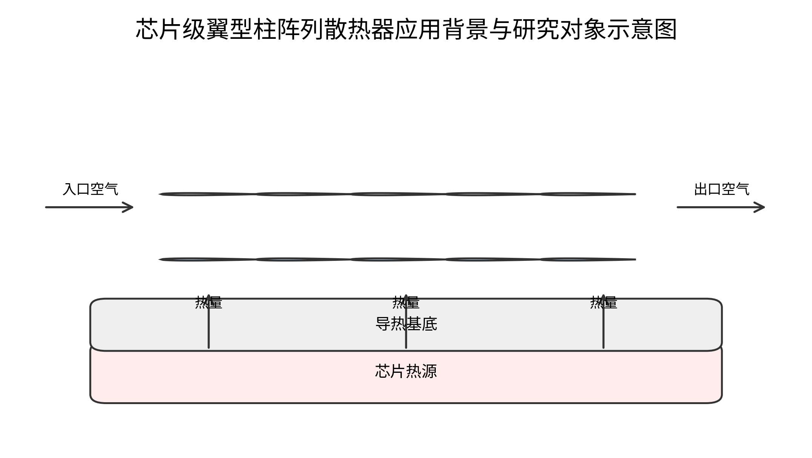

**图1-1 芯片级翼型柱阵列散热器应用背景与研究对象示意图**

但是，翼型柱阵列散热器的流热性能受多个结构参数共同影响。翼型外形、厚度、阵列间距、错排偏移和旋转角之间存在明显耦合作用，不同参数组合会改变柱间通道宽度、局部加速区域、尾迹覆盖范围、压力集中区和温度高梯度区域。CFD 数值模拟能够获得散热器内部速度场、压力场和温度场，但对于多参数结构优化问题，逐点 CFD 计算会带来较高计算成本[33,46-51]。因此，需要结合代理模型和智能优化方法提高结构筛选效率。

近年来，机器学习代理模型逐渐被用于流动与传热性能预测。相关研究表明，人工神经网络、随机森林、卷积神经网络和深度学习模型能够建立结构参数与流热性能之间的非线性映射关系，从而降低 CFD 计算成本[5,34-41,61-65,70-72]。传统代理模型通常以低维结构参数作为输入，以整体性能指标作为输出，能够实现快速预测，但难以反映压力场、速度场和温度场等空间流热分布信息。CNN 和 U-Net 等深度学习模型具有较强空间特征表达能力，为流热场重建提供了新的方法基础[63-67]。

基于上述问题，本文以翼型柱阵列散热器为研究对象，提出基于 MLP-CNN 流热场重建的流热性能预测与参数优化方法。本文通过 CFD 构建七参数样本数据集，将压力场、速度大小场和温度场整理为 PVT 三通道流热场监督标签，训练 MLP-CNN 模型同时实现流热场重建与 Nu/f 性能预测；随后结合差分进化算法搜索综合性能较优的七参数结构，并通过二维 CFD 复算和三维芯片级模型验证优化结果。该研究能够在降低 CFD 优化成本的同时，提高代理模型对流热场空间分布的表达能力，为翼型柱阵列散热器快速优化设计提供方法参考。

## 1.2 国内外研究现状

### 1.2.1 翼型柱阵列散热器强化传热技术研究

散热器空气侧强化传热结构主要通过增加换热面积、扰动热边界层、改变流动路径和增强局部对流来提高散热能力。已有研究从百叶窗翅片、开缝翅片、圆管、椭圆管和管翅式换热器等角度分析了空气侧结构对传热与阻力特性的影响，表明结构参数改变会同时影响换热面积、局部扰动、尾迹分布和压降水平[14-27]。

翼型结构由于具有流线型外形，在绕流过程中能够减弱前缘冲击和尾部流动分离，被逐渐引入换热器和散热器设计中。翼型管和翼型翅片研究表明，流线型截面能够减弱钝体绕流中的大范围尾迹区，并有助于降低空气侧阻力；翼型针肋和翼型热沉研究进一步说明，翼型结构在紧凑式风冷散热场景中具有较好的应用潜力[28-32,56-59]。

已有研究表明，合理的错排结构有助于改变主流穿透路径，减弱前排尾迹对后排结构的遮挡；适当增大柱间间距可以改善通流能力，降低局部阻塞；翼型厚度和迎角变化则会同时影响换热面积、局部扰动和压力损失。因此，翼型柱阵列散热器的优化本质上是多结构参数耦合作用下的流热性能平衡问题。

总体来看，翼型柱阵列结构兼具流线型低阻特征和阵列强化换热优势，在芯片级风冷散热器中具有较好的应用潜力。但目前相关研究多集中于单因素分析或少量结构参数组合，对翼型形状参数、阵列布局参数和姿态参数之间耦合作用的系统研究仍需进一步加强。

### 1.2.2 基于数值模拟的散热器流热性能研究

CFD 已被广泛用于散热器流热耦合性能分析。通过求解连续性方程、动量方程和能量方程，可以获得空气侧速度场、压力场和温度场，并进一步计算 Nu、f、压降和热阻等指标[33,46-49]。对于芯片级风冷散热器，流固耦合数值模拟能够描述芯片热源、导热基底、鳍片结构和空气流道之间的热量传递过程，是结构优化和性能评价的重要工具[52-55]。

在参数化散热器研究中，通常需要在固定材料物性、入口速度、入口温度、热源功率和边界条件下，对不同结构组合进行 CFD 计算，从而比较结构参数变化对换热能力和流动阻力的影响。二维模型具有建模简单、计算成本低和便于批量生成样本的优点，可用于结构参数影响规律分析和代理模型训练；三维模型能够考虑鳍片高度、基底导热、芯片热源面积和端部绕流等真实工程因素，可用于验证优化结构在实际散热场景中的适用性。

对于翼型柱阵列散热器而言，CFD 模拟不仅能够提供 Nu、f 等整体性能指标，还能够揭示柱间局部加速、尾迹干扰、压力集中和热尾迹扩展等空间流热特征。这些空间场信息对于理解结构参数影响规律和解释优化结构性能提升具有重要价值。若仅提取整体标量指标，而忽略 CFD 结果中的压力场、速度场和温度场，将难以充分发挥数值模拟数据的价值。

为保证 CFD 计算结果可靠性，网格无关性分析通常用于比较不同网格密度下关键性能指标的变化，从而确定兼顾计算精度和计算成本的网格方案[50-51]。然而，CFD 模拟本身计算成本较高。对于包含多个设计变量的散热器结构，若在优化过程中对每一个候选结构均重新进行建模、划分网格和求解，将消耗大量计算资源。因此，如何在保证结果可靠性的前提下降低 CFD 调用次数，是散热器参数优化中的重要问题。

### 1.2.3 基于代理模型的散热器参数优化研究

散热器结构优化通常需要在多个几何参数和边界条件组合下反复进行数值模拟或实验测试。对于翼型柱阵列散热器而言，翼型外形、厚度、阵列间距、错排偏移和旋转角等参数会共同影响空气侧流动组织、局部换热强度和压力损失。若直接采用 CFD 对每一个候选结构进行求解，则需要重复经历几何建模、网格划分、流热耦合求解和结果后处理等步骤，计算成本较高。因此，利用机器学习代理模型建立结构参数与流热性能之间的快速映射关系，已成为散热器参数优化中的重要研究方向。

早期代理模型多以人工神经网络、响应面模型、支持向量机、随机森林等方法为主，其主要思想是以结构参数、入口条件或材料参数作为输入，以 Nu、f、压降、热阻或最高温度等整体指标作为输出。相关研究表明，代理模型能够在一定程度上降低 CFD 调用次数，并提高参数优化效率[34-41]。但是，此类标量代理模型通常只学习低维输入与整体性能之间的关系，难以反映散热器内部压力场、速度场和温度场的空间分布特征。对于翼型柱阵列这类强几何耦合结构，仅依靠整体指标难以解释不同参数组合导致性能变化的具体流动和传热机理。

近年来，深度学习方法在流体力学快速预测和流场重建领域得到广泛关注。与传统标量代理模型不同，CNN、U-Net 等卷积结构能够利用局部卷积运算提取空间特征，并已被用于二维障碍物流场、翼型绕流和 RANS 流场的快速近似预测。Guo 等利用卷积神经网络实现了二维障碍物稳态流场的快速预测，证明 CNN 对几何边界与流场分布之间映射关系具有一定学习能力；Thuerey 等进一步将深度学习方法用于翼型绕流 RANS 结果预测，说明神经网络在气动流场近似建模中具有较高效率；Brunton 等对机器学习在流体力学中的应用进行了系统总结，指出深度学习能够为复杂流动建模和流场特征提取提供新的工具[61-65]。

但是，现有流场重建研究多侧重于物理场本身的快速近似，即将神经网络作为 CFD 求解器的替代或加速工具，重点评价预测流场与真实流场之间的像素误差或场误差。对于散热器结构优化问题而言，仅重建局部流场仍不足以直接服务工程设计，因为实际优化目标通常同时涉及整体换热能力、流动阻力和综合性能评价。因此，如何将空间流热场重建与 Nu、f、η 等宏观工程指标预测进行联合建模，是代理模型应用于散热器优化时需要进一步解决的问题。

基于上述研究现状，本文并不将 MLP-CNN 模型简单作为流场可视化工具，而是将 CFD 计算得到的压力场 p、速度大小场 U 和温度场 T 作为训练阶段的监督标签，并同时引入 Nu 和 f 的标量预测分支。模型在学习七参数结构变量与 PVT 空间流热场之间映射关系的同时，进一步学习结构参数与整体流热性能之间的非线性关系。该方法使代理模型既能够输出整体性能指标，又能够提供局部流热场分布，从而为差分进化优化和优化机理分析提供双层信息支撑。

此外，本文的优化阶段并不依赖候选结构的 CFD 云图输入，而是仅以七个结构参数作为优化变量，通过训练完成的 MLP-CNN 代理模型快速预测 Nu 和 f，并进一步计算综合评价因子 η。这样既避免了优化过程中反复调用 CFD 的高成本问题，也避免了新候选结构缺少真实流场图像而无法参与优化的问题。与传统标量代理模型相比，本文模型在训练阶段引入 PVT 流热场监督信息，使其能够学习结构参数对空间流热分布的影响；与单纯流场重建模型相比，本文进一步将场重建与宏观性能预测相结合，使代理模型能够直接服务于翼型柱阵列散热器的参数优化。

## 1.3 本文主要研究内容及技术路线

### 1.3.1 主要研究内容

针对翼型柱阵列散热器多参数优化中 CFD 计算成本高、传统标量代理模型难以表达空间流热场信息以及二维优化结果缺乏三维工程验证等问题，本文提出基于 MLP-CNN 流热场重建的流热性能预测与参数优化方法。主要研究内容如下。

（1）建立翼型柱阵列散热器二维 CFD 数值模型和七参数设计空间。采用 $T_a$、$T_{wa}$、$T_b$、$T_s$、$T_t$、$T_{ad}$ 和 $\theta$ 七个参数描述翼型柱外形、厚度、阵列间距、错排偏移和整体旋转角。基于统一材料物性、入口条件、出口条件和热源设置，开展二维流热耦合 CFD 计算，获得不同结构组合下的 Nu、f、$\eta$ 和 $p/U/T$ 流热场。

（2）构建 PVT 三通道流热场数据集。将 COMSOL 计算得到的压力场 $p$、速度大小场 $U$ 和温度场 $T$ 统一采样到规则网格上，形成尺寸为 $3\times96\times320$ 的 PVT 三通道数据。构建包含 1000 组样本的数据集，并划分为训练集、验证集和测试集，为 MLP-CNN 流热场重建模型训练提供监督标签。

（3）构建 MLP-CNN 流热场重建代理模型。模型以七参数结构变量、归一化空间坐标和区域条件信息为输入，通过 MLP 编码器提取结构潜在特征，并利用 CNN/U-Net 解码器重建压力场、速度场和温度场，同时通过性能预测分支输出 Nu 和 f。通过场重建损失、Nu/f 预测损失、$\eta$ 一致性损失和场梯度一致性损失共同约束模型训练。

（4）开展模型性能验证、交叉验证和消融实验。基于测试集评价模型对 Nu、f、$\eta$ 和 $p/U/T$ 流热场的预测精度；采用 3 折交叉验证分析模型对数据划分方式的敏感性；通过 A0-A4 消融实验分析坐标通道、区域条件信息、物理一致性损失和 CBAM 注意力机制对模型性能的影响。

（5）结合差分进化算法开展七参数结构优化。将训练好的 MLP-CNN 性能预测分支嵌入差分进化算法，以综合性能评价因子 $\eta$ 最大化为目标，在七参数设计空间内搜索高性能候选结构。随后将优化结构重新导入 COMSOL 进行二维 CFD 独立复算，并结合速度场、压力场和温度场分析其性能提升机理。

（6）建立三维芯片级翼型鳍片散热器代表性模型进行验证。将二维优化得到的七参数结构迁移到三维模型中，与基准结构在相同入口条件、热源功率、材料物性和求解设置下进行对比，分析芯片平均温度、最高温度、等效热阻、压降、Nu3D、f3D 和 $\eta_{3D}$ 等指标，验证二维优化结构在三维芯片级散热器中的适用性。

### 1.3.2 研究技术路线

本文技术路线可概括为“二维 CFD 样本构建—PVT 流热场数据集生成—MLP-CNN 流热场重建—差分进化参数优化—二维 CFD 复算—三维芯片级验证”。

首先，建立翼型柱阵列散热器二维流热耦合 CFD 模型，明确控制方程、材料物性、边界条件、网格划分和性能评价指标。在此基础上，定义七参数设计变量及其取值范围，并生成不同结构组合下的 CFD 样本。每组样本均提取 Nu、f、$\eta$ 以及压力场、速度场和温度场。

其次，对 CFD 结果进行后处理，将压力场 $p$、速度大小场 $U$ 和温度场 $T$ 统一采样至规则网格，构建 $3\times96\times320$ 的 PVT 三通道流热场数据集。该数据集中的 CFD 数值场作为训练阶段监督标签，用于约束模型学习结构参数与空间流热场之间的映射关系。

然后，构建 MLP-CNN 流热场重建代理模型。模型通过 MLP 编码七参数结构变量，通过 CNN/U-Net 解码规则网格上的 $p/U/T$ 流热场，并通过性能预测分支输出 Nu 和 f。训练过程中同时考虑场重建误差、性能预测误差、$\eta$ 一致性误差和场梯度一致性误差。训练完成后，采用测试集、交叉验证和消融实验评价模型预测精度、稳定性和关键模块作用。

最后，将训练后的 MLP-CNN 性能预测分支嵌入差分进化算法，以综合性能评价因子 $\eta$ 最大化为目标搜索七参数最优组合。对优化结构进行二维 COMSOL CFD 独立复算，验证代理优化结果可靠性，并结合速度场、压力场和温度场分析性能提升机理。在此基础上，进一步建立三维芯片级翼型鳍片散热器模型，对基准结构和优化结构进行三维流热性能对比，验证二维优化结果在工程散热场景中的适用性。

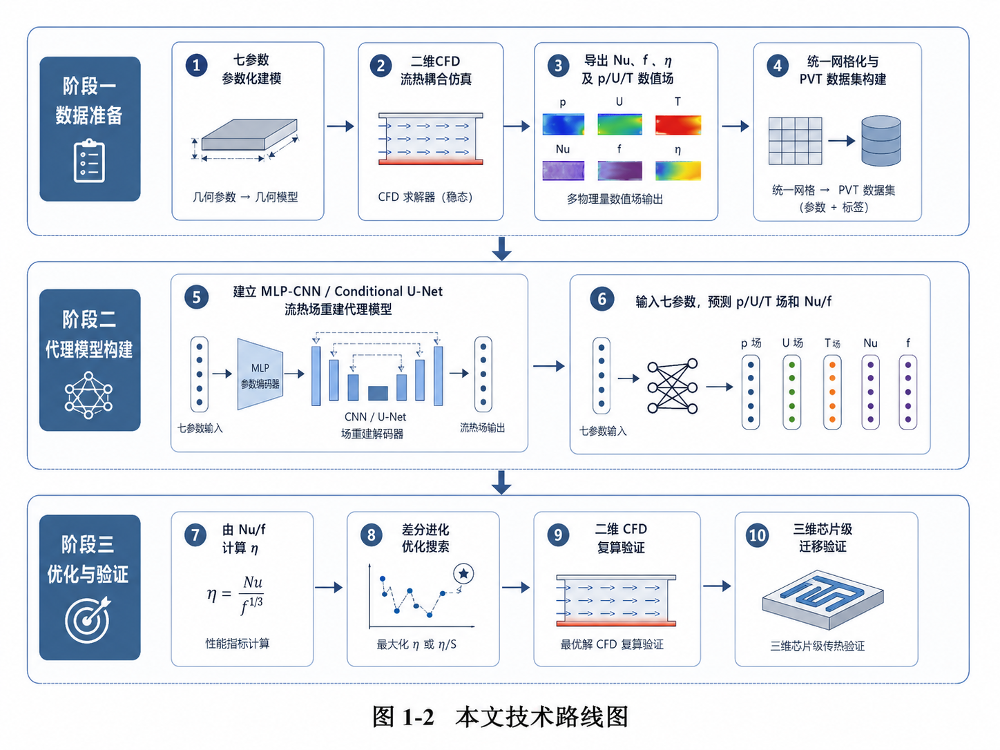

**图1-2 本文研究技术路线图**

## 1.4 本章小结

本章首先阐述了芯片级散热器热管理需求和翼型柱阵列散热器研究意义，指出传统 CFD 逐点优化成本高、标量代理模型难以表达空间流热信息等问题。随后，从翼型柱阵列散热器强化传热、基于数值模拟的散热器流热性能研究以及基于代理模型的散热器参数优化研究三个方面综述了相关研究现状，并分析了现有研究存在的不足。

在此基础上，本章明确了本文主要研究内容和研究技术路线。本文围绕翼型柱阵列散热器七参数优化问题，构建二维 CFD 样本与 PVT 流热场数据集，提出 MLP-CNN 流热场重建代理模型，并结合差分进化算法、二维 CFD 复算和三维芯片级模型验证，形成完整的流热性能预测与参数优化研究流程。上述内容为后续章节的理论方法、数值建模、代理模型训练和优化验证奠定基础。

---

# 第2章 翼型柱阵列散热器流热耦合理论与研究方法

## 2.1 引言

第1章阐述了翼型柱阵列散热器在芯片级风冷散热中的研究意义，并明确了本文采用 MLP-CNN 流热场重建代理模型和差分进化算法开展七参数优化的研究思路。为了支撑后续二维 CFD 数值模拟、PVT 流热场数据集构建、代理模型训练和参数优化工作，有必要对翼型柱阵列散热器的流热耦合机理、性能评价指标、流热场重建模型和智能优化方法进行理论说明。

翼型柱阵列散热器的性能受流动和传热共同影响。空气流经翼型柱阵列时，会在柱间通道形成局部加速，在翼型柱尾部形成尾迹区，并在前后排结构之间产生流动干扰。与此同时，固体区域中的热量通过导热传递至翼型柱和基底表面，再通过空气侧强制对流带出计算域。因此，散热器性能评价不能只考虑换热能力，还需要同时考虑流动阻力和综合性能。

本文以 Nu、f 和综合性能评价因子 $\eta$ 作为二维模型的主要性能指标，以芯片平均温度、最高温度、等效热阻、压降和三维综合性能因子作为三维验证指标。在代理模型方面，本文采用 MLP-CNN 流热场重建方法，使模型能够在预测 Nu 和 f 的同时重建压力场、速度大小场和温度场。该方法能够充分利用 CFD 数值场中的空间流热信息，为后续差分进化参数优化和优化结构机理分析提供理论基础。

## 2.2 翼型柱阵列散热器流热耦合机理

### 2.2.1 空气侧强制对流换热机理

风冷散热器主要依靠空气强制对流带走固体结构中的热量。对于翼型柱阵列散热器，芯片或等效热源产生的热量首先在固体区域内通过导热传递至翼型柱和基底表面，然后由流经阵列区域的空气带出计算域。空气侧换热能力与入口速度、空气物性、固体表面温度、流动路径和局部速度梯度等因素密切相关。

当空气流经翼型柱阵列时，翼型柱表面附近形成热边界层。若空气流动较弱或局部尾迹区范围较大，热边界层厚度增加，局部换热能力下降；若柱间通道形成适当加速，空气与高温固体表面的热量交换增强，热边界层变薄，局部对流换热能力提高。因此，合理设计翼型柱外形和阵列排布，有助于改善空气流动组织，提高整体换热性能。

与传统圆柱或矩形柱相比，翼型柱具有较好的流线型特征，能够减弱钝体绕流中的强分离和大范围尾迹区。同时，翼型柱阵列仍可通过排布方式形成局部扰动和通道加速，在控制流阻的同时增强换热。因此，翼型柱阵列散热器的设计目标是在增加有效换热、改善空气流动和降低压力损失之间取得平衡。

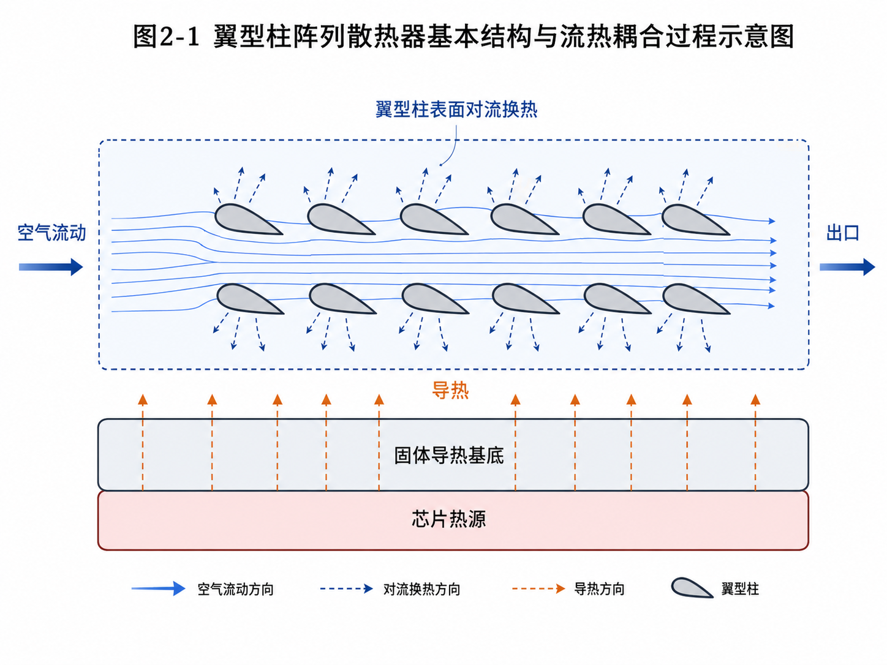

**图2-1 翼型柱阵列散热器基本结构与流热耦合过程示意图**

### 2.2.2 翼型柱阵列流动阻力形成机理

空气流经翼型柱阵列时，流动阻力主要来源于沿程摩擦损失、局部压力损失和尾迹损失。翼型柱前缘区域由于来流受阻形成局部高压区，翼型柱尾部和下游区域可能出现低压尾迹区。前后排翼型柱之间的相对位置会影响尾迹恢复过程，进而影响后排翼型柱来流条件和整体压降。

阵列横向间距 $T_s$ 直接影响柱间通道宽度。当横向间距较小时，空气通道变窄，局部流速增加，换热可能增强，但同时容易产生较大压降；当横向间距较大时，通流能力改善，局部阻塞降低，但若间距过大，空气与固体表面的换热接触可能减弱。纵向间距 $T_t$ 和错排偏移 $T_{ad}$ 会改变前后排之间的尾迹干扰关系，影响后排翼型柱附近的速度分布和温度分布。

旋转角 $\theta$ 则会改变翼型柱相对于来流方向的姿态，影响前缘压力分布、表面速度梯度和尾迹方向。合理的旋转角有助于改善局部流动组织，但过大的姿态变化可能增加迎风面积和局部压力损失。因此，翼型柱阵列散热器的流动阻力是多个结构参数共同作用的结果。

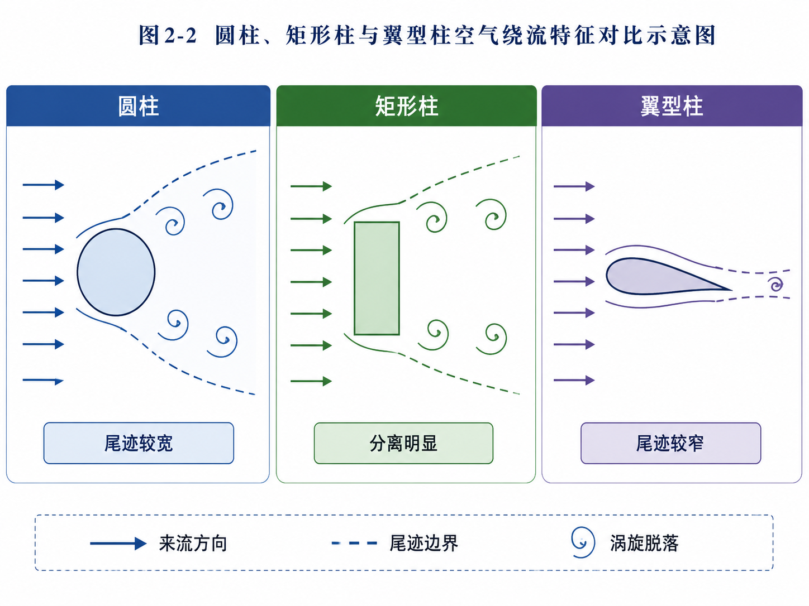

**图2-2 不同柱形截面空气绕流特征对比示意图**

### 2.2.3 流热耦合关系

翼型柱阵列散热器中的流动和传热过程具有明显耦合关系。速度场决定空气与固体表面的换热强度，压力场反映空气流动阻力和能量损失，温度场则反映热量在固体和空气中的传递过程。结构参数变化会同时影响这三个物理场，从而改变 Nu、f 和 $\eta$ 等整体性能指标。

例如，增大柱间通道宽度可能降低流动阻力，但也可能改变空气与高温固体表面的接触强度；增大翼型厚度可能增加换热面积和局部扰动，但也可能提高阻塞程度；错排偏移可以改变尾迹覆盖关系，使后排翼型柱获得更好的低温来流。由此可见，翼型柱阵列散热器的优化不能只关注单一流场或单一温度指标，而需要从流动、传热和综合性能三个角度共同评价。

## 2.3 流热耦合控制方程

### 2.3.1 流体区域控制方程

本文二维 CFD 模型和三维验证模型均涉及空气侧流动与换热过程。空气被视为定常、不可压缩牛顿流体。流体区域满足连续性方程、动量方程和能量方程。

连续性方程为：

$$
\nabla\cdot \mathbf{u}=0
$$

式中，$\mathbf{u}$ 为速度矢量。

动量方程为：

$$
\rho(\mathbf{u}\cdot\nabla)\mathbf{u}=-\nabla p+\mu\nabla^2\mathbf{u}
$$

式中，$\rho$ 为空气密度，$p$ 为压力，$\mu$ 为空气动力黏度。

能量方程为：

$$
\rho c_p(\mathbf{u}\cdot\nabla T)=k_f\nabla^2T
$$

式中，$c_p$ 为空气定压比热容，$T$ 为温度，$k_f$ 为空气导热系数。

在二维模型中，速度大小场由速度分量合成：

$$
U=\sqrt{u^2+v^2}
$$

其中，$u$ 和 $v$ 分别为二维流场中两个方向的速度分量。速度大小场 $U$ 与压力场 $p$、温度场 $T$ 共同组成本文的 PVT 三通道流热场数据。

### 2.3.2 固体区域导热方程

翼型柱、导热基体和三维散热器鳍片等固体区域主要通过导热传递热量。对于含有体积热源的二维固体区域，其稳态导热方程可写为：

$$
\nabla\cdot(k_s\nabla T)+q_v=0
$$

式中，$k_s$ 为固体导热系数，$q_v$ 为体积生热率。

对于三维芯片级散热器模型，芯片热源可采用等效热功率 $Q$ 表征，热量经基底向翼型鳍片传递，并最终通过空气侧对流带出计算域。固体区域导热能力直接影响芯片平均温度、最高温度和等效热阻，是三维模型验证的重要组成部分。

### 2.3.3 流固耦合边界条件

在流体与固体接触界面处，需要满足速度、温度和热流连续条件。空气侧在固体壁面处满足无滑移条件：

$$
\mathbf{u}=0
$$

流固界面温度连续：

$$
T_f=T_s
$$

式中，$T_f$ 为流体侧温度，$T_s$ 为固体侧温度。

流固界面热流连续：

$$
-k_f\frac{\partial T_f}{\partial n}
=
-k_s\frac{\partial T_s}{\partial n}
$$

式中，$n$ 为界面法向方向。上述条件保证固体区域的热量能够连续传递至空气侧，是散热器流热耦合数值模拟的基础。

## 2.4 流热性能评价指标

### 2.4.1 努塞尔数 Nu

努塞尔数 Nu 用于表征空气侧对流换热能力，是散热器换热性能评价中的重要无量纲指标。一般可表示为：

$$
Nu=\frac{hL_c}{k_f}
$$

式中，$h$ 为等效对流换热系数，$L_c$ 为特征长度，$k_f$ 为空气导热系数。Nu 越大，表示空气侧对流换热能力越强。

在本文二维翼型柱阵列模型中，Nu 用于评价不同七参数结构组合下的整体换热能力。由于所有样本采用统一物性参数、入口条件、热源条件和后处理方法，因此 Nu 的变化主要反映翼型柱外形和阵列排布对空气侧换热性能的影响。

### 2.4.2 摩擦因子 f

摩擦因子 f 用于评价空气流经散热器结构时的流动阻力。对于给定计算域，可基于进出口压降定义为：

$$
f=\frac{2\Delta p D_h}{\rho u_{in}^2 L}
$$

式中，$\Delta p$ 为进出口压降，$D_h$ 为水力直径或特征长度，$u_{in}$ 为入口平均速度，$L$ 为流动方向特征长度。f 越大，表示空气流经散热器时的阻力损失越大。

在翼型柱阵列散热器中，f 主要受翼型柱迎风姿态、柱间通道宽度、尾迹恢复和局部阻塞影响。优化结构设计时，不能只追求 Nu 提高，还需要控制 f 的增长，否则可能导致风机功耗增加，降低整体工程应用价值。

### 2.4.3 综合性能评价因子 $\eta$

为了同时考虑换热增强和流动阻力代价，本文引入综合性能评价因子 $\eta$：

$$
\eta=\frac{Nu/Nu_0}{(f/f_0)^{1/3}}
$$

式中，$Nu_0$ 和 $f_0$ 分别为基准结构的努塞尔数和摩擦因子。$\eta$ 越大，说明结构在综合考虑换热能力和流动阻力后性能越优。

该指标能够避免单纯追求 Nu 增大而忽略流阻代价的问题。当某一结构 Nu 提高但 f 也明显增加时，$\eta$ 可以综合反映其换热收益是否足以抵消阻力损失。本文差分进化算法以 $\eta$ 最大化为优化目标，用于搜索综合性能较优的七参数组合。

### 2.4.4 等效热阻 $R_{th}$

在三维芯片级散热器验证中，除 Nu、f 和 $\eta$ 外，还需要关注芯片温度和等效热阻。等效热阻定义为：

$$
R_{th}=\frac{T_{avg}-T_{in}}{Q}
$$

式中，$T_{avg}$ 为芯片平均温度，$T_{in}$ 为入口空气温度，$Q$ 为芯片热源功率。$R_{th}$ 越小，表示散热器在相同热源功率下能够以更小温差将芯片热量传递至空气侧，整体散热能力越强。

三维模型中，芯片最高温度 $T_{max}$ 用于评价局部热点控制能力，芯片平均温度 $T_{avg}$ 用于评价整体热管理水平，压降 $\Delta p$ 用于评价空气侧流动阻力。通过这些指标可以更全面地验证二维优化结构在三维芯片级散热器中的适用性。

## 2.5 MLP-CNN 流热场重建代理模型理论

### 2.5.1 代理模型基本思想

代理模型的核心思想是利用已有 CFD 数据训练一个快速预测模型，用较低计算成本近似替代高成本 CFD 求解。对于散热器参数优化问题，代理模型可以建立结构参数与性能指标之间的非线性映射关系，从而在优化过程中快速评估候选结构。

传统代理模型通常只输出 Nu、f 或温度等标量指标。本文进一步将压力场、速度大小场和温度场作为训练监督标签，使模型不仅学习七参数结构变量到 Nu/f 的映射关系，也学习七参数结构变量到空间流热场分布的映射关系。这样，模型能够在性能预测的同时提供流热场重建结果，提高优化结果的空间流热分析能力。

### 2.5.2 模型输入与输出

本文 MLP-CNN 流热场重建代理模型的输入包括七参数结构变量、归一化空间坐标和区域条件信息。七参数结构变量为：

$$
\mathbf{X}_7=[T_a,T_{wa},T_b,T_s,T_t,T_{ad},\theta]^T
$$

归一化空间坐标用于标识规则网格上每个采样点的位置，区域条件信息用于区分流体区域和固体区域。模型通过这些输入学习不同空间位置处的压力、速度和温度分布。

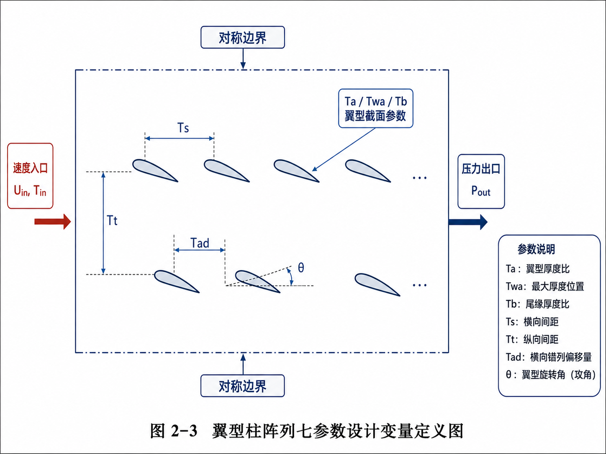

**图2-3 七参数设计变量定义示意图**

模型输出包括：

$$
\hat{\mathbf{Y}}_{field}=[\hat{p},\hat{U},\hat{T}]
$$

以及标量性能指标：

$$
\hat{\mathbf{Y}}_{scalar}=[\widehat{Nu},\widehat{f}]
$$

其中，$\hat{p}$、$\hat{U}$ 和 $\hat{T}$ 分别为模型预测的压力场、速度大小场和温度场，$\widehat{Nu}$ 和 $\widehat{f}$ 为模型预测的努塞尔数和摩擦因子。综合性能评价因子 $\hat{\eta}$ 由 $\widehat{Nu}$ 和 $\widehat{f}$ 根据定义计算得到。

### 2.5.3 MLP 参数编码器

MLP 参数编码器用于将七参数结构变量映射为高维潜在特征。其基本形式可写为：

$$
\mathbf{z}=F_{MLP}(\mathbf{X}_7)
$$

式中，$\mathbf{z}$ 为结构潜在特征，$F_{MLP}$ 表示多层感知机映射函数。

七个结构参数具有不同物理意义和不同取值范围，直接输入网络可能造成训练不稳定。因此，训练前需要对七参数进行归一化或标准化处理。MLP 编码器能够提取参数之间的非线性耦合关系，例如 $T_s$ 与 $T_b$ 对通流能力和换热面积的共同影响，$T_{ad}$ 与 $\theta$ 对尾迹干扰和后排来流条件的共同影响。

### 2.5.4 CNN/U-Net 流热场解码器

CNN/U-Net 解码器用于将结构潜在特征、空间坐标和区域条件信息映射为规则网格上的 PVT 流热场。其基本形式可写为：

$$
\hat{\mathbf{Y}}_{field}=F_{CNN}(\mathbf{z},\mathbf{C})
$$

式中，$\mathbf{C}$ 表示归一化空间坐标和区域条件信息，$F_{CNN}$ 表示 CNN/U-Net 解码函数。

U-Net 结构具有多尺度特征融合能力。编码路径可以提取全局流动趋势，解码路径可以逐步恢复空间分辨率，跳跃连接能够保留局部细节。对于翼型柱阵列散热器，压力场、速度场和温度场同时包含全局分布和局部高梯度特征，因此适合采用 CNN/U-Net 进行重建。

### 2.5.5 性能预测分支

性能预测分支基于结构潜在特征输出 Nu 和 f：

$$
[\widehat{Nu},\widehat{f}]=F_{reg}(\mathbf{z})
$$

式中，$F_{reg}$ 为性能回归分支。预测得到 Nu 和 f 后，可进一步计算：

$$
\hat{\eta}=\frac{\widehat{Nu}/Nu_0}{(\widehat{f}/f_0)^{1/3}}
$$

性能预测分支是差分进化优化中的快速适应度评估器。对于每一组候选七参数结构，模型可快速输出 Nu 和 f，并计算 $\eta$，从而避免优化过程中频繁调用 CFD 求解器。


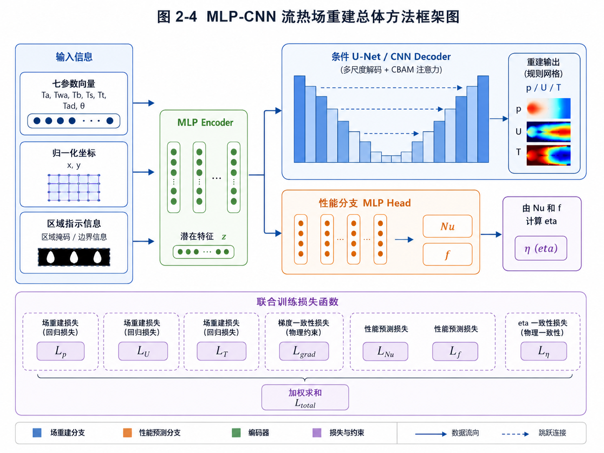

**图2-4 MLP-CNN 流热场重建代理模型总体方法框架图**

## 2.6 损失函数与物理一致性约束

### 2.6.1 场重建损失

为了约束模型准确重建压力场、速度场和温度场，本文采用场重建损失衡量预测场与 CFD 标签场之间的差异。对于压力场、速度大小场和温度场，可分别定义：

$$
L_p=\frac{1}{N}\sum_{i=1}^{N}|\hat{p}_i-p_i|
$$

$$
L_U=\frac{1}{N}\sum_{i=1}^{N}|\hat{U}_i-U_i|
$$

$$
L_T=\frac{1}{N}\sum_{i=1}^{N}|\hat{T}_i-T_i|
$$

式中，$N$ 为规则网格采样点数量，带帽变量表示模型预测值，不带帽变量表示 CFD 标签值。

场重建损失使模型能够学习不同结构参数下的空间流热场分布规律。相比只预测标量性能指标，场重建任务能够引导模型关注柱间通道、翼型柱边界、尾迹区和高温区等关键区域。

### 2.6.2 性能预测损失

Nu 和 f 是本文参数优化中的核心标量指标，因此需要设置性能预测损失：

$$
L_{Nu}=|\widehat{Nu}-Nu|
$$

$$
L_f=|\widehat{f}-f|
$$

性能预测损失保证模型能够准确预测候选结构的换热能力和流动阻力。由于差分进化算法以模型预测的 Nu 和 f 计算 $\eta$，因此 Nu/f 预测精度直接影响优化搜索可靠性。

### 2.6.3 $\eta$ 一致性损失

为了保证 Nu、f 和 $\eta$ 之间满足统一评价关系，本文引入 $\eta$ 一致性损失：

$$
L_{\eta}=|\hat{\eta}-\eta|
$$

其中，

$$
\hat{\eta}=\frac{\widehat{Nu}/Nu_0}{(\widehat{f}/f_0)^{1/3}}
$$

$\eta$ 一致性损失能够使模型训练目标与后续优化目标保持一致，避免模型虽然分别拟合 Nu 和 f，但二者组合得到的综合性能评价因子与真实标签不一致的问题。

### 2.6.4 场梯度一致性损失

翼型柱边界、柱间通道和尾迹区域通常存在较大的速度梯度、压力梯度和温度梯度。为了提高模型对局部高梯度区域的表达能力，本文引入场梯度一致性损失：

$$
L_{grad}=
\left\|
\nabla\hat{\mathbf{Y}}_{field}
-
\nabla\mathbf{Y}_{field}
\right\|_1
$$

其中，$\nabla\hat{\mathbf{Y}}_{field}$ 和 $\nabla\mathbf{Y}_{field}$ 分别为预测流热场和 CFD 标签流热场的空间梯度。该损失有助于模型更好保留边界附近和尾迹区域的局部变化趋势。

### 2.6.5 总损失函数

综合场重建损失、性能预测损失、$\eta$ 一致性损失和场梯度一致性损失，本文总损失函数可写为：

$$
L=w_pL_p+w_UL_U+w_TL_T+\lambda_gL_{grad}
+\alpha L_{Nu}+\beta L_f+\gamma L_{\eta}
$$

式中，$w_p$、$w_U$、$w_T$、$\lambda_g$、$\alpha$、$\beta$ 和 $\gamma$ 为各项损失权重。通过多任务损失共同约束，模型能够同时兼顾流热场重建精度、标量性能预测精度和综合性能评价一致性。

## 2.7 CBAM 注意力机制

为了进一步增强模型对关键流热区域的表达能力，本文在 MLP-CNN 流热场重建模型中引入 CBAM 注意力机制。CBAM 由通道注意力模块和空间注意力模块组成，能够分别从通道维度和空间维度调整特征权重。

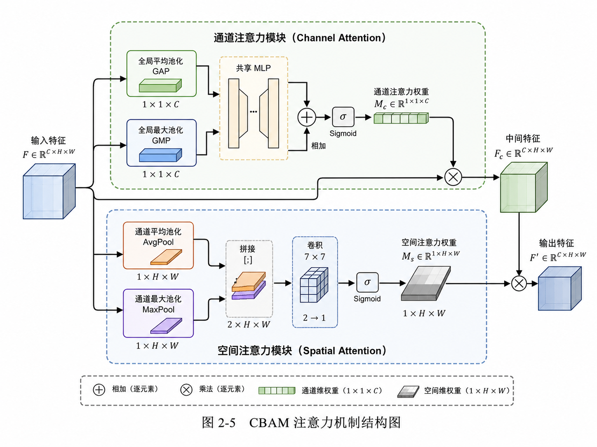

**图2-5 CBAM 注意力机制结构示意图**

### 2.7.1 通道注意力模块

通道注意力模块用于判断不同特征通道的重要性。对于输入特征图 $\mathbf{F}$，首先分别进行全局平均池化和全局最大池化，得到两个通道描述向量；然后通过共享多层感知机生成通道权重；最后将通道权重与原始特征图相乘，得到加权后的通道特征。

通道注意力可表示为：

$$
\mathbf{M}_c(\mathbf{F})
=
\sigma\left(MLP(AvgPool(\mathbf{F}))+MLP(MaxPool(\mathbf{F}))\right)
$$

其中，$\sigma$ 为 Sigmoid 函数，$\mathbf{M}_c$ 为通道注意力权重。

通道注意力能够帮助模型区分不同特征通道对流热场重建的重要性，使网络更加关注与压力变化、速度加速和温度扩散相关的有效特征。

### 2.7.2 空间注意力模块

空间注意力模块用于判断不同空间位置的重要性。对于经过通道注意力加权后的特征图，分别在通道维度上进行平均池化和最大池化，并将二者拼接后通过卷积层和 Sigmoid 函数生成空间权重图：

$$
\mathbf{M}_s(\mathbf{F})
=
\sigma\left(f^{7\times7}([AvgPool(\mathbf{F});MaxPool(\mathbf{F})])\right)
$$

其中，$f^{7\times7}$ 表示卷积核尺寸为 $7\times7$ 的卷积操作，$\mathbf{M}_s$ 为空间注意力权重。

空间注意力能够增强模型对翼型柱边界、柱间通道、尾迹区和高温区等关键空间区域的关注能力。这些区域通常对 Nu、f 和 $\eta$ 具有重要影响，因此空间注意力机制有助于提高 PVT 流热场重建精度。

### 2.7.3 CBAM 在本文模型中的作用

在本文 MLP-CNN 流热场重建模型中，CBAM 主要用于增强 CNN/U-Net 解码过程中的关键特征表达。通过通道注意力和空间注意力的联合作用，模型能够在多尺度特征中更加关注与流热性能密切相关的特征通道和空间区域。

消融实验结果表明，引入 CBAM 后，U_MAE、T_MAE、field_MAE 和 boundary_MAE 均进一步降低，说明注意力机制主要改善了流热场重建效果，特别是对速度场、温度场和边界区域的预测具有积极作用。

## 2.8 差分进化算法

### 2.8.1 差分进化算法基本原理

差分进化算法是一种基于种群的全局优化算法，适合求解连续变量优化问题。该算法通过种群初始化、变异、交叉和选择不断更新候选解，不依赖目标函数梯度，因此适用于复杂非线性优化问题。

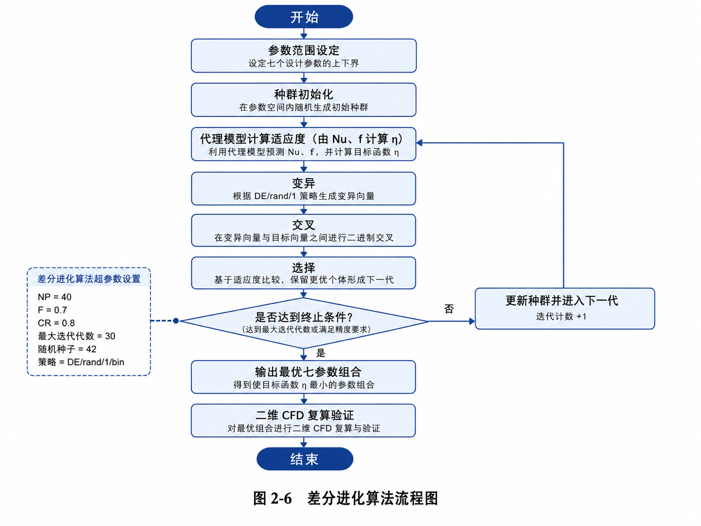

**图2-6 差分进化算法优化流程图**

对于本文七参数优化问题，候选个体可表示为：

$$
\mathbf{X}_i=[T_a,T_{wa},T_b,T_s,T_t,T_{ad},\theta]_i
$$

其中，$i$ 表示种群中的第 $i$ 个个体。每个个体均对应一个翼型柱阵列结构参数组合。

### 2.8.2 种群初始化

在给定七参数上下界范围内，随机生成初始种群：

$$
X_{i,j}=X_{j}^{min}+\mathrm{rand}(0,1)(X_{j}^{max}-X_{j}^{min})
$$

式中，$X_{i,j}$ 为第 $i$ 个个体的第 $j$ 个参数，$X_j^{min}$ 和 $X_j^{max}$ 分别为第 $j$ 个参数的下限和上限。

### 2.8.3 变异操作

差分进化算法通过差分向量生成变异个体。常用变异形式为：

$$
\mathbf{V}_i=\mathbf{X}_{r1}+F(\mathbf{X}_{r2}-\mathbf{X}_{r3})
$$

式中，$\mathbf{X}_{r1}$、$\mathbf{X}_{r2}$ 和 $\mathbf{X}_{r3}$ 为种群中随机选取的不同个体，$F$ 为变异因子，$\mathbf{V}_i$ 为变异个体。

### 2.8.4 交叉操作

为了增加种群多样性，变异个体与目标个体进行交叉，生成试验个体：

$$
U_{i,j}=
\begin{cases}
V_{i,j}, & \mathrm{rand}(0,1)\leq CR \\
X_{i,j}, & \mathrm{rand}(0,1)>CR
\end{cases}
$$

式中，$CR$ 为交叉概率，$U_{i,j}$ 为试验个体第 $j$ 个参数。

### 2.8.5 选择操作

选择操作根据适应度函数判断试验个体是否替代原个体。本文优化目标为最大化综合性能评价因子 $\eta$，因此选择规则为：

$$
\mathbf{X}_i^{g+1}=
\begin{cases}
\mathbf{U}_i, & \eta(\mathbf{U}_i)\geq \eta(\mathbf{X}_i^g) \\
\mathbf{X}_i^g, & \eta(\mathbf{U}_i)<\eta(\mathbf{X}_i^g)
\end{cases}
$$

式中，$g$ 表示迭代代数。经过多代迭代后，差分进化算法输出适应度最高的七参数组合。

### 2.8.6 MLP-CNN 辅助差分进化优化

在传统优化中，每个候选个体的适应度需要通过 CFD 计算获得，计算成本较高。本文将训练好的 MLP-CNN 性能预测分支作为快速适应度评估器。对于每一个候选七参数组合，模型快速预测 $\widehat{Nu}$ 和 $\widehat{f}$，并计算：

$$
\hat{\eta}=\frac{\widehat{Nu}/Nu_0}{(\widehat{f}/f_0)^{1/3}}
$$

差分进化算法以 $\hat{\eta}$ 作为适应度值进行搜索。优化完成后，将最优候选结构重新导入 COMSOL 进行二维 CFD 独立复算，以验证代理模型优化结果的真实性能。该流程既能降低优化搜索成本，又能通过 CFD 复核保证最终优化结构的可靠性。

## 2.9 本章小结

本章围绕翼型柱阵列散热器流热耦合理论、性能评价指标、MLP-CNN 流热场重建代理模型和差分进化优化算法进行了说明。首先，分析了翼型柱阵列散热器中空气侧强制对流换热、流动阻力形成和流热耦合关系，指出结构参数变化会同时影响压力场、速度场、温度场以及 Nu、f 和 $\eta$ 等性能指标。

随后，本章给出了流体区域连续性方程、动量方程、能量方程，固体区域导热方程以及流固耦合边界条件，明确了二维 CFD 模型和三维验证模型的理论基础。在性能评价方面，介绍了 Nu、f、综合性能评价因子 $\eta$ 和等效热阻 $R_{th}$ 等指标，为后续数值模拟和优化结果分析提供评价依据。

在代理模型方面，本章介绍了 MLP-CNN 流热场重建模型的输入输出、MLP 参数编码器、CNN/U-Net 流热场解码器、性能预测分支以及多任务损失函数。通过场重建损失、Nu/f 预测损失、$\eta$ 一致性损失和场梯度一致性损失共同约束，模型能够同时实现流热场重建和性能预测。最后，本章介绍了 CBAM 注意力机制和差分进化算法，为第4章模型训练、消融实验和七参数优化奠定理论基础。

---

# 第3章 翼型柱阵列散热器数值模型与参数影响规律分析

## 3.1 引言

第2章对翼型柱阵列散热器的流热耦合理论、性能评价指标以及 MLP-CNN 流热场重建代理模型的基本原理进行了说明。为了构建可靠的数据驱动代理模型，需要首先建立统一的 CFD 数值模型，并在给定参数空间内生成具有代表性的流热耦合样本。本章围绕翼型柱阵列散热器二维数值模型、七参数设计空间、CFD 样本生成、PVT 流热场数据集构建以及参数影响规律分析展开研究。

本章首先建立翼型柱阵列散热器二维流热耦合模型，明确计算域、材料物性、边界条件和求解设置；其次定义 $T_a$、$T_{wa}$、$T_b$、$T_s$、$T_t$、$T_{ad}$ 和 $\theta$ 七个结构参数，构建翼型柱外形与阵列排布的参数化设计空间；随后基于 COMSOL 批量计算生成 1000 组 CFD 样本，并将压力场、速度大小场和温度场统一采样为 PVT 三通道规则网格数据；最后结合典型流热场分布和参数敏感性分析，讨论七参数对 Nu、f 和综合性能评价因子 $\eta$ 的影响规律。本章结果为第4章 MLP-CNN 流热场重建代理模型训练和差分进化优化提供数据基础。

## 3.2 物理模型、计算域与边界条件

### 3.2.1 物理模型与计算域建立

本文以翼型柱阵列散热器空气侧流动与换热过程为研究对象，建立二维代表性计算域。翼型柱阵列由多个翼型柱单元按照一定横向间距、纵向间距和错排方式排列而成。空气由入口进入计算域，流经翼型柱阵列区域后由出口排出。翼型柱和导热基体为固体区域，空气为流体区域，二者之间通过流固界面进行共轭传热。

二维模型能够在较低计算成本下保留翼型柱阵列中的空气绕流、柱间局部加速、尾迹干扰、热量扩散和压力损失等主要物理现象，适合用于大规模参数化样本生成和代理模型训练。由于本文重点关注不同翼型柱外形和阵列布置参数对相对流热性能的影响，因此二维模型中材料物性、入口条件、出口条件、热源条件和求解设置保持一致，不同样本之间仅改变七个结构参数。

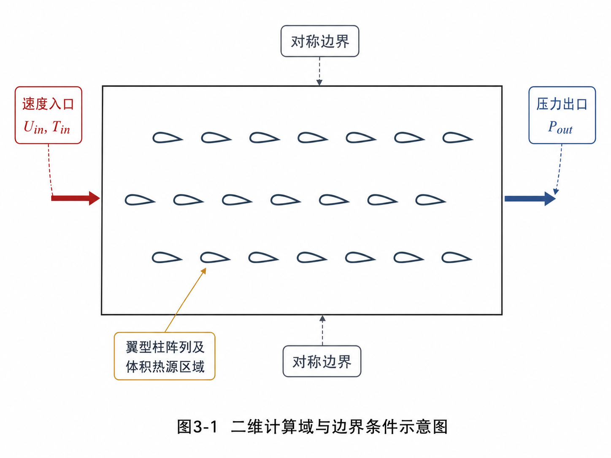

**图3-1 翼型柱阵列散热器二维计算域示意图**

### 3.2.2 控制方程

空气区域视为定常、不可压缩牛顿流体，流体区域满足质量守恒方程、动量方程和能量方程：

$$
\nabla\cdot \mathbf{u}=0
$$

$$
\rho(\mathbf{u}\cdot\nabla)\mathbf{u}=-\nabla p+\mu\nabla^2\mathbf{u}
$$

$$
\rho c_p(\mathbf{u}\cdot\nabla T)=k_f\nabla^2T
$$

式中，$\mathbf{u}$ 为速度矢量，$p$ 为压力，$T$ 为温度，$\rho$ 为空气密度，$\mu$ 为空气动力黏度，$c_p$ 为空气定压比热容，$k_f$ 为空气导热系数。

固体区域只考虑导热和热源作用，其能量方程可写为：

$$
\nabla\cdot(k_s\nabla T)+q_v=0
$$

式中，$k_s$ 为固体导热系数，$q_v$ 为体积生热率。流固交界面满足无滑移条件、温度连续条件和热流连续条件：

$$
\mathbf{u}=0
$$

$$
T_f=T_s
$$

$$
-k_f\frac{\partial T_f}{\partial n}=-k_s\frac{\partial T_s}{\partial n}
$$

其中，$T_f$ 和 $T_s$ 分别为流体侧和固体侧温度。

### 3.2.3 边界条件与求解设置

二维模型入口设置为速度入口，给定入口平均速度和入口温度；出口设置为压力出口，出口相对压力取 0 Pa；翼型柱与空气接触界面设置为流固耦合边界；其余外边界根据计算域设置采用壁面、对称或绝热边界条件。计算中忽略辐射换热和重力影响，重点考虑空气侧强制对流换热过程。

为保证样本之间具有可比性，所有二维 CFD 样本采用统一的求解器设置、收敛准则和后处理方法。当速度、压力、温度残差以及 Nu、f、压降等监测量趋于稳定时，判定计算达到稳态收敛。

### 3.2.4 二维 CFD 数值模型参数设置

为保证不同翼型柱阵列结构之间的流热性能具有可比性，本文二维 CFD 数值模型采用统一的材料物性、入口边界、出口边界、热源条件和求解设置。不同样本之间仅改变 $T_a$、$T_{wa}$、$T_b$、$T_s$、$T_t$、$T_{ad}$ 和 $\theta$ 七个结构参数，其余物理参数和边界条件保持一致。该处理能够保证 Nu、f 和 $\eta$ 的变化主要来源于翼型柱外形和阵列布置差异。

二维模型热源采用体积热源形式，施加于全部翼型固体域，体积生热率设为 $q_v=1.0\times10^7\ \mathrm{W/m^3}$。本文二维模型没有直接设置固定表面热流密度 $q''$，因此后续不将热边界写作固定 $q''$ 形式。由于二维模型按单位深度处理，单位深度总发热量可由体积热源在二维固体域内积分得到：

$$
Q'_{total}=\int_{A_s}q_v\,\mathrm{d}A
$$

式中，$A_s$ 为二维模型中全部翼型固体域面积。基准结构的单位深度总发热量为 $Q'_{total,0}=1947.8274\ \mathrm{W/m}$，当前最优结构的单位深度总发热量为 $Q'_{total}=2431.1628\ \mathrm{W/m}$。因此，本文二维样本在统一体积热源强度和统一作用区域规则下进行比较，性能差异主要反映翼型柱外形、固体域尺度和阵列排布变化对流动换热过程的综合影响。

需要说明的是，二维模型采用固定体积生热率而非固定总热功率，因此不同几何结构的单位深度总发热量会随固体域面积变化而变化。本文二维模型主要用于统一体积热源条件下的相对流热性能评价，最终工程散热能力则通过第5章固定芯片热功率 $Q=1.0\ \mathrm{W}$ 的三维模型进行验证。

二维 CFD 数值模型主要物性参数与边界条件如表3-1所示。

**表3-1 二维 CFD 数值模型主要物性参数与边界条件**

| 参数类别 | 参数名称 | 符号 | 数值或设置 | 单位 | 说明 |
|---|---|---:|---:|---|---|
| 流体物性 | 空气密度 | $\rho$ | 1.2 | kg/m³ | 空气视为不可压缩牛顿流体 |
| 流体物性 | 空气动力黏度 | $\mu$ | $1.8\times10^{-5}$ | Pa·s | 用于动量方程 |
| 流体物性 | 空气定压比热容 | $c_p$ | 1005 | J/(kg·K) | 用于能量方程 |
| 流体物性 | 空气导热系数 | $k_f$ | 0.026 | W/(m·K) | 用于空气侧传热计算 |
| 固体物性 | 固体材料 | — | 铝 | — | 翼型柱及导热基体材料 |
| 固体物性 | 固体密度 | $\rho_s$ | 2700 | kg/m³ | 用于固体区域物性设置 |
| 固体物性 | 固体导热系数 | $k_s$ | 238 | W/(m·K) | 用于固体导热计算 |
| 固体物性 | 固体定压比热容 | $c_{ps}$ | 900 | J/(kg·K) | 用于固体区域物性设置 |
| 入口边界 | 入口速度 | $u_{in}$ | 5 | m/s | 速度入口 |
| 入口边界 | 入口温度 | $T_{in}$ | 293.15 | K | 冷却空气入口温度 |
| 出口边界 | 出口压力 | $p_{out}$ | 0 | Pa | 压力出口，相对压力 |
| 热源条件 | 体积热源 | $q_v$ | $1.0\times10^7$ | W/m³ | 施加于全部翼型固体域 |
| 热边界说明 | 表面热流密度 | $q''$ | 不设定固定值 | W/m² | 二维模型不采用固定表面热流密度边界 |
| 发热量后处理 | 基准结构单位深度总发热量 | $Q'_{total,0}$ | 1947.8274 | W/m | 由体积热源在二维固体域积分得到 |
| 发热量后处理 | 最优结构单位深度总发热量 | $Q'_{total}$ | 2431.1628 | W/m | 由体积热源在二维固体域积分得到 |
| 求解类型 | 流动状态 | — | 稳态层流 | — | 用于二维相对性能评价 |
| 换热方式 | 流固耦合 | — | 共轭传热 | — | 固体导热与空气对流耦合 |
| 简化处理 | 辐射换热 | — | 忽略 | — | 重点考虑强制对流换热 |
| 简化处理 | 重力影响 | — | 忽略 | — | 不考虑自然对流影响 |

在上述参数设置下，二维 CFD 模型能够获得每一组七参数结构对应的速度场、压力场、温度场以及 Nu、f 和 $\eta$ 等性能指标。所有样本采用统一后处理方法计算性能指标，以保证数据集内部的一致性。

## 3.3 网格划分与数值离散控制

### 3.3.1 网格划分方法

翼型柱阵列散热器计算域同时包含流体区域和固体区域，且翼型柱前缘、尾缘、柱间通道和流固交界面附近存在较大的速度梯度、温度梯度和压力梯度。因此，本文采用非结构网格对计算域进行离散，并在翼型柱近壁面、尾迹恢复区域和柱间狭窄通道处进行局部加密。

整体网格划分应保证流体区域和固体区域之间的界面匹配，避免因网格过粗导致壁面温度梯度和速度梯度无法准确捕捉。对于不同参数化样本，由于翼型柱位置、外形和姿态可能发生变化，网格划分策略需要具有一定适应性，以保证各样本关键区域均具有足够分辨率。


**图3-2 二维计算域整体网格及翼型柱近壁面局部加密图**

### 3.3.2 网格无关性验证与网格控制说明

为保证数值计算结果具有可靠性，本文在网格划分过程中采用非结构化网格，并在翼型柱近壁面、柱间通道、尾迹恢复区域和流固交界面等梯度较大的区域进行局部加密。考虑到当前七参数翼型柱阵列模型需要进行大批量 CFD 样本生成，网格方案需要在计算精度和计算成本之间取得平衡。

本文前期同类翼型结构数值模型已针对基准翼型结构开展过网格无关性验证。该验证以翼型结构平均温度和流道压降为主要监测指标，采用四档非结构化三角形网格进行对比。相关结果如表3-2所示。

**表3-2 前期同类翼型结构网格无关性验证结果及本文网格控制参考**

| 网格方案 | 网格总数 / 个 | 翼型结构平均温度 / K | 压降 $\Delta P$ / Pa | 相对误差 / % | 说明 |
|---|---:|---:|---:|---:|---|
| 方案 A（粗糙） | 21,450 | 329.05 | 0.612 | — | 前期基准翼型结构 |
| 方案 B（常规） | 48,200 | 329.82 | 0.626 | 0.23 | 前期基准翼型结构 |
| 方案 C（较细） | 85,600 | 330.15 | 0.631 | 0.10 | 前期采用网格方案 |
| 方案 D（超细） | 152,000 | 330.18 | 0.632 | 0.01 | 前期加密验证方案 |

由表3-2可知，当网格总数由 85,600 增加至 152,000 时，翼型结构平均温度由 330.15 K 变化至 330.18 K，相对变化约为 0.01%，压降由 0.631 Pa 变化至 0.632 Pa，变化幅度较小。因此，前期模型采用方案 C 作为后续计算网格。该结果说明，在翼型近壁面和尾迹区域采用局部加密的非结构化网格策略，能够获得较稳定的温度与压降计算结果。

基于上述前期数值建模经验，本文当前二维七参数样本生成和优化结构复算继续采用非结构化网格，并在翼型柱前缘、尾缘、柱间通道、尾迹恢复区域和流固交界面处进行局部加密。对于不同参数化样本，保持一致的几何生成、网格控制、求解器设置和后处理流程，以降低数值设置差异对样本数据一致性的影响。这样可以保证不同样本之间的 Nu、f、$\eta$ 以及 PVT 场差异主要来源于结构参数变化，而非数值流程差异。

需要说明的是，表3-2来源于前期同类翼型结构数值模型，主要用于支撑本文网格划分策略和局部加密原则。由于本文当前研究对象已扩展为七参数翼型柱阵列结构，并进一步包含 PVT 流热场重建和三维芯片级验证，因此该表作为当前网格控制策略的参考依据。后续若进一步补充当前七参数模型的粗、中、细多档网格结果，可在本节基础上更新为当前模型的严格网格无关性分析。

## 3.4 七参数样本设计与 CFD 数据生成

### 3.4.1 NACA 翼型截面参数化方程

本文翼型柱截面基于 NACA 四位数翼型参数化思想生成[30,73]。NACA 四位数翼型通常由最大弯度、最大弯度位置和最大厚度三个参数控制，其中最大弯度决定翼型中弧线偏离弦线的程度，最大弯度位置决定弯度峰值沿弦向的位置，最大厚度决定翼型上下表面之间的最大距离。该参数化方法能够用较少变量描述翼型截面的主要几何特征，适合用于翼型柱阵列散热器的结构参数化建模。

设翼型弦长为 $c$，归一化弦向坐标为：

$$
\xi=\frac{x}{c},\quad 0\leq \xi \leq 1
$$

其中，$x$ 为沿弦向坐标，$\xi$ 为无量纲弦向坐标。本文采用 $T_a$ 表示最大弯度调节参数，$T_{wa}$ 表示最大弯度位置调节参数，$T_b$ 表示最大厚度调节参数。对应 NACA 翼型中弧线可表示为：

$$
y_c(\xi)=
\begin{cases}
\frac{T_a}{T_{wa}^2}\left(2T_{wa}\xi-\xi^2\right)c, & 0\leq \xi < T_{wa} \\
\frac{T_a}{(1-T_{wa})^2}\left[(1-2T_{wa})+2T_{wa}\xi-\xi^2\right]c, & T_{wa}\leq \xi \leq 1
\end{cases}
$$

本文采用有限尾缘形式的 NACA 厚度分布，其厚度分布可表示为：

$$
y_t(\xi)=5T_b c\left(
0.2969\sqrt{\xi}
-0.1260\xi
-0.3516\xi^2
+0.2843\xi^3
-0.1015\xi^4
\right)
$$

式中，$y_c$ 为翼型中弧线坐标，$y_t$ 为半厚度分布。上式中 $-0.1015\xi^4$ 对应有限尾缘厚度形式，与本文翼型柱几何生成方式保持一致。中弧线斜率对应的局部角度为：

$$
\varphi(\xi)=\arctan\left(\frac{dy_c}{dx}\right)
$$

由此可得到翼型上下表面坐标：

$$
x_u=x-y_t\sin\varphi,\quad y_u=y_c+y_t\cos\varphi
$$

$$
x_l=x+y_t\sin\varphi,\quad y_l=y_c-y_t\cos\varphi
$$

其中，$(x_u,y_u)$ 和 $(x_l,y_l)$ 分别为翼型上表面和下表面坐标。通过改变 $T_a$、$T_{wa}$ 和 $T_b$，可以得到不同弯度、不同弯度位置和不同厚度的翼型柱截面。当 $T_a=0$ 时，翼型中弧线退化为弦线，截面接近对称翼型；当 $T_b$ 增大时，翼型柱厚度和迎风实体尺度增大，可能增加换热面积和局部扰动，同时也可能提高流动阻力。

在生成翼型柱阵列时，首先根据上述 NACA 参数化方程生成单个翼型柱截面；随后根据阵列横向间距 $T_s$、纵向间距 $T_t$ 和错排偏移 $T_{ad}$ 确定翼型柱在计算域中的排布位置；最后通过整体旋转角 $\theta$ 对翼型柱截面进行姿态变换。若翼型柱原始坐标为 $(x,y)$，其绕参考点旋转后的坐标可表示为：

$$
x'=x\cos\theta-y\sin\theta
$$

$$
y'=x\sin\theta+y\cos\theta
$$

通过上述 NACA 翼型截面方程、阵列布置参数和旋转变换，本文能够由七个结构参数唯一确定一组翼型柱阵列几何结构。该参数化方法保证了 CFD 样本生成、MLP-CNN 模型输入和差分进化优化变量之间的一致性。

### 3.4.2 七参数设计变量及取值范围

为描述翼型柱外形和阵列排布特征，本文定义七个结构参数作为设计变量，包括翼型形状参数、阵列布局参数和整体姿态参数。七参数设计变量可表示为：

$$
\mathbf{X}_7=[T_a,T_{wa},T_b,T_s,T_t,T_{ad},\theta]^T
$$

其中，$T_a$、$T_{wa}$ 和 $T_b$ 主要用于描述 NACA 翼型柱截面外形和厚度特征，$T_s$、$T_t$ 和 $T_{ad}$ 主要用于描述阵列横向间距、纵向间距和错排偏移，$\theta$ 用于描述翼型柱整体旋转角。各参数取值范围如表3-3所示。

**表3-3 翼型柱阵列七参数设计变量及取值范围**

| 参数符号 | 物理意义 | 变量类型 | 下限 | 上限 | 单位 |
|---|---|---|---:|---:|---|
| $T_a$ | 翼型最大弯度调节参数 | 形状特征 | 0.000 | 0.050 | — |
| $T_{wa}$ | 翼型最大弯度位置调节参数 | 形状特征 | 0.200 | 0.600 | — |
| $T_b$ | 翼型最大厚度调节参数 | 形状特征 | 0.080 | 0.150 | — |
| $T_s$ | 阵列横向间距调节参数 | 布局特征 | 0.500 | 1.500 | — |
| $T_t$ | 阵列纵向间距调节参数 | 布局特征 | 0.500 | 1.200 | — |
| $T_{ad}$ | 错排偏移调节参数 | 布局特征 | 0.000 | 1.000 | — |
| $\theta$ | 翼型柱整体旋转角 | 姿态特征 | -10.000 | 10.000 | ° |

由表3-3可知，本文七参数同时覆盖翼型柱截面形状、阵列布置和整体姿态三个层面。其中，$T_a$、$T_{wa}$ 和 $T_b$ 决定单个翼型柱的基本外形；$T_s$、$T_t$ 和 $T_{ad}$ 决定不同翼型柱之间的相对位置；$\theta$ 决定翼型柱相对于来流方向的姿态。该七参数体系能够较完整地描述翼型柱阵列散热器的主要几何变化，为后续 CFD 样本生成、代理模型训练和差分进化优化提供统一参数基础。

### 3.4.3 CFD 批量计算与样本生成

基于表3-3所示七参数设计空间，本文生成 1000 组翼型柱阵列结构样本，并对每组样本开展二维 CFD 流热耦合计算。每组样本均采用统一的物性参数、边界条件、热源条件、网格策略和后处理方法，以保证样本之间的差异主要来自结构参数变化。

每组 CFD 样本计算完成后，提取 Nu、f、$\eta$ 等标量性能指标，同时导出压力场 $p$、速度分量 $u/v$ 和温度场 $T$。速度大小场由速度分量合成：

$$
U=\sqrt{u^2+v^2}
$$

由此，每组样本同时包含结构参数、标量性能指标和空间流热场信息，为后续 MLP-CNN 流热场重建代理模型训练提供监督数据。

## 3.5 CFD 样本后处理与 PVT 流热场数据集构建

### 3.5.1 PVT 流热场数据构建

为使 CFD 计算结果能够用于 MLP-CNN 模型训练，本文对每组二维流热耦合计算结果进行统一后处理，构建压力场、速度大小场和温度场组成的 PVT 三通道流热场数据集。每组样本均包含七个结构参数、整体性能指标 Nu、f、$\eta$，以及对应的空间流热场数据。

COMSOL 计算得到的二维流热场基于非结构化网格存储，而 MLP-CNN 模型需要规则张量形式的监督标签。因此，本文将 CFD 后处理得到的压力场 $p$、速度分量 $u/v$ 和温度场 $T$ 统一重采样至规则矩形网格。规则网格尺寸设定为 $96\times320$，并进一步构造压力场 $p$、速度大小场 $U$ 和温度场 $T$ 三个通道，其中速度大小定义为：

$$
U=\sqrt{u^2+v^2}
$$

在重采样过程中，首先根据二维计算域的几何范围建立规则采样坐标，然后将非结构化网格节点上的 CFD 结果插值到规则采样点上。由于原始 CFD 网格为非结构化三角形网格，本文采用基于三角单元的分片线性插值方法进行重采样，而不是采用最近邻赋值方式。该处理能够在保持场变量连续性的同时，减小规则化过程中由离散跳变引起的数值误差。对于位于流体区域内部的采样点，采用分片线性插值获得对应物理量；对于位于固体区域或边界附近的采样点，结合区域条件信息进行识别，使模型能够区分流体区域、固体区域和边界区域。

经过重采样后，每组样本的 PVT 数据统一表示为：

$$
\mathbf{Y}_{field}\in \mathbb{R}^{3\times96\times320}
$$

其中，三个通道分别对应压力场 $p$、速度大小场 $U$ 和温度场 $T$。

需要说明的是，规则化处理的目的不是替代原始 CFD 网格求解，而是将已经收敛的 CFD 计算结果转换为神经网络可学习的张量标签。原始 CFD 计算仍在非结构化网格上完成，近壁面速度梯度、温度梯度和压力变化首先由 CFD 求解器解析；规则网格重采样仅用于构建深度学习监督数据。本文采用 $96\times320$ 的分辨率，能够在整体流道尺度上保留翼型柱前缘高压区、柱间局部加速区、下游尾迹区和热尾迹扩展区等主要流热结构。

PVT 规则网格不作为重新计算质量守恒、动量守恒或能量守恒的离散控制体网格，也不用于替代 CFD 的壁面边界层求解。近壁面梯度和守恒关系仍由原始 CFD 网格与求解器保证；规则化后的场数据主要用于神经网络监督学习、场重建误差评价以及优化结果的空间流热特征分析。该处理能够在控制神经网络训练成本的同时，保留影响整体 Nu、f 和 $\eta$ 的主要空间分布信息。

对于近壁面极薄边界层内的更细尺度梯度，其精确解析仍由原始 CFD 模型保证。本文 MLP-CNN 模型重点学习与 Nu、f 和 $\eta$ 相关的空间流热分布特征，包括通道内速度加速、尾迹扩展、压力恢复和温度扩散等主导流热结构。因此，PVT 数据集既保留了 CFD 结果中的空间物理信息，又具有统一的数据格式，便于后续模型训练、场重建误差分析和性能预测。


**图3-3 PVT 三通道流热场数据集构建流程图**

### 3.5.2 数据字段与样本格式

单个样本可表示为：

$$
Sample_i=\{\mathbf{X}_{7,i},\mathbf{Y}_{field,i},\mathbf{Y}_{scalar,i}\}
$$

其中，$\mathbf{X}_{7,i}$ 为第 $i$ 组样本的七参数结构变量，$\mathbf{Y}_{field,i}$ 为对应的 $p/U/T$ 三通道流热场，$\mathbf{Y}_{scalar,i}$ 为 Nu、f 和 $\eta$ 等标量性能标签。

PVT 流热场数据集基本信息如表3-4所示。

**表3-4 PVT 流热场数据集基本信息**

| 内容 | 数值 |
|---|---:|
| 样本数量 | 1000 |
| 参数维度 | 7 |
| 场通道数量 | 3 |
| 场变量 | $p/U/T$ |
| 单样本场尺寸 | $3\times96\times320$ |
| 标量标签 | Nu、f、$\eta$ |
| 训练集样本数 | 700 |
| 验证集样本数 | 150 |
| 测试集样本数 | 150 |

### 3.5.3 数据归一化与数据集划分

为提高模型训练稳定性，本文对七参数输入、PVT 场变量和标量性能标签分别进行归一化处理。归一化参数仅由训练集统计得到，并统一应用于验证集和测试集，以避免数据泄露。压力场、速度大小场和温度场具有不同量纲和数值范围，因此分别进行归一化处理，使三个物理场在训练过程中具有较均衡的损失贡献。

数据集按照 700/150/150 划分为训练集、验证集和测试集。训练集用于模型参数学习，验证集用于监控模型训练过程和选择较优模型，测试集用于评价模型在未见样本上的泛化能力。数据集划分与归一化处理说明如表3-5所示。

**表3-5 数据集划分与归一化处理说明**

| 项目 | 设置或处理方式 |
|---|---|
| 样本总数 | 1000 组二维 CFD 样本 |
| 输入变量 | $T_a,T_{wa},T_b,T_s,T_t,T_{ad},\theta$ |
| 场标签 | $p/U/T$ 三通道 PVT 流热场 |
| 标量标签 | Nu、f、$\eta$ |
| 数据集划分 | 训练集 700 组，验证集 150 组，测试集 150 组 |
| 参数归一化 | 基于训练集统计量对七参数输入进行归一化 |
| 场变量归一化 | 对 $p$、$U$、$T$ 三个通道分别归一化 |
| 标量标签归一化 | 对 Nu、f 和 $\eta$ 分别进行归一化处理 |
| 数据泄露控制 | 归一化统计量仅由训练集计算，并应用于验证集和测试集 |

需要说明的是，本文中的 CFD 数值场不作为优化阶段的输入，而作为训练阶段的监督标签。模型通过七参数结构变量、归一化空间坐标和区域条件信息学习结构参数与压力场、速度场、温度场以及 Nu/f 指标之间的映射关系。这样既保留了代理模型快速预测的优势，又能够利用 CFD 结果中包含的空间流热信息，提高模型对局部流动与传热特征的表达能力。

## 3.6 典型流热场特征分析

为明确翼型柱阵列结构参数对流热性能的影响，本文选取典型样本对速度场、压力场和温度场进行分析。速度场能够反映空气在翼型柱阵列中的主流路径、柱间局部加速区和尾迹低速区；压力场能够反映前缘高压区、尾迹低压区和沿程压力损失；温度场能够反映固体向空气侧传热过程、高温滞留区和热尾迹发展。

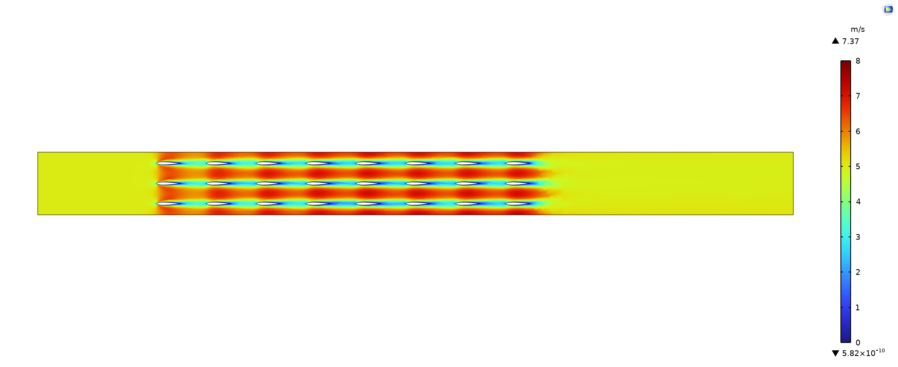

**图3-4 典型样本速度大小场分布云图**

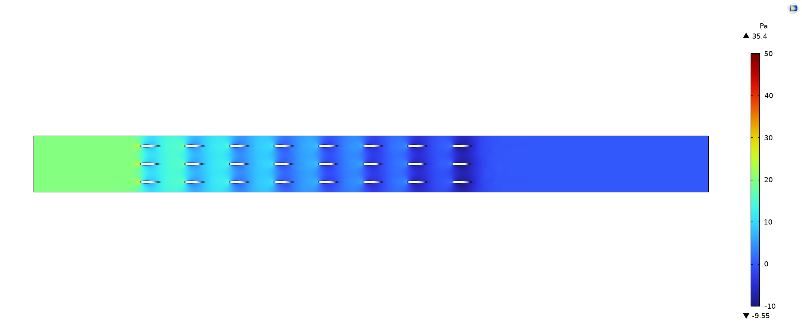

**图3-5 典型样本压力场分布云图**

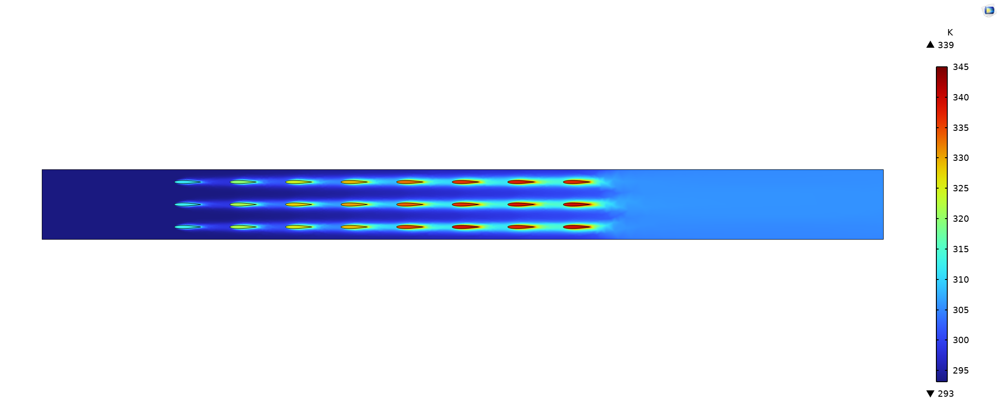

**图3-6 典型样本温度场分布云图**

从典型流热场分布可以看出，翼型柱阵列的 Nu 和 f 不仅取决于七个结构参数本身，还与柱间通道宽度、前后排尾迹干扰、局部压力集中和温度高梯度区域密切相关。较合理的阵列间距和错排布置能够改善空气穿透能力，减弱前排尾迹对后排翼型柱换热的不利影响；合理的翼型姿态能够改变前缘压力分布和尾迹方向，使流动阻力和换热能力之间形成更优平衡。

因此，仅使用标量性能指标难以充分解释结构参数变化引起的局部流动与传热差异。本文将 PVT 流热场作为监督标签，引导 MLP-CNN 模型学习结构参数与空间流热场之间的映射关系，有助于提高代理模型的空间分布解释能力和优化结果的机理分析能力。

## 3.7 结构参数敏感性分析方法

为进一步分析七参数对综合性能评价因子 $\eta$ 的影响，本文采用随机森林置换重要性和差分进化最优点附近局部扰动分析两种方法开展参数敏感性研究。

随机森林置换重要性用于从全局样本分布角度评价各参数对 $\eta$ 的影响。其基本思想是：在保持其他参数不变的情况下，随机打乱某一参数的取值顺序，观察模型预测误差或性能指标变化程度。若某一参数被打乱后模型误差明显增加，则说明该参数对目标指标具有较高重要性。

局部扰动分析用于评价差分进化最优点附近各参数对 $\eta$ 的影响。以优化得到的最优七参数组合为中心，分别对单个参数进行一定范围扰动，其余参数保持不变，观察 $\eta$ 的变化范围。若某一参数扰动引起 $\eta$ 变化较大，则说明该参数在优化点附近对综合性能具有较强局部敏感性。

两种方法分别从全局样本分布和局部优化区域两个角度评价参数重要性，能够更全面地揭示七参数对翼型柱阵列散热器综合性能的影响规律。

## 3.8 七参数对流热性能的影响规律

为进一步识别七参数对翼型柱阵列散热器综合性能的影响，本文基于样本数据开展参数敏感性分析。随机森林置换重要性结果表明，$T_s$ 对综合性能评价因子 $\eta$ 的影响最显著，其次为 $\theta$ 和 $T_b$。该结果说明，柱间通道宽度、翼型柱姿态和翼型柱厚度是影响翼型柱阵列散热器综合性能的主要因素。

**表3-6 七参数随机森林置换重要性分析结果**

| 排名 | 参数 | 置换重要性 | 影响说明 |
|---:|---|---:|---|
| 1 | $T_s$ | 1.361628 | 对综合性能 $\eta$ 影响最显著，主要改变柱间通道宽度和阵列通流能力 |
| 2 | $\theta$ | 0.231464 | 改变翼型柱迎角和尾迹方向，对局部流动和压降具有重要影响 |
| 3 | $T_b$ | 0.147826 | 影响翼型柱尺度、阻塞比和局部换热面积 |

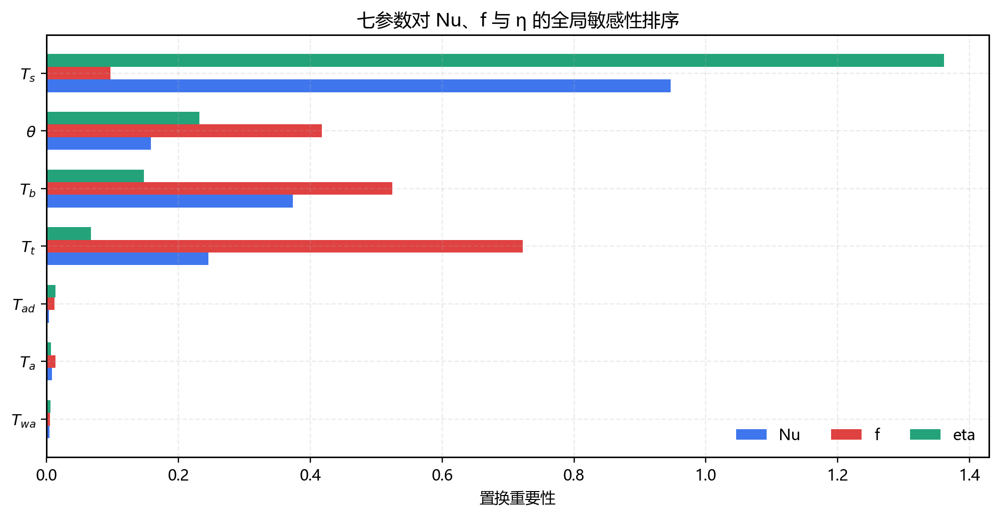

**图3-7 七参数全局敏感性排序图**

在差分进化最优点附近，本文进一步进行局部扰动敏感性分析。结果表明，$T_s$、$T_b$ 和 $\theta$ 在优化点附近仍对 $\eta$ 具有较明显影响，说明这些参数不仅在全局样本空间中重要，在优化结构附近也具有较强局部调节作用。

**表3-7 DE 最优点附近局部扰动敏感性分析结果**

| 排名 | 参数 | $\eta$ 扰动范围 | 局部影响说明 |
|---:|---|---:|---|
| 1 | $T_s$ | 0.044242 | 优化点附近对综合性能最敏感 |
| 2 | $T_b$ | 0.017418 | 对局部阻塞和换热面积仍具有明显影响 |
| 3 | $\theta$ | 0.014892 | 对翼型柱姿态和尾迹方向具有局部影响 |

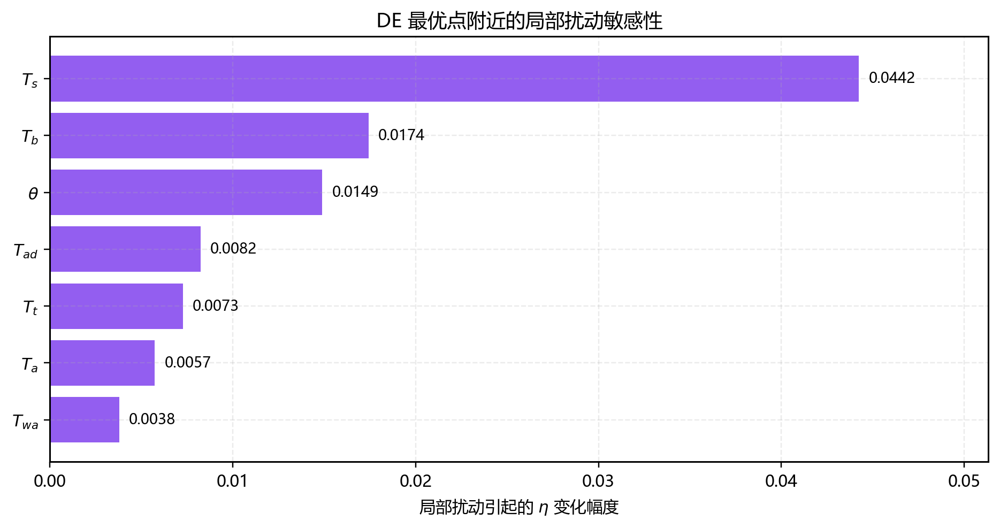

**图3-8 DE 最优点附近局部扰动敏感性分析图**

综合来看，$T_s$ 通过改变阵列通流能力和柱间局部加速区影响换热与压降；$T_b$ 通过改变翼型柱尺度和换热面积影响局部对流换热；$\theta$ 通过改变翼型柱迎风姿态和尾迹方向调节流动组织。上述结果为第4章差分进化参数优化提供了敏感性依据。

## 3.9 本章小结

本章建立了翼型柱阵列散热器二维 CFD 数值模型，明确了控制方程、边界条件、材料物性、网格划分方法和后处理指标。基于 $T_a$、$T_{wa}$、$T_b$、$T_s$、$T_t$、$T_{ad}$ 和 $\theta$ 七个结构参数，构建了翼型柱阵列散热器参数化设计空间，并生成 1000 组二维 CFD 样本。

在数据集构建方面，本文将 CFD 计算得到的压力场、速度大小场和温度场统一采样为 $3\times96\times320$ 的 PVT 三通道规则网格数据，并将数据集划分为 700 组训练样本、150 组验证样本和 150 组测试样本。CFD 数值场在本文中作为训练阶段的监督标签，用于约束 MLP-CNN 模型学习结构参数与空间流热场之间的映射关系。

参数敏感性分析表明，$T_s$ 是影响综合性能评价因子 $\eta$ 的关键参数，$T_b$ 和 $\theta$ 也对综合性能具有较明显影响。上述结果说明翼型柱阵列散热器的综合性能主要受阵列通流能力、翼型厚度和整体姿态共同影响。本章研究为第4章 MLP-CNN 流热场重建代理模型训练、消融实验和差分进化参数优化提供了数据基础与物理依据。

# 第4章 基于 MLP-CNN 流热场重建的翼型柱阵列散热器流热性能预测与参数优化

## 4.1 引言

第3章建立了翼型柱阵列散热器二维 CFD 数值模型，完成了七参数样本生成、PVT 流热场数据集构建以及结构参数敏感性分析，为代理模型训练和参数优化提供了数据基础。由于翼型柱阵列散热器的结构参数较多，不同参数之间存在明显耦合作用，若在优化过程中对每一组候选结构均重新进行 COMSOL 建模、网格划分和 CFD 求解，将产生较高计算成本。因此，有必要构建能够快速预测流热性能的代理模型，并将其用于七参数结构优化。

对于翼型柱阵列散热器而言，Nu、f 和综合性能评价因子 $\eta$ 不仅受七参数结构变量影响，还与压力场、速度场和温度场的空间分布密切相关。传统标量代理模型虽然能够直接预测 Nu 和 f，但难以解释结构参数变化对局部加速、尾迹恢复、压力损失和温度扩散的影响。为充分利用 CFD 结果中的空间流热信息，本文构建 MLP-CNN 流热场重建代理模型，使模型在预测 Nu 和 f 的同时重建规则网格上的 $p/U/T$ 三通道流热场，从而兼顾快速预测和机理解释。

本章主要内容包括：首先，构建由 MLP 参数编码器、CNN/U-Net 流热场解码器和性能预测分支组成的 MLP-CNN 代理模型，明确模型输入、输出和损失函数设置；其次，基于第3章构建的 1000 组 PVT 数据集训练模型，并从 Nu、f、$\eta$ 预测精度和 $p/U/T$ 场重建误差两个方面评价模型性能；然后，通过 K 折验证和消融实验分析模型稳定性及坐标条件、区域条件、物理一致性损失和 CBAM 注意力机制的作用；最后，将训练后的性能预测分支与差分进化算法结合，搜索综合性能较优的七参数组合，并通过 COMSOL 二维 CFD 复算验证优化结构性能，结合速度场、压力场和温度场分析其流热性能提升机理。

## 4.2 MLP-CNN 流热场重建代理模型构建

### 4.2.1 模型输入与输出定义

本文 MLP-CNN 流热场重建代理模型的输入由三部分组成：七参数结构变量、归一化空间坐标和区域条件信息。七参数结构变量表示为：

$$
\mathbf{X}_7=[T_a,T_{wa},T_b,T_s,T_t,T_{ad},\theta]^T
$$

其中，$T_a$、$T_{wa}$、$T_b$、$T_s$、$T_t$、$T_{ad}$ 和 $\theta$ 分别描述翼型柱外形、阵列间距、错排偏移和整体旋转角等结构特征。归一化空间坐标用于标识规则网格中每一个采样点的位置，区域条件信息用于区分流体区域和固体区域，辅助网络学习不同区域中的流热场分布规律。

模型输出包括两类结果：一类是规则网格上的 $p/U/T$ 三通道流热场，另一类是 Nu 和 f 两个标量性能指标。综合性能评价因子 $\eta$ 不设置为独立网络输出，而是由预测 Nu 和 f 根据下式计算得到：

$$
\eta=\frac{Nu/Nu_0}{(f/f_0)^{1/3}}
$$

该设置能够保证 Nu、f 和 $\eta$ 之间满足统一定义关系，避免多个标量输出之间出现物理含义不一致的问题。

需要说明的是，本文优化阶段的核心输入为七参数结构变量。空间坐标和区域条件信息可由参数化结构在统一规则网格上自动生成，CFD 数值场仅在训练阶段作为监督标签使用。因此，该方法能够避免优化阶段依赖候选结构预先 CFD 计算结果，使代理模型可以直接嵌入差分进化算法进行快速候选结构筛选。

### 4.2.2 网络总体结构

本文 MLP-CNN 流热场重建代理模型由 MLP 参数编码器、CNN/U-Net 流热场解码器和 MLP 性能预测分支组成。其总体结构可表示为：

```text
七参数结构变量
        ↓
MLP 参数编码器
        ↓
结构潜在特征 z
        ├── 与空间坐标、区域条件融合 → CNN/U-Net 解码器 → p/U/T 流热场
        └── MLP 性能预测分支 → Nu、f → η
```

MLP 参数编码器用于将七参数结构变量映射为高维潜在特征，提取翼型柱外形、阵列间距、错排偏移和整体旋转角中包含的结构信息。CNN/U-Net 流热场解码器用于将结构潜在特征与空间条件融合，并在 96×320 规则网格上重建压力场、速度大小场和温度场。性能预测分支基于共享潜在特征输出 Nu 和 f，用于后续性能评价和差分进化优化。

与单纯标量代理模型相比，该模型在训练过程中同时受到流热场标签和性能指标标签约束。流热场重建任务促使模型学习空间分布特征，性能预测任务使模型直接服务于结构优化。两类任务共享潜在特征，有助于增强模型对七参数结构变量与流热性能之间关系的表达能力。

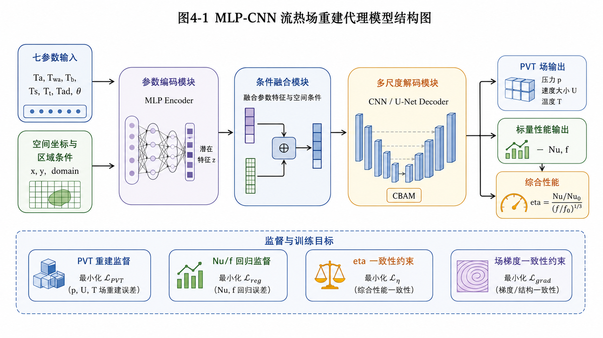

**图4-1 MLP-CNN 流热场重建代理模型总体结构图**

### 4.2.3 MLP 参数编码器

MLP 参数编码器接收归一化后的七参数结构变量，通过多层全连接网络提取结构潜在特征。由于七个设计变量具有不同物理含义和数值范围，训练前需对其进行标准化处理，使不同参数在训练过程中具有相近尺度，避免某一参数因数值范围较大而主导网络学习。

MLP 编码器的作用是将低维设计变量映射到高维特征空间，使网络能够表达参数之间的非线性耦合作用。例如，横向间距 $T_s$ 与翼型厚度 $T_b$ 会共同影响柱间通道宽度和局部加速强度，错排偏移 $T_{ad}$ 与旋转角 $\theta$ 会共同影响后排翼型柱来流条件和尾迹干扰。通过 MLP 编码器，模型能够从七参数输入中提取适合流热场重建和性能预测的共享结构特征。

### 4.2.4 CNN/U-Net 流热场解码器

CNN/U-Net 流热场解码器用于输出 $p/U/T$ 三通道规则网格场。解码器接收结构潜在特征、归一化空间坐标和区域条件信息，并通过卷积运算恢复不同空间位置上的压力、速度和温度分布。U-Net 结构具有多尺度特征融合能力，能够同时学习全局流动趋势和局部空间变化。

在翼型柱阵列散热器中，压力场主要用于描述空气流经阵列时的沿程压降、前缘高压区和尾迹低压区；速度大小场主要用于描述柱间通道局部加速、主流路径和尾迹低速区；温度场主要用于描述固体向空气传热、高温区扩展和热尾迹发展。通过同时重建 $p/U/T$ 三个物理场，模型能够为后续优化结构机理分析提供空间场依据。

### 4.2.5 性能预测分支

性能预测分支基于 MLP 参数编码器输出的结构潜在特征，预测 Nu 和 f 两个性能指标。Nu 表征空气侧对流换热能力，f 表征空气侧流动阻力。二者共同决定综合性能评价因子 $\eta$。性能预测分支的输出直接服务于差分进化优化过程，在优化迭代中用于快速计算候选结构适应度。

由于 $\eta$ 由 Nu 和 f 按定义计算得到，本文在训练中通过 $\eta$ 一致性损失进一步约束预测结果，使模型不仅分别拟合 Nu 和 f，还能保证二者组合得到的综合性能指标与真实标签保持一致。这一设计有助于提高代理模型在结构优化目标上的可靠性。

## 4.3 损失函数与训练策略

### 4.3.1 损失函数设置与区域条件信息处理

MLP-CNN 模型需要同时完成 PVT 流热场重建和 Nu/f 标量性能预测。为保证模型既能学习空间流热分布，又能保持整体性能预测精度，本文采用多任务损失函数对模型进行联合训练。总损失函数由场重建损失、标量预测损失、综合性能一致性损失和场梯度一致性损失共同组成，可表示为：

$$
L=\lambda_{field}L_{field}+\lambda_{scalar}L_{scalar}+\lambda_{\eta}L_{\eta}+\lambda_{grad}L_{grad}
$$

其中，$L_{field}$ 用于约束压力场 $p$、速度大小场 $U$ 和温度场 $T$ 的重建误差；$L_{scalar}$ 用于约束 Nu 和 f 的预测误差；$L_{\eta}$ 用于保证由预测 Nu 和 f 计算得到的综合评价因子与真实值保持一致；$L_{grad}$ 用于约束场变量梯度，使模型更好地捕捉翼型柱近壁面、柱间加速区和尾迹区域的局部变化。

场重建损失可表示为：

$$
L_{field}=\lambda_p L_p+\lambda_U L_U+\lambda_T L_T
$$

其中，$L_p$、$L_U$ 和 $L_T$ 分别表示压力场、速度大小场和温度场的重建误差。由于 PVT 数据在规则网格上同时包含流体区域、固体区域和边界附近区域，不同区域内物理量含义并不完全相同：流体区域内的 $p$、$U$ 和 $T$ 共同描述空气侧流动与换热过程；固体区域内主要体现导热温度分布，而速度大小 $U$ 在物理上趋近于零。若完全不区分区域属性，模型可能过度依赖固体区域内速度为零等简单特征，从而削弱对流体主通道、近壁面和尾迹区域的学习能力。

为降低不同区域物理含义差异对训练过程的影响，本文在模型输入中引入区域条件信息，使网络能够在空间上区分流体区域、固体区域和边界区域。该区域条件信息与归一化坐标共同输入模型，使 CNN 解码器在重建 PVT 场时不仅依赖七参数结构编码，还能够感知不同空间位置的区域属性。通过这种方式，模型可以学习不同区域内压力、速度和温度的分布差异，从而提高对翼型柱近壁面、柱间加速区和下游尾迹区的场重建能力。

在误差评价过程中，本文除统计整体场误差 field_MAE 外，还单独统计边界区域误差 boundary_MAE，用于评价模型在复杂边界附近的重建表现。该指标能够反映模型对翼型柱边界、固流交界面和局部高梯度区域的识别能力。需要说明的是，本文没有将固体区域内速度趋近于零这一简单特征作为评价模型流动预测能力的唯一依据，而是通过区域条件信息引导网络区分不同物理区域，并通过边界区域误差补充评价复杂边界附近的预测表现。消融实验结果表明，随着坐标信息、区域条件信息、物理一致性约束和 CBAM 注意力机制逐步引入，场重建误差和边界区域误差均明显降低，说明区域条件信息能够帮助模型识别复杂几何边界并改善局部流热场重建效果。

标量预测损失用于约束模型输出的 Nu 和 f，其形式为：

$$
L_{scalar}=L_{Nu}+L_f
$$

其中，$L_{Nu}$ 和 $L_f$ 分别表示 Nu 与 f 的预测误差。综合性能一致性损失 $L_{\eta}$ 则用于约束由预测 Nu 和预测 f 计算得到的 $\eta$ 与真实 $\eta$ 之间的一致性。这样可以避免模型虽然在 Nu 和 f 单项指标上误差较小，但由二者共同决定的综合性能评价出现偏差。

场梯度一致性损失 $L_{grad}$ 用于增强模型对空间梯度变化的表达能力。翼型柱阵列散热器中，压力场在翼型柱前缘和尾部区域存在明显梯度变化，速度场在柱间通道和尾迹区变化较快，温度场在热源附近和热边界层区域存在高梯度。引入梯度一致性约束后，模型不仅拟合场变量数值本身，还学习场变量在空间上的变化趋势，从而提高 PVT 流热场重建的物理保真度。

### 4.3.2 综合评价因子与基准值标定

本文综合性能评价因子 $\eta$ 采用相对于基准参考结构的归一化形式进行定义。其中，$Nu_0$ 和 $f_0$ 分别表示二维综合性能评价中的固定标定值。本文采用的二维归一化参考值为：

$$
Nu_0=30.366123,\quad f_0=0.092996,\quad \eta_0=1.000000
$$

需要说明的是，本文二维 $\eta$ 归一化参考值取自现有样本库中与标准基准几何前六个参数最接近的参考样本，参考样本编号为 case_id=30232。标准几何 baseline 的七参数为 $T_a=0.000000$、$T_{wa}=0.400000$、$T_b=0.120000$、$T_s=1.100000$、$T_t=0.850000$、$T_{ad}=0.000000$、$\theta=0.000000$。上述 $Nu_0$ 和 $f_0$ 作为统一评价标定值使用，而不是在差分进化过程中随候选结构动态更新。

采用固定基准值的原因在于，差分进化算法需要在统一的适应度坐标系下比较不同候选结构的综合性能。若 $Nu_0$ 和 $f_0$ 随每个候选结构动态变化，则不同个体之间的 $\eta$ 将失去统一参照，无法反映结构优化相对于同一评价基准的性能变化。因此，本文将 $Nu_0$ 和 $f_0$ 作为固定常数，以保证优化过程中 $\eta$ 的物理含义和数值比较具有一致性。

### 4.3.3 训练数据与归一化处理

本文采用第3章构建的 1000 组 PVT 数据集进行训练。数据集划分为训练集、验证集和测试集，样本数分别为 700、150 和 150。七参数输入、PVT 场变量和 Nu/f/$\eta$ 标签均基于训练集统计量进行归一化，验证集和测试集使用相同的归一化参数进行变换。

压力场、速度大小场和温度场具有不同量纲和数值范围，若直接混合训练，可能导致数值范围较大的通道主导损失函数。因此，本文分别对 $p$、$U$ 和 $T$ 三个通道进行归一化处理，使不同物理场在训练过程中具有较均衡的贡献。模型评价阶段再将预测结果反归一化到物理量尺度，用于计算 MAE、RMSE 和绘制流热场对比图。

### 4.3.4 训练参数设置

本文主模型采用 320×96 高分辨率 PVT 三通道数据进行训练。训练轮数为 50 epoch，优化器采用 Adam，batch size 为 2，计算设备为 GPU。训练过程中根据验证集损失监控模型收敛状态，并保存验证性能较优的模型用于测试集评价和后续差分进化优化。

**表4-1 MLP-CNN 主模型训练参数设置**

| 项目                 | 设置                                                        |
| -------------------- | ----------------------------------------------------------- |
| 样本数量             | 1000                                                        |
| 训练集/验证集/测试集 | 700/150/150                                                 |
| 流热场尺寸           | $3\times96\times320$                                        |
| 场变量               | $p/U/T$                                                     |
| 训练轮数             | 50                                                          |
| batch size           | 2                                                           |
| 优化器               | Adam                                                        |
| 损失函数             | 场重建损失 + 梯度一致性损失 + Nu/f 损失 + $\eta$ 一致性损失 |
| 计算设备             | cuda                                                        |

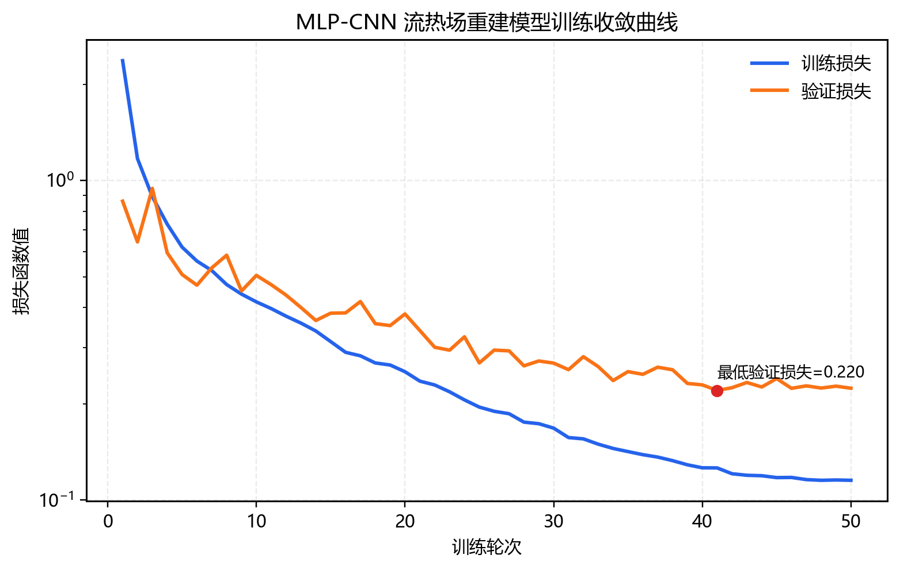

**图4-2 训练集与验证集损失函数收敛曲线**

## 4.4 模型预测性能分析

### 4.4.1 标量性能指标预测结果

主模型在测试集上的 Nu、f 和 $\eta$ 预测结果如表4-2所示。

**表4-2 MLP-CNN 主模型测试集标量性能预测结果**

| 指标       | 结果     |
| ---------- | -------- |
| Nu_R2      | 0.969309 |
| Nu_MAE     | 0.732264 |
| f_R2       | 0.978038 |
| f_MAE      | 0.002571 |
| $\eta$ R²  | 0.971888 |
| $\eta$ MAE | 0.016209 |

由表4-2可知，MLP-CNN 流热场重建代理模型对 Nu、f 和 $\eta$ 均具有较高预测精度。其中，Nu_R2 为 0.969309，f_R2 为 0.978038，$\eta$ R² 为 0.971888，说明模型能够较好学习七参数结构变量与整体流热性能之间的非线性映射关系。从误差指标看，Nu_MAE 为 0.732264，f_MAE 为 0.002571，$\eta$ MAE 为 0.016209，能够满足后续候选结构快速筛选和参数优化需求。

f_R2 略高于 Nu_R2，说明当前样本分布下模型对流动阻力变化趋势具有较好拟合能力。$\eta$ R² 与 Nu_R2 和 f_R2 保持在相近水平，说明由预测 Nu 和 f 计算得到的综合性能评价因子能够较好反映真实 $\eta$ 变化趋势，模型在优化目标上具有较好一致性。

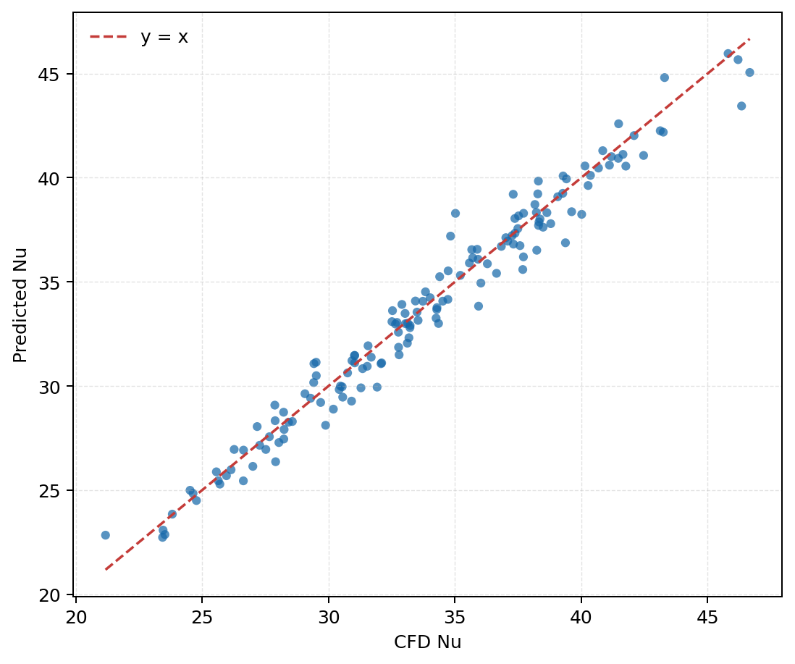

**图4-3 测试集 Nu 预测值与真实值对比图**

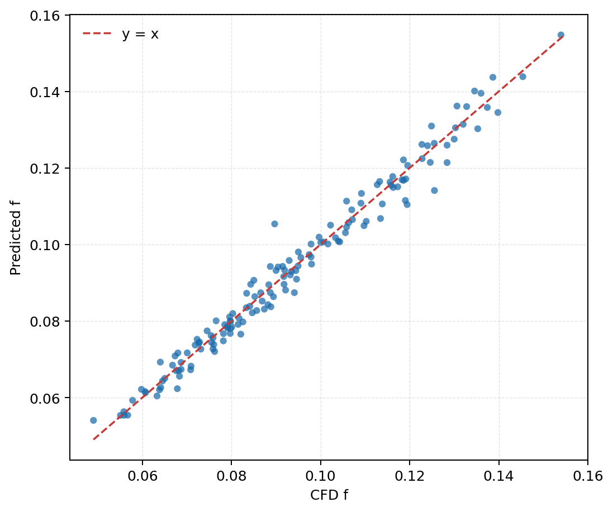

**图4-4 测试集 f 预测值与真实值对比图**

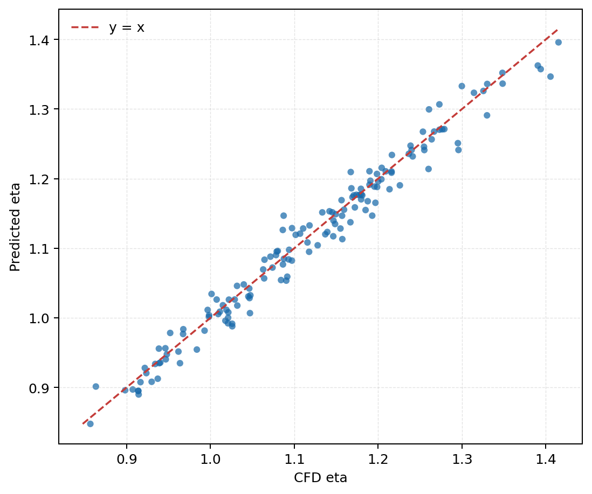

**图4-5 测试集 $\eta$ 预测值与真实值对比图**

### 4.4.2 PVT 流热场重建误差

除标量性能预测外，本文模型还输出规则网格上的 $p/U/T$ 三通道流热场。测试集场重建误差如表4-3所示。

**表4-3 MLP-CNN 主模型测试集 PVT 场重建误差**

| 指标       | 结果         |
| ---------- | ------------ |
| field_MAE  | 0.485520     |
| field_RMSE | 0.954466     |
| p_MAE      | 0.908374 Pa  |
| p_RMSE     | 1.488316     |
| U_MAE      | 0.108227 m/s |
| U_RMSE     | 0.169416     |
| T_MAE      | 0.439960 K   |
| T_RMSE     | 0.699452     |

结果表明，模型能够较好恢复压力场、速度大小场和温度场的主要空间分布趋势。其中，T_MAE 为 0.439960 K，说明温度场重建具有较高精度；U_MAE 为 0.108227 m/s，说明模型能够较好捕捉柱间通道局部加速和尾迹低速区的整体变化；p_MAE 为 0.908374 Pa，说明压力场沿程分布和局部压力变化能够被模型较好重建。

PVT 场重建结果说明，MLP-CNN 模型并非只学习七参数到 Nu/f 的标量映射，而是能够在统一规则网格上恢复主要流热场分布。该结果为后续优化结构速度场、压力场和温度场机理分析提供了数据基础。

### 4.4.3 流热场重建可视化分析

为直观评价模型对空间流热场的重建能力，本文选取测试集典型样本，对比 CFD 规则采样场、模型预测场和误差场。典型结果如图4-6至图4-9所示。

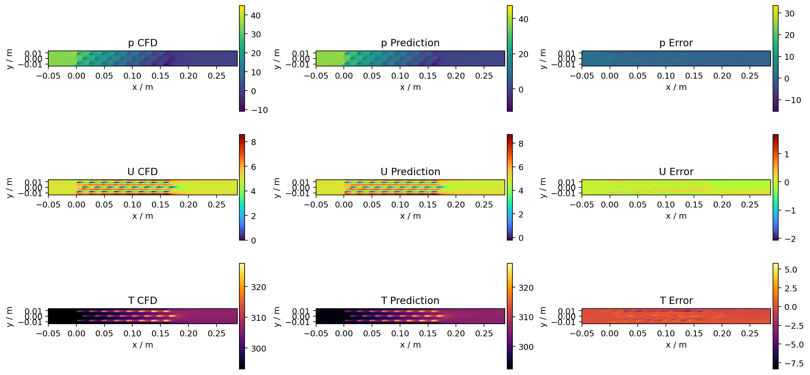

**图4-6 典型样本 PVT 流热场重建对比图**

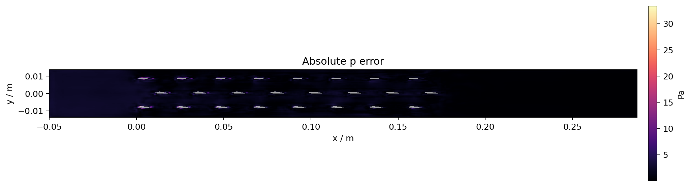

**图4-7 典型样本压力场预测误差分布图**

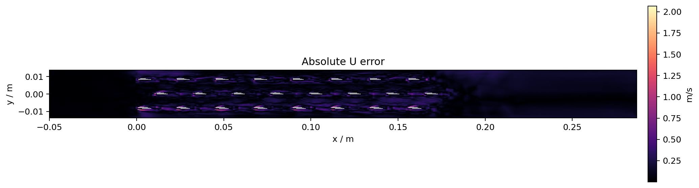

**图4-8 典型样本速度大小场预测误差分布图**

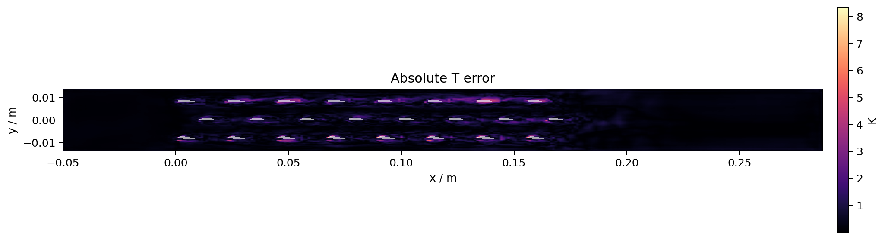

**图4-9 典型样本温度场预测误差分布图**

从可视化结果看，模型能够较好恢复入口至出口方向的压力变化趋势、柱间通道速度加速区域、尾迹低速区以及温度场整体扩散规律。压力场预测能够反映沿程压降和翼型柱附近局部压力变化；速度场预测能够反映主流通道和阵列区域的流动组织；温度场预测能够反映高温区位置和热量向空气侧扩散趋势。

与仅输出 Nu/f 的代理模型相比，流热场重建结果能够提供更多空间物理信息，使模型预测结果更容易进行机理解释。例如，当某一候选结构 $\eta$ 较高时，可进一步观察其速度场是否具有较好的通流能力、压力场是否存在过强局部压降、温度场是否减小热滞留区域。该特点是本文 MLP-CNN 流热场重建模型区别于传统标量代理模型的重要优势。

### 4.4.4 流热场重建与标量性能的物理一致性说明

需要强调的是，本文所称流热场重建的解释作用，并不是指神经网络发现了新的流体力学规律，也不是指由预测场重新替代 CFD 求解控制方程。MLP-CNN 本质上仍属于数据驱动代理模型，其严格物理守恒关系由原始 CFD 样本保证。本文引入 PVT 场重建的目的，是使代理模型在预测 Nu 和 f 的同时，能够给出与性能变化相对应的压力、速度和温度空间分布，从而为优化结果提供空间流热证据。

从换热角度看，温度场能够反映热量由固体区域向空气侧传递的空间路径。对于原始 CFD 结果，壁面热流密度可由温度梯度表示为：

$$
q_w=-k_s\frac{\partial T}{\partial n}
$$

局部等效对流换热系数可写为：

$$
h_{loc}=\frac{q_w}{T_w-T_f}
$$

整体换热水平与壁面热流、温度梯度和有效换热面积密切相关。因此，当代理模型重建的温度场能够较好反映高温区、热尾迹和温度梯度区域时，可用于辅助解释 Nu 的变化来源。但本文并不将预测温度场重新作为 CFD 求解结果使用，Nu 的训练标签和验证结果仍以原始 CFD 后处理为准。

从流动阻力角度看，压力场能够反映翼型柱阵列中的局部压力集中、尾迹低压区和沿程压力恢复过程。进出口压降可由入口和出口截面平均压力差表示为：

$$
\Delta p=\overline{p}_{in}-\overline{p}_{out}
$$

摩擦因子 f 则由压降、入口速度和特征长度进一步计算。因此，模型重建的压力场可用于判断预测 f 的空间来源，例如局部阻塞、尾迹损失和压力恢复是否合理。

基于上述关系，PVT 场重建主要提供空间一致性检查：若模型预测某一结构具有较高 Nu，则其速度场和温度场应表现出较好的柱间通流、局部冲刷和热量带出能力；若模型预测 f 较低，则其压力场应表现出较弱局部压力集中和较平缓压力恢复。本文后续对优化结构的二维 CFD 复算场进行分析，正是为了验证代理模型预测的高 $\eta$ 结构是否具有相应的流热场机理支撑。

## 4.5 模型稳定性与交叉验证

### 4.5.1 交叉验证方法

为进一步评估模型预测结果对数据划分方式的敏感性，本文采用 3 折交叉验证对 PVT 主模型进行补充检验。将 1000 组样本划分为 3 个子集，每次选取其中 1 个子集作为验证集，其余样本作为训练集，重复训练与验证 3 次，并统计 Nu、f、$\eta$ 以及 $p/U/T$ 流热场重建误差的平均水平和标准差。

交叉验证的目的在于评价模型在不同训练/验证划分下的稳定性。若不同折次的 Nu、f 和 $\eta$ 预测指标差异较小，说明模型对数据划分不敏感，具有较好的泛化稳定性。

### 4.5.2 交叉验证结果

3 折交叉验证结果如表4-4所示。

**表4-4 PVT 主模型 3 折交叉验证结果**

| 指标         | 均值     | 标准差   |
| ------------ | -------- | -------- |
| Nu_R2        | 0.964261 | 0.003353 |
| f_R2         | 0.969705 | 0.004482 |
| $\eta$ R²    | 0.968501 | 0.000825 |
| Nu_MAE       | 0.767173 | 0.019363 |
| f_MAE        | 0.002954 | 0.000048 |
| $\eta$ MAE   | 0.016889 | 0.000435 |
| p_MAE        | 1.204861 | 0.042282 |
| U_MAE        | 0.130367 | 0.003036 |
| T_MAE        | 0.614454 | 0.049592 |
| field_MAE    | 0.649893 | 0.028645 |
| boundary_MAE | 1.501871 | 0.137107 |

由表4-4可知，MLP-CNN 流热场重建代理模型在不同数据划分下均保持较高预测精度。其中，$\eta$ R² 均值为 0.968501，标准差为 0.000825，说明模型对综合性能评价因子的预测结果较稳定。Nu_R2 和 f_R2 的标准差也较小，表明模型对换热性能和流动阻力指标均具有较好的泛化能力。

场重建误差方面，p_MAE、U_MAE、T_MAE 和 field_MAE 在不同折次之间波动较小，说明模型对 PVT 流热场的重建能力较稳定。上述结果表明，本文模型并非依赖某一次特定数据划分，而是在不同训练/验证划分下均具有较好的预测稳定性。


为更直观展示不同折次下模型预测精度和场重建误差的稳定性，将 3 折交叉验证结果绘制为图4-9a。

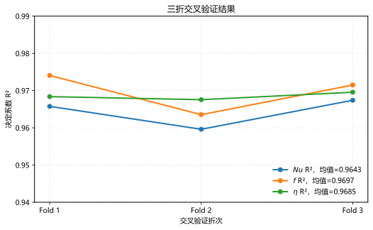

**图4-9a PVT 主模型三折交叉验证结果图**

## 4.6 消融实验与模型对比

### 4.6.1 消融实验设计

为分析不同模块对模型预测性能和流热场重建能力的贡献，本文设计 A0-A4 五组消融实验。A0 为纯 MLP 标量代理模型，仅预测 Nu、f 和 $\eta$；A1 为基础 U-Net 场重建模型；A2 在 A1 基础上加入坐标通道和区域条件信息；A3 在 A2 基础上加入 $\eta$ 一致性和场梯度一致性损失；A4 在 A3 基础上进一步加入 CBAM 注意力机制。

**表4-5 消融实验模型设置**

| 组别 | 模型设置                              | 目的                             |
| ---- | ------------------------------------- | -------------------------------- |
| A0   | MLP 标量代理，只预测 Nu/f/$\eta$      | 判断纯标量模型的性能水平         |
| A1   | 基础 U-Net，七参数潜在特征解码 PVT 场 | 判断 CNN/U-Net 的基本场重建能力  |
| A2   | A1 + 坐标通道 + 区域条件信息          | 判断空间条件输入对场重建的作用   |
| A3   | A2 + $\eta$ 一致性 + 梯度一致性       | 判断物理一致性损失的作用         |
| A4   | A3 + CBAM 注意力机制                  | 判断注意力机制对场重建的改善作用 |

### 4.6.2 消融实验结果

消融实验结果如表4-6所示。

**表4-6 A0-A4 消融实验结果**

| 组别 | Nu_R2    | f_R2     | $\eta$ R² | p_MAE    | U_MAE    | T_MAE    | field_MAE | boundary_MAE |
| ---- | -------- | -------- | --------- | -------- | -------- | -------- | --------- | ------------ |
| A0   | 0.970617 | 0.980708 | 0.969789  | —        | —        | —        | —         | —            |
| A1   | 0.973088 | 0.979705 | 0.974212  | 7.134856 | 0.673944 | 3.316894 | 3.708562  | 6.138286     |
| A2   | 0.974393 | 0.980798 | 0.973342  | 1.086147 | 0.126960 | 0.637812 | 0.616973  | 1.513489     |
| A3   | 0.972907 | 0.980358 | 0.973451  | 1.180342 | 0.134455 | 0.509703 | 0.608167  | 1.377163     |
| A4   | 0.971559 | 0.980530 | 0.972475  | 1.128742 | 0.117111 | 0.469610 | 0.571821  | 1.371744     |

从 A0 结果可知，纯 MLP 标量代理模型已经能够获得较高 Nu、f 和 $\eta$ 预测精度，说明七参数结构变量中包含较强的性能预测信息。然而，A0 不输出压力场、速度场和温度场，因此无法提供局部流动、压力损失和温度扩散层面的机理解释。

A1 引入基础 U-Net 后能够输出 PVT 流热场，但由于缺少空间坐标和区域条件信息，场重建误差较大。A2 加入坐标通道和区域条件信息后，field_MAE 由 3.708562 降至 0.616973，p_MAE、U_MAE 和 T_MAE 均显著降低，说明空间条件输入是提高流热场重建精度的关键因素。

A3 加入 $\eta$ 一致性和场梯度一致性损失后，T_MAE 和 boundary_MAE 进一步降低，说明物理一致性约束有助于改善温度场和边界区域预测效果。A4 进一步加入 CBAM 注意力机制后，U_MAE、T_MAE、field_MAE 和 boundary_MAE 继续降低，说明注意力机制能够增强模型对翼型柱边界、柱间通道、尾迹区域和高温区域等关键流热区域的表达能力。

总体来看，坐标通道和区域条件信息是提升流热场重建精度的主要因素，$\eta$ 一致性损失和场梯度一致性损失进一步改善温度场和边界区域预测效果，CBAM 注意力机制主要提升流热场重建能力。消融实验结果证明，本文 MLP-CNN 流热场重建模型的各组成模块具有明确作用。


为突出不同模块对场重建误差的影响，A0-A4 消融实验中主要场误差指标对比如图4-9b所示。

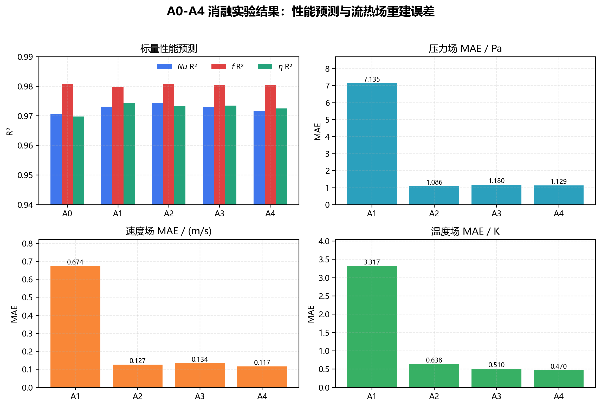

**图4-9b A0-A4 消融实验场重建误差对比图**

## 4.7 代理模型预测能力综合讨论

综合主模型测试结果、交叉验证和消融实验可以看出，本文 MLP-CNN 流热场重建代理模型在标量性能预测和空间流热场重建方面均具有较好表现。主模型在测试集上获得 Nu_R2=0.969309、f_R2=0.978038 和 $\eta$ R²=0.971888，说明模型能够准确预测整体流热性能；PVT 场重建误差中 T_MAE 为 0.439960 K，U_MAE 为 0.108227 m/s，p_MAE 为 0.908374 Pa，说明模型能够恢复主要空间流热场分布趋势。

交叉验证结果表明，模型在不同数据划分下具有稳定预测能力，尤其 $\eta$ R² 标准差仅为 0.000825，说明综合性能评价因子预测稳定。消融实验进一步表明，流热场重建模型的精度提升主要来自空间条件输入和物理一致性约束，注意力机制能够进一步改善关键区域场重建效果。

因此，MLP-CNN 流热场重建代理模型不仅可以作为差分进化优化过程中的快速性能预测器，也可以作为流热场空间分布分析工具。相比仅输出 Nu 和 f 的标量代理模型，本文模型能够在优化候选结构后给出对应的压力、速度和温度场重建结果，从而更好解释性能变化来源。

## 4.8 基于差分进化算法的七参数优化设置

### 4.8.1 优化变量与目标函数

本文将训练好的 MLP-CNN 性能预测分支嵌入差分进化算法，以综合性能评价因子 $\eta$ 最大化为目标，在七参数设计空间中搜索较优结构组合。优化变量为：

$$
\mathbf{X}_7=[T_a,T_{wa},T_b,T_s,T_t,T_{ad},\theta]^T
$$

各参数取值范围与第3章样本设计范围保持一致。对于任意候选参数组合，代理模型首先预测 Nu_pred 和 f_pred，然后根据下式计算适应度函数：

$$
F(\mathbf{X}_7)=\eta_{pred}
=
\frac{Nu_{pred}/Nu_0}{(f_{pred}/f_0)^{1/3}}
$$

差分进化算法通过种群初始化、变异、交叉和选择不断更新候选结构，最终搜索到 $\eta_{pred}$ 较高的七参数组合。该优化过程不实时调用 CFD 求解器，因此能够显著降低候选结构筛选成本。

### 4.8.2 差分进化算法复现性设置

差分进化算法主要复现性设置如表4-7所示。本文优化过程将七个结构参数作为连续设计变量，并在第3章给定的参数上下界内进行搜索。每个候选个体均先由 MLP-CNN 性能预测分支输出 Nu_pred 和 f_pred，再根据固定基准值 $Nu_0$ 和 $f_0$ 计算 $\eta_{pred}$，作为差分进化算法的适应度值。

本文主线实际采用的差分进化策略为 DE/rand/1/bin，种群规模 $NP=40$，变异因子 $F=0.7$，交叉概率 $CR=0.8$，最大迭代代数为 30，随机种子为 42。上述参数在整个优化过程中保持固定，不随候选结构变化而改变。

**表4-7 差分进化算法主要复现性设置**

| 项目 | 设置或说明 |
|---|---|
| 优化算法 | 差分进化算法 |
| 变异策略 | DE/rand/1/bin |
| 优化变量 | $T_a,T_{wa},T_b,T_s,T_t,T_{ad},\theta$ |
| 变量维数 | 7 |
| 变量边界 | 与表3-3中七参数取值范围一致 |
| 种群规模 | $NP=40$ |
| 变异因子 | $F=0.7$ |
| 交叉概率 | $CR=0.8$ |
| 最大迭代代数 | 30 |
| 随机种子 | 42 |
| 目标函数 | 最大化综合性能评价因子 $\eta$ |
| 适应度计算方式 | MLP-CNN 代理模型预测 Nu 和 f 后计算 $\eta$ |
| 基准值处理 | $Nu_0$ 和 $f_0$ 在优化过程中保持固定 |
| 越界处理 | 候选参数限制在给定上下界范围内 |
| 选择规则 | 保留 $\eta_{pred}$ 较高的候选个体 |
| 输出结果 | 最优七参数组合及对应 Nu_pred、f_pred、$\eta_{pred}$ |
| 验证方式 | 将最优结构重新导入 COMSOL 进行二维 CFD 独立复算 |

上述设置保证了代理模型辅助优化过程在统一设计空间和统一适应度坐标系下进行。由于优化目标由 Nu 和 f 共同决定，差分进化算法并非单独追求换热增强或流阻降低，而是在综合性能评价因子约束下搜索高性能翼型柱阵列结构。

### 4.8.3 代理模型辅助优化流程

代理模型辅助差分进化优化流程如下：首先，在七参数设计空间内生成初始种群；其次，将每个候选个体输入训练好的 MLP-CNN 性能预测分支，得到 Nu_pred 和 f_pred；然后根据综合性能评价公式计算 $\eta_{pred}$，并作为差分进化算法的适应度值；随后通过差分变异、交叉和选择更新种群；最后输出适应度最高的候选参数组合。

差分进化算法迭代收敛过程如图4-10所示。

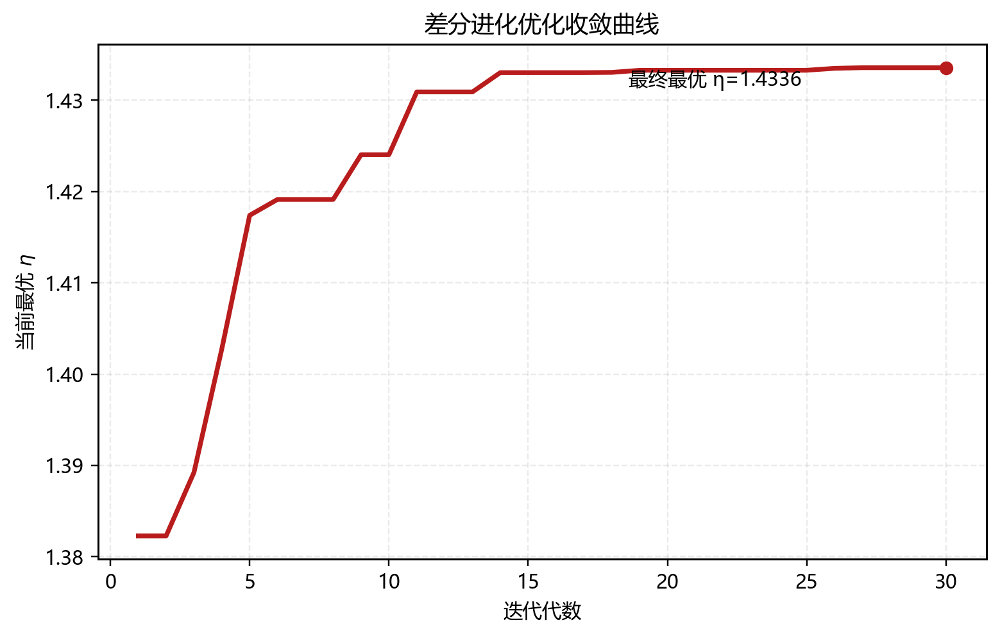

**图4-10 差分进化算法优化收敛曲线**

## 4.9 差分进化优化结果

### 4.9.1 最优七参数组合

差分进化算法搜索得到的最优候选结构参数如表4-8所示。

**表4-8 MLP-CNN-DE 优化得到的最优七参数组合**

| 参数 | 最优值 |
|---|---:|
| $T_a$ | 0.000000 |
| $T_{wa}$ | 0.600000 |
| $T_b$ | 0.150000 |
| $T_s$ | 1.500000 |
| $T_t$ | 0.960919 |
| $T_{ad}$ | 1.000000 |
| $\theta$ | -2.224429 |

从优化结果看，$T_s$、$T_b$ 和 $T_{ad}$ 取值较大，与第3章敏感性分析中 $T_s$ 和 $T_b$ 对 $\eta$ 影响较显著的结果相一致。较大的横向间距有助于改善阵列通流能力和后排翼型柱来流条件，较大的翼型厚度能够增加换热面积并增强局部扰动，错排偏移则能够改变前后排之间的尾迹干扰关系。旋转角 $\theta=-2.224429$ 表明翼型柱整体姿态对局部压力分布和尾迹方向也具有一定调节作用。

### 4.9.2 代理模型预测性能

对于上述最优候选结构，MLP-CNN 代理模型预测结果如表4-9所示。

**表4-9 优化候选结构代理模型预测结果**

| 指标 | 代理模型预测值 |
|---|---:|
| Nu_pred | 45.453880 |
| f_pred | 0.105865 |
| $\eta_{pred}$ | 1.433572 |

代理模型预测结果表明，该候选结构具有较高 Nu 和综合性能评价因子，同时 f 保持在合理范围内。说明差分进化算法在七参数设计空间内搜索到的候选结构能够在换热增强和阻力控制之间取得较好平衡。

## 4.10 二维优化模型 CFD 复算结果对比

为验证 MLP-CNN 代理模型和差分进化算法所得优化结构的真实性能，本文将优化得到的七参数组合重新写入 COMSOL 参数化模型中，并采用与二维样本生成阶段完全一致的材料物性、入口条件、出口条件、热源设置、网格控制和后处理方法进行独立 CFD 复算。通过该复算过程，可以避免仅依赖代理模型预测结果，从而进一步确认优化候选结构的流热性能。

二维优化模型的七参数组合为 $T_a=0.000000$、$T_{wa}=0.600000$、$T_b=0.150000$、$T_s=1.500000$、$T_t=0.960919$、$T_{ad}=1.000000$、$\theta=-2.224429$。该参数组合由差分进化算法以综合性能评价因子 $\eta$ 最大化为目标搜索得到。代理模型对该结构的预测结果为 Nu_pred=45.453880、f_pred=0.105865、$\eta_{pred}$=1.433572。COMSOL 二维 CFD 复算结果为 Nu=46.022427、f=0.106658、$\eta=1.447895$。

进一步将 MLP-CNN 代理模型预测结果与 COMSOL 二维 CFD 复算结果进行对比，结果如表4-10所示。

**表4-10 优化结构代理预测与二维 CFD 复算结果对比**

| 指标 | 代理模型预测值 | 二维 CFD 复算值 | 绝对误差 | 相对误差 |
|---|---:|---:|---:|---:|
| Nu | 45.453880 | 46.022427 | 0.568547 | 1.24% |
| f | 0.105865 | 0.106658 | 0.000793 | 0.74% |
| $\eta$ | 1.433572 | 1.447895 | 0.014323 | 0.99% |

由表4-10可知，MLP-CNN 代理模型对优化结构 Nu、f 和 $\eta$ 的预测结果与 CFD 复算结果保持较好一致。其中，Nu、f 和 $\eta$ 的相对误差分别为 1.24%、0.74% 和 0.99%，均处于较低水平。该结果验证了 MLP-CNN 代理模型在优化候选结构附近的预测可靠性，也说明差分进化算法基于代理模型搜索得到的结构具有真实 CFD 性能支撑。

优化结构二维 CFD 复算及单位深度发热量后处理结果如表4-11所示。

**表4-11 优化结构二维 CFD 复算及单位深度发热量后处理结果**

| 指标 | 数值 |
|---|---:|
| Nu | 46.022427 |
| f | 0.106658 |
| $\eta$ | 1.447895 |
| 进出口压降 $\Delta p$ / Pa | 1.599866 |
| 温度差 $\Delta T$ / K | 20.317542 |
| 基准结构单位深度总发热量 $Q'_{total,0}$ / (W/m) | 1947.8274 |
| 最优结构单位深度总发热量 $Q'_{total}$ / (W/m) | 2431.1628 |

由表4-11可知，优化模型的综合性能评价因子 $\eta$ 达到 1.447895。若以基准结构 $\eta=1.000000$ 作为参照，则优化结构综合性能提高约 44.79%。优化模型 Nu=46.022427，表明该结构具有较强空气侧对流换热能力；f=0.106658，说明其在增强换热的同时仍保持了可接受的流动阻力水平。需要说明的是，表中的 $Q'_{total}$ 为二维模型单位深度总发热量，由 $q_v=1.0\times10^7\ \mathrm{W/m^3}$ 在全部翼型固体域内积分得到，并非固定表面热流密度 $q''$。结合 $\eta$ 结果可知，优化结构的换热收益能够抵消流阻代价，并最终表现出较高综合流热性能。


为进一步对比优化前后流热场变化，本文补充给出基准结构与优化结构的二维速度场、温度场和压力场对比，如图4-10a至图4-10c所示。

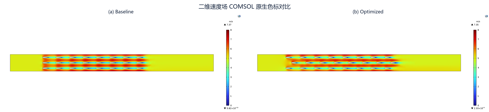

**图4-10a 基准结构与优化结构二维速度场对比图**

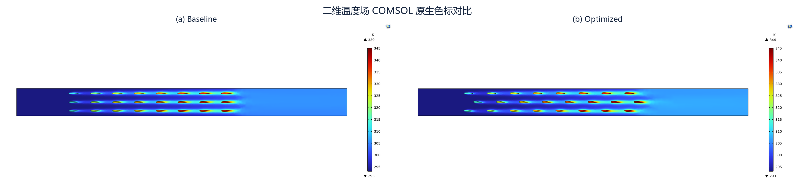

**图4-10b 基准结构与优化结构二维温度场对比图**

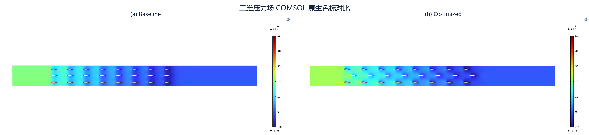

**图4-10c 基准结构与优化结构二维压力场对比图**

## 4.11 优化结构流热场机理分析

### 4.11.1 速度场分析

优化结构的二维 CFD 速度场如图4-11所示。速度场主要用于观察空气在翼型柱阵列中的主流路径、柱间局部加速和尾迹低速区。由优化参数可知，$T_s$ 取较大值，使柱间横向通道更加通畅，有利于降低局部阻塞并改善后排翼型柱的来流条件；$T_{ad}$ 取较大值，使前后排之间形成错排关系，能够改变后排翼型柱相对于前排尾迹的位置。

从速度场分布看，空气能够较充分地穿过翼型柱阵列，柱间通道形成明显局部加速区，后排低速尾迹范围得到控制。较好的通流能力使空气与固体表面保持有效接触，有助于提高对流换热能力。速度场结果与优化结构较高 Nu 值相互印证，说明该候选结构在增强换热方面具有合理流动基础。

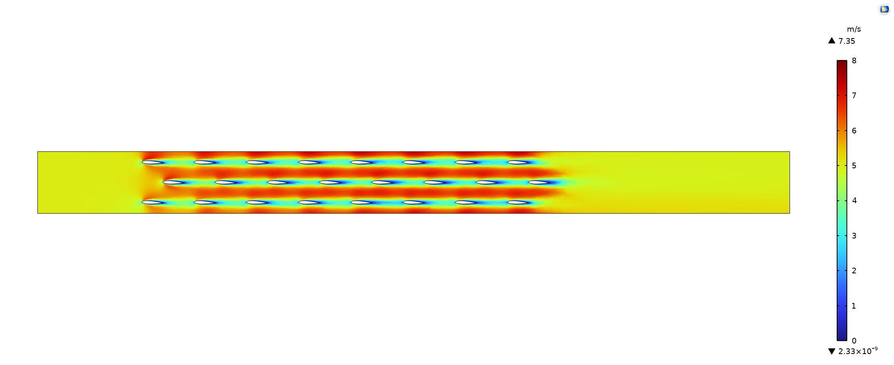

**图4-11 MLP-CNN-DE 优化结构二维速度场复算结果**

### 4.11.2 压力场分析

优化结构的二维 CFD 压力场如图4-12所示。压力场主要用于分析翼型柱前缘高压区、尾缘低压区以及整体沿程压降。空气流经翼型柱阵列时，前缘区域由于来流受阻形成局部高压，柱间通道和尾缘区域由于流速增加和压力恢复形成压力变化。优化结构中，翼型柱外形和阵列间距共同影响压力梯度分布。

CFD 复算结果显示，优化结构 f=0.106658，代理预测 f=0.105865，二者误差较小，说明模型能够较好识别该结构的流动阻力水平。虽然优化结构通过局部加速增强了换热，但其压力损失仍处于合理范围内。结合 $\eta=1.447895$ 可知，换热收益超过了流阻代价，优化结构具有较好的综合性能。

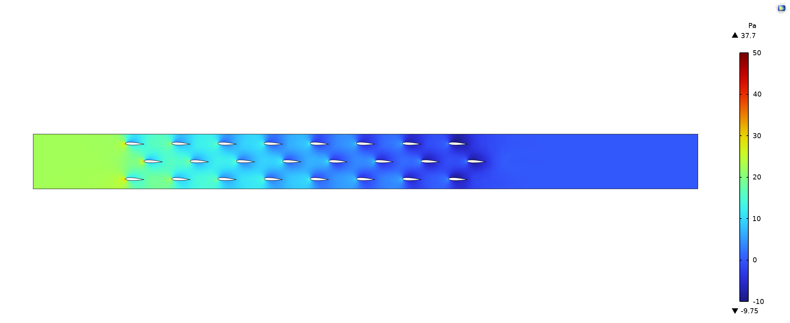

**图4-12 MLP-CNN-DE 优化结构二维压力场复算结果**

### 4.11.3 温度场分析

优化结构的二维 CFD 温度场如图4-13所示。温度场用于观察固体区域热量向空气侧传递的过程，以及阵列区域是否存在局部热滞留。优化结构具有较好的通流能力和局部扰动，使空气能够更有效地带走翼型柱和基底附近热量。

从温度场分布看，翼型柱附近高温区域与空气流动方向相互关联，热量沿主流方向被带出计算域。优化结构较高 Nu 值说明其空气侧对流换热能力较强；$\Delta T=20.317542\ \mathrm{K}$ 反映了该结构在当前体积热源条件下的温度响应。$Q'_{total}=2431.1628\ \mathrm{W/m}$ 为由固定体积生热率在优化结构固体域内积分得到的单位深度总发热量，主要用于说明二维复算的热源规模，不单独作为换热性能提升依据。温度场结果与速度场、压力场分析共同说明，优化结构在增强换热的同时保持了较合理的流动阻力。

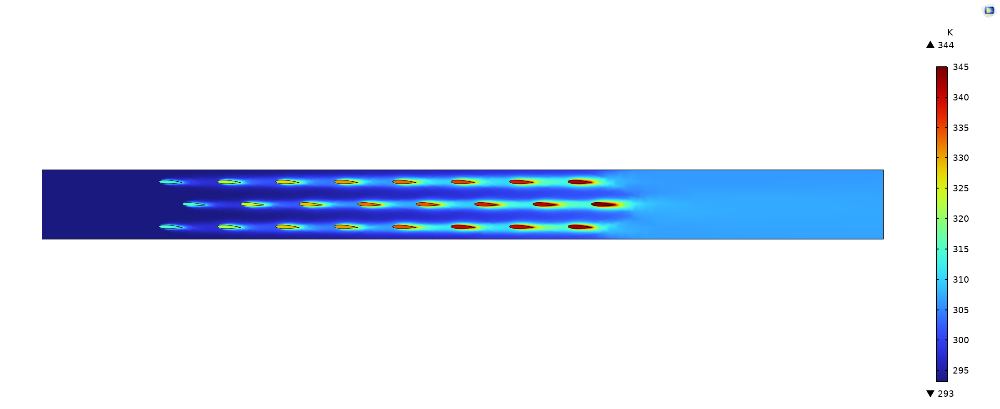

**图4-13 MLP-CNN-DE 优化结构二维温度场复算结果**

### 4.11.4 综合性能提升机理

从最优七参数组合可以看出，部分参数达到设计空间边界，例如 $T_s=1.500000$、$T_b=0.150000$ 和 $T_{ad}=1.000000$。这说明在当前设计范围和流动条件下，增大柱间通流空间、提高有效换热尺度以及增强错排扰动有利于改善综合性能。该趋势与翼型柱阵列散热器的基本流动规律一致：较大的横向间距能够减弱局部阻塞并改善通流能力，较大的结构尺度能够增加有效换热面积，而错排布置能够改变后排翼型柱的来流条件，增强主流对下游区域的冲刷作用。

但是，优化结果并非简单的边界取值问题。对于翼型柱阵列而言，换热增强和流动阻力之间存在强耦合关系，结构参数之间并非单调独立作用。特别是翼型柱旋转角 $\theta=-2.224429$ 和排布参数 $T_t=0.960919$ 并未简单取上下限，而是在设计空间内部形成了非边界最优组合；$T_{wa}=0.600000$ 虽位于当前上限，但其与 $\theta$、$T_t$ 的组合决定了翼型轮廓姿态、前缘压力分布和尾迹方向。也就是说，优化结果并不是单一参数取边界即可获得，而是多个主导尺度参数和姿态微调参数共同作用的结果。这表明模型在优化过程中不仅捕捉了通道宽度和换热面积等主导因素，还进一步识别了翼型姿态和上下游尾迹干扰之间的非线性耦合关系。

从流场机理上看，适当的负旋转角能够调节翼型柱前缘迎风方向，使气流绕过翼型柱时的局部压力梯度和尾迹方向更加合理，从而减弱后排区域的低速滞留和热尾迹堆积。若旋转角过大，翼型柱迎风投影面积增加，容易引起局部压降上升；若旋转角过小，则对流动路径和后排扰动的调节作用不足。因此，$\theta$ 的微调体现了结构姿态参数对流热耦合性能的细致影响，也是单纯依靠经验规则难以准确确定的部分。

综合速度场、压力场和温度场分析可知，MLP-CNN-DE 优化结构的性能提升主要来源于以下方面：第一，较大的横向间距改善了阵列通流能力，使空气能够更加充分地穿过翼型柱阵列，减小前后排之间的低速尾迹干扰；第二，翼型厚度和错排偏移共同调节了局部扰动和换热面积，使空气在翼型柱附近形成有效换热区域；第三，合理的整体旋转角改变了翼型柱迎风姿态，使压力分布和尾迹方向得到优化；第四，尽管局部加速和扰动增强可能带来一定流动阻力，但换热性能提升幅度更大，因此综合性能评价因子 $\eta$ 得到提高。

上述结果表明，MLP-CNN 流热场重建代理模型不仅能够预测候选结构性能，还能通过重建或复算得到的流热场解释优化结构性能提升来源。该特点使本文方法具有较好的工程分析价值。

## 4.12 本章小结

本章围绕 MLP-CNN 流热场重建代理模型构建、性能预测、模型验证、消融实验和七参数优化开展研究。首先，建立了由 MLP 参数编码器、CNN/U-Net 流热场解码器和性能预测分支组成的代理模型。模型以七参数结构变量、归一化空间坐标和区域条件信息为输入，同时输出 $p/U/T$ 三通道流热场以及 Nu 和 f 性能指标，并由 Nu 和 f 计算综合性能评价因子 $\eta$。

测试集结果表明，主模型获得 Nu_R2=0.969309、f_R2=0.978038、$\eta$ R²=0.971888，场重建误差为 p_MAE=0.908374 Pa、U_MAE=0.108227 m/s、T_MAE=0.439960 K，说明模型能够较好预测整体性能并恢复主要流热场空间分布趋势。3 折验证结果显示，$\eta$ R² 均值为 0.968501，标准差为 0.000825，表明模型在不同数据划分下具有稳定预测能力。消融实验表明，坐标通道和区域条件信息显著提高流热场重建精度，$\eta$ 一致性与梯度一致性损失有助于改善温度场和边界区域预测效果，CBAM 注意力机制能够进一步降低流热场重建误差。

在参数优化方面，本文将训练后的 MLP-CNN 性能预测分支嵌入差分进化算法，以 $\eta$ 最大化为目标搜索七参数组合。优化得到的候选结构参数为 $T_a=0.000000$、$T_{wa}=0.600000$、$T_b=0.150000$、$T_s=1.500000$、$T_t=0.960919$、$T_{ad}=1.000000$、$\theta=-2.224429$。代理模型预测 Nu_pred=45.453880、f_pred=0.105865、$\eta_{pred}$=1.433572；二维 CFD 复算得到 Nu=46.022427、f=0.106658、$\eta=1.447895$，验证了代理模型与差分进化算法结合用于翼型柱阵列散热器参数优化的有效性。

通过优化结构速度场、压力场和温度场分析可知，优化结构通过改善阵列通流能力、调节尾迹干扰、增强局部换热并控制流动阻力，实现了综合性能提升。本章结果为第5章三维芯片级散热器验证提供了优化结构和流热性能依据。

---

# 第5章 面向工程应用的翼型柱阵列散热器三维代表性模型验证

## 5.1 引言

第4章基于 MLP-CNN 流热场重建代理模型和差分进化算法，获得了综合性能较优的七参数翼型柱阵列结构，并通过二维 COMSOL CFD 复算验证了优化结构的 Nu、f 和 $\eta$。二维模型能够较高效地分析翼型柱阵列截面参数对空气侧流动和换热性能的影响，适合用于大批量样本生成、代理模型训练和七参数优化。然而，实际芯片级风冷散热器通常具有有限高度鳍片、导热基底、芯片热源面积、三维空气流道和端部效应等特征，仅依靠二维模型难以完全反映工程应用场景中的热量传递过程。

因此，在完成二维代理优化和 CFD 复算后，有必要进一步将优化结构迁移到三维芯片级散热器模型中进行验证。三维模型能够同时考虑芯片热源、基底导热、翼型鳍片三维高度、空气通道和整体温度响应，可用于评价二维优化结构在实际散热场景中的适用性。通过对比基准结构和优化结构的芯片平均温度、最高温度、等效热阻、压降、三维 Nu、三维 f 和综合性能评价因子，可以进一步判断本文 MLP-CNN-DE 优化流程的工程应用价值。

本章主要内容包括：首先，建立三维芯片级翼型鳍片散热器代表性模型，说明其结构组成、计算域、边界条件和后处理指标；其次，将第4章得到的二维优化七参数结构迁移到三维模型中，并与基准结构在相同工况下进行对比；然后，分析三维温度场、速度场和压力场分布，解释优化结构在三维模型中的散热性能提升机理；最后，总结二维优化结果在三维工程场景中的适用性。

## 5.2 三维芯片级翼型鳍片散热器模型建立

### 5.2.1 三维模型结构组成

三维芯片级翼型鳍片散热器模型由空气流道、导热基底、芯片热源区域和翼型鳍片阵列组成。芯片热源位于基底下方或基底指定区域，热量首先传递至导热基底，再经基底扩散至上方翼型鳍片结构，最终通过空气侧强制对流换热带出计算域。空气从入口进入流道，流经翼型鳍片阵列后由出口排出。

与二维翼型柱阵列模型相比，三维模型增加了鳍片高度方向、基底厚度方向和芯片热源面积等因素，能够反映实际散热器中热量从芯片到基底、再到鳍片和空气之间的三维传递过程。同时，有限高度翼型鳍片会引入端部绕流和高度方向速度分布变化，使空气侧流动组织更加接近真实散热器场景。

三维验证中设置两类结构：基准结构 baseline 和优化结构 optimized。baseline 结构作为三维验证的性能参照，用于表征未经过 MLP-CNN-DE 优化的参考翼型鳍片阵列；optimized 结构采用第4章差分进化算法搜索得到的七参数组合。两种结构保持相同的风道尺寸、芯片热源、材料物性、入口条件、出口条件和求解设置，仅改变翼型鳍片几何参数和阵列布置，从而保证性能差异主要来源于结构优化结果。

需要说明的是，baseline 在本文中承担统一比较基准的作用，其三维温度、压降、Nu3D、f3D 和 $\eta_{3D}$ 均采用与 optimized 完全一致的求解设置和后处理方法获得。通过 baseline 与 optimized 的直接对比，可以评价二维优化参数迁移至三维芯片级散热器后的实际性能收益。

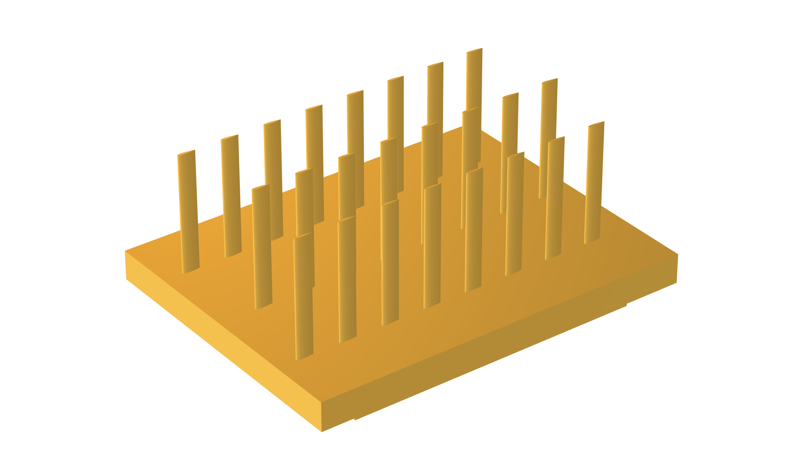

**图5-1 三维芯片级翼型鳍片散热器模型结构示意图**

### 5.2.2 优化结构参数设置

三维验证中，optimized 结构采用第4章差分进化算法得到的七参数组合。优化参数如下：

$$
T_a=0.000000,\quad T_{wa}=0.600000,\quad T_b=0.150000
$$

$$
T_s=1.500000,\quad T_t=0.960919,\quad T_{ad}=1.000000,\quad \theta=-2.224429
$$

这些参数共同决定三维模型中翼型鳍片的截面形态、阵列间距、错排偏移和整体旋转角。将二维优化参数迁移到三维模型时，保持翼型截面参数与二维优化结构一致，并沿高度方向生成三维翼型鳍片。通过这种方式，可以检验二维优化得到的截面参数在三维芯片级散热器中的性能表现。

三维优化模型七参数设置如表5-1所示。

**表5-1 三维 baseline 与 optimized 模型七参数设置**

| 参数 | baseline | optimized | 单位 |
|---|---:|---:|---|
| $T_a$ | 0.000000 | 0.000000 | — |
| $T_{wa}$ | 0.400000 | 0.600000 | — |
| $T_b$ | 0.120000 | 0.150000 | — |
| $T_s$ | 1.100000 | 1.500000 | — |
| $T_t$ | 0.850000 | 0.960919 | — |
| $T_{ad}$ | 0.000000 | 1.000000 | — |
| $\theta$ | 0.000000 | -2.224429 | ° |

其中，三维 baseline 的综合性能归一化参考值为 $Nu_{3D,0}=39.729845$、$f_{3D,0}=2.581841$、$\eta_{3D,0}=1.000000$。三维 baseline 与 optimized 采用相同的风道尺寸、芯片热源功率、材料物性、入口条件和后处理方法，以保证三维性能对比具有统一参照。

### 5.2.3 三维模型边界条件与求解设置

三维模型采用稳态流热耦合计算。空气入口设置为速度入口，并给定入口温度；出口设置为压力出口；芯片热源区域施加等效热输入；固体与空气接触表面满足无滑移条件、温度连续条件和热流连续条件；其余外壁根据模型设置采用绝热或壁面边界条件。基准结构和优化结构采用完全一致的边界条件和求解参数，以保证二者结果具有可比性。

三维模型中，空气区域求解连续性方程、动量方程和能量方程，固体区域求解导热方程，流固界面通过共轭传热条件耦合。计算完成后，提取芯片平均温度 $T_{avg}$、芯片最高温度 $T_{max}$、进出口压降 $\Delta p$、等效热阻 $R_{th}$、三维 Nu、三维 f 以及三维综合性能评价因子 $\eta_{3D}$。同时导出温度场、速度场、压力场和网格图，用于后续流热机理分析。

### 5.2.4 三维芯片级散热器模型参数设置

为进一步验证二维 MLP-CNN-DE 优化结构在工程散热场景中的适用性，本文建立三维芯片级翼型鳍片散热器代表性模型。三维模型由空气流道、导热基底、芯片热源区域和翼型鳍片阵列组成，能够反映芯片热量经基底和翼型鳍片传递至空气侧的三维共轭传热过程。与二维模型相比，三维模型进一步考虑了鳍片高度方向、基底导热扩散、芯片热源面积和三维空气流道等因素，可用于评价优化结构在实际芯片级风冷散热条件下的性能表现。

三维验证设置 baseline 和 optimized 两种结构。baseline 为基准翼型鳍片阵列结构，optimized 为第4章差分进化算法得到的优化七参数结构。两种结构采用相同的风道尺寸、芯片热源功率、材料物性、入口速度、入口温度、出口压力和求解设置，仅改变翼型鳍片几何参数和阵列布置，以保证二者性能差异主要来源于结构参数变化。

三维模型主要物性参数和边界条件如表5-2所示。

**表5-2 三维芯片级翼型鳍片散热器模型主要物性参数与边界条件**

| 参数类别 | 参数名称       | 符号      | 数值               | 单位     | 说明                        |
| -------- | -------------- | --------- | ------------------ | -------- | --------------------------- |
| 流体物性 | 空气密度       | $\rho$    | 1.2                | kg/m³    | 空气视为不可压缩牛顿流体    |
| 流体物性 | 空气动力黏度   | $\mu$     | $1.8\times10^{-5}$ | Pa·s     | 用于空气侧流动计算          |
| 流体物性 | 空气定压比热容 | $c_p$     | 1005               | J/(kg·K) | 用于空气侧能量方程          |
| 流体物性 | 空气导热系数   | $k_f$     | 0.026              | W/(m·K)  | 用于空气侧传热计算          |
| 固体物性 | 散热器材料     | —         | 铝                 | —        | 基底和翼型鳍片材料          |
| 固体物性 | 固体导热系数   | $k_s$     | 238                | W/(m·K)  | 用于固体导热计算            |
| 入口边界 | 入口速度       | $u_{in}$  | 5                  | m/s      | 速度入口                    |
| 入口边界 | 入口温度       | $T_{in}$  | 293.15             | K        | 冷却空气入口温度            |
| 出口边界 | 出口压力       | $p_{out}$ | 0                  | Pa       | 压力出口，相对压力          |
| 热源条件 | 芯片热源功率   | $Q$       | 1.0                | W        | 芯片等效发热功率            |
| 求解类型 | 流动状态       | —         | 稳态层流           | —        | 用于三维相对性能验证        |
| 换热方式 | 流固耦合       | —         | 共轭传热           | —        | 芯片—基底—鳍片—空气耦合换热 |
| 简化处理 | 辐射换热       | —         | 忽略               | —        | 重点考虑强制对流换热        |
| 简化处理 | 重力影响       | —         | 忽略               | —        | 不考虑自然对流影响          |

三维模型中，芯片热源施加在基底下方或指定热源区域，热量首先传递至导热基底，再扩散至翼型鳍片结构，最终通过空气强制对流带出计算域。空气入口设置为速度入口，出口设置为压力出口。固体与空气接触界面满足无滑移、温度连续和热流连续条件。baseline 和 optimized 结构均采用相同求解设置和后处理方法，以保证三维验证结果具有可比性。

## 5.3 三维网格划分与数值计算

### 5.3.1 三维网格划分原则

三维芯片级散热器模型包含空气流道、导热基底、芯片热源区域和翼型鳍片阵列，几何特征较二维模型更复杂。为保证三维流热耦合计算准确性，需要对关键区域进行合理网格划分。翼型鳍片前缘、尾缘、鳍片间通道、流固交界面、芯片热源附近和基底上表面均是温度梯度、速度梯度或压力梯度较大的区域，应进行局部加密。

空气流道入口和出口区域用于保证流动发展和压力恢复，应保持足够长度和合理网格密度。翼型鳍片附近网格用于捕捉空气绕流、局部加速、尾迹恢复和对流换热过程；芯片热源与基底区域网格用于描述热量在固体内部的扩散过程。通过对空气侧和固体侧同时进行网格控制，可以较好反映芯片热源—基底—翼型鳍片—空气之间的三维热量传递路径。

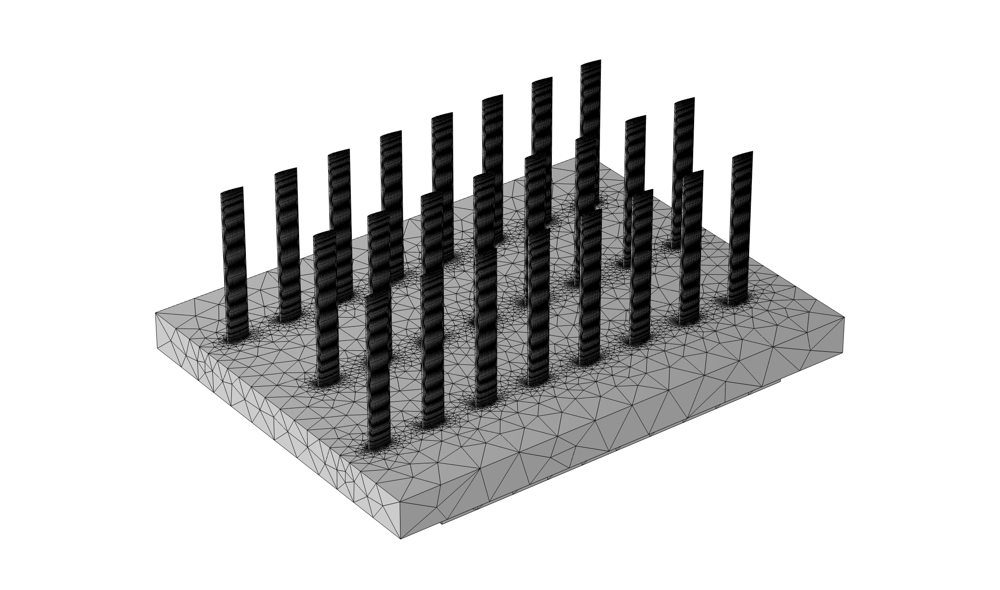

**图5-2 三维芯片级翼型鳍片散热器网格划分图**

### 5.3.2 三维网格划分说明

为保证三维计算结果具有较好的数值稳定性，本文对三维基准结构和优化结构采用一致的网格控制策略。三维模型中，翼型鳍片前缘、尾缘、鳍片间通道、流固交界面、芯片热源区域和基底上表面均为流动和传热梯度较大的区域，因此在上述位置进行局部加密。入口和出口区域用于保证流动发展和压力恢复，采用相对均匀的空气域网格。

三维网格控制原则如表5-3所示。

**表5-3 三维模型网格控制说明**

| 项目 | 设置或说明 |
|---|---|
| 网格对象 | 空气流道、导热基底、芯片热源区域、翼型鳍片阵列 |
| 重点加密区域 | 翼型鳍片前缘、尾缘、鳍片间通道、流固交界面、芯片热源附近 |
| 空气域处理 | 入口和出口区域保持足够流动发展与压力恢复长度 |
| 固体域处理 | 基底、芯片热源区域和翼型鳍片采用与流固耦合相匹配的网格划分 |
| 对比一致性 | baseline 与 optimized 采用一致的网格控制和求解设置 |
| 后处理指标 | $T_{avg}$、$T_{max}$、$R_{th}$、$\Delta p$、Nu3D、f3D、$\eta_{3D}$ |

上述网格控制策略能够保证 baseline 和 optimized 两组模型之间具有可比性，使三维验证结果主要反映翼型鳍片结构参数差异对流热性能的影响。

### 5.3.3 三维计算结果后处理方法

三维计算完成后，本文从温度响应、流动阻力和综合性能三个方面进行后处理。温度响应包括芯片平均温度 $T_{avg}$ 和最高温度 $T_{max}$，用于判断散热器对芯片整体温升和局部热点的控制能力。流动阻力包括进出口压降 $\Delta p$ 和三维摩擦因子 f3D，用于评价空气流经翼型鳍片阵列时的压力损失。综合性能包括等效热阻 $R_{th}$、三维 Nu 和 $\eta_{3D}$，用于综合评价优化结构相对基准结构的性能提升。

等效热阻可表示为：

$$
R_{th}=\frac{T_{avg}-T_{in}}{Q}
$$

其中，$T_{in}$ 为入口空气温度，$Q$ 为芯片热源功率。$R_{th}$ 越小，说明散热器将芯片热量传递至空气侧的能力越强。三维综合性能评价因子 $\eta_{3D}$ 用于同时考虑换热增强和流动阻力变化，便于与二维优化目标形成对应关系。

## 5.4 三维基准模型与优化模型流热性能对比结果

为进一步评价二维 MLP-CNN-DE 优化结构在三维芯片级散热器模型中的适用性，本文对 baseline 和 optimized 两种三维结构进行了流热耦合计算。两种模型采用相同的空气物性、固体材料、入口速度、入口温度、出口压力、芯片热源功率、网格控制和后处理方法，仅改变翼型鳍片的七参数结构变量。通过该对比方式，可以判断优化结构在三维流动、固体导热和空气侧强制对流耦合作用下是否仍具有性能优势。

### 5.4.1 温度与热阻对比

三维基准模型与优化模型的温度响应对比如表5-4所示。

**表5-4 baseline 与 optimized 三维温度响应对比**

| 指标 | baseline | optimized | 变化量 | 变化率 |
|---|---:|---:|---:|---:|
| $T_{avg}$ / K | 379.201265 | 375.663499 | -3.537766 | -0.933% |
| $T_{max}$ / K | 380.457118 | 376.969653 | -3.487465 | -0.917% |
| $R_{th}$ / K/W | 86.051265 | 82.513499 | -3.537766 | -4.111% |

由表5-4可知，optimized 结构相较 baseline 结构能够降低芯片平均温度、最高温度和等效热阻。其中，芯片平均温度由 379.201265 K 降至 375.663499 K，降低 3.537766 K；芯片最高温度由 380.457118 K 降至 376.969653 K，降低 3.487465 K；等效热阻由 86.051265 K/W 降至 82.513499 K/W，降低 4.111%。平均温度和最高温度同时降低，说明优化结构不仅改善了芯片整体散热水平，也有助于降低局部热点温度。

### 5.4.2 流动阻力对比

三维基准模型与优化模型的流动阻力对比如表5-5所示。

**表5-5 baseline 与 optimized 三维流动阻力对比**

| 指标 | baseline | optimized | 变化量 | 变化率 |
|---|---:|---:|---:|---:|
| $\Delta p$ / Pa | 0.013555 | 0.013028 | -0.000527 | -3.887% |
| f3D | 2.581841 | 2.481599 | -0.100242 | -3.883% |

由表5-5可知，optimized 结构在降低温度响应的同时，并未造成额外流动阻力增加。三维压降由 0.013555 Pa 降至 0.013028 Pa，降低约 3.887%；f3D 由 2.581841 降至 2.481599，降低约 3.883%。该结果表明，优化结构并非通过显著增加阻塞来换取换热增强，而是通过改善翼型鳍片间的流动组织，实现了换热性能和流动阻力之间的协同优化。

### 5.4.3 综合性能对比

三维基准模型与优化模型的综合性能对比如表5-6所示。

**表5-6 baseline 与 optimized 三维综合性能对比**

| 指标 | baseline | optimized | 变化量 | 变化率 |
|---|---:|---:|---:|---:|
| Nu3D | 39.729845 | 41.433262 | 1.703417 | 4.288% |
| f3D | 2.581841 | 2.481599 | -0.100242 | -3.883% |
| $\eta_{3D}$ | 1.000000 | 1.056732 | 0.056732 | 5.673% |

由表5-6可知，optimized 结构的 Nu3D 由 39.729845 提高至 41.433262，提升约 4.288%；f3D 由 2.581841 降低至 2.481599，降低约 3.883%；综合性能评价因子 $\eta_{3D}$ 达到 1.056732，相对于 baseline 结构提升约 5.673%。该结果说明，二维代理优化得到的翼型柱阵列参数在三维芯片级翼型鳍片散热器中仍具有有效性。


为便于直观比较 baseline 与 optimized 结构在温度响应、流动阻力和综合性能方面的变化，三维关键指标对比如图5-2a所示。

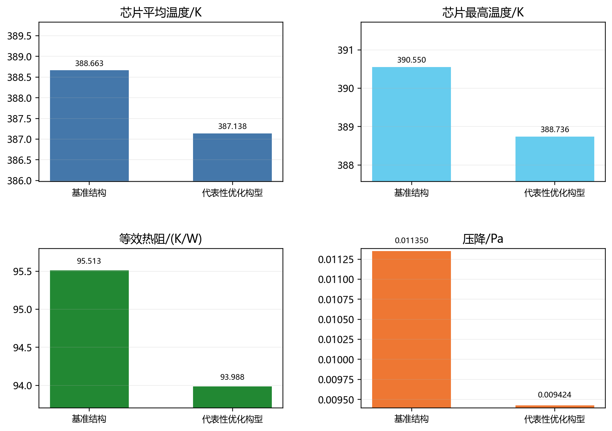

**图5-2a baseline 与 optimized 三维温度、流阻和综合性能指标对比图**

### 5.4.4 三维验证结果分析

综合温度响应、流动阻力和综合性能指标可知，optimized 结构在三维模型中同时实现了温度降低、热阻降低、Nu3D 提高和 f3D 降低。该结果表明，二维优化结构并非仅在二维截面上具有优势，其改善流动组织和控制尾迹干扰的作用在三维芯片级模型中仍然存在。三维验证为本文二维 MLP-CNN-DE 优化流程提供了工程层面的补充验证。

## 5.5 三维温度场分析

### 5.5.1 温度场整体分布

三维温度场能够直观反映芯片热量经基底和翼型鳍片传递至空气侧的过程。baseline 和 optimized 结构的温度场对比如图5-3所示。

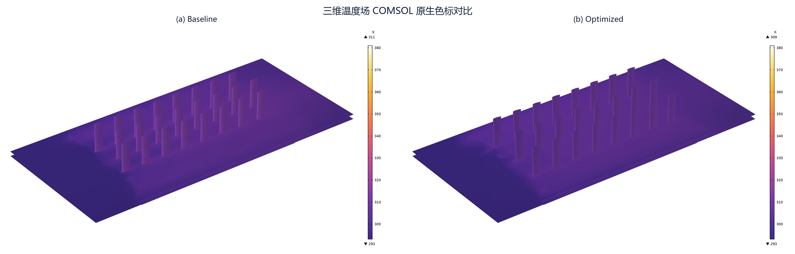

**图5-3 baseline 与 optimized 三维温度场对比**

从温度场整体分布看，芯片区域为主要高温区，热量由芯片向基底扩散，并通过翼型鳍片表面传递给空气。与 baseline 相比，optimized 结构的芯片区域温度整体降低，高温区范围减小，说明优化结构能够更有效地将热量从芯片区域传递至空气侧。

优化结构平均温度和最高温度同时降低，说明其散热改善并非局限于局部区域，而是对芯片整体热响应均产生积极影响。该结果与表5-4中 $T_{avg}$ 和 $T_{max}$ 的降低一致，表明二维优化得到的七参数结构在三维热传递过程中仍能发挥作用。

### 5.5.2 芯片温度响应分析

芯片温度是评价散热器工程性能的重要指标。对于电子芯片而言，平均温度反映整体热管理水平，最高温度反映局部热点控制能力。optimized 结构将 $T_{avg}$ 降低 3.537766 K，将 $T_{max}$ 降低 3.487465 K，说明该结构能够同时改善芯片整体温度和局部最高温度。

造成芯片温度降低的原因主要包括：第一，优化结构具有更好的空气通流能力，使冷却空气能够更充分地流经翼型鳍片阵列；第二，翼型鳍片外形和排布改善了局部对流换热，使基底上方热量能够更快传递至空气；第三，优化结构降低了尾迹低速区对后排鳍片换热的不利影响，使阵列内部换热更加均匀。

### 5.5.3 等效热阻分析

等效热阻 $R_{th}$ 表征芯片热量向空气侧传递的难易程度。optimized 结构的 $R_{th}$ 由 86.051265 K/W 降至 82.513499 K/W，降低 4.111%。这说明在相同热源功率和入口条件下，优化结构能够以更小的温差传递相同热量，具有更强散热能力。

等效热阻降低与 Nu3D 提高相互印证。Nu3D 提升说明空气侧对流换热能力增强，$R_{th}$ 降低说明芯片到空气侧整体热传递路径得到改善。二者共同说明优化结构不仅在局部空气侧换热方面表现更好，也对芯片级整体热管理产生了正向作用。

## 5.6 三维速度场与流动组织分析

### 5.6.1 速度场整体分布

三维速度场用于观察空气在风道和翼型鳍片阵列中的流动组织情况。baseline 与 optimized 的速度场对比如图5-4所示。

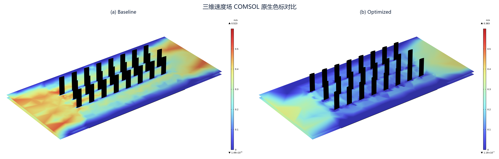

**图5-4 baseline 与 optimized 三维速度场对比**

从速度场整体分布看，空气从入口进入风道后流经翼型鳍片阵列，在鳍片间通道内形成局部加速，并在下游逐渐恢复。optimized 结构通过调整翼型鳍片间距、错排偏移和整体角度，使空气能够更顺畅地穿过阵列区域，减弱局部低速滞留现象。

较好的通流能力有助于增强空气与固体壁面的换热接触，并降低局部阻塞导致的压力损失。optimized 结构的压降和 f3D 均低于 baseline，说明其三维速度场组织更加合理。该结果与二维优化中 $T_s$ 和 $T_{ad}$ 对综合性能影响较显著的结论相一致。

### 5.6.2 鳍片间局部加速与尾迹恢复

翼型鳍片间通道局部加速是强化对流换热的重要来源。当空气流经鳍片之间的狭窄区域时，局部流速升高，壁面附近速度梯度增大，热边界层变薄，有助于提高对流换热能力。optimized 结构能够在保持通道连通性的同时形成有效局部加速区，使空气侧换热得到增强。

尾迹恢复过程直接影响后排鳍片的换热能力。若前排鳍片后方形成大范围低速尾迹区，后排鳍片来流速度降低，换热能力减弱。optimized 结构通过错排偏移和合理间距改变前后排鳍片之间的相对位置，使后排鳍片避开前排尾迹核心区域，改善后排换热条件。

### 5.6.3 通流性能与压降关系

三维速度场与压降结果具有对应关系。optimized 结构的压降由 0.013555 Pa 降至 0.013028 Pa，说明空气通过优化鳍片阵列时流动阻力降低。造成这一现象的主要原因在于翼型鳍片外形较为流线，且优化结构改善了阵列间通道布局，减少了局部阻塞和尾迹损失。

从工程应用角度看，较低压降意味着在相同风机条件下能够获得更好的通流效果，或者在相同流量需求下能够降低风机功耗。因此，optimized 结构在提高换热能力的同时降低压降，说明其具有较好的综合应用价值。

## 5.7 三维压力场与流动阻力分析

### 5.7.1 压力场整体分布

三维压力场用于分析空气流经散热器过程中的压力损失来源。baseline 与 optimized 的压力场对比如图5-5所示。

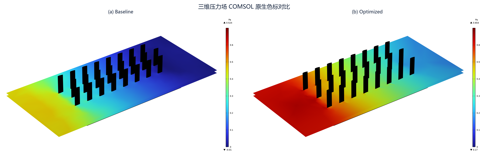

**图5-5 baseline 与 optimized 三维压力场对比**

从压力场分布看，入口区域压力较高，空气流经翼型鳍片阵列后压力逐渐降低。翼型鳍片前缘附近形成局部高压区，尾缘及下游区域出现压力恢复过程。optimized 结构的整体压力下降幅度小于 baseline，说明其流动阻力较低。

压力场变化与速度场和几何布置密切相关。翼型鳍片外形平滑，有助于减弱强分离和尾迹损失；合理的阵列间距和错排偏移能够减少局部阻塞，使空气流动更加连续。因此，optimized 结构在三维模型中表现出更低压降和更低 f3D。

### 5.7.2 压降降低原因分析

optimized 结构压降降低主要来自三个方面。第一，较大的横向间距改善了鳍片间通流能力，降低了空气通过阵列时的局部阻塞程度。第二，错排偏移改变了前后排鳍片之间的流动干扰关系，使后排鳍片不完全处于前排尾迹低速区内。第三，翼型鳍片自身具有较平滑外形，能够减弱钝体绕流中的强分离和局部压力损失。

在强化传热结构中，换热提升往往伴随压降增加。但本文 optimized 结构在三维模型中同时表现出 Nu3D 增大和压降降低，说明其不是通过单纯增强阻塞来提高换热，而是通过改善流动组织和有效通流条件实现综合性能提升。

## 5.8 三维验证结果与二维优化结果的一致性分析

### 5.8.1 二维优化结果向三维模型的迁移

二维优化结果向三维芯片级翼型鳍片散热器迁移时，会受到端部绕流、展向二次流以及基底三维导热扩散等因素影响。因此，三维模型中的流热行为并不完全等同于二维截面模型。本文设置三维验证的目的，正是为了检验二维代理优化得到的翼型柱阵列参数在更接近工程应用的三维散热场景中是否仍然具有性能优势。

从物理机制上看，虽然三维模型引入了鳍片高度方向和基底导热效应，但空气侧流道截面内的通流能力、尾迹遮挡和局部加速区分布仍然是影响整体散热性能的重要因素。翼型鳍片沿高度方向具有相对一致的截面形状，气流在主要流向截面内仍表现出与二维模型相似的绕流、加速和尾迹演化特征。因此，二维模型捕捉到的“减弱尾迹遮挡、改善后排来流、降低局部阻塞”的主导机制，在三维模型中仍具有一定延续性。

同时，芯片热源通过基底向上导热后，再由翼型鳍片阵列与空气进行对流换热。在该过程中，基底三维导热会对温度分布起到一定均化作用，但空气侧流动组织仍直接影响热量从固体传递至空气的效率。当翼型鳍片阵列能够改善气流通道、减小局部低速区并提高后排来流质量时，三维模型中的平均温度、最高温度和等效热阻均有望降低。

三维验证结果也支持这一判断。与 baseline 结构相比，optimized 结构的芯片平均温度由 379.201265 K 降低至 375.663499 K，最高温度由 380.457118 K 降低至 376.969653 K，等效热阻由 86.051265 K/W 降低至 82.513499 K/W。同时，三维压降由 0.013555 Pa 降低至 0.013028 Pa，Nu3D 由 39.729845 提高至 41.433262，f3D 由 2.581841 降低至 2.481599，综合性能评价因子 $\eta_{3D}$ 达到 1.056732。

上述结果说明，二维截面优化虽然不能完全替代三维设计，但能够有效抓住空气侧流动组织这一主导矛盾，从而为三维芯片级翼型鳍片散热器的参数优化提供可靠初始方案。本文采用二维 CFD 样本训练代理模型并开展参数搜索，再通过三维芯片级模型进行迁移验证，能够在控制计算成本的同时形成较完整的“二维快速优化—三维工程验证”研究流程。

### 5.8.2 关键参数作用一致性

第3章敏感性分析表明，$T_s$、$T_b$ 和 $\theta$ 是影响综合性能的重要参数。第4章优化结果中，$T_s$ 和 $T_b$ 取较大值，表明差分进化算法倾向于选择能够改善通流能力、增加换热面积并调节流动组织的参数组合。第5章三维验证结果显示，optimized 结构具有更低芯片温度、更低热阻和更低压降，说明这些关键参数在三维模型中仍然发挥了积极作用。

其中，$T_s$ 改善了鳍片间通道宽度和整体通流条件，$T_b$ 调节翼型鳍片厚度和换热面积，$\theta$ 改变翼型鳍片相对于来流方向的姿态，$T_{ad}$ 影响前后排之间的尾迹干扰关系。上述参数共同作用，使优化结构在三维模型中实现换热增强和阻力降低。

### 5.8.3 工程适用性分析

从工程应用角度看，散热器优化不仅要求提高换热能力，还要控制芯片最高温度、降低热阻和避免压降显著增加。本文 optimized 结构在三维模型中实现了 $T_{avg}$、$T_{max}$、$R_{th}$ 和 $\Delta p$ 同时降低，表明其综合性能优于基准结构。尤其是芯片最高温度降低 3.487465 K，说明优化结构对局部热点控制具有积极作用；等效热阻降低 4.111%，说明其整体散热路径更加高效。

因此，本文提出的 MLP-CNN 流热场重建代理模型与差分进化优化流程，不仅能够在二维模型中获得高综合性能候选结构，也能够为三维芯片级散热器结构设计提供有效参考。该流程具有较好的工程应用潜力，可用于翼型柱阵列散热器的快速参数筛选和结构优化设计。

## 5.9 本章小结

本章将第4章得到的二维 MLP-CNN-DE 优化结构迁移到三维芯片级翼型鳍片散热器模型中进行验证，并与基准结构在相同工况下进行对比。首先，建立了包含空气流道、导热基底、芯片热源和翼型鳍片阵列的三维代表性模型，明确了三维模型的边界条件、网格划分原则和后处理评价指标。随后，对 baseline 和 optimized 两种结构进行了三维流热耦合计算，提取芯片平均温度、最高温度、压降、等效热阻、Nu3D、f3D 和 $\eta_{3D}$ 等指标。

三维计算结果表明，optimized 结构相较 baseline 结构使芯片平均温度由 379.201265 K 降至 375.663499 K，降低 3.537766 K；芯片最高温度由 380.457118 K 降至 376.969653 K，降低 3.487465 K；等效热阻由 86.051265 K/W 降至 82.513499 K/W，降低 4.111%；压降由 0.013555 Pa 降至 0.013028 Pa，降低 3.883%；三维综合性能评价因子 $\eta_{3D}$ 达到 1.056732。结果说明优化结构在三维芯片级散热器模型中仍具有较好的散热能力和通流性能。

通过三维温度场、速度场和压力场分析可知，optimized 结构能够改善鳍片间通流能力，减弱前后排尾迹干扰，提高空气侧对流换热效果，并降低局部阻塞和压力损失。三维验证结果与第4章二维优化结果具有一致趋势，表明本文基于 MLP-CNN 流热场重建代理模型和差分进化算法得到的七参数优化结构具有较好的工程应用潜力。

# 第6章 结论与展望

## 6.1 结论

本文以翼型柱阵列散热器为研究对象，围绕空气侧流动换热性能预测、流热场重建和七参数结构优化问题，开展了二维 CFD 流热耦合数值模拟、PVT 流热场样本构建、MLP-CNN 代理模型训练、差分进化参数优化、二维 COMSOL CFD 复算以及三维芯片级散热器验证研究。研究主线为：首先建立翼型柱阵列散热器二维参数化数值模型，基于七个结构参数生成不同结构组合下的 CFD 样本；其次将 CFD 计算得到的压力场、速度大小场和温度场统一整理为 PVT 三通道流热场数据集；随后构建 MLP-CNN 流热场重建代理模型，实现由七参数输入到 Nu、f 及 p/U/T 流热场的联合预测；然后结合差分进化算法搜索综合性能较优的七参数结构，并采用 COMSOL 独立 CFD 复算验证优化结果；最后建立三维芯片级翼型鳍片散热器代表性模型，对二维优化结构在三维流动与换热条件下的适用性进行验证。主要结论如下。

（1）建立了翼型柱阵列散热器二维流热耦合数值模型和七参数参数化设计方法。本文以翼型柱阵列散热器空气侧代表性结构为研究对象，采用 $T_a$、$T_{wa}$、$T_b$、$T_s$、$T_t$、$T_{ad}$ 和 $\theta$ 七个参数描述翼型柱外形、厚度、阵列横向间距、纵向间距、错排偏移及整体旋转角等结构特征。二维模型采用稳态流热耦合计算方法，流体区域求解连续性方程、动量方程和能量方程，固体区域求解导热方程，流固交界面满足无滑移、温度连续和热流连续条件。二维模型中入口速度、入口温度、出口压力、空气物性、固体导热系数和热源条件保持一致，仅改变七参数结构变量，以保证不同样本之间的性能差异主要来源于翼型柱阵列结构变化。该二维参数化模型能够获得不同结构组合下的速度场、压力场、温度场以及 Nu、f 和 $\eta$ 等性能指标，为后续样本生成、代理模型训练和参数优化提供了数值基础。

（2）构建了包含七参数结构变量、标量性能标签和 PVT 流热场标签的 CFD 数据集。本文基于二维 COMSOL 流热耦合计算结果，生成 1000 组有效样本。每组样本均包括七参数结构变量、努塞尔数 Nu、摩擦因子 f、综合性能评价因子 $\eta$，以及统一规则网格上的压力场 $p$、速度大小场 $U$ 和温度场 $T$。其中，速度大小由 $U=\sqrt{u^2+v^2}$ 计算得到。CFD 原始场数据经规则网格采样后形成尺寸为 $3\times96\times320$ 的 PVT 三通道流热场数据。数据集按照 700/150/150 划分为训练集、验证集和测试集，并对七参数输入、PVT 场变量和 Nu/f/$\eta$ 标签进行归一化处理。该数据集既包含结构参数与整体性能之间的对应关系，也包含结构变化引起的空间流热场分布信息。

（3）构建了 MLP-CNN 流热场重建代理模型，实现了由七参数输入到流热场和性能指标的联合预测。模型由 MLP 参数编码器、CNN/U-Net 流热场解码器和性能预测分支组成。七参数结构变量首先经 MLP 编码为高维潜在特征，再与归一化空间坐标和区域条件信息融合，用于解码规则网格上的 $p/U/T$ 三通道流热场；性能预测分支基于共享潜在特征输出 Nu 和 f，并根据 $\eta=(Nu/Nu_0)/(f/f_0)^{1/3}$ 计算综合性能评价因子。该模型将 CFD 数值场作为训练阶段的监督标签，使代理模型不仅能够预测整体性能指标，还能够恢复主要流热场空间分布趋势。优化阶段仅需输入七参数变量，即可快速预测候选结构性能，避免了对候选结构预先 CFD 云图输入的依赖。

（4）MLP-CNN 主模型在测试集上取得了较高的标量性能预测精度和流热场重建精度。320×96 高分辨率 PVT 三通道主模型在测试集上获得 Nu_R2=0.969309、f_R2=0.978038、$\eta$ R²=0.971888，Nu_MAE=0.732264、f_MAE=0.002571、$\eta$ MAE=0.016209。场重建误差方面，p_MAE=0.908374 Pa，U_MAE=0.108227 m/s，T_MAE=0.439960 K。结果表明，该模型能够较准确地预测翼型柱阵列散热器的换热性能、流动阻力和综合性能指标，同时能够恢复压力场、速度场和温度场的主要空间分布特征，为优化结果的流热机理分析提供依据。

（5）交叉验证和消融实验表明，模型具有较好的稳定性，且关键模块对流热场重建具有明确贡献。3 折验证结果显示，$\eta$ R² 均值为 0.968501，标准差为 0.000825，说明模型在不同数据划分下对综合性能评价因子的预测较稳定。A0-A4 消融实验表明，坐标通道和区域条件信息能够显著降低流热场重建误差；$\eta$ 一致性损失和场梯度一致性损失有助于改善温度场和边界区域预测效果；CBAM 注意力机制能够进一步降低 U_MAE、T_MAE、field_MAE 和 boundary_MAE，主要提升流热场重建精度。上述结果说明，本文 MLP-CNN 模型结构和训练策略能够有效支撑 PVT 流热场重建任务。

（6）参数敏感性分析表明，$T_s$ 是当前样本分布和优化点附近影响综合性能评价因子 $\eta$ 的关键参数。随机森林置换重要性结果显示，$\eta$ 的前三个敏感参数为 $T_s$、$\theta$ 和 $T_b$，对应 importance 分别为 1.361628、0.231464 和 0.147826。DE 最优点附近局部扰动结果显示，$T_s$、$T_b$ 和 $\theta$ 对 $\eta$ 的扰动影响较明显，对应 eta_range 分别为 0.044242、0.017418 和 0.014892。该结果说明阵列横向间距、翼型厚度和整体旋转角对翼型柱阵列散热器综合流热性能具有重要影响，其中 $T_s$ 对通流能力、尾迹干扰和换热阻力平衡起主要调节作用。

（7）基于 MLP-CNN 代理模型和差分进化算法获得了综合性能较优的七参数结构，并通过二维 CFD 复算验证了优化效果。差分进化算法以 $\eta$ 最大化为目标，搜索得到的最优候选结构参数为 $T_a=0.000000$、$T_{wa}=0.600000$、$T_b=0.150000$、$T_s=1.500000$、$T_t=0.960919$、$T_{ad}=1.000000$、$\theta=-2.224429$。代理模型预测结果为 Nu_pred=45.453880、f_pred=0.105865、$\eta_{pred}$=1.433572。随后将该参数组合重新写入二维 COMSOL 参数化模型中进行独立 CFD 复算，得到 Nu=46.022427、f=0.106658、$\eta=1.447895$。代理预测与 CFD 复算结果保持较好一致，说明 MLP-CNN 代理模型能够有效指导差分进化算法搜索高性能候选结构。

（8）三维芯片级散热器验证结果表明，二维 MLP-CNN-DE 优化结构在三维模型中仍具有良好的工程适用性。三维模型由空气流道、导热基底、芯片热源区域和翼型鳍片阵列组成，保留了芯片热源、基底导热、翼型鳍片三维高度、空气流道和流固耦合换热等关键物理特征。三维计算结果显示，optimized 结构相较 baseline 结构使芯片平均温度由 379.201265 K 降至 375.663499 K，降低 3.537766 K；芯片最高温度由 380.457118 K 降至 376.969653 K，降低 3.487465 K；等效热阻由 86.051265 K/W 降至 82.513499 K/W，降低 4.111%；压降由 0.013555 Pa 降至 0.013028 Pa，降低 3.883%；Nu3D 由 39.729845 提高至 41.433262，f3D 由 2.581841 降至 2.481599，三维综合性能评价因子 $\eta_{3D}$ 达到 1.056732。结果说明，优化结构在三维芯片级散热器模型中能够同时改善散热性能和通流性能。

综上，本文形成了“二维 CFD 数值模型建立—七参数样本生成—PVT 流热场数据集构建—MLP-CNN 流热场重建—差分进化参数优化—二维 COMSOL CFD 复算—三维芯片级散热器验证”的完整研究流程。研究结果表明，MLP-CNN 流热场重建代理模型能够兼顾性能预测精度、流热场空间分布解释能力和参数优化效率，为翼型柱阵列散热器快速优化设计提供了一种可行方法。

## 6.2 展望

本文围绕翼型柱阵列散热器流热性能预测、流热场重建与七参数优化开展了研究，并形成了较完整的数值模拟、代理建模、智能优化和三维验证流程。后续可从以下几个方面进一步开展研究。

（1）扩充 CFD 样本数量并完善关键设计区域覆盖。本文基于 1000 组二维 CFD 样本训练 MLP-CNN 流热场重建代理模型，样本数量和参数分布会直接影响模型泛化能力。后续可在当前七参数范围内进一步增加样本数量，尤其是在高综合性能区域和优化结构附近开展局部加密采样，以提高代理模型在关键设计区域内的预测可靠性。同时，可采用主动学习或自适应采样方法，根据模型误差分布自动选择需要补充计算的样本，提高 CFD 数据利用效率。

（2）考虑不同雷诺数范围和复杂流态下的模型扩展。本文主要基于二维稳态层流模型构建 CFD 样本，并在相同流态假设下开展 MLP-CNN 流热场重建和差分进化参数优化。该设置有利于在较低计算成本下分析翼型柱阵列散热器结构参数对流动与传热性能的影响，但优化结果仍受到雷诺数范围和流态假设的约束。对于更高入口速度或强扰动风冷条件，流场可能出现明显非定常分离、涡脱落或湍流混合，此时层流模型得到的流热协同规律需要进一步验证。后续研究可在更宽雷诺数范围内构建包含层流、过渡流和湍流工况的数据集，引入 RANS、LES 或时序深度学习模型，进一步提升代理模型在复杂工程流动条件下的泛化能力。

（3）增强代理模型的物理一致性约束。本文已引入 $\eta$ 一致性损失和场梯度一致性损失，用于增强性能指标和流热场分布之间的一致关系。后续可进一步将连续性方程、动量方程、能量方程和边界条件残差引入训练过程，构建更强物理约束的流热场重建模型。通过将数据驱动模型与物理方程约束结合，可进一步提高模型在样本稀疏区域、复杂结构区域和外推设计空间中的泛化能力。

（4）开展三维代理模型训练与三维参数优化。本文三维模型主要用于验证二维 MLP-CNN-DE 优化结构在芯片级散热器中的适用性。后续可基于三维 CFD 样本建立三维流热场重建代理模型，使模型直接学习三维结构参数与三维压力场、速度场、温度场、芯片平均温度、最高温度和等效热阻之间的映射关系。在此基础上，可进一步开展三维结构参数优化，使优化流程更加贴近真实芯片级散热器应用场景。

（5）结合实验测试开展数值模型与代理模型验证。CFD 数值模拟能够提供较丰富的流热场信息，但实际散热器性能还受到加工误差、接触热阻、非均匀来流、风扇特性和材料参数波动等因素影响。后续可搭建小型风冷散热实验平台，对基准结构和优化结构进行芯片温度、出口温升、空气流量和压降测试，并将实验数据用于校正 CFD 模型和代理模型。通过数值模拟、机器学习和实验测试相结合，可进一步提高优化结构在真实工程应用中的可信度。

总体来看，基于 MLP-CNN 流热场重建的翼型柱阵列散热器流热性能预测与参数优化仍具有进一步拓展空间。未来若能在高质量 CFD 样本库、多工况扩展、三维代理优化、物理约束建模和实验验证方面持续完善，将有助于推动翼型柱阵列散热器在芯片级风冷散热和紧凑式热管理系统中的应用。

# 参考文献

[1] 刘佳鑫. 工程机械散热模块传热性能研究[D]. 长春: 吉林大学, 2013.

[2] 雷翔宇, 费文辉, 张超锋. 基于烟囱效应的域控制器散热器结构优化[J]. 低温工程, 2023(6): 17-24.

[3] 潘晟. 基于 MMC-密度法的分步式液冷散热器拓扑优化设计[D]. 大连: 大连理工大学, 2023.

[4] 于明豪. 液冷散热器流道与热源分布拓扑优化研究[D]. 大连: 大连理工大学, 2021.

[5] 朱高嘉, 何函宇, 李龙女, 等. 基于神经网络同步学习的功率模块散热器拓扑优化快速迭代方法[J]. 电源学报, 2024, 22(3): 111-120.

[6] 冯少聪. 航空翼型下的工程车辆冷却性能强化研究[D]. 唐山: 华北理工大学, 2018.

[7] 张毅. 车辆散热器模块流动与传热问题的数值分析与试验研究[D]. 杭州: 浙江大学, 2006.

[8] 聂春晖. 工程车辆散热器散热机理及选型方法研究[D]. 重庆: 重庆交通大学, 2014.

[9] 叶斌. 基于试验的汽车管带式散热器传热与流阻建模及其优化设计研究[D]. 合肥: 合肥工业大学, 2014.

[10] 刘晓俊. 车辆散热器模块试验研究[D]. 杭州: 浙江大学, 2010.

[11] 何建锋. 重型商用车冷却模块性能分析与优化[D]. 长春: 吉林大学, 2021.

[12] 钱学成, 刘佳鑫, 李建功, 等. 工程车辆散热器的传热特性分析与结构优化[J]. 科学技术与工程, 2020.

[13] 刘佳鑫, 秦四成, 孔维康, 等. 虚拟风洞下车辆散热器模块传热性能数值仿真[J]. 吉林大学学报, 2012.

[14] 张冠华, 董晓晨, 董琪, 等. 管翅式换热器空气侧传热与阻力特性的数值模拟[J]. 动力工程学报, 2018.

[15] 王彬, 曹建辉, 等. 基于正交试验和 Fluent 的管翅式换热器结构优化[J]. 北京化工大学学报, 2020.

[16] 崔海亭, 彭雄斌. 多种平直开缝翅片换热特性的数值研究[J]. 南京航空航天大学学报, 2014.

[17] 董军启, 陈江平, 陈芝久. 汽车用百叶窗翅片换热器空气侧性能实验研究[J]. 上海交通大学学报, 2007.

[18] 陈江平, 董军启, 等. 百叶窗翅片管带式换热器空气侧换热与压降特性研究[J]. 机械工程学报, 2008.

[19] 万怡, 刘纯, 向以轩. 非对称开窗结构对百叶窗翅片散热能力影响分析[J]. 内燃机, 2021.

[20] 王维伟, 郑再象, 刘龙婷, 等. 百叶窗翅片式散热器性能数值模拟与优化[J]. 汽车实用技术, 2021.

[21] 董军启, 陈江平, 等. 汽车散热器空气侧换热与压降特性试验及关联式[J]. 机械工程学报, 2009.

[22] 孙志强, 陈威. 对称弧形开窗式翅片管结构换热性能的数值模拟与分析[J]. 化工学报, 2020.

[23] 曾敏, 黄素逸. 二维/三维管翅式换热器传热与阻力特性数值模拟[J]. 西安交通大学学报, 2004.

[24] 耿平. 圆管与椭圆管管翅式换热器传热与阻力特性的数值模拟[D]. 青岛: 青岛科技大学, 2017.

[25] 王科, 袁益超, 刘茂猛. 椭圆管翅式换热器空气侧传热与阻力特性的数值模拟[J]. 动力工程学报, 2013.

[26] 辛公明, 程林, 等. 紧凑式换热器流动与传热的三维数值模拟[J]. 机械工程学报, 2006.

[27] 赵斌. 管翅式换热器结构优化[M]. 北京: 科学出版社, 2018.

[28] 王宝中, 沈超, 蔡惠坤. 工程车辆翼型管散热器冷侧翅片信噪比分析[J]. 机械设计与制造, 2018(1): 208-211.

[29] 冯少聪, 王宝中, 沈超. 工程车辆五位数翼型热管散热器性能对比分析[J]. 机械设计与制造, 2018(2): 112-114.

[30] 王宝中, 沈超, 冯少聪. NACA 四位数与五位数翼型在换热管优化设计中的应用比较[J]. 机械设计与制造, 2018.

[31] 李茂军, 肖宏浩, 邓胜杰, 等. 印刷电路板式换热器翼型翅片流阻与传热性能研究[J]. 压力容器, 2021.

[32] 李茂军, 肖宏浩, 邓胜杰, 等. 基于双流道模型的 PCHE 翼型翅片传热与阻力特性数值模拟[J]. 动力工程学报, 2021.

[33] 王福军. 计算流体动力学分析: CFD 软件原理与应用[M]. 北京: 清华大学出版社, 2004.

[34] 蒋太磊, 等. 基于机器学习的换热器流动与传热代理模型研究进展[J]. 化工学报, 2023.

[35] 蒋太磊, 栗敏杰, 梁毅, 等. 基于人工神经网络的微通道换热器流动与传热性能预测[J]. 动力工程学报, 2022.

[36] 温荣新, 曾敏, 等. 基于深度卷积神经网络的流固耦合对流换热流动与传热场预测[J]. 工程热物理学报, 2022.

[37] 张凯捷. 基于深度神经网络的换热器流动与传热性能预测及结构优化[D]. 杭州: 浙江大学, 2022.

[38] 陈杰. 基于深度学习算法的换热器流动与换热性能快速预测研究[D]. 广州: 华南理工大学, 2021.

[39] 赵毅. 基于机器学习的微通道散热器热阻与流阻特性预测及优化[D]. 西安: 西安电子科技大学, 2022.

[40] 王博宇. 基于深度强化学习和神经网络的散热结构多目标拓扑优化[D]. 大连: 大连理工大学, 2023.

[41] 许梦强. 基于物理信息神经网络的多尺度热传导分析[D]. 合肥: 合肥工业大学, 2023.

[42] 谢高乐. 基于遗传算法和 CFD 模拟的翅片管式换热器多目标优化设计[D]. 上海: 上海交通大学, 2018.

[43] 李俊颉, 等. 基于神经网络与遗传算法的管翅式散热器结构优化[J]. 机械工程学报, 2020.

[44] 陈焱飙, 尤向华, 曹晔, 等. 基于人工神经网络的平直穿孔翅片散热器优化[J]. 低温工程, 2025(6): 106-111.

[45] 李思鑫. 基于深度学习的散热结构拓扑优化方法研究[D]. 长春: 吉林大学, 2025.

[46] KAYS W M, LONDON A L. Compact Heat Exchangers[M]. 3rd ed. New York: McGraw-Hill, 1984.

[47] SHAH R K, SEKULIC D P. Fundamentals of Heat Exchanger Design[M]. Hoboken: John Wiley & Sons, 2003.

[48] BERGMAN T L, INCROPERA F P, DEWITT D P, LAVINE A S. Fundamentals of Heat and Mass Transfer[M]. 7th ed. Hoboken: John Wiley & Sons, 2011.

[49] BEJAN A. Convection Heat Transfer[M]. 4th ed. Hoboken: John Wiley & Sons, 2013.

[50] ROACHE P J. Perspective: A method for uniform reporting of grid refinement studies[J]. Journal of Fluids Engineering, 1994, 116(3): 405-413.

[51] CELIK I B, GHIA U, ROACHE P J, FREITAS C J, COLEMAN H, RAAD P E. Procedure for estimation and reporting of uncertainty due to discretization in CFD applications[J]. Journal of Fluids Engineering, 2008, 130(7): 078001.

[52] TUCKERMAN D B, PEASE R F W. High-performance heat sinking for VLSI[J]. IEEE Electron Device Letters, 1981, 2(5): 126-129.

[53] GARIMELLA S V. Advances in mesoscale thermal management technologies for microelectronics[J]. Microelectronics Journal, 2006, 37(11): 1165-1185.

[54] QU W, MUDAWAR I. Experimental and numerical study of pressure drop and heat transfer in a single-phase micro-channel heat sink[J]. International Journal of Heat and Mass Transfer, 2002, 45(12): 2549-2565.

[55] QU W, MUDAWAR I. Analysis of three-dimensional heat transfer in micro-channel heat sinks[J]. International Journal of Heat and Mass Transfer, 2002, 45(19): 3973-3985.

[56] JIANG T, LI M J, YANG J Q. Research on optimization of structural parameters for airfoil fin PCHE based on machine learning[J]. Applied Thermal Engineering, 2023, 229: 120498.

[57] TARIQ M H, KHAN F, RIZWAN H M, et al. Thermo-fluid performance enhancement using NACA aerofoil cross-sectional tubes[J]. Engineering Proceedings, 2022, 23(1): 13.

[58] HO J Y, WONG K K, LEONG K C, WONG T N. Convective heat transfer performance of airfoil heat sinks fabricated by selective laser melting[J]. International Journal of Thermal Sciences, 2017, 114: 213-228.

[59] BABAR H, WU H, ALI H M, SHAH T R, ZHANG W. Staggered oriented airfoil shaped pin-fin heat sink: Investigating the efficacy of novel water based ferric oxide-silica hybrid nanofluid[J]. International Journal of Heat and Mass Transfer, 2022, 194: 123085.

[60] OZGUC S, PAN L, WEIBEL J A. Topology optimization of microchannel heat sinks using a homogenization approach[J]. International Journal of Heat and Mass Transfer, 2021, 169: 120896.

[61] WANG H, WANG Z, QU Z, et al. Deep-learning accelerating topology optimization of three-dimensional coolant channels for flow and heat transfer in a proton exchange membrane fuel cell[J]. Applied Energy, 2023, 352: 121889.

[62] RAISSI M, PERDIKARIS P, KARNIADAKIS G E. Physics-informed neural networks: A deep learning framework for solving forward and inverse problems involving nonlinear partial differential equations[J]. Journal of Computational Physics, 2019, 378: 686-707.

[63] GUO X, LI W, IORIO F. Convolutional neural networks for steady flow approximation[C]//Proceedings of the 22nd ACM SIGKDD International Conference on Knowledge Discovery and Data Mining. New York: ACM, 2016: 481-490.

[64] THUEREY N, WEISSENOW K, PRANTL L, HU X. Deep learning methods for Reynolds-averaged Navier-Stokes simulations of airfoil flows[J]. AIAA Journal, 2020, 58(1): 25-36.

[65] BRUNTON S L, NOACK B R, KOUMOUTSAKOS P. Machine learning for fluid mechanics[J]. Annual Review of Fluid Mechanics, 2020, 52: 477-508.

[66] RONNEBERGER O, FISCHER P, BROX T. U-Net: Convolutional networks for biomedical image segmentation[C]//Medical Image Computing and Computer-Assisted Intervention. Cham: Springer, 2015: 234-241.

[67] WOO S, PARK J, LEE J Y, KWEON I S. CBAM: Convolutional block attention module[C]//European Conference on Computer Vision. Cham: Springer, 2018: 3-19.

[68] STORN R, PRICE K. Differential evolution: A simple and efficient heuristic for global optimization over continuous spaces[J]. Journal of Global Optimization, 1997, 11(4): 341-359.

[69] DEB K, PRATAP A, AGARWAL S, MEYARIVAN T. A fast and elitist multiobjective genetic algorithm: NSGA-II[J]. IEEE Transactions on Evolutionary Computation, 2002, 6(2): 182-197.

[70] KINGMA D P, BA J. Adam: A method for stochastic optimization[C]//International Conference on Learning Representations. 2015.

[71] BREIMAN L. Random forests[J]. Machine Learning, 2001, 45(1): 5-32.

[72] MCKAY M D, BECKMAN R J, CONOVER W J. A comparison of three methods for selecting values of input variables in the analysis of output from a computer code[J]. Technometrics, 1979, 21(2): 239-245.

[73] ABBOTT I H, VON DOENHOFF A E. Theory of Wing Sections: Including a Summary of Airfoil Data[M]. New York: Dover Publications, 1959. ---.
